# 🟪 Conta

No menu Conta encontram-se as informações sobre a conta do usuário.

<figure><figcaption>
Clique na imagem para ampliar
</figcaption></figure>

***

## 1. Aba Dados Fiscais

Na aba Dados Fiscais são apresentadas as informações ficais e financeiras do usuário. Os dados informados ao se criar uma conta e adquirir um plano na plataforma ArgSign são apresentados nesta tela.   &#x20;

Caso a conta do usuário seja de um plano gratuito, as informações estarão em branco, mas poderão ser editadas clicando-se no botão “Editar”.

<figure><figcaption>
Clique na imagem para ampliar.
</figcaption></figure>

Nesta aba são apresentadas as seguintes informações do usuário:

* **Nome da conta:** Nome criado para a conta no momento do cadastro na plataforma. Pode ser, por exemplo, o nome do usuário ou da empresa proprietária da conta.
* **Segmento:** Segmento profissional em que o usuário ou empresa atua.
* **Quantidade de Funcionários:** Quantidade de funcionários que a empresa em que o usuário atua possui.
* **Tipo de Inscrição:** Tipo de inscrição da conta que pode ser CPF, CNPJ ou outros.
* **Número de inscrição:** Número de inscrição da conta que deve ser preenchido de acordo com a opção escolhida no campo “Tipo de Inscrição”.
* **Idioma default para novos usuários:** Idioma em que a plataforma será apresentada para novos usuários associados à conta, que pode ser Português, Inglês ou Espanhol.
* **Nome do aplicativo:** Este dado será exibido no histórico das assinaturas dos documentos que forem enviados através da nossa [API de Integração que possuam o parâmetro “retornarLinkProcesso = 1”](https://manual.arquivar.com/manual-arqsign/administracao/integracoes/api/metodos-disponiveis-na-api/1.-processo/1.1.post-api-v2-processo-enviar-documento-para-assinar). Este campo não altera nenhum parâmetro para envios de Processos através da plataforma.
* **Endereço:** Endereço residencial ou comercial do usuário ou empresa.
* **Número:** Número da residência ou imóvel comercial.
* **Complemento:** Complemento do endereço.
* **Bairro:** Bairro do usuário ou empresa&#x20;
* **Código Postal:** Código postal do endereço residencial ou comercial do usuário ou empresa.
* **País:** País do usuário ou empresa.
* **Estado:** Estado do usuário ou empresa.
* **Cidade:** Cidade do usuário ou empresa.

<figure><figcaption>
Clique na imagem para ampliar.
</figcaption></figure>

***

## 2. Aba Faturamento e Uso

Na aba Faturamento e Uso é apresentado o histórico de compra da conta do usuário.

### Plano e Consumo

Na sub aba Plano e Consumo é apresentado o tipo de plano, o período de faturamento (anual ou mensal), a data de assinatura do plano e a data de vencimento da assinatura.

Por padrão ao criar uma conta a opção “**Renovação Automática**” será automaticamente habilitada. Para cancelar essa renovação, basta desmarcar essa opção.

<figure><figcaption>
Clique na imagem para ampliar.
</figcaption></figure>


<mark style="color:blue;">Ao deixar habilitada a renovação automática, quando o plano vencer o sistema fará a renovação do pagamento de forma automática, utilizando o mesmo meio de pagamento da compra anterior. Se desabilitada a opção, será exibido o botão “Comprar Agora”, para que o usuário faça uma nova compra do plano que desejar.</mark>


***

### 2.1. Alterar forma de pagamento

Para alterar a forma de pagamento do plano, clique em “**Alterar Forma de Pagamento**”.&#x20;

Ao clicar neste botão, o sistema deve exibir a modal de Alterar Forma de Pagamento, oferecendo as 3 opções de pagamento, **Boleto, Cartão de Crédito e PIX**, como na imagem abaixo.

<figure><figcaption>
Clique na imagem para ampliar.
</figcaption></figure>

O botão Alterar Forma de Pagamento é exibido quando:

* Usuário logado possui a permissão de alterar a forma de pagamento.
* Conta com status ativo que permite a renovação automática do plano.
* Assinatura com plano pago (TRIAL ou não).
* Assinatura vigente com status do pagamento pago.

Ao alterar a forma de pagamento de PIX ou Boleto para **Cartão de Crédito**, o sistema deve exibir mensagem informando que será necessário a alteração do plano quando a assinatura entrar no período de renovação.

<figure><figcaption>
Clique na imagem para ampliar.
</figcaption></figure>

#### 2.1.1. Alterar cartões de crédito

<figure><figcaption>
Clique na imagem para ampliar.
</figcaption></figure>

O botão Alterar Cartão é exibido somente se a conta possuir a forma de pagamento origem por cartão de crédito. Ou seja, a compra foi realizada com pagamento por cartão de crédito e não foi alterada.

Ao acionar este botão, o sistema envia o link de alteração do cartão para o usuário.

#### 2.1.2. Assinatura vencida

Sistema não exibe o botão Alterar Forma de Pagamento quando a assinatura da conta está vencida.

***

### 2.2. Renovação automática

O campo de Renovação Automática é exibido somente para conta com assinatura vigente de um plano pago.

* Quando **marcado**, significa que a conta possui renovação automática da assinatura do plano.
* Quando **desmarcado**, significa que a conta não possui renovação automática da assinatura do plano.

<figure>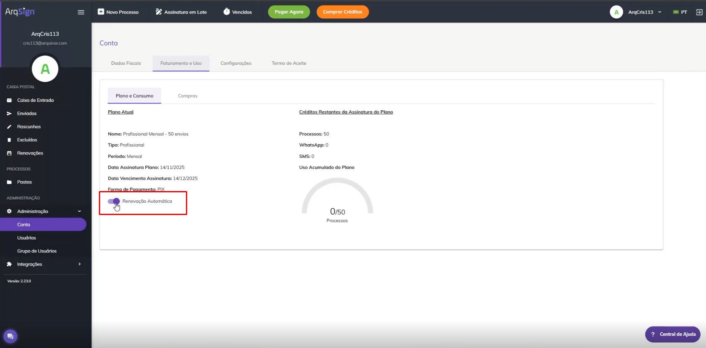<figcaption></figcaption></figure>

### **2.2.1. Assinatura em período TRIAL**

* Ao desmarcar este campo o sistema exibe mensagem de confirmação para remover a renovação automática.

<figure><figcaption>
Clique na imagem para ampliar.
</figcaption></figure>

### **2.2.2. Assinatura sem período TRIAL**

* Para assinatura com forma de pagamento por PIX ou Boleto, o sistema altera a renovação automática da conta em questão.
* Para assinatura com forma de pagamento por cartão de crédito, sistema atualizar o período de cobrança automática da assinatura na plataforma Cyclopay e alterar a renovação automática da conta em questão.


<mark style="color:red;">Quando a assinatura não for localizada na plataforma Cyclopay, o sistema exibe a mensagem "Esta alteração não pode ser realizada. Entre em contato com o suporte técnico." e não alterar a renovação automática.</mark>


#### **2.2.3. Assinatura vencida**

Sistema não exibe o campo **Renovação Automática** quando a assinatura da conta está vencida.

<figure>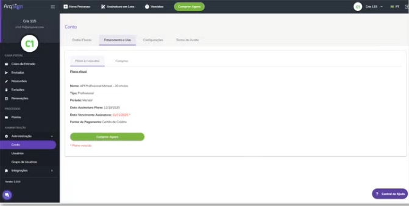<figcaption></figcaption></figure>

***

## 3. Detalhes do plano

Ao clicar em “**Detalhes do Plano**” serão exibidos detalhes do plano atual do usuário, como tipo de plano, período de faturamento (mensal ou anual), valor pago no plano, descrição e quantidade dos itens aos quais o plano dá acesso, valores de créditos, créditos excedentes e data de validade do plano.

<figure>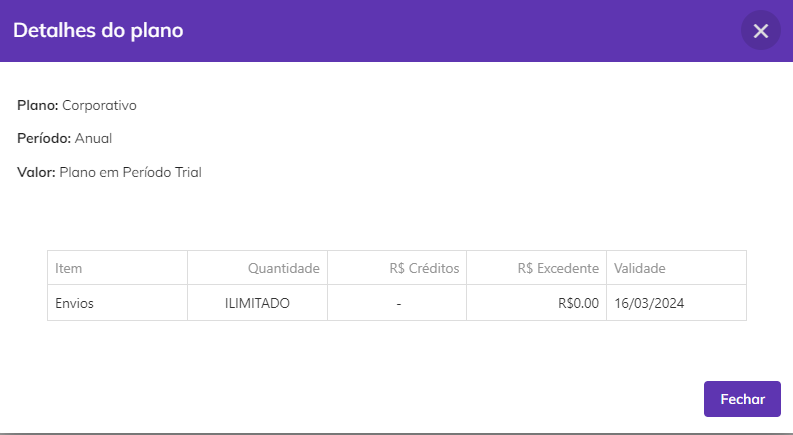<figcaption>
Clique na imagem para ampliar.
</figcaption></figure>

Nesta tela é possível visualizar também a quantidade de créditos restantes o usuário ainda possui para envio de processos. Em “**Uso Acumulado do Plano**” o usuário pode visualizar a quantidade de envios de processos à qual ele tem direito no plano contratado.

Em “**Créditos Restantes da Assinatura do Plano**” são apresentados os créditos que o usuário ainda possui no plano assinado. O usuário pode visualizar a quantidade de créditos que possui para envio de processos via Whatsapp e e-mail e códigos de segurança via SMS.


<mark style="color:orange;">**Não é possível enviar processos via SMS. Os créditos adquiridos para envio via SMS só podem ser usados para disparo de códigos de segurança. O código de segurança ou token é uma senha usada para dar acesso aos processos enviados via e-mail ou Whatsapp e pode ser utilizada para acrescentar uma camada extra de segurança ao processo de assinatura eletrônica de documentos.**</mark>


Se o usuário tiver comprado créditos além daqueles já inclusos no plano clicando em “**Datas de expiração dos créditos extra**” será possível visualizar as datas em que os créditos comprados à parte do plano irão expirar.

<figure>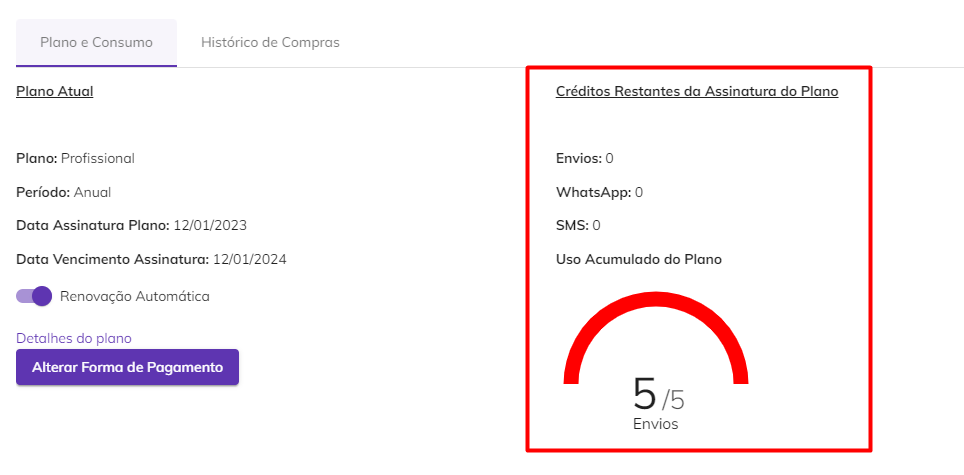<figcaption>
Clique na imagem para ampliar.
</figcaption></figure>


<mark style="color:orange;">**Quando o plano da assinatura da conta for ArqGED, a ArqSign não exibe:**</mark>

* <mark style="color:orange;">**Os campos “Renovação Automática”, "Alterar forma de pagamento" e o botão "Comprar Créditos".**</mark>

<mark style="color:orange;">**O faturamento dessas contas será realizado via ArqGED, de acordo com o serviço estabelecido no contrato.**</mark>&#x20;


***

## 4. Compras

Na aba Compras é exibido um histórico dos produtos já adquiridos pelo usuário.

<figure><figcaption>
Clique na imagem para ampliar.
</figcaption></figure>

Abaixo o detalhamento da tela:

**Descrição da Compra:** Exibe a descrição da compra, que pode ser:

* Compra/Alteração de Plano, exibindo a descrição do plano.
* Compra de créditos, exibindo a quantidade e os itens extras adquiridos.

**Data da Compra:** Exibe a data em que a compra foi realizada.

**Período de Vigência:** Exibe o período de vigência dos itens (plano e itens extras) adquiridos em uma compra com status de pagamento "Pago".

* Compra de plano exibe o período inicial e final da assinatura do plano.
* Compra de créditos, exibe o período inicial e final dos itens extras adquiridos.


<mark style="color:orange;">Quando se tratar de uma compra com pagamento por PIX ou Boleto que esteja com status do pagamento pendente ou cancelado, não será apresentada a vigência.</mark>


**Parcela:** Exibe a parcela da compra o registro se refere no formato ""{0} de {1}"".

**Valor:** Exibe o valor da compra, em reais.

**Status:** Exibe o status da compra.

* **Pago** para compra com pagamento confirmado.
* **Pendente** para compra com pagamento pendente.
* **Cancelado** para compras om pagamento cancelado.

**Detalhes:** Exibe o link conforme o tipo e status da compra.

**Compra com status&#x20;**<mark style="color:green;">**Pago**</mark>

* **Compra de Créditos** apresenta o link "**Detalhes da Compra**". Ao clicar neste link, o sistema exibe a modal Detalhes da Compra.
* **Compra de Plano** apresenta o link "**Detalhes do Plano**". Ao clicar no link, o sistema exibe a modal Detalhes do Plano.

**Compra de plano ou créditos com status&#x20;**<mark style="color:yellow;">**Pendente**</mark>

* Se **pagamento com PIX** exibe o link "Pagar com PIX". Ao clicar neste link, o sistema exibe a modal Pagamento com PIX.
* Se **pagamento com boleto** exibe o link "Pagar com Boleto". Ao clicar no link, o sistema exibe a modal Pagamento com Boleto.

**Compra com status&#x20;**<mark style="color:red;">**Cancelado**</mark>

* Compra com dado de **pagamento não regerado** e **não tiver excedido o limite** de dias permitido para regerar, exibe o link "**Regerar Pagamento**". Ao clicar neste link, o sistema regera os dados de pagamento e apresenta a mensagem "**Link de pagamento regerado com sucesso**."
* Compra que não permite regerar o pagamento

**Se compra regerada:** apresenta o ícone informativo com a mensagem no _tooltip_ "Este pagamento já foi regerado."

**Se compra não atender ao critério do prazo de dias para regerar:** apresentar o ícone informativo com a mensagem no _tooltip_ "Este pagamento não pode ser regerado, realize a compra novamente.".

Ao clicar em “**Detalhes do plano**” é exibido o detalhamento dos itens que compõem o plano, os valores de créditos e valores excedentes (quando adquiridos) e a data de validade de cada um dos itens.

<figure>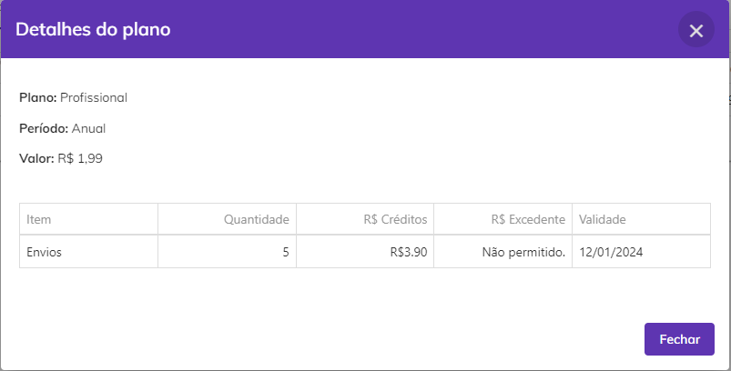<figcaption>
Clique na imagem para ampliar.
</figcaption></figure>

***

## 5. Home

O sistema exibe alerta e botões de compras, conforme o status, renovação, forma de pagamento e vigência da assinatura da conta .

Os alertas e botões de compras serão exibidos somente para o usuário que possui a permissão 3.1.4.1 - Alterar Plano.

### **5.1. Conta teste grátis ou conta com status bloqueado**

Ao clicar no botão Comprar Agora ou no link Clique aqui, o sistema direciona o usuário para o site (e-commerce) que lista os planos disponíveis para compra.

<figure><figcaption>
Clique na imagem para ampliar.
</figcaption></figure>

<figure><figcaption>
Clique na imagem para ampliar.
</figcaption></figure>

### **5.2. Conta - assinatura com pagamento pendente (PIX ou Boleto)**

Ao clicar no botão Pagar Agora ou no link Clique aqui, na Home, o sistema apresenta a modal com os dados de PIX ou boleto para pagamento, conforme nas imagens abaixo:

<figure><figcaption>
Clique na imagem para ampliar.
</figcaption></figure>

<figure><figcaption>
Clique na imagem para ampliar.
</figcaption></figure>

***

### **5.3. Conta com assinatura próximo de vencer**

Conta com status ativo com assinatura de plano diferente de grátis, sem período TRIAL e com período final próximo de vencer.

#### **5.3.1. Forma de pagamento alterada para cartão de crédito**

<figure><figcaption>
Clique na imagem para ampliar.
</figcaption></figure>

Ao clicar no botão Alterar Plano ou no link Clique aqui, o sistema direciona o usuário para o site (e-commerce) que lista os planos disponíveis para compra.

#### 5.3.2. Renovação automática marcada

**5.3.2.1. Forma de pagamento por PIX ou Boleto**

<figure>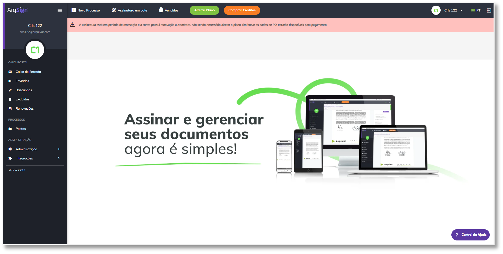<figcaption>
Clique na imagem para ampliar.
</figcaption></figure>

Ao clicar no botão Alterar Plano, o sistema direciona o usuário para o site (e-commerce) que lista os planos disponíveis para compra.

#### 5.3.2. Renovação automática desmarcada

**5.3.2.1. Forma de pagamento por Cartão de Crédito, PIX ou Boleto**

<figure>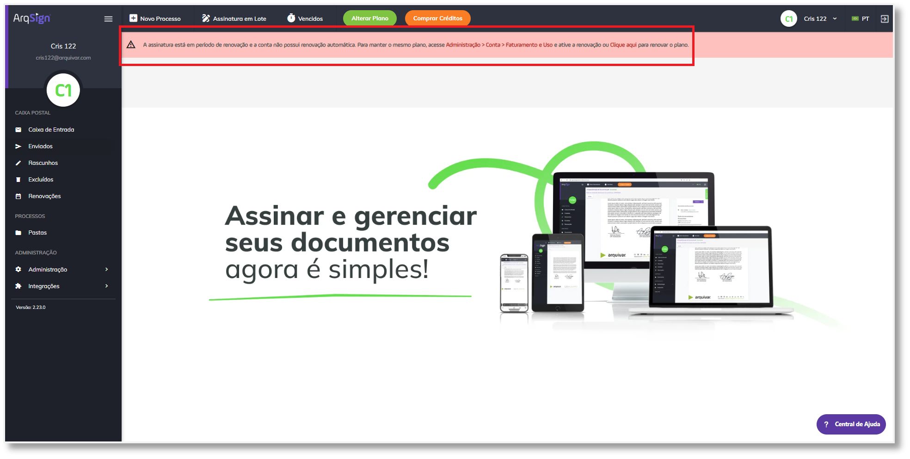<figcaption>
Clique na imagem para ampliar.
</figcaption></figure>

Ao clicar no link **Administração > Conta > Faturamento e Uso**, o sistema exibe a tela de  Faturamento e Uso.


Obs.: Caso o usuário marque a renovação automática, o sistema deve as informações e:


* Se pagamento alterado para cartão de créditos, apresenta o comportamento descrito no tópico 9.4.1.
* Se pagamento por cartão de crédito, apresenta o comportamento no tópico 9.4.2.1.
* Se pagamento por PIX ou Boleto, apresentar o comportamento descrito no tópico 9.4.2.2.

Ao clicar no botão Alterar Plano ou no link Clique aqui, o sistema direciona o usuário para o site (e-commerce) que lista os planos disponíveis para compra.

### 5.4. Conta com assinatura vencendo no dia

Conta com status ativo com assinatura de plano diferente de grátis, sem período TRIAL e com período final vencendo no dia.

#### **5.4.1. Forma de pagamento alterada para cartão de crédito**

<figure><figcaption>
Clique na imagem para ampliar.
</figcaption></figure>

Ao clicar no botão Alterar Plano ou no link Clique aqui, o sistema direciona o usuário para o site (e-commerce) que lista os planos disponíveis para compra.

#### 5.4.2. Renovação automática marcada

**5.4.2.1. Forma de pagamento por Cartão de Crédito**

<figure><figcaption>
Clique na imagem para ampliar.
</figcaption></figure>

Ao clicar no botão Alterar Plano ou no link Clique aqui, o sistema verifica se existe venda paga a partir da data fim da assinatura atual no Cyclopay:

* **Se não existir:** O sistema direciona o usuário para o site (e-commerce) que lista os planos disponíveis para compra.
* **Se existir:** O sistema processa a recorrência e atualiza os dados da conta, exibindo a mensagem: "A assinatura foi renovada com sucesso. Em caso de dúvidas, contate: EmailFaleConoscoArqSign.".

**5.4.1.2. Forma de pagamento por PIX ou Boleto**

<figure>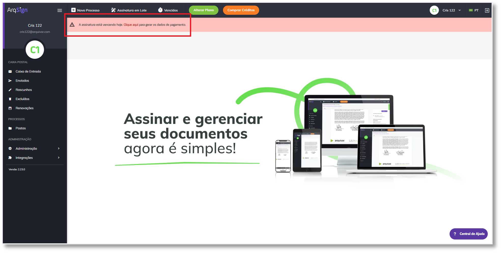<figcaption>
Clique na imagem para ampliar.
</figcaption></figure>

Ao clicar no botão **Alterar Plano**, o sistema direciona o usuário para o site (e-commerce) que lista os planos disponíveis para compra.

Ao clicar no botão no link Clique aqui, o sistema realiza a renovação da assinatura, gerando os dados de pagamento.

#### 5.4.3. Renovação automática desmarcada

**5.4.3.1. Forma de pagamento por Cartão de Crédito, PIX ou Boleto**

<figure>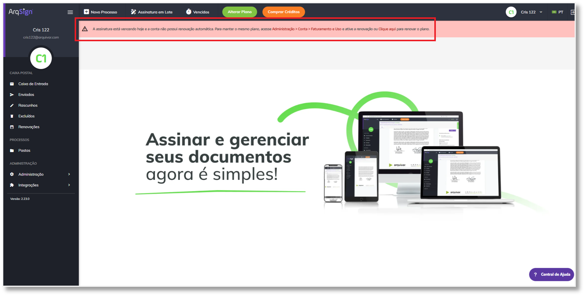<figcaption>
Clique na imagem para ampliar.
</figcaption></figure>

Ao clicar no link **Administração > Conta > Faturamento e Uso**, o sistema exibe a tela de  Faturamento e Uso.


Obs.: Caso o usuário marque a renovação automática, o sistema deve as informações e:


* Se pagamento alterado para cartão de créditos, apresenta o comportamento descrito no ópico 9.5.1.
* Se pagamento por cartão de créditos, apresenta o comportamento no tópico 9.5.2.1.
* Se pagamento por PIX ou Boleto, apresentar o comportamento descrito no tópico 9.5.2.2.

Ao clicar no botão Alterar Plano ou no link Clique aqui, o sistema direciona o usuário para o site (e-commerce) que lista os planos disponíveis para compra.

### 5.5. Conta com assinatura vencida

Conta com status ativo com assinatura de plano diferente de grátis, sem período TRIAL e com período final vencido.

#### **5.5.1. Forma de pagamento por alterada para cartão de crédito**

<figure>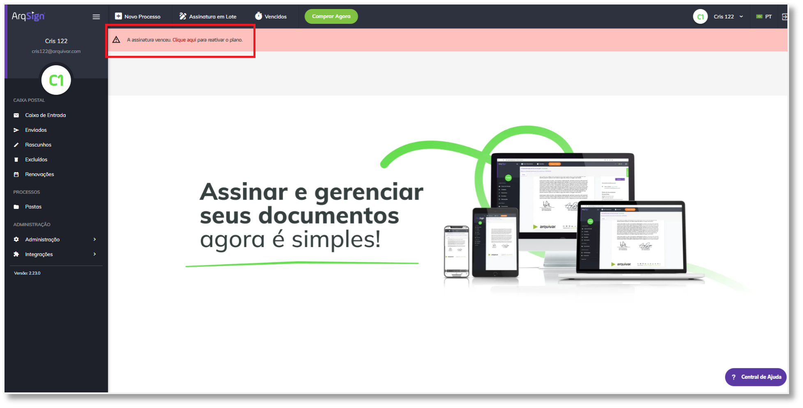<figcaption>
Clique na imagem para ampliar.
</figcaption></figure>

#### 5.5.2. Forma de pagamento por Cartão de Crédito

<figure><figcaption>
Clique na imagem para ampliar.
</figcaption></figure>

Ao clicar no botão Comprar ou no link Clique aqui, o sistema verifica se existe venda paga a partir da data fim da assinatura atual no Cyclopay:

* **Se não existir:** O sistema direciona o usuário para o site (e-commerce) que lista os planos disponíveis para compra.
* **Se existir:** O sistema processa a recorrência e atualiza os dados da conta, exibindo a mensagem: "A assinatura foi renovada com sucesso. Em caso de dúvidas, contate: EmailFaleConoscoArqSign.".

#### 5.5.3. Renovação automática marcada

**5.5.3.1. Forma de pagamento por PIX ou Boleto**

<figure>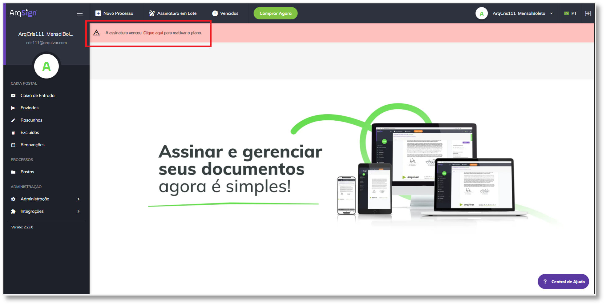<figcaption>
Clique na imagem para ampliar.
</figcaption></figure>

Ao clicar no botão Comprar Agora, o sistema direciona o usuário para o site (e-commerce) que lista os planos disponíveis para compra.

Ao clicar no botão no link Clique aqui, o sistema realiza a renovação da assinatura, gerando os dados de pagamento.

#### 5.5.4. Renovação automática desmarcada

**5.5.4.1. Forma de pagamento por PIX ou Boleto**

<figure><figcaption>
Clique na imagem para ampliar.
</figcaption></figure>

Ao clicar no botão Comprar Agora ou no link Clique aqui, o sistema direciona o usuário para o site (e-commerce) que lista os planos disponíveis para compra.

***

## 6. Aba Configurações

### 6.1. Processos

Por default algumas configurações dessa aba são preenchidas automaticamente, mas é possível alterá-las clicando-se no botão “Editar”.

<figure><figcaption>
Clique na imagem para ampliar.
</figcaption></figure>

Os valores definidos aqui serão adotados como padrão para a configuração de envio e renovações de processos de assinatura feitos pelo usuário, mas podem ser alteradas em cada processos durante a sua criação na tela [Novo Processo > Adicionar Documentos e Destinatários > Configurações Avançadas. ](../../menu-superior/novo-processo.md#configuracoes-avancadas)

**Tempo padrão de \_\_\_\_ dias para expiração do processo, quando não assinado por um ou mais destinatários a partir da data de envio:** Nesse campo é definido o tempo padrão (em dias) que os usuários terão para assinar um processo até que ele expire e fique indisponível.

**Tempo padrão de \_\_\_\_ dias para aviso antes da data de expiração:** Nesse campo é definido quantos dias antes de um processo expirar os destinatários que ainda não tiverem assinado deverão ser notificados sobre a sua expiração.

**Configuração padrão para lembretes recorrentes a serem enviados aos destinatários após a data de envio:** Ao marcar essa opção, a partir do momento do envio do processo até a data de seu vencimento, serão enviados lembretes aos destinatários a cada período de tempo determinado no campo “Tempo padrão de \_\_\_\_\_ dias para recorrência de lembrete aos destinatários sobre alguma ação pendente no processo”. Se a opção for desabilitada, o campo abaixo também será desabilitado automaticamente.

**Agrupar os documentos do processo em arquivo único:** Configuração de agrupamento dos documentos do processo em arquivo único. Essa opção estará, por padrão, desmarcada.

**Obrigar o signatário a ler os documentos antes de assinar:** Essa configuração obriga a leitura dos documentos do processo.  Essa opção estará, por padrão, desmarcada.

<figure><figcaption>
Clique na imagem para ampliar.
</figcaption></figure>

**Gerar QR Code de acesso do documento no Registro de Assinaturas:** Se habilitada essa opção, no Registro de Assinaturas de um documento assinado será apresentado um QR COde, por meio do qual a pessoa que está acessando conseguirá visualizar o documento assinado.

**Tempo padrão de \_\_\_\_\_ dias para expiração do link de acesso ao documento, após a conclusão da assinatura:** Nesse campo é definido o tempo padrão (em dias) que os usuários terão para acessar um documento depois de concluído o processo de assinaturas até que ele expire e fique indisponível.

**Anexar arquivo menor que 10MB ao e-mail enviado na finalização das assinaturas:** Se marcada essa opção, todo documento concluído cujo o arquivo do processo for de tamanho menor que 10MB será enviado aos destinatários como anexo no e-mail de notificação da conclusão do processo de assinatura.


<mark style="color:orange;">**Ao concluir o processo de assinaturas, o sistema enviará um link de acesso ao documento no corpo do e-mail para todos os destinatários.**</mark>


<figure>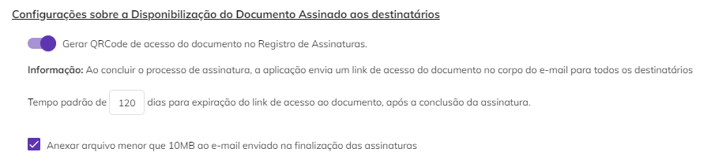<figcaption>
Clique na imagem para ampliar.
</figcaption></figure>

**Configuração padrão para lembretes recorrentes a serem enviados aos remetentes após a data de renovação agendada de um documento:** Se marcada essa opção, quando houver um documento concluído que possui renovação agendada, o sistema vai lembrar ao remetente do documento que ele está apto para ser renovado. Esse lembrete será enviado no período definido no campo “Tempo padrão de \_\_\_\_ dias para recorrência de lembretes aos remetentes sobre renovação de documento”. Se desabilitada essa opção, esse campo será também desabilitado.

<figure><figcaption>
Clique na imagem para ampliar.
</figcaption></figure>

### 6.2. Papel do Signatário

Nesta aba são criados os papéis de signatários. Os papéis de signatários serão apresentados ao usuário no momento da configuração dos destinatários / signatários na tela [Novo Processo > Adicionar Documentos e Destinatários > Adicionar Documentos > Destinatários.](../../menu-superior/novo-processo.md#b.-destinatarios)


<mark style="color:blue;">O papel do signatário é a função dele no contrato, seja como parte, pessoa contratada ou contratante, testemunha, representante legal etc.</mark>


Por padrão a plataforma apresenta os papéis “Contratada”, “Contratante”, “Fiador”, “Parte” e “Testemunha”.

<figure>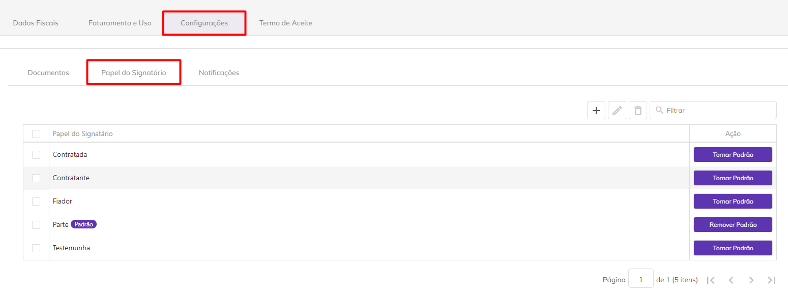<figcaption>
Clique na imagem para ampliar.
</figcaption></figure>

Para editar esses papéis, basta selecionar aquele que deseja editar e clicar no ícone “Editar”.

<figure><figcaption>
Clique na imagem para ampliar.
</figcaption></figure>

Será possível alterar o nome do papel e defini-lo como papel padrão.&#x20;


<mark style="color:orange;">**Papel padrão é aquele que será atribuído ao signatário caso o remetente do processo não defina um papel específico para ele no momento do cadastro do documento. Por default o sistema determina o papel "Parte" como padrão, mas essa escolha pode ser alterada pelo usuário remetente. Não é obrigatório determinar um papel padrão, mas caso seja preciso, somente um dos papéis pode ser o padrão.**</mark>


<figure><figcaption></figcaption></figure>

Para criar um novo papel, clique no ícone “Adicionar” e informe um nome para o papel. Se desejar torná-lo o papel padrão, assinale a opção “Definir este papel como padrão”. Para finalizar, clique em “Salvar”.

<figure><figcaption>
Clique na imagem para ampliar.
</figcaption></figure>

<figure><figcaption></figcaption></figure>

Para alterar o papel padrão clique “Remover Padrão” ou “Tornar Padrão”, de acordo com a necessidade.

<figure><figcaption>
Clique na imagem para ampliar.
</figcaption></figure>

Para excluir um papel, clique no ícone “Excluir”. Também é possível localizar um tipo de papel utilizando a barra de pesquisa da tela. &#x20;

<figure><figcaption></figcaption></figure>

### 6.3. Notificações

**Notificar ao atingir \_\_\_\_ % de uso dos itens da minha assinatura:** Ao preencher esse campo, o usuário será notificado pelo sistema quando o seu consumo do plano atingir determinada porcentagem. Essa configuração será desabilitada no plano com envios ilimitados.

**Notificar a cada \_\_\_\_\_ dias, a partir de \_\_\_\_\_ dias antes do vencimento da assinatura:** Ao preencher esses campos os administradores globais da conta serão notificados no período determinado quando a data de vencimento do plano estiver se aproximando do vencimento. Após o vencimento da assinatura, este tipo de notificação não será mais enviada.

<figure><figcaption>
Clique na imagem para ampliar
</figcaption></figure>

Se habilitado o campo “**Notificações Personalizadas - Personalização com cores e logo da marca**” será possível inserir um banner e definir as cores de destaque das notificações enviadas aos destinatários por e-mail e Whatsapp.

<figure>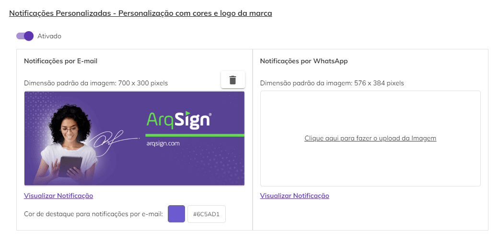<figcaption>
Clique na imagem para ampliar.
</figcaption></figure>


<mark style="color:orange;">**Atente-se à dimensão padrão da imagem para o banner. Imagens fora dos tamanhos especificados não serão aceitas.**</mark>


<figure>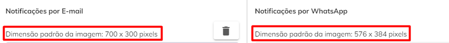<figcaption></figcaption></figure>

Clicando no ícone “Excluir imagem” o banner será excluído.

Clicando em “Visualizar Notificação” será possível ver como será apresentado ao destinatário o e-mail de notificação e a notificação via Whasapp.

<figure>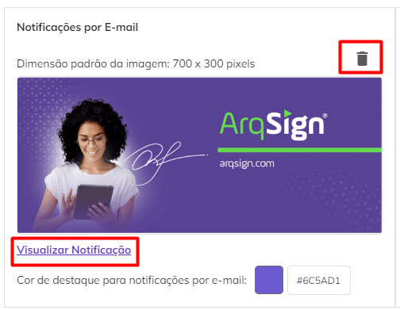<figcaption>
Clique na imagem para ampliar.
</figcaption></figure>

<figure>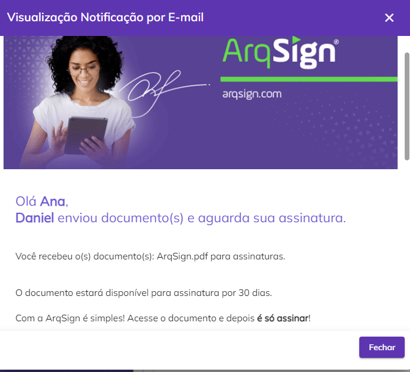<figcaption></figcaption></figure>


<mark style="color:orange;">**Caso estes campos não sejam preenchidos, o sistema enviará o banner e utilizará as cores padrão da plataforma ArqSign.**</mark>


***

## 7. Aba Termo de Aceite

### 7.1. Termo

Nesta aba o usuário pode inserir ou editar o Termo de aceite para Assinatura Eletrônica que é apresentado aos signatários no momento da assinatura de um documento. O objetivo desse termo é assegurar que os signatários aceitaram assinar o documento eletronicamente.

A plataforma apresenta o termo padrão, mas caso o usuário deseje editar ou substituir esse texto, pode fazê-lo clicando em “Editar”.

<figure><figcaption>
Clique na imagem para ampliar
</figcaption></figure>

Ele poderá também alterar a formatação e cores do texto utilizando a barra de ferramentas de edição.

<figure><figcaption>
Clique na imagem para ampliar.
</figcaption></figure>

Ao clicar em “Visualizar” o Termo é exibido da forma que será apresentado aos signatários. O usuário poderá imprimir o texto clicando em “Imprimir”.

<figure><figcaption></figcaption></figure>

### 7.2. Histórico de Aceite

Nesta aba são apresentadas todos os Aceites ao Termo de Assinatura Eletrônica realizados por signatários, ou seja, toda vez que um signatário aceitar o Termo de Aceite apresentado a ele, essa ação será registrada e poderá ser consultada nesta tela.

* **Data do Aceite:** Nesta coluna é apresentada a data em que o signatário aceitou o Termo de Assinatura Eletrônica.
* **Nome:** Nome do signatário que realizou o aceite.
* **E-mail/Telefone:** Contato do signatário por meio do qual ele recebeu o link para acesso ao documento para assinatura e realizou o aceite.
* **Versão do Termo:** Esta coluna mostra a versão do Termo de Assinatura Eletrônica aceita pelo usuário. Cada vez que o Termo é editado ou substituído, o sistema atribui a ele uma nova versão.
* **IP:** Essa coluna apresenta o IP da máquina utilizada pelo signatário no momento do aceite do Termo de Assinatura Eletrônica.
* **Geolocalização:** Essa coluna apresenta a geolocalização da máquina do signatário no momento em que ele realizou o aceite ao Termo de Assinatura Eletrônica.
* **Visualizar Termo:** Ao clicar neste botão é exibida a versão do termo que foi aceita pelo signatário.

<figure>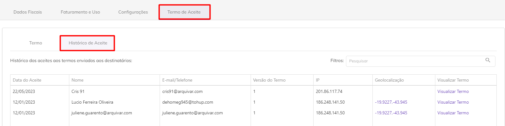<figcaption>
Clique na imagem para ampliar.
</figcaption></figure>

<figure><figcaption>
Clique na imagem para ampliar.
</figcaption></figure>

## 🗪 Perguntas e Respostas Frequentes

Como personalizar a plataforma ArqSign com as cores e logomarca do cliente?

Na plataforma ArqSign, as notificações (e-mails e mensagens de WhatsApp) para os remetentes e destinatários podem ter os seguintes layouts:&#x20;

1. Layout Padrão da Plataforma ArqSign ou&#x20;
2. Layout com suas cores e logomarca.&#x20;

Os itens disponíveis para personalização são:&#x20;

* Cabeçalho&#x20;
* Cor do texto superior&#x20;
* Cor do botão do e-mail ou mensagem de WhatsApp&#x20;

Para personalizar as notificações da Plataforma ArqSign, basta que o Administrador da conta acesse: Administração > Conta > Configurações > Outros e seguir os seguintes passos:&#x20;

1. No canto inferior direito clique em editar;&#x20;
2. Em “Notificações Personalizas”, altere para Ativado;&#x20;
3. Em “Notificações por E-mail”, execute as seguintes etapas:&#x20;

* insira uma imagem para o cabeçalho das mensagens com as dimensões descritas no campo;&#x20;
* escolha a cor de destaque para o texto do e-mail.&#x20;

&#x20;     4\. Em “Notificações por WhatsApp”, execute a seguinte etapa:&#x20;

* Insira uma imagem para cabeçalho das mensagens com as dimensões descritas no campo.&#x20;

&#x20;     5\. Se quiser visualizar as notificações com as mudanças que você fez clique em “Visualizar Notificação”;&#x20;

&#x20;     6\. Quando todos os ajustes estiverem ok, clique em “Salvar”.&#x20;

.png>)

Notificação padrão:

.png>)

Exemplo de notificação personalizada simulação:

.png>)

Como alterar o cartão de crédito para faturamento e compra na plataforma ArqSign?

Você pode alterar o seu cartão de crédito para faturamento e compras na Plataforma ArqSign, seguindo o seguinte passo a passo:

1\) Vá até o menu “Administração”;

2\) Clique em “Conta”;

3\) Clique em “Faturamento e Uso”;

4\) Clique em “Alterar a forma de pagamento”.

Como personalizar as configurações para Processo de Assinatura, Disponibilidade do link para documento assinado, lembretes e notificações da plataforma?

Você pode personalizar as configurações padronizadas e, se precisar, ajustar lembretes e notificações durante a criação de seus Processos.

Para personalizar as configurações padronizadas siga o passo a passo:&#x20;

1. Acesse o menu de Administração > Conta > Configurações;&#x20;
2. Clique em Editar;&#x20;
3. Faça os ajustes conforme sua necessidade;&#x20;
4. Clique em Salvar.&#x20;

Entenda em detalhes cada um dos itens personalizáveis:&#x20;

* Configurações sobre o Processo de assinatura.
* Tempo padrão em dias para expiração do Processo a partir da data de envio.&#x20;
* Tempo padrão em dias para aviso antes da expiração.
* Habilitar, desabilitar e definir periodicidade de lembretes para assinatura aos signatários pendentes.&#x20;
* Configurações de disponibilidade do link para o documento assinado.
* Configure o tempo padrão para expiração do link de acesso ao documento após a assinatura.&#x20;
* Habilite, desabilite a opção de anexar arquivo menor que 20MB ao e-mail enviado na finalização das assinaturas.&#x20;
* Configurações sobre lembretes para vencimento, renovação, reajuste.
* Configure a recorrência de lembretes para vencimento, renovação, reajuste de documentos, Processos.&#x20;
* Em Outros, configure notificações em relação à conta.
* Notificação para percentual de uso dos itens da conta.&#x20;
* Notificação para lembrete de vencimento da assinatura.&#x20;

Como habilitar e desabilitar a renovação automática do plano?

Durante a vigência do plano o cliente pode habilitar ou desabilitar a renovação automática do plano. Para isso acesse: [Administração > Conta > Faturamento e Uso > Renovação Automática](conta.md#aba-faturamento-e-uso).&#x20;

Como verificar plano, vencimento, renovação automática e consumo?

Acesse o menu de [Administração > Conta > Faturamento e Uso](conta.md#aba-faturamento-e-uso).&#x20;

Consulte o plano contratado, período do plano, data de assinatura, data de vencimento, renovação automática, itens consumidos e disponíveis, período de renovação e Histórico de compras.&#x20;

Como personalizar o Termo de Aceite para assinatura eletrônica?

A funcionalidade Termo de Aceite para assinatura eletrônica, formaliza e registra o histórico de aceite dos signatários para assinatura no formato eletrônico o que é um pré-requisito legal para a validade jurídica da assinatura. Você pode utilizar a nossa sugestão de Termo de Aceite ou personalizar o seu. Para personalizar siga os seguintes passos:&#x20;

1. Clique em [Administração > Conta > Termo de Aceite](conta.md#aba-termo-de-aceite);&#x20;
2. Clique em editar e personalize o seu termo;&#x20;
3. Clique em publicar.

[Clique aqui](https://youtu.be/MBJB6RW7y7E) e assista ao passo a passo.

