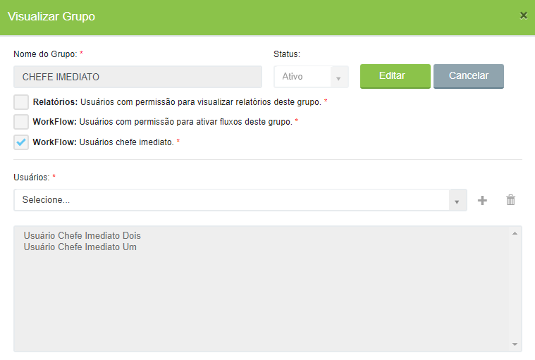

# 🟩 API

No menu Grupos são criados grupos de usuários com permissão de acesso a algumas funcionalidades do sistema, que são:&#x20;

* **Relatórios:** Usuários com permissão para visualizar relatórios deste grupo - Ao criar um relatório é possível restringir seu acesso apenas a quem for membro de um grupo de relatórios.&#x20;
* **Workflow: Usuários com permissão para ativar fluxos deste grupo** - Ao criar um fluxo é possível restringir sua criação apenas a quem for membro de um grupo deste tipo.&#x20;
* **Workflow: Usuários chefe imediato** – Membros de grupos de chefe imediato podem ser selecionados para receber notificações e realizar tarefas durante fluxos executados por seus subordinados. &#x20;

<figure><figcaption>
Clique na imagem para ampliar.
</figcaption></figure>


<mark style="color:orange;">**A indicação do chefe imediato de um usuário deve ser feita na tela**</mark> [<mark style="color:orange;">**Administração > Usuários > Aba Permissões II.**</mark>](usuarios.md)


