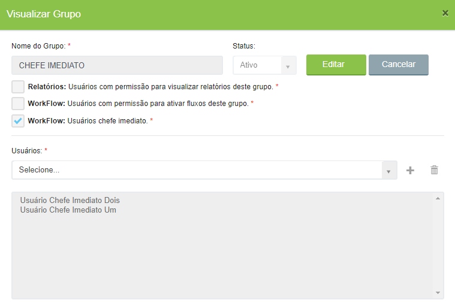

# 🟩 Grupos



No menu Grupos são criados grupos de usuários com permissão de acesso a algumas funcionalidades do sistema, que são:

*   **Relatórios:** **Permissões de Visualização e Edição por Grupo**

    Ao criar um relatório, é possível restringir o acesso apenas aos usuários que fazem parte de um grupo de relatórios. Somente os usuários que possuem permissão específica e que pertencem ao grupo poderão acessar a aba de **Relatórios** e visualizar os dados correspondentes.

    **Permissões por tipo de usuário:**

    * **Usuário 006:** possui permissão para **visualizar e editar** os relatórios e os grupos de relatórios.
    * **Usuário 01:** possui permissão para **visualizar relatórios**, mas **não pode visualizar os grupos**.
    * **Usuário 02:** possui permissão para **visualizar os grupos**, mas **não pode visualizar os relatórios**.
* **Workflow: Usuários com permissão para ativar fluxos deste grupo** - Ao criar um fluxo é possível restringir sua criação apenas a quem for membro de um grupo deste tipo.
* **Workflow: Usuários chefe imediato** – Membros de grupos de chefe imediato podem ser selecionados para receber notificações e realizar tarefas durante fluxos executados por seus subordinados.

<figure><figcaption>
Clique na imagem para ampliar.
</figcaption></figure>


<mark style="color:orange;">**A indicação do chefe imediato de um usuário deve ser feita na tela**</mark> [<mark style="color:orange;">**Administração > Usuários > Aba Permissões II.**</mark>](usuarios.md)

