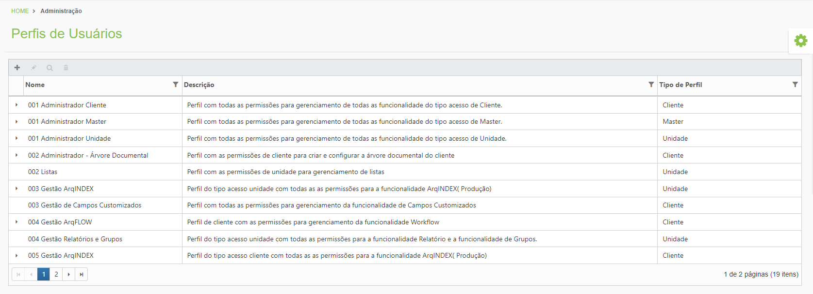
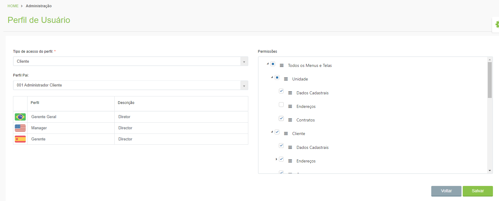

# 🟩 Perfis de Usuários

Neste menu são criados todos os perfis de usuários da plataforma. Um perfil de usuário é criado de acordo com as permissões que o usuário terá de acesso às funcionalidades da plataforma. Os perfis de usuário podem ser de quatro tipos:&#x20;

* **Root:** Perfis com acesso a todas as funcionalidades e permissões da plataforma. Apenas usuários do setor de TI da Arquivar Master possuem esse tipo de perfil.&#x20;
* **Master:** Perfis criados para todos os colaboradores da Arquivar Master.&#x20;
* **Unidade:** Perfis criados para todos os colaboradores das unidades Arquivar franqueadas.&#x20;
* **Cliente:** Perfis criados para os clientes Arquivar. &#x20;

<figure><figcaption>
Clique na imagem para ampliar.
</figcaption></figure>

Ao solicitar a criação de um novo perfil é preciso informar o tipo ao qual ele se enquadrará e as permissões de acesso, selecionando as ações que o perfil que está sendo criado poderá executar. &#x20;

<figure><figcaption>
Clique na imagem para ampliar.
</figcaption></figure>
