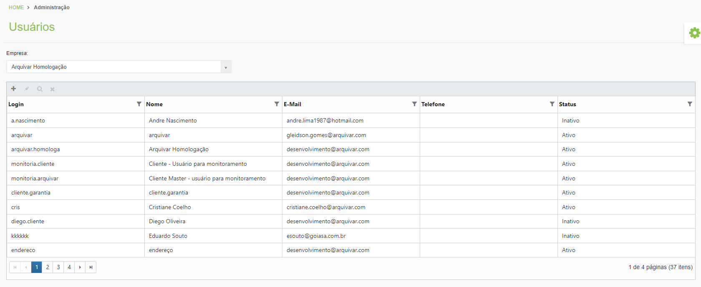

# 🟩 Usuários

No menu Usuários são criados todos os usuários que utilizam o sistema ArqGED e atribuídas as permissões de acesso às funcionalidades do sistema. &#x20;

<figure><figcaption>
Clique na imagem para ampliar.
</figcaption></figure>

## Criar novo usuário

<figure><figcaption>
Clique na imagem para ampliar.
</figcaption></figure>

**Empresa:** Selecione o nome do cliente que deseja.

**Adicionar:** Clique para criar um novo usuário.

### Aba Usuário

<figure><figcaption>
Clique na imagem para ampliar.
</figcaption></figure>

**Nome:** Informe o nome completo do usuário.

**Usuário:** Informe qual será o usuário que deverá ser utilizado na tela de acesso ao sistema.


<mark style="color:blue;">Crie um padrão de usuário para seu cliente, como por exemplo: "nome" + "." + "sobrenome" (maria.santos), ou utilize o e-mail corporativo, assim será muito difícil criar um usuário já existente. Quando isso acontece, é apresentada a seguinte mensagem:</mark>

.png>)

<mark style="color:blue;">Outro ponto importante é que a validação de duplicidade de usuário ocorre em todo o banco de dados do ArqGED e não somente na base de determinado cliente.</mark>


**Tipo de Acesso:** No caso de usuário de cliente, a única opção disponível é "Cliente", quando o processo é realizado pela Unidade, também é apresentada a opção de acesso "Unidade".

**Status:** Indica a situação do usuário no sistema. Ao adicionar um novo usuário, será mantido como "**Inativo" até que sejam aplicadas todas as permissões/configurações do usuário.** Ao finalizar todas as configurações, retorne na aba de usuário e altere o status para "ativo", caso contrário, o usuário não conseguirá logar no sistema.

**Telefone Fixo e Telefone Celular:** Não são campos de preenchimento obrigatório, porém, estão disponíveis para uso.

**E-mail:** Informe o e-mail mais acessado pelo usuário, este endereço será utilizado para todo o processo de comunicação com o usuário dentro do ArqGED.

**Senha e Confirmar Senha:** Crie uma senha temporária para o usuário considerando os critérios apresentados pelo sistema: _"A senha deve conter no mínimo 8 caracteres, contendo letra maiúscula, minúscula, número e caractere especial."_

**Inativar o usuário depois do dia:** Deve ser utilizado quando o usuário precisar de acesso ao sistema por um determinado período. Ao informar uma data de inativação, automaticamente o usuário será inativado na data previamente cadastrada.&#x20;

**Alterar senha no próximo login:** Marcando o _checkbox_**,** assim que o usuário acessar o sistema pela primeira vez com a senha temporária criada para primeiro acesso, ele deverá criar uma senha pessoal considerando os critérios exigidos pelo sistema.

**Trocar senha a cada \_\_\_ mês:** Marcando o _checkbox_, o sistema deverá de forma automática solicitar o cadastro de uma nova senha, sempre que atingido o prazo estipulado.

**Notificação TTD:** Marcando o _checkbox_, o usuário será notificado quanto ao vencimento dos documentos da sua empresa, caso contratado o serviço.


<mark style="color:blue;">É indicada a utilização do</mark> <mark style="color:blue;"></mark>_<mark style="color:blue;">checkbox</mark>_ <mark style="color:blue;"></mark><mark style="color:blue;">"Notificação TTD" apenas para os usuários com permissão de acesso completo a Árvore Documental do cliente, visto que para esta notificação, o sistema não valida o acesso do nível da Árvore Documental sendo o relatório de documentos vencidos enviado na íntegra ao usuário.</mark>


### Aba Permissões I

<figure><figcaption>
Clique na imagem para ampliar.
</figcaption></figure>

**Master:** Informe se o usuário é do tipo Master, ou seja, se ele deve acessar a Árvore Documental completa ou se ele deve ter restrições por departamento ou tipo documental, etc.

**Usuário Master > SIM:** Indica que o usuário terá acesso a todos os níveis da Árvore Documental, sendo necessária a definição somente do tipo de acesso que deve ser aplicado aos níveis.

<figure><figcaption>
Clique na imagem para ampliar.
</figcaption></figure>

**Usuário Master > NÃO:** Indica que o usuário possui restrições de acesso aos níveis da Árvore Documental, neste caso é habilitada a coluna Árvore Organizacional, para que o perfil de acesso seja definido conforme nível da árvore.

<figure><figcaption>
Clique na imagem para ampliar.
</figcaption></figure>


<mark style="color:blue;">Só é permitido definir se o usuário é Master ou não neste momento. Uma vez realizada a definição, não é permitido alterar,  neste caso, um novo usuário deverá ser criado.</mark>


**Clientes que o usuário terá acesso:** Aqui devem ser selecionados todos os clientes que o usuário terá acesso dentro do ArqGED, ou seja, o sistema permite o acesso a vários clientes considerando um login único, ao selecionar o cliente, clique em adicionar "+". Repita o processo até que todos os clientes estejam listados na tela.&#x20;


<mark style="color:blue;">Quando o atendimento do cliente é realizado por mais de uma Unidade, devem ser adicionadas todas as Unidades uma a uma na lista. Desta forma as permissões são aplicadas para todas as Unidades selecionadas, não sendo possível a aplicação de permissões diferentes por Unidade.</mark>


Selecione o cliente que deseja definir as permissões para que a Árvore Documental seja habilitada na tela:

<figure><figcaption>
Clique na imagem para ampliar.
</figcaption></figure>

Selecione o perfil que deseja atribuir clicando e arrastando para o nó de Árvore desejado. Para selecionar vários perfis, mantenha o "Ctrl" pressionado e clique nos perfis desejados, arraste os perfis para a Árvore ou clique na opção "Atribuir os perfis selecionados para os níveis de Árvore".

<figure><figcaption>
Clique na imagem para ampliar.
</figcaption></figure>

Clicando no botão de atribuição, será apresentada uma nova tela para indicar em qual nível da Árvore o perfil deve ser aplicado, selecione o desejado e clique "Salvar".

<figure><figcaption>
Clique na imagem para ampliar.
</figcaption></figure>


<mark style="color:orange;">Se o usuário não for do tipo Master, é possível aplicar permissões diferentes para diferentes nós da Árvore. Se o usuário for do tipo Master, ele terá acesso a toda a Árvore Documental, de acordo com o perfil de acesso definido, por exemplo, se ele tiver perfil de "Edição", ele poderá editar em todos os nós da árvore.</mark>


Os perfis são aplicados considerando as atribuições do nível mais alto, então se for arrastado o perfil "pai", todas as permissões "filhas" serão aplicadas ao nó da árvore.

Considerando o exemplo abaixo, ao selecionar o "pai" - Gestão de Documentos para um nó da árvore, automaticamente terá habilitada as permissões filhas:

\- Gestão de Documentos Eletrônicos

&#x20;  \- Eletrônico - Cadastrar, Alterar e Visualizar

&#x20;   \- Eletrônico - Visualizar

&#x20;     \- Eletrônico - Visualizar (não altera)

Caso a restrição precise ser em um nível "filho", é necessário selecionar somente este perfil no momento de arrastar para a árvore, desta forma não serão aplicadas permissões dos níveis superiores ou do nível "pai".

<figure><figcaption>
Clique na imagem para ampliar.
</figcaption></figure>

Como regra, o sistema permite ao perfil que cria novos usuários, definir acessos iguais ao seu ou inferiores, ele também só consegue criar acessos para os mesmos níveis de árvore que ele visualiza.


<mark style="color:red;">Importante ressaltar que a análise das permissões de cada usuário na árvore é de extrema importância para que os perfis sejam aplicados conforme necessidade e não comprometa a saúdo do sistema. Se por ventura esta análise não for feita e o perfil de acesso for aplicado em toda a árvore para todos os usuários, podem ocorrer casos de lentidão desde o momento do login, onde o sistema já inicia a verificação das permissões de acesso, até o momento da consulta de documentos, onde o sistema verifica na solicitação quais dados podem ser apresentados ao usuário logado.</mark>

<mark style="color:red;">Caso identificada a necessidade de acesso a toda a Árvore Documental, a orientação é que o usuário seja criado do tipo "Master".</mark>


Para atribuir uma licença de assinatura digital ao usuário, é necessário concluir todas as configurações e posterior ativação do usuário para que então a opção de atribuir a licença seja habilitada.

<figure><figcaption>
Clique na imagem para ampliar.
</figcaption></figure>

Ativado o usuário, prossiga com a atribuição da licença de assinatura digital do usuário, clique no ícone. Na frente do ícone o sistema apresenta a quantidade de licenças utilizadas x a quantidade de licenças contratadas.

<figure><figcaption>
Clique na imagem para ampliar.
</figcaption></figure>

Para desativar a licença, clique novamente no ícone.

<figure><figcaption>
Clique na imagem para ampliar.
</figcaption></figure>

Existe também a opção de **"Copiar as Permissões para outro usuário do cliente"**, esta funcionalidade permite que as configurações de perfil seja realizada para um usuário e replicada de forma automática aos demais.

<figure><figcaption>
Clique na imagem para ampliar.
</figcaption></figure>

Crie o(s) novo(s) usuário(s) preenchendo os dados da [aba usuário](usuarios.md#aba-usuario), depois acesse o usuário que deve ser utilizado como "espelho" e em "Permissões I" clique na opção  **"Copiar as Permissões para outro usuário do cliente".**

Selecione na lista todos os usuários que devem herdar as permissões do usuário em questão. Selecione o nome do usuário e clique em "+" adicionar. Repita o processo até que todos os usuários sejam adicionados na tela. Após clique "Enviar".

<figure><figcaption>
Clique na imagem para ampliar.
</figcaption></figure>

Será apresentada na tela uma mensagem de previsão de conclusão da cópia das permissões.&#x20;

<figure><figcaption>
Clique na imagem para ampliar.
</figcaption></figure>


<mark style="color:blue;">A função de</mark> <mark style="color:blue;"></mark><mark style="color:blue;">**"Copiar as Permissões para outro usuário do cliente"**</mark><mark style="color:blue;">, funciona apenas para clientes que</mark> <mark style="color:blue;"></mark><mark style="color:blue;">**Não**</mark> <mark style="color:blue;"></mark><mark style="color:blue;">são do tipo Master.</mark>



<mark style="color:red;">Se a "Aba Permissões I" não for devidamente configurada com as permissões que devem ser aplicadas para o usuário, ao tentar realizar o primeiro acesso o sistema apresentará a seguinte mensagem na tela:</mark>

.png>)

<mark style="color:red;">Retorne ao usuário e realize as configuração necessárias.</mark>


### Aba Permissões II

<figure><figcaption>
Clique na imagem para ampliar.
</figcaption></figure>

**Endereço Raiz de Armazenamento de Caixas:** Trata-se da lista de endereços utilizada pelo cliente quando realizada a gestão de arquivo interno. Selecione no _checkbox_ somente aqueles que o usuário poderá acessar. Quando não é realizada essa configuração, o usuário não terá a localização física da caixa no busca de documentos, não visualizará o Menu > Caixa ou Pasta > Endereço do Cliente e também não poderá realizar a alocação de caixas.

<figure><figcaption>
Clique na imagem para ampliar.
</figcaption></figure>

**Chefe Imediato:** Selecione na lista apresentada o superior do usuário, em caso de utilização do ArqFlow, o chefe imediato poderá visualizar ou executar atividades de seus subordinados, além de ser notificado quanto ao processo.&#x20;

Dentro do arquivo interno, o chefe imediato também poderá cancelar reservas realizadas por seus subordinados.

**Horário de Trabalho:** Selecione na lista o horário de trabalho praticado pelo usuário, quando cadastrado pelo cliente. Este campo é utilizado no ArqFlow para contabilizar o prazo de execução das atividades. Caso o cliente não utilize é só manter o campo sem preenchimento.&#x20;

**Calendário:** Selecione na lista o calendário utilizado pelo usuário, quando cadastrado pelo cliente. Este campo é utilizado no ArqFlow para contabilizar o prazo de execução das atividades. Caso o cliente não utilize é só manter o campo sem preenchimento.

### Aba Perfil

<figure><figcaption>
Clique na imagem para ampliar.
</figcaption></figure>

Nesta aba temos configurações voltadas para o layout do sistema que será apresentado ao usuário.

**Registros por página:** Informe quantos registros o usuário poderá visualizar por página, a sugestão é que sejam definidos no máximo 20.

**Idioma:** Selecione o idioma que será utilizado, podendo ser Português ou Espanhol.

**Foto de Perfil:** Utilize para fazer o upload da foto do usuário.

**Opções de layout:** Selecione na lista qual como deseja que o usuário veja a tela do sistema.

**Cores Padrão:** Deve ser utilizado para definir qual será a cor aplicada na visão do usuário, porém, o usuário só poderá alterar se no cadastro do cliente tiver sido permitida a mudança com a seleção da possibilidade de "Permitir que o usuário altere o layout padrão".

**Alterar Senha:** Utilize para alterar a senha do usuário criado, quando necessário. Preencha com a nova senha e confirme.&#x20;


<mark style="color:orange;">Concluídas todas as configurações para o novo usuário, salve o cadastro, retorne para a "</mark><mark style="color:orange;">**Aba Usuário"**</mark> <mark style="color:orange;"></mark><mark style="color:orange;">e altere o status para "</mark><mark style="color:orange;">**ativo**</mark><mark style="color:orange;">", caso contrário, o usuário não conseguirá logar no sistema.</mark>


## Excluir / Inativar / Bloquear Usuário

Por padrão, o sistema não permite a exclusão de um usuário da base, isso ocorre devido aos _logs_ e históricos criados nos processos executados. É importante mantermos essa memória de todas as ocorrências.

A orientação é utilizar as opções:

* **Inativar:** Utilizado quando ocorre o desligamento e o usuário não será ativado novamente.
* **Bloquear:** Utilizado quando o acesso precisar ser interrompido por um período curto ou por situações pontuais, por exemplo, quando o usuário estiver de férias e não puder acessar o sistema, mantenha bloqueado.

Para tal alteração acesse a lista de usuários, selecione o que deseja alterar e clique no ícone de edição.&#x20;

<figure><figcaption>
Clique na imagem para ampliar.
</figcaption></figure>

Selecione o status desejado e clique salvar.

<figure><figcaption>
Clique na imagem para ampliar.
</figcaption></figure>

Também é possível "Inativar" o usuário selecionando na tela e clicando no ícone.

<figure><figcaption>
Clique na imagem para ampliar.
</figcaption></figure>

Será apresentada uma mensagem para validar a ação.

<figure><figcaption>
Clique na imagem para ampliar.
</figcaption></figure>
