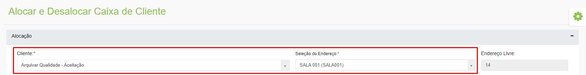
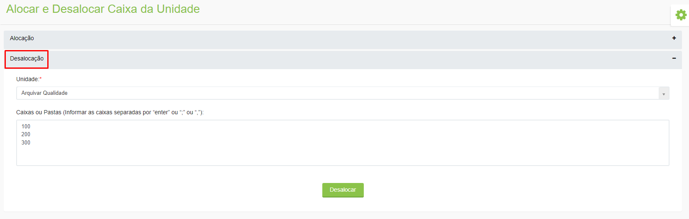
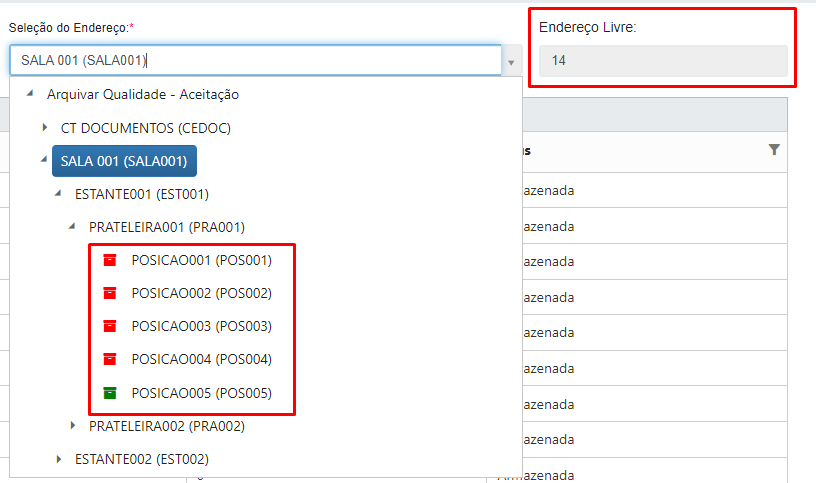

# 🟩 Pesquisar



É possível pesquisar informações sobre as caixas alocadas.

Para realizar uma Pesquisa Simplificada, informe o “Cliente”, a “Unidade” e o código da caixa ou pasta e clique em “Pesquisar”.

<figure><figcaption>
Clique para ampliar a imagem.
</figcaption></figure>

Pode ser feita também a pesquisa por código provisório, ou seja, pelo número não controlado habilitado no menu [Caixa ou Pasta > Configurar](configurar.md).

Para realizar uma Pesquisa Avançada, informe o “Cliente”, a “Unidade” e utilize os demais filtros para refinar os resultados da busca.

<figure><figcaption>
Clique para ampliar a imagem.
</figcaption></figure>

Serão exibidos todos os registros associados ao código informado. Serão exibidos o código da caixa, o endereço onde está alocada, o total de itens que existem dentro dela, o cliente ao qual pertence e o ícone e status de armazenamento.

<figure><figcaption>
Clique para ampliar a imagem.
</figcaption></figure>

Ao selecionar um dos registros são habilitadas as seguintes funcionalidades:

<figure><figcaption></figcaption></figure>

**Editar:** Ao clicar neste ícone serão exibidos os dados cadastrais da caixa ou pasta e o histórico de sua movimentação. Será possível realizar a indexação da caixa e gerar as etiquetas de identificação.

<figure><figcaption>
Clique para ampliar a imagem.
</figcaption></figure>

**Visualizar:** Ao clicar neste ícone serão exibidos os dados cadastrais da caixa ou pasta e o histórico de sua movimentação. Será possível realizar a indexação da caixa e gerar as etiquetas de identificação.

<figure><figcaption>
Clique para ampliar a imagem.
</figcaption></figure>

**Reservar subcaixa:** Se a caixa tiver subcaixas associadas, este ícone será habilitado para que seja feita a reserva das subcaixas.

**Reservar caixa:** Utilizado para reservar a caixa selecionada.

**Exportar:** Exporta os resultados da pesquisa realizada. É possível exportas apenas as informações de caixas, apenas o resultado de subcaixas ou os resultados de ambas.

<figure><figcaption>
Clique na imagem para ampliar.
</figcaption></figure>

## Como enviar uma Subcaixa para Container 

Localize a subcaixa na pesquisa do menu Caixa ou Pasta:

<figure><figcaption>
Clique na imagem para ampliar.
</figcaption></figure>

Selecione a caixa e clique para editar:

Clique na imagem para ampliar.

Clique no botão "Enviar Caixa para":

<figure><figcaption>
Clique na imagem para ampliar.
</figcaption></figure>

Selecione se a caixa deve ser enviada para Guarda Terceirizada, ou seja, para guarda em uma Unidade da Arquivar ou se ela deve ser enviada para Guarda Interna, na sede do cliente.

Depois informe o número da caixa pai, container e clique em "Enviar" para concluir.

<figure><figcaption>
Clique na imagem para ampliar.
</figcaption></figure>


<mark style="color:red;">Caso selecione para "Enviar Caixa para Guarda Terceirizada" e o código informado seja de Guarda interna será apresentada uma mensagem de erro. Verifique a seleção e envie novamente.</mark>

