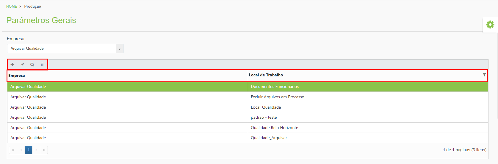
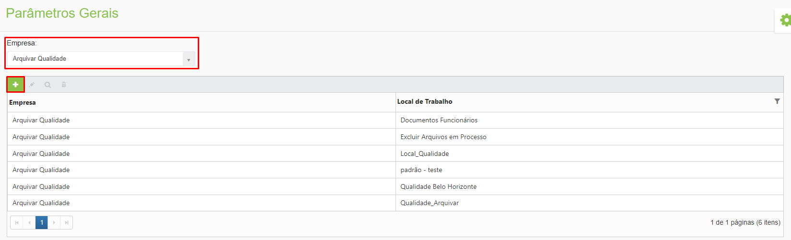
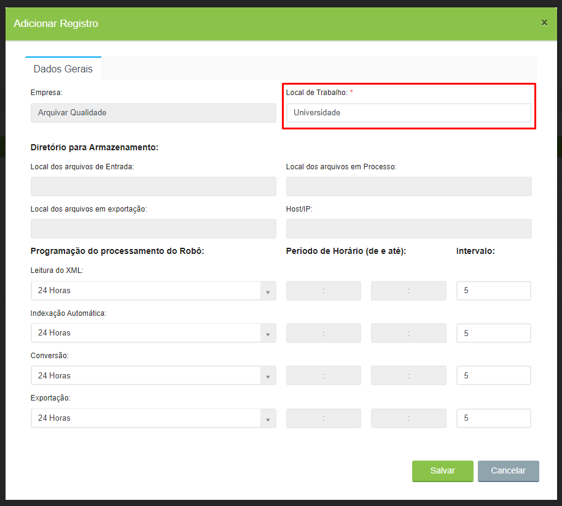
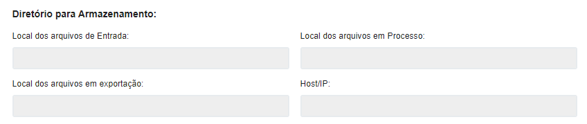
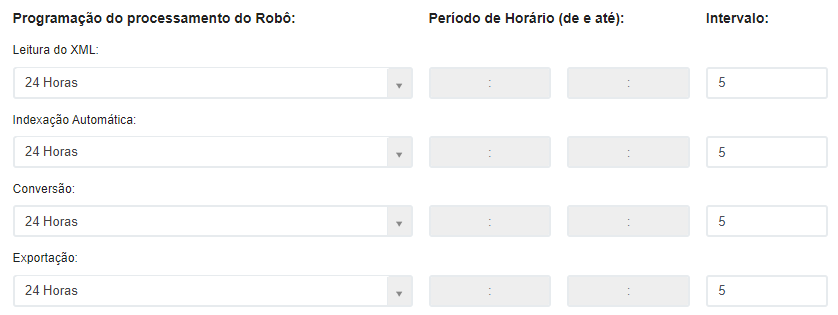
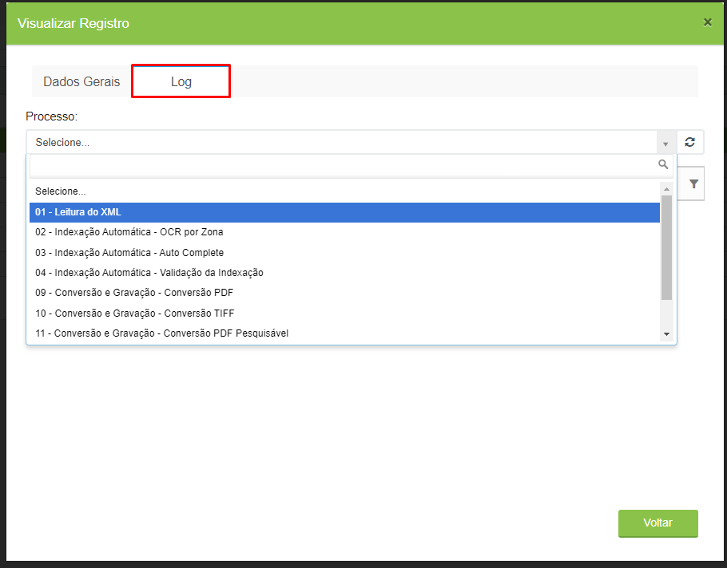
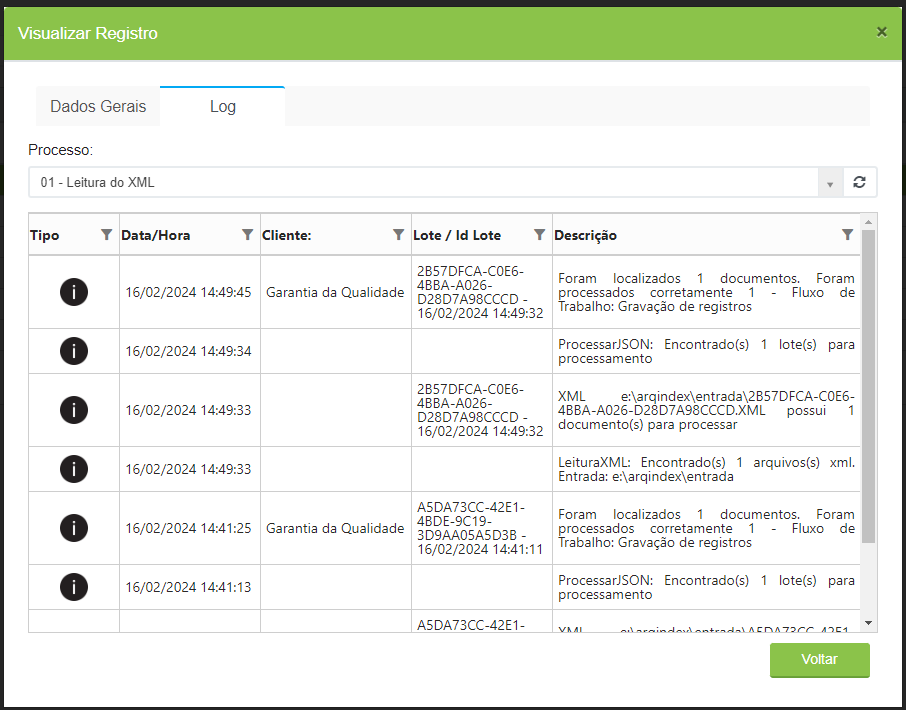

# 🔹 Parâmetros Gerais



No menu Parâmetros Gerais são configurados os locais de trabalho que serão posteriormente associados à aplicação ArqIndex. Cada Unidade ou cliente pode ter um ou mais locais de trabalho configurados, mas a aplicação ArqIndex pode ter relacionado apenas um local de trabalho.


<mark style="color:blue;">**Local de trabalho**</mark> <mark style="color:blue;">é o termo utilizado para configuração criada com os parâmetros de execução da aplicação ArqIndex. Por exemplo, a Unidade Arquivar Qualidade possui um local de trabalho chamado "Documentos de Funcionários".</mark>


O nome do local de trabalho pode ser aquele que o usuário desejar. Posteriormente esse local criado será relacionado a um fluxo de trabalho e associado à aplicação ArqIndex.

## Parâmetros Gerais – Tela inicial

**Campo Empresa:** Utilizado para selecionar o cliente ou a unidade Arquivar relacionada ao cliente.

**Ícone Adicionar:** Utilizado para configurar um novo local de trabalho.

**Ícone Editar:** Utilizado para editar um local de trabalho já existente.

**Ícone Visualizar:** Utilizado para visualizar os detalhes da configuração do local de trabalho selecionado.

**Ícone Excluir:** Utilizado para excluir o local de trabalho selecionado.

**Coluna Empresa:** Exibe o cliente ou unidade Arquivar selecionado.

**Coluna Local de Trabalho:** Exibe o nome dado ao local de trabalho.

<figure><figcaption>
Clique para ampliar a imagem.
</figcaption></figure>

***

## Configuração do local de trabalho

Para iniciar a configuração de um local de trabalho, selecione a "Empresa" e clique no ícone "Adicionar".

<figure><figcaption>
Clique para ampliar a imagem.
</figcaption></figure>

### Aba Dados Gerais

Na tela “Adicionar Registro”, informe um nome para o local de trabalho que está sendo configurado.

<figure><figcaption>
Clique para ampliar a imagem.
</figcaption></figure>

Ao longo do processo de indexação um arquivo de documento fica hospedado em diferentes locais do servidor, chamados de “Diretório para Armazenamento”.

**Local dos arquivos de Entrada:** Quando um documento é digitalizado ele gera dois arquivos: um XML e um PDF ou TIFF (imagem), que ficam hospedados nesse local (pasta).

**Local dos arquivos em Processo:** Quando é realizada a leitura do XML e os documentos gerados são validados e processados corretamente, seus arquivos são enviados para este local (pasta). Neste momento os documentos podem ser consultados para indexação.

**Local dos arquivos em Exportação:** Quando é realizada a indexação dos documentos e são processados corretamente, seus arquivos ficam hospedados neste local (pasta) prontos para serem exportados para o sistema ArqGED. Quando a exportação é executada, os documentos com seus respectivos arquivos são gravados na base de dados do sistema e podem ser consultados por meio da [Localização Simples](../../documento/localizacao-simples.md), [Localização Avançada](../../documento/localizacao-avancada.md) ou tela [Explorar](../../documento/explorar/).

**Host/IP:** Endereço da máquina de instalação da aplicação ArqIndex.

Os campos informados acima são exibidos desabilitados nessa tela, já que são apenas espelho da [configuração realizada na aplicação ArqIndex](aplicativo-arqindex.md#configurar-parametros), ou seja, somente após associado o Local de Trabalho com o ArqIndex será possível configurá-los.

<figure><figcaption>
Clique para ampliar a imagem.
</figcaption></figure>

Em “Programação do processamento do Robô” é definida a periodicidade de execução dos processos da aplicação ArqIndex, ou seja, a execução de cada um dos processos pode durante 24 horas ou durante um horário pré-definido, com intervalo de tempo para execução em minutos. Inicialmente todos os processos são executados por 24 horas a cada cinco minutos, mas o usuário pode alterar essa definição se desejar.


<mark style="color:blue;">**EXEMPLO:**</mark> <mark style="color:blue;">A etapa de Leitura do XML pode ocorrer em horário comercial, de 8h às 18h, e as etapas de Conversão e Exportação podem ocorrer de 18h às 8h. Essa configuração pode ser utilizada em casos de demanda de processamento de rede ou de acordo com a necessidade de cada cliente/unidade.</mark>


<figure><figcaption>
Clique para ampliar a imagem.
</figcaption></figure>

***

### Aba Log

Depois de configurado um local de trabalho, clicando no ícone “Visualizar” é exibida a aba Log, em que são apresentados os logs do robô de processamento, ou seja, as informações de todas as movimentações dos processos que foram realizados nos arquivos escaneados e indexados.

No campo “Processo” selecione a etapa do fluxo de trabalho da qual deseja visualizar os logs executados.

<figure><figcaption>
Clique para ampliar a imagem.
</figcaption></figure>

**Coluna Tipo:** Nesta coluna é apresentado o ícone que representa o tipo de log, que pode ser de informação ou de erro.

**Coluna Data/Hora:** Apresenta as informações de data e hora de quando a ação apresentada foi executada pelo robô do ArqIndex.

**Coluna Cliente:** Apresenta o nome do cliente selecionado.

**Coluna Lote/Id Lote:** Apresenta o Id do lote, quando selecionada a etapa de “Leitura do XML” no campo “Processo”.

**Coluna Descrição:** Apresenta informações do log ou os erros encontrados no processamento do arquivo, se houverem.

<figure><figcaption>
Clique para ampliar a imagem.
</figcaption></figure>
