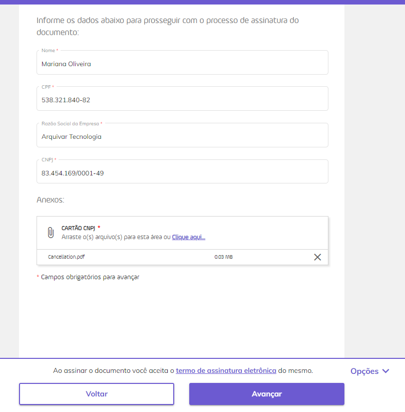

# Novidades ArqSign - Histórico

02/2025

Nova possibilidade de filtro

Possibilidade de filtrar os[ destinatários](/broken/pages/hbDx93gJUPXptabpnm6q#b.-destinatarios) por nome, e-mail ou WhatsApp.

Posições de botões

Foram alterados os posicionamentos de botões da direita para a esquerda nos seguintes menus:

[Meu perfil > Meus Dados](/broken/pages/RbSBr28H7nJdeeDINj7p#aba-meus-dados)

[Meu perfil > Estilo de Assinatura](/broken/pages/RbSBr28H7nJdeeDINj7p#aba-estilo-de-assinatura)

[Conta > Documentos](/broken/pages/DDYlmIGVSNqM0T82hGyz#documentos)

[Conta > Notificações](/broken/pages/DDYlmIGVSNqM0T82hGyz#notificacoes)

[Conta > Termo de Aceite](/broken/pages/DDYlmIGVSNqM0T82hGyz#aba-termo-de-aceite)

Adição de campo no na aba Conta > Dados Fiscais

Adição do campo Bairro na aba [Dados Fiscais](/broken/pages/DDYlmIGVSNqM0T82hGyz#aba-dados-fiscais) no menu Administração > Conta

01/2025

Verificação de falhas na entrega 

O sistema passa a [sinalizar os processos com falha de envio](/broken/pages/rnqe2OErE9bqwNDM0eek#falhas-na-entrega-de-emails) do processo e/ou código de segurança.

Limite de quantidade de arquivos no envio de processos

Implementado o[ limite máximo de 50 arquivos para upload de processos.](/broken/pages/hbDx93gJUPXptabpnm6q#a.-adicionar-documentos-upload-de-arquivos) Foi mantido o tamanho máximo de 35Mb por arquivo e o limite de 100Mb no total.

09/2024

Representação Visual Assinatura

Agora o remetente pode definir qual a [**representação visual** ](/broken/pages/hbDx93gJUPXptabpnm6q#b.-destinatarios)deve ser utilizada pelos signatários no Passo 01 do processo de assinatura.

Validação de dados do(s) signatário(s) para assinatura de documentos

O remetente pode definir uma [**validação de dados do signatário**](/broken/pages/hbDx93gJUPXptabpnm6q#informacoes-complementares-de-assinatura) na configuração da assinatura, determinado uma informação que deve ser validada pelo signatário no momento da assinatura.&#x20;

**Exemplo:** O remetente configurou para que o signatário valide o número de CPF 123.456.789-00. No momento da assinatura o signatário precisa validar esse número para efetivar a assinatura do documento.

Reenvio do Processo de Assinatura - Edição dos dados de validação dos signatários

O documento pode ser [**reenviado ao signatário**](/broken/pages/rnqe2OErE9bqwNDM0eek#reenviar), caso ele ainda não tenha realizado a assinatura, neste momento, ainda é possível alterar as configurações de assinatura do documento.

08/2024

Mensagem Padrão no Menu > Meu Perfil

Agora o usuário pode [**incluir mensagens padrão**](/broken/pages/RbSBr28H7nJdeeDINj7p#mensagem-padrao) no seu perfil para utilizar no envio de Documentos para assinatura apenas selecionando em uma lista a mensagem que deseja utilizar.

07/2024

Configurações da Conta

Nesta versão, foram incluídas duas novas possibilidades de configuração padrão para a conta:&#x20;

**Opção 1** - Agrupar os documentos do processo em arquivo único.&#x20;

**Opção 2** - Obrigar o signatário a ler os documentos antes de assinar.&#x20;

Por _default_, as contas são criadas com essas opções desmarcadas. &#x20;

Para mais detalhes, acesse [<mark style="color:blue;">**Administração > Conta > Configurações**</mark> ](/broken/pages/DDYlmIGVSNqM0T82hGyz#aba-configuracoes)

Enviar Processo > Passo 01

O passo 1 foi atualizado e trouxe uma série de melhorias nas etapas de:&#x20;

[<mark style="color:blue;">**• Configurações Avançadas**</mark>](/broken/pages/hbDx93gJUPXptabpnm6q#configuracoes-avancadas)

[<mark style="color:blue;">**• Upload de arquivos**</mark> ](/broken/pages/hbDx93gJUPXptabpnm6q#adicionar-documentos-upload-de-arquivos)

[<mark style="color:blue;">**• Destinatários**</mark>](/broken/pages/hbDx93gJUPXptabpnm6q#destinatarios)

Clicando em cada uma das etapas, é possível conferir todas as novidades.

Enviar Processo > Passo 02

As atualizações realizadas no passo 2, trouxeram novidades nas etapas:&#x20;

[<mark style="color:blue;">**• Posicionar as assinaturas automaticamente em uma página ao final do documento, que foi substituída pelo “Envio Simplificado".**</mark> ](/broken/pages/hbDx93gJUPXptabpnm6q#envio-simplificado)

[<mark style="color:blue;">**• Documentos do processo - Processo com um ou mais documentos agrupados**</mark> ](/broken/pages/hbDx93gJUPXptabpnm6q#processo-com-um-documento-ou-mais-documentos-agrupados)

[<mark style="color:blue;">**• Documentos do processo - Processo com um ou mais documentos não agrupados**</mark> ](/broken/pages/hbDx93gJUPXptabpnm6q#processo-com-mais-de-um-documento-nao-agrupados)

[<mark style="color:blue;">**• Dados de assinatura e anexos**</mark> ](/broken/pages/hbDx93gJUPXptabpnm6q#informacoes-complementares-de-assinatura)

[<mark style="color:blue;">**• Representação da Assinatura, processo com um documento ou mais documentos agrupados e processo com mais de um documento não agrupado.**</mark> ](/broken/pages/hbDx93gJUPXptabpnm6q#representacao-da-assinatura)

Clicando em cada uma das etapas, é possível conferir todas as novidades.

Assinatura de documento

Na tela de assinatura também foram realizadas alterações consideráveis, que envolvem:&#x20;

[<mark style="color:blue;">**• Assinatura individual**</mark> ](/broken/pages/HJAZaEx7Mqqk6GdlAK06)

<mark style="color:blue;">**•**</mark>[ <mark style="color:blue;">**Assinatura em lote**</mark> ](/broken/pages/jiR2E6B0dSW88XkyIkdv)

<mark style="color:blue;">**•**</mark> [<mark style="color:blue;">**APPNative**</mark> ](/broken/pages/HJAZaEx7Mqqk6GdlAK06#appnative)

Clicando em cada um dos itens, é possível conferir todas as novidades.

Visualizar processo

A [<mark style="color:blue;">**visualização do processo**</mark>](/broken/pages/rnqe2OErE9bqwNDM0eek#visualizar-processo) conta com duas novas opções:&#x20;

• Visão logado&#x20;

• Visão não logado&#x20;

Baixar arquivo

A ação de[ **“Baixar arquivo”**](/broken/pages/TG1uVJS1jp037DiMv6vZ#baixar-arquivo) veio para substituir a ação de “Registro de Assinatura”. Agora, ao solicitar o download do arquivo, a folha de registro de assinaturas já é considerada e o sistema gera o download do documentos do processo de assinatura e do registro de assinaturas em uma pasta zip, onde os arquivos são devidamente no nomeados.&#x20;

Compartilhar processo

Também tivemos novidades na ação de [**compartilhamento do processo**](/broken/pages/TG1uVJS1jp037DiMv6vZ#compartilhar)**.**&#x20;

Renomear

Agora é possível [<mark style="color:blue;">**alterar o nome do processo**</mark>](/broken/pages/TG1uVJS1jp037DiMv6vZ#renomear) com um documento ou o nome do processo e dos documentos que compõem o processo. &#x20;

Histórico

No [<mark style="color:blue;">**histórico**</mark>](/broken/pages/TG1uVJS1jp037DiMv6vZ#historico), tivemos melhorias que permitem mostrar ao usuário o _hash_ do processo ou o _hash_ dos arquivos em pdf quando enviado um processo com vários documentos não agrupados. &#x20;

Notificações

Por fim, as [**notificações**](/broken/pages/HJAZaEx7Mqqk6GdlAK06#concluindo-a-assinatura) também foram atualizadas para informar ao destinatário sobre o processo de assinatura de um mais documentos e permitindo também, o envio de arquivo "zip" com todos os documentos do processo de assinatura e seu(s) respectivo(s) registro(s) de assinatura.&#x20;

03/2024

Alteração na criação das áreas de assinatura

A criação das áreas de assinatura dos signatários na tela [Novo Documento](/broken/pages/hbDx93gJUPXptabpnm6q) foi alterada. Agora, o usuário deve clicar no campo "Assinar como Pessoa Física" e "Assinar como Pessoa Jurídica" para criar as respectivas áreas e utilizar as setas e cursor para posicioná-las e redimensioná-las.&#x20;

Os detalhes da alteração podem ser conferidos na página [Novo Documento > Etapa 2: Configurar Campos > Campos Assinatura.](/broken/pages/hbDx93gJUPXptabpnm6q#campos-assinatura)

02/2024

Mudança de labels

Foram realizadas mudanças de labels nas telas:

* [Novo Documento > Etapa 1: Adicionar Documentos e Destinatários:](/broken/pages/hbDx93gJUPXptabpnm6q#etapa-1-adicionar-documentos-e-destinatarios) O campo "Mensagem Personalizada" passou a ser "Mensagem Privada".
* [Novo Documento > Etapa 2: Configurar Campos: ](/broken/pages/hbDx93gJUPXptabpnm6q#etapa-2-configurar-campos)No campo "Anexos", a label "Permitir anexar documentos" passou a ser "Solicitar anexar documentos".
* &#x20;[Meu Perfil > Aba Certificado Digital: ](/broken/pages/RbSBr28H7nJdeeDINj7p#aba-certificado-digital)Os campos "Nome" e "Senha" passaram a ser "Informe o nome para o certificado" e "Informe a senha do certificado".
* [Administração > Usuários: ](/broken/pages/CXbsgADBiaAvvcQi3Pt9)Na tela "Adicionar usuário" deixou de ser solicitado o código de segurança para o usuário convidado a ingressar na conta e foi incluída legenda explicativa sobre as características dos perfis de usuário.
* [E-mail recebido por usuário convidado a ingressar na conta:](/broken/pages/CXbsgADBiaAvvcQi3Pt9) Foi alterada a mensagem exibida para o usuário que vai ingressar na conta, que se já tiver cadastro na plataforma deverá informar apenas a senha e se não tiver deverá informar o nome e criar uma senha para realizar o primeiro acesso.

Os detalhes dessas alterações estão nas páginas citadas.

01/2024

Mudança do cabeçalho e rodapé da tela de assinatura

A visualização da tela de assinatura foi alterada. Agora, os nomes do responsável pelo envio e do documento são exibidos na parte superior da tela de assinatura. Também foi incluída na parte superior a navegação entre páginas e os botões de zoom e visualização do documento em tela cheia.

O botão de assinatura passou a ser exibido na parte inferior da tela, junto com as opções de ação (Registro de Assinaturas, Exibir Histórico, Recusar Assinatura, Concluir Mais Tarde e Baixar Arquivo).

Agora, o signatário não precisa mais marcar o termo de aceite de assinatura eletrônica. Ao assinar o documento o sistema registrará o aceite automaticamente.  &#x20;

Os detalhes dessas alterações estão na página [Assinatura de Documentos](/broken/pages/HJAZaEx7Mqqk6GdlAK06).

Mudança da exibição do fluxo de assinatura

As etapas para a conclusão do processo de assinatura são exibidas uma a uma, dando a opção de o usuário navegar entre as etapas utilizando os botões “Voltar” e “Avançar”, mostrados na parte inferior da tela. &#x20;

As telas de escolha da representação visual e de inserção de dados e anexos do signatário passaram a ser exibidas durante o fluxo de assinatura, como etapas a serem cumpridas para avanço.

Não será preciso que o signatário clique em uma parte do documento para plotar sua assinatura. Assim que ele escolher a representação visual sua assinatura será inserida no local determinado pelo responsável pelo envio do documento.

A tela de escolha do certificado digital que será utilizado para assinatura também passou a ser exibida durante o fluxo, como uma etapa a ser cumprida para avanço. Caso o usuário tenha o certificado digital hospedado na ArqSign, será oferecida a ele a opção de autenticação na plataforma para utilizar o certificado que possui.

Além disso, a sugestão de login para acesso à plataforma ou para criação de uma conta teste grátis passou a ser exibida para o usuário no final do processo de assinatura do documento.

Os detalhes dessas alterações estão na página [Assinatura de Documentos](/broken/pages/HJAZaEx7Mqqk6GdlAK06).

