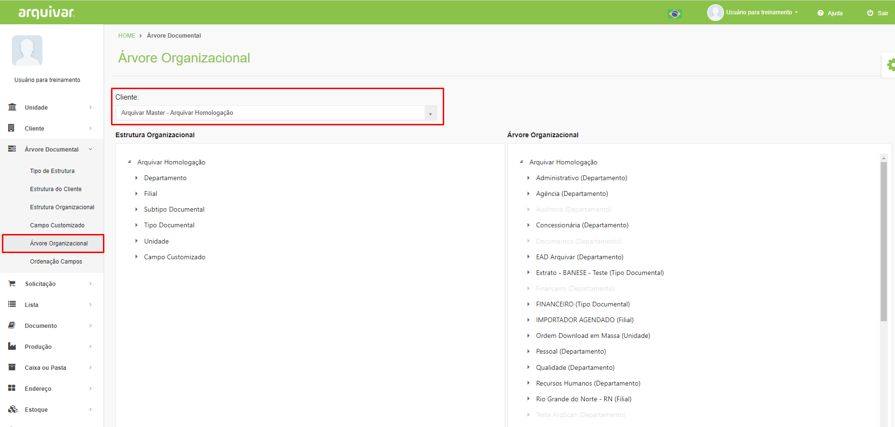
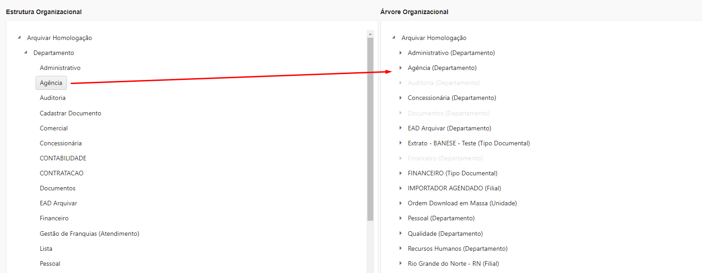
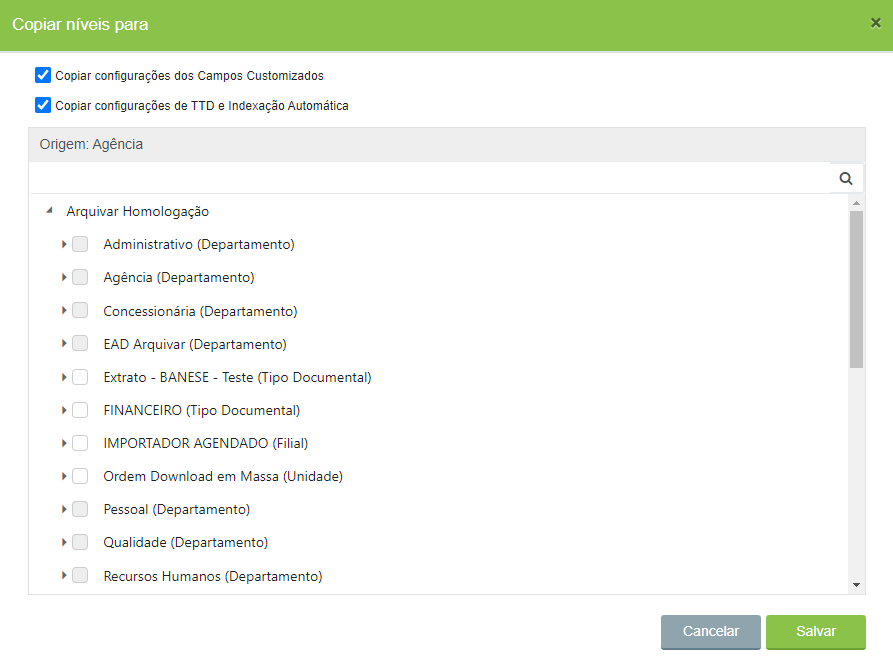
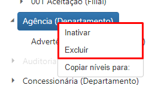
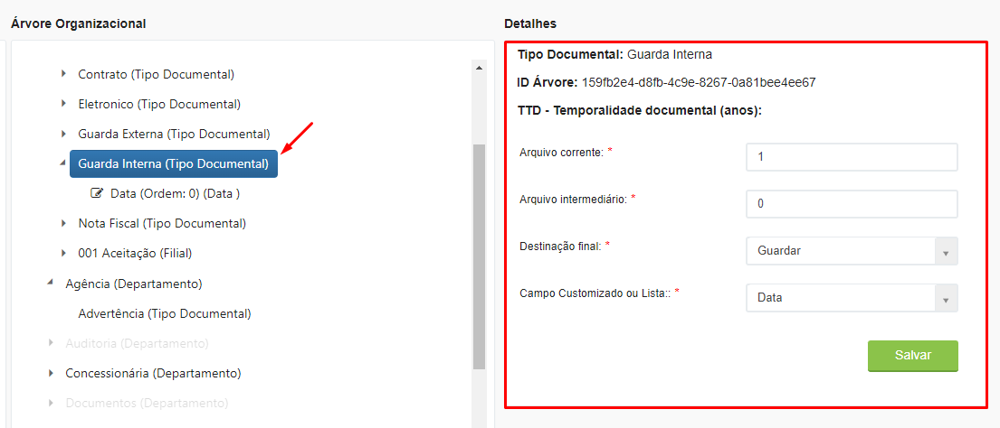
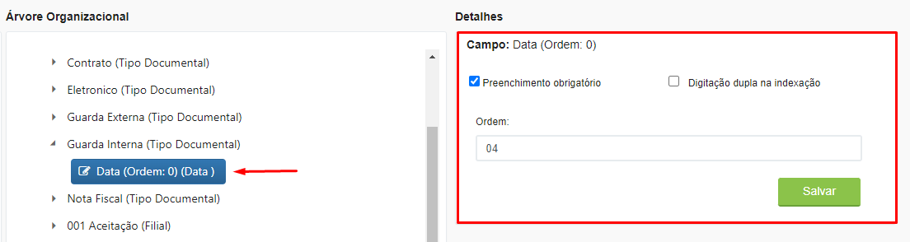

# 🟩 Árvore Organizacional

No menu Árvore Organizacional serão organizadas as informações da árvore do cliente (selecionado no campo “Cliente”) definidas anteriormente nos menus Tipo de Estrutura, Estrutura do Cliente, Estrutura Organizacional e Campo Customizado. Por meio da estrutura de árvore é possível separar os documentos por filial, área, e/ou departamento e ainda restringir acessos de usuários conforme os níveis da árvore.​&#x20;

<figure><figcaption>
Clique para ampliar a imagem.
</figcaption></figure>

É neste menu que a Árvore Documental será efetivamente desenhada, arrastando-se os itens do campo “Estrutura Organizacional” à esquerda para o campo “Árvore Organizacional”, à direita. Podem ser arrastados as estruturas, campos customizados e listas criados para o cliente. Se o campo arrastado tiver um “campo pai”, ou seja, relacionamento com outro campo, os dois serão arrastados automaticamente. &#x20;

<figure><figcaption>
Clique para ampliar a imagem.
</figcaption></figure>

***

## Observações para a montagem da Árvore Organizacional&#x20;

&#x20;Se dentro de uma estrutura existir mais de um tipo documental, mas todos solicitarem os mesmos campos é possível associar estes campos à estrutura. Dessa forma todos os documentos que estiverem dentro dessa estrutura herdarão os campos.&#x20;


<mark style="color:blue;">**EXEMPLO:**</mark> <mark style="color:blue;"></mark><mark style="color:blue;">A estrutura “Departamento Comercial” possui os tipos documentais “Contrato” e “Aditivo”. Ambos os tipos documentais exigem o preenchimento dos campos “Nome do Cliente”, “CPF” e “Nº do Contrato”. Neste caso esses campos devem ser associados à estrutura “Departamento Comercial” e todos os documentos que estiverem dentro dessa estrutura herdarão esses campos. Se no futuro um novo tipo documental for associado à essa estrutura, como “Distrato” por exemplo, ele também herdará automaticamente os campos “Nome do Cliente”, “CPF” e “Nº do Contrato”.</mark>


Caso queira copiar os níveis de uma estrutura para outra, basta clicar com o botão direito sobre a estrutura que deseja copiar e selecionar a opção “Copiar níveis para”.&#x20;

<figure><figcaption></figcaption></figure>

Defina se deseja copiar as configurações dos campos customizados e da tabela de temporalidade documental e selecione a estrutura para a qual irá copiar os dados.&#x20;

<figure><figcaption></figcaption></figure>

Clicando com o botão direito do mouse sobre uma estrutura também é possível inativá-la ou excluí-la. &#x20;

<figure><figcaption></figcaption></figure>

Ao clicar sobre um Tipo Documental serão exibidos os campos para configuração da Temporalidade Documental. A Temporalidade Documental deve ser definida de acordo com a legislação e a área de atuação da empresa:&#x20;

* _Arquivo corrente:_ Tempo em que o documento deverá permanecer no setor ao qual pertence. &#x20;
* _Arquivo intermediário:_ Tempo em que o arquivo poderá permanecer guardado no arquivo do cliente.&#x20;
* _Destinação final:_ Destino final do arquivo após expirado, que pode ser a digitalização, a eliminação, a guarda do documento físico ou a microfilmagem. A expiração de um arquivo considera a soma do tempo no arquivo corrente e no arquivo intermediário.&#x20;
* _Campo Customizado ou Lista:_ Campo ou lista que serão utilizados como referência para a contagem do prazo do documento (como campo data de criação, data de cadastro, data de demissão, data final etc.)&#x20;

<figure><figcaption>
Clique para ampliar a imagem.
</figcaption></figure>

Ao clicar sobre um campo, são exibidos os seguintes campos do lado direito da tela:&#x20;

* _Preenchimento obrigatório:_ Se selecionada essa opção o campo será de preenchimento obrigatório pelo respondente no momento da indexação.&#x20;
* _Digitação dupla na indexação:_ Se selecionada essa opção será necessário ao respondente preencher o campo duas vezes. Essa opção é comum, por exemplo, em casos em que o campo é numérico e precisa ser confirmado para garantir que não haverá erro de digitação.&#x20;
* _Ordem:_ Aqui deve ser informada em que ordem o campo deverá ser exibido. &#x20;

<figure><figcaption>
Clique para ampliar a imagem.
</figcaption></figure>
