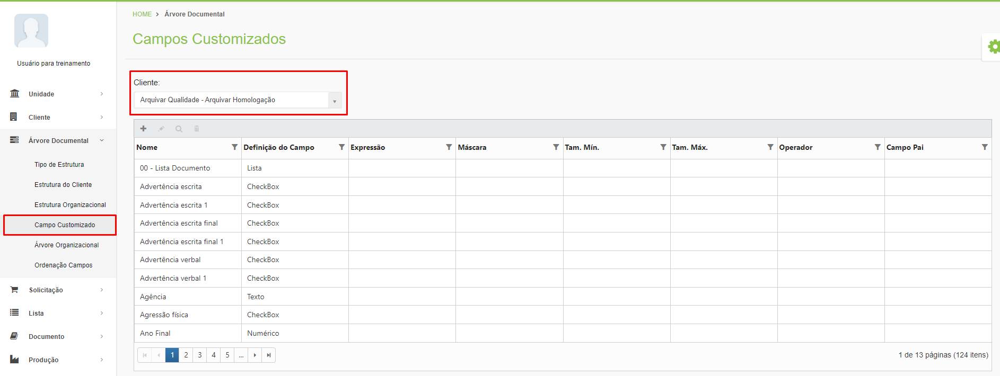
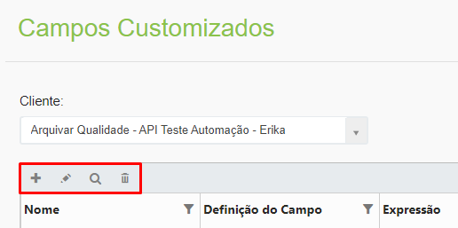
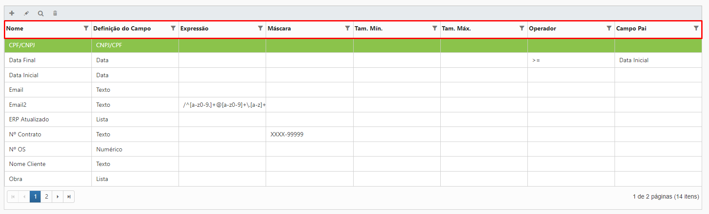
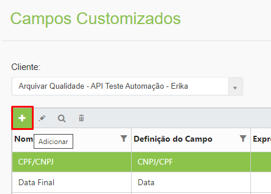
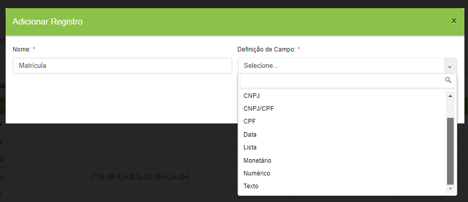
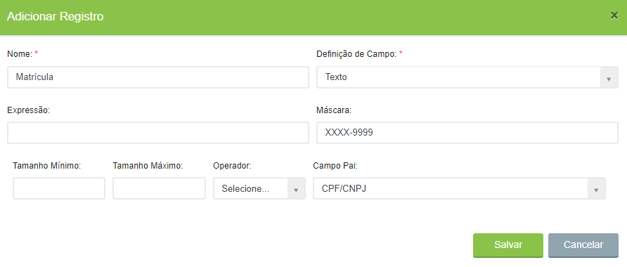

# 🟩 Campo Customizado

Os campos customizados são indexadores criados para identificar o conteúdo do documento que permite localizar um arquivo com maior rapidez e precisão a partir do cruzamento de informações.&#x20;

Ao se decidir criar um tipo documental é preciso ​definir quais campos vão compor aquele documento e servirão como indexadores. Esses campos devem ser criados neste menu. Um mesmo campo customizado pode ser usado em mais de um tipo documental. Para exibir os campos customizados criados para um cliente, selecione-o no campo “Cliente”.&#x20;

<figure><figcaption>
Clique para ampliar a imagem.
</figcaption></figure>


<mark style="color:blue;">**EXEMPLO:**</mark> <mark style="color:blue;"></mark><mark style="color:blue;">Ao criar o tipo documental Nota Fiscal, os campos “Número” e “Data” serão alguns dos</mark> <mark style="color:blue;"></mark><mark style="color:blue;">**campos customizados**</mark> <mark style="color:blue;"></mark><mark style="color:blue;">que deverão compor o documento e serão utilizados como indexadores para a localização das notas fiscais no sistema.</mark>


***

## Campo customizado - Tela principal

**Ícone Adicionar:** Utilizado para cadastrar um novo campo customizado.   &#x20;

**Ícone Editar:** Utilizado para editar as informações do campo customizado selecionado. &#x20;

**Ícone Visualizar:** Utilizado para apresentar as informações do campo customizado selecionado.  &#x20;

**Ícone Excluir:** Utilizado para excluir o campo customizado selecionado.&#x20;

<figure><figcaption></figcaption></figure>

**Coluna Nome:** Apresenta o nome do campo.&#x20;

**Coluna Definição do Campo:** Apresenta o formato do campo. &#x20;

**Coluna Expressão:** Apresenta a expressão regular utilizada para validar o campo, se houver.&#x20;

**Coluna Máscara:** Apresenta a máscara definida para preenchimento do campo, se houver. &#x20;

**Coluna Campo Pai:** Apresenta o campo pai do qual aquele campo é derivado, se houver.&#x20;

<figure><figcaption>
Clique para ampliar a imagem.
</figcaption></figure>

***

## Cadastro de Campo Customizado&#x20;

&#x20;Clique no ícone “Adicionar”.&#x20;

<figure><figcaption></figcaption></figure>

Informe o nome do campo. Em “Definição de Campo” selecione se o formato do campo, que pode ser:&#x20;

* _Checkbox:_ Campo em que o usuário deverá marcar uma caixa de seleção de acordo com a pergunta apresentada.  &#x20;
* _CNPJ:_ Campo em que o usuário deverá informar um número de CNPJ válido. &#x20;
* _CNPJ/CPF:_ Campo em que o usuário deverá informar um número de CNPJ ou de CPF válido.&#x20;
* _CPF:_ Campo em que o usuário deverá informar um número de CPF válido.&#x20;
* _Data:_ O usuário deverá informar uma data válida, com dia, mês e ano.&#x20;
* _Lista:_ Deverá ser criada uma lista de opções para que o usuário selecione a opção que deseja.&#x20;
* _Monetário:_ Campo em que o usuário deverá informar um valor monetário, com vírgula.&#x20;
* _Numérico:_ Campo em que o usuário deverá informar um valor numérico.&#x20;
* _Texto:_ Campo em que o usuário poderá informar qualquer valor, seja de texto ou numérico. Este tipo de campo aceita qualquer caractere como resposta. &#x20;

<figure><figcaption>
Clique para ampliar a imagem.
</figcaption></figure>

**Expressão:** No campo Expressão pode ser informada uma expressão regular para verificar o preenchimento do campo.&#x20;


<mark style="color:blue;">Uma</mark> <mark style="color:blue;"></mark><mark style="color:blue;">**expressão regular**</mark> <mark style="color:blue;"></mark><mark style="color:blue;">é usada para verificar se uma cadeia de caracteres contém o padrão de busca especificado. Por exemplo, se for preciso que o usuário informe um número de celular brasileiro válido, pode-se aplicar uma expressão regular para a pergunta. Ao fazer isso, todos os respondentes terão que inserir os números de celulares correspondentes ao formato do número de celular brasileiro - (xx) xxxxx-xxxx. Se o número de telefone não corresponder a esse padrão, será exibida uma mensagem de erro indicando que ele deve corresponder ao formato apropriado.</mark>


**Máscara:** No campo Máscara deverá ser informado o formato da resposta aceita, se houver um formato obrigatório. Neste caso, a letra X deve representar a quantidade de letras requeridas e o número 9 a quantidade de números. Se houver um dígito verificador, utilize o hífen (-).


<mark style="color:blue;">**EXEMPLO:**</mark> <mark style="color:blue;"></mark><mark style="color:blue;">Se for solicitado que a resposta contenha obrigatoriamente quatro letras, um dígito e quatro números, no campo Máscara informe “XXXX-9999”.</mark>


**Campo Pai:** Se o campo que está sendo criado for derivado de algum outro campo, selecione o campo pai. Neste caso para que o campo seja liberado para preenchimento deverá ser preenchido antes o campo pai. &#x20;

<figure><figcaption>
Clique para ampliar a imagem.
</figcaption></figure>
