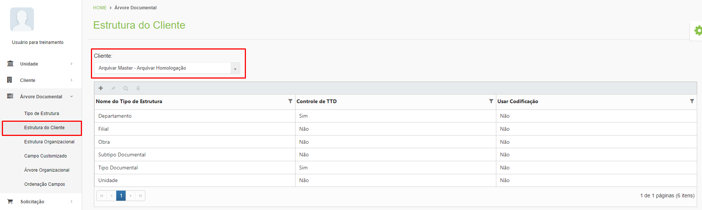
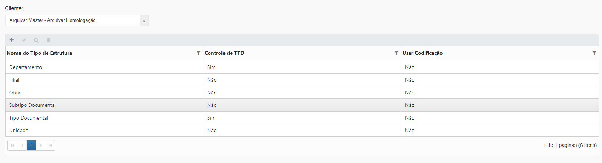
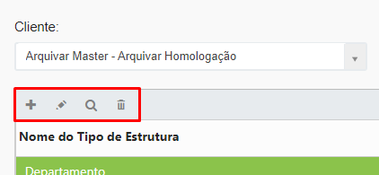
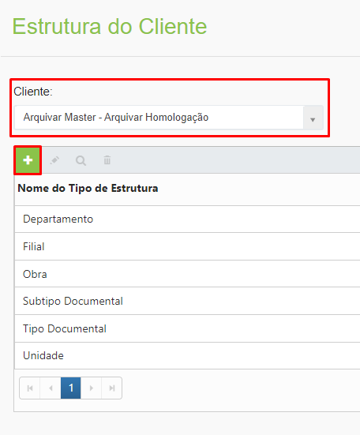
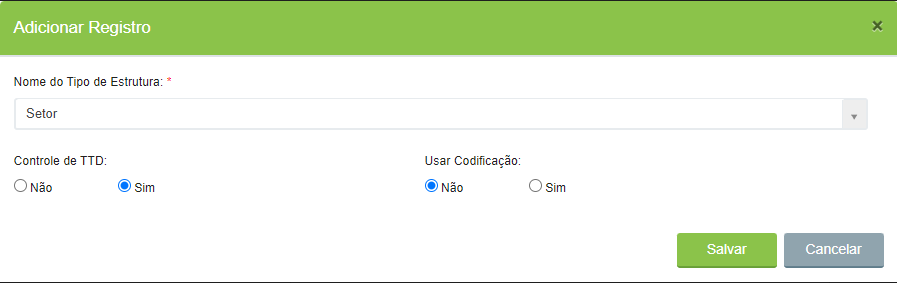

# 🟩 Estrutura do Cliente

Ao se criar a Estrutura do Cliente estamos determinando quais Tipos de Estrutura serão utilizadas na sua árvore documental específica. &#x20;

Para exibir a estrutura de um cliente, selecione-o no campo “Cliente”.&#x20;

<figure><figcaption>
Clique para ampliar a imagem.
</figcaption></figure>


<mark style="color:blue;">**Tipos de Estrutura**</mark> <mark style="color:blue;"></mark><mark style="color:blue;">são estruturas cadastradas e disponibilizadas para todos os clientes dentro do ArqGED.</mark> <mark style="color:blue;"></mark><mark style="color:blue;">**Estrutura do Cliente**</mark> <mark style="color:blue;"></mark><mark style="color:blue;">é a estrutura elaborada para um cliente em específico. A</mark> <mark style="color:blue;"></mark><mark style="color:blue;">**Estrutura do Cliente**</mark> <mark style="color:blue;"></mark><mark style="color:blue;">utiliza os</mark> <mark style="color:blue;"></mark><mark style="color:blue;">**Tipos de Estrutura**</mark> <mark style="color:blue;"></mark><mark style="color:blue;">disponíveis para sua organização.</mark>&#x20;

<mark style="color:blue;">Por exemplo, no ArqGED estão disponíveis os</mark> <mark style="color:blue;"></mark><mark style="color:blue;">**Tipos de Estrutura**</mark> <mark style="color:blue;"></mark><mark style="color:blue;">Filial, Unidade, Departamento, Setor, Agência, Tipo de Documento, entre outros. A Árvore Documental de um determinado banco utiliza a seguinte</mark> <mark style="color:blue;"></mark><mark style="color:blue;">**Estrutura do Cliente:**</mark> <mark style="color:blue;"></mark><mark style="color:blue;">Agência, Departamento, Tipo de Documento.</mark>


***

## Estrutura do Cliente - Tela principal

**Coluna do Tipo de Estrutura:** Apresenta todos os tipos de estrutura utilizados por aquele cliente.&#x20;

**Coluna Controle de TTD:** Informa se o tipo de estrutura selecionado utiliza controle por Tabela de Temporalidade Documental.&#x20;

**Coluna Usar Codificação:** Informa se o tipo de estrutura selecionado utiliza codificação para controle, ou seja, é numerado de forma a ser organizado.&#x20;

<figure><figcaption>
Clique para ampliar a imagem.
</figcaption></figure>

**Ícone Adicionar:** Utilizado para associar um novo tipo de estrutura à estrutura do cliente.&#x20;

**Ícone Editar:** Utilizado para editar as informações do tipo de estrutura selecionado.&#x20;

**Ícone Visualizar:** Utilizado para apresentar as informações do tipo de estrutura selecionado. &#x20;

**Ícone Excluir:** Utilizado para excluir o tipo de estrutura selecionado.&#x20;

<figure><figcaption></figcaption></figure>

***

## Cadastro de Estrutura do Cliente&#x20;

&#x20;Selecione o cliente para o qual deseja fazer o cadastro e clique no ícone “Adicionar”.&#x20;

<figure><figcaption></figcaption></figure>

Selecione o tipo de estrutura que deseja cadastrar na árvore do cliente selecionado. Os tipos de estrutura apresentados aqui foram criados anteriormente no menu Tipo de Estrutura.  &#x20;

Informe se o tipo de estrutura selecionado terá controle de Tabela de Temporalidade Documental (TTD). O controle de TTD é utilizado para definir o prazo em que um documento que for inserido na estrutura que está sendo criada pode ser expurgado ou eliminado. &#x20;

Defina se será usada codificação para identificar a estrutura. A codificação é um código numérico que será usado para identificar cada item do tipo de estrutura. Para concluir, clique em “Salvar”.&#x20;

<figure><figcaption>
Clique para ampliar a imagem.
</figcaption></figure>
