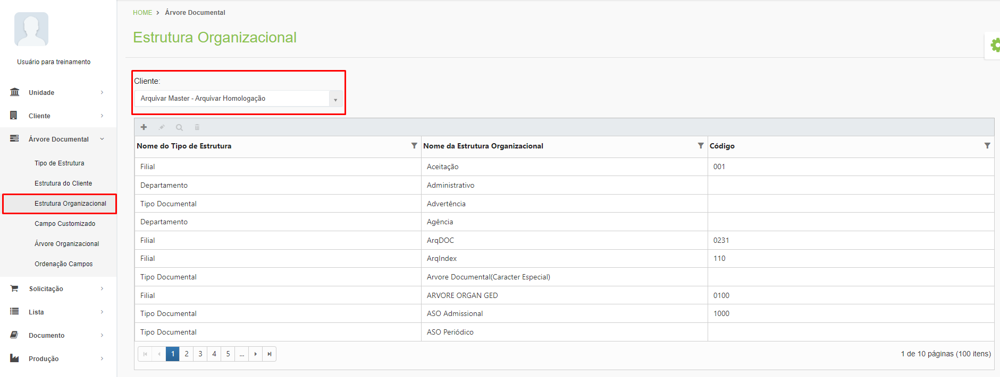
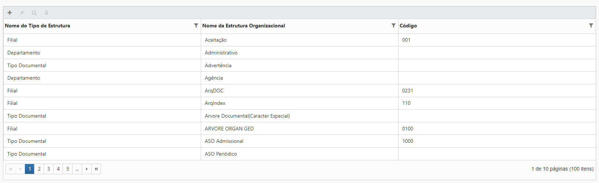
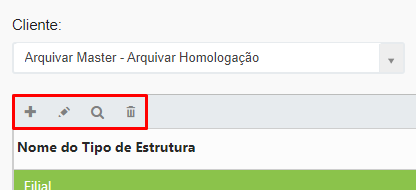
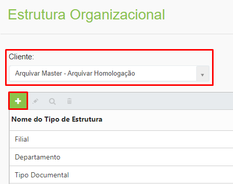
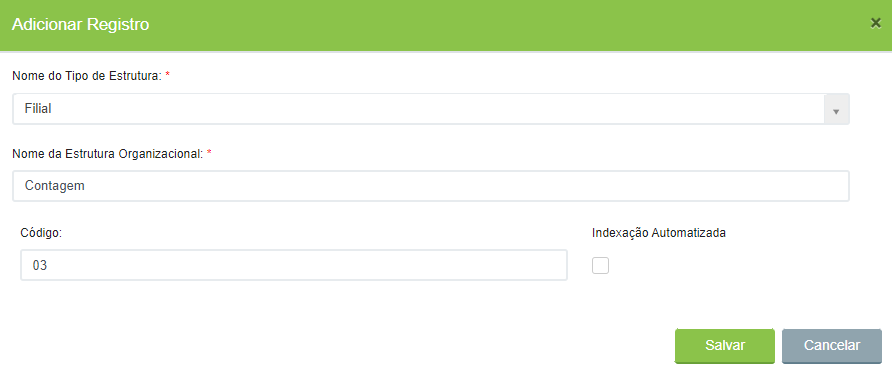

# 🟩 Estrutura Organizacional

Estrutura organizacional é a nomeação da dada à estrutura física da empresa do cliente. Neste menu são nomeados os setores, unidades, documentos e outros elementos que compõem a estrutura da empresa.&#x20;


<mark style="color:orange;">**É importante que no momento de criar a estrutura organizacional do cliente o seu projeto de implantação já esteja pronto, para direcionar como essa estrutura deverá ser organizada de acordo com a estrutura física existente na empresa cliente.**</mark>


A estrutura organizacional deve ser cadastrada uma única vez, mesmo sendo utilizada por diversas árvores documentais. Para exibir a estrutura de um cliente, selecione-o no campo “Cliente”.&#x20;

<figure><figcaption>
Clique para ampliar a imagem.
</figcaption></figure>


<mark style="color:blue;">**EXEMPLO:**</mark> <mark style="color:blue;"></mark><mark style="color:blue;">Uma empresa possui três filiais. Sua</mark> <mark style="color:blue;"></mark><mark style="color:blue;">**estrutura do cliente**</mark> <mark style="color:blue;"></mark><mark style="color:blue;">é composta pelos</mark> <mark style="color:blue;"></mark><mark style="color:blue;">**tipos de estrutura:**</mark> <mark style="color:blue;"></mark><mark style="color:blue;">Filial, Departamento e Documentos. Sua</mark> <mark style="color:blue;"></mark><mark style="color:blue;">**estrutura organizacional**</mark> <mark style="color:blue;"></mark><mark style="color:blue;">é composta pela Filial Belo Horizonte, Filial Salvador e Filial São Paulo, pelos Departamentos RH, Comercial e Financeiro e pelos Documentos Contrato, Ficha de Funcionário e Nota Fiscal.</mark>


***

## Estrutura Organizacional - Tela principal

**Coluna Nome do Tipo de Estrutura:** Exibe o Tipo de Estrutura à qual a Estrutura Organizacional selecionada foi associada.&#x20;

**Coluna Nome da Estrutura Organizacional:** Exibe o nome dado à Estrutura Organizacional selecionada.&#x20;

**Coluna Código:** Informa o código utilizado para identificar a Estrutura Organizacional. &#x20;

<figure><figcaption>
Clique para ampliar a imagem.
</figcaption></figure>

**Ícone Adicionar:** Utilizado para cadastrar um novo tipo de Estrutura Organizacional.  &#x20;

**Ícone Editar:** Utilizado para editar as informações do tipo de estrutura selecionado.&#x20;

**Ícone Visualizar:** Utilizado para apresentar as informações do tipo de estrutura. &#x20;

**Ícone Excluir:** Utilizado para excluir o tipo de estrutura selecionado.&#x20;

<figure><figcaption></figcaption></figure>

***

## Cadastro de Estrutura Organizacional&#x20;

Selecione o cliente para o qual será elaborada a estrutura organizacional e clique no ícone “Adicionar”. &#x20;

<figure><figcaption></figcaption></figure>

Selecione o Tipo de Estrutura que será utilizado. Os tipos de estrutura apresentados aqui foram criados anteriormente no menu [Tipo de Estrutura](tipo-de-estrutura.md).  &#x20;

Informe o nome da Estrutura Organizacional.


<mark style="color:blue;">**EXEMPLO:**</mark> <mark style="color:blue;"></mark><mark style="color:blue;">Se selecionado o tipo de estrutura “Filial”, informe o nome da cidade da filial: Belo Horizonte, São Paulo etc. Se selecionado o tipo de estrutura “Setor”, informe o nome do setor que está sendo cadastrado: RH, Comercial, Financeiro etc.</mark>


Se no momento da criação da [Estrutura do Cliente](estrutura-do-cliente.md) tiver sido definido que será usada codificação para identificar a estrutura, o campo “Código” será mostrado. Informe um código numérico para identificar o item da estrutura organizacional que está sendo cadastrado.


<mark style="color:blue;">O</mark> <mark style="color:blue;"></mark><mark style="color:blue;">**código numérico**</mark> <mark style="color:blue;"></mark><mark style="color:blue;">geralmente é utilizado quando a empresa utiliza uma tabela de classificação documental para a organização de seus documentos, como por exemplo a utilizada pelo CONARQ.</mark> [<mark style="color:blue;">**Clique aqui**</mark>](https://www.gov.br/arquivonacional/pt-br/servicos/gestao-de-documentos/orientacao-tecnica-1/codigo-de-classificacao-e-tabela-de-temporalidade-e-destinacao-de-documentos-de-arquivo/copy\_of\_cod\_classif\_-e\_tab\_temp\_2019\_m\_book\_digital\_25jun2020.pdf) <mark style="color:blue;">e confira.</mark>


<figure><figcaption>
Clique para ampliar a imagem.
</figcaption></figure>
