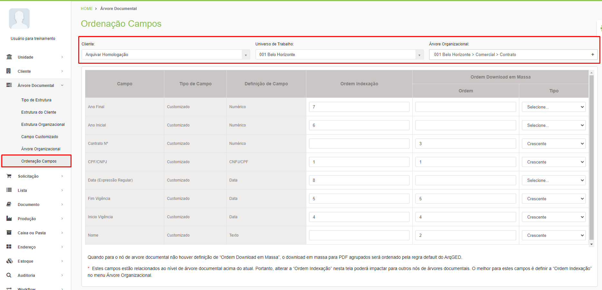
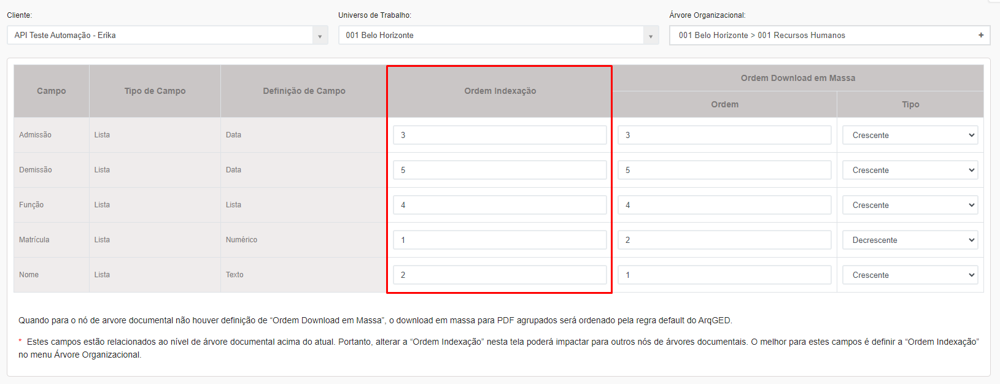
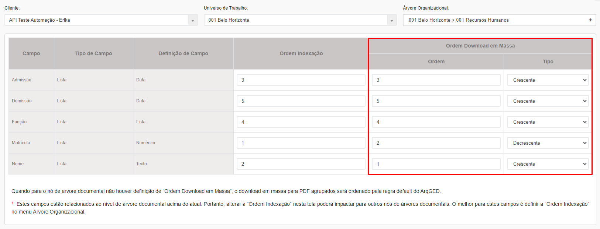

# 🟩 Ordenação Campos

A Ordenação de Campos da Árvore Documental é utilizada para a funcionalidade de download em massa e para mudar a ordem de indexação dos campos de um tipo documental.&#x20;

Para exibir um documento e mudar a ordem, selecione o Cliente, o Universo de Trabalho e a Árvore Organizacional. &#x20;

<figure><figcaption>
Clique para ampliar a imagem.
</figcaption></figure>

Na coluna Ordem de Indexação, será mostrada a ordem em que os campos são exibidos no documento. Essa ordem é aquela definida anteriormente no menu [Árvore Documental > Árvore Organizacional.](arvore-organizacional.md) Para alterá-la, mude numere o campo de acordo com a nova ordem que deseja que seja exibida.

<figure><figcaption>
Clique para ampliar a imagem.
</figcaption></figure>

A Ordem do Download em Massa é utilizada para que o sistema organize os documentos em um download em massa em PDF seguindo a ordem estabelecida aqui. Para organizar os campos é preciso definir a ordem numerando os campos na coluna “Ordem” e definir se o sistema deverá seguir aquela ordem de forma crescente ou decrescente na coluna “Tipo”.

<figure><figcaption>
Clique para ampliar a imagem.
</figcaption></figure>


<mark style="color:blue;">**EXEMPLO:**</mark> <mark style="color:blue;"></mark><mark style="color:blue;">Se em um download em massa for definido que o campo “Data” é o número um do tipo crescente e o campo “Filial” é o número dois do tipo crescente, o sistema organizará os documentos por data, do mais antigo para o mais recente, e por nome de filial em ordem alfabética.</mark>&#x20;

