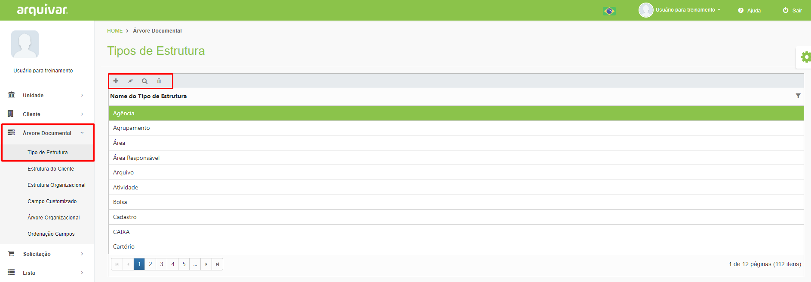
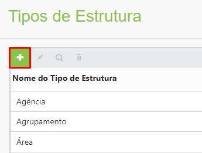
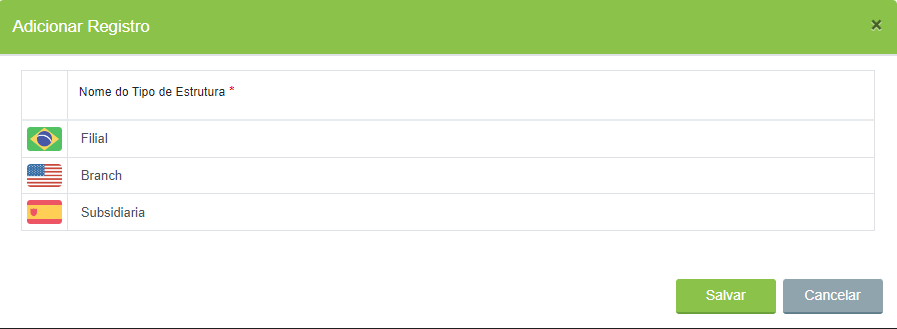

# 🟩 Tipo de Estrutura

Neste menu são criados todos os tipos de estrutura possíveis dentro de uma Árvore Documental.  As estruturas criadas nesse menu ficam disponíveis para todas as unidades e clientes e sua criação é feita pela Arquivar Master. &#x20;


<mark style="color:blue;">**EXEMPLO:**</mark> <mark style="color:blue;"></mark><mark style="color:blue;">Uma empresa possui diversas filiais e em cada uma dessas filiais existem diversos setores. Os tipos de estrutura utilizados na árvore dessa empresa seriam, por exemplo, filial, departamento e tipo de documento.</mark>



<mark style="color:orange;">**Antes de solicitar a criação de uma estrutura, verifique se ela já não existe dentro da plataforma para evitar duplicidade.**</mark>&#x20;


***

## Tipos de Estrutura - Tela principal

**Ícone Adicionar:** Utilizado para cadastrar um novo tipo de estrutura. Ao se criar um tipo de estrutura deverão ser informados os nomes nos idiomas português, inglês e espanhol.  &#x20;

**Ícone Editar:** Utilizado para editar as informações do tipo de estrutura selecionado.&#x20;

**Ícone Visualizar:** Utilizado para apresentar as informações do tipo de estrutura. &#x20;

**Ícone Excluir:** Utilizado para excluir o tipo de estrutura selecionado.&#x20;

<figure><figcaption>
Clique para ampliar a imagem.
</figcaption></figure>

***

## Cadastro de Tipo de Estrutura&#x20;

Clique no ícone “Adicionar”.&#x20;

<figure><figcaption></figcaption></figure>

Informe o nome do tipo de estrutura. Deverá ser informado o nome nos idiomas Português (BR), Inglês (EUA) e Espanhol (ES). Clique em Salvar para concluir.

<figure><figcaption>
Clique para ampliar a imagem.
</figcaption></figure>
