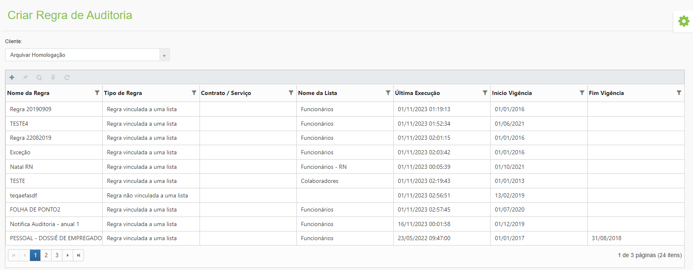

# 🟩 Regra de Auditoria

No menu Regra de Auditoria são criadas as regras de auditoria que podem ser gerais ou vinculadas a uma lista específica. Devem ser definidas as características das regras e selecionado o cliente a quem essa regra será vinculada.  &#x20;

<figure><figcaption>
Clique na imagem para ampliar.
</figcaption></figure>
