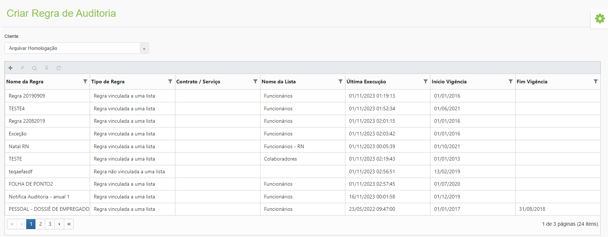

# 🟩 Regra de Auditoria

Nesta tela, o usuário define regras que possibilitam o controle e a identificação dos documentos ausentes em seu acervo, com base em parâmetros previamente estabelecidos para validação. Essas regras são essenciais para garantir que a documentação esteja completa e em conformidade com as exigências legais ou internas da organização.

Por exemplo, ao admitir um funcionário, é necessário a realização de um exame para emissão do Atestado de Saúde Ocupacional (ASO) - Admissional, logo, é possível criar uma regra no sistema, onde é informado que o documento precisa constar na pasta do funcionário uma única vez dias antes da data de admissão.

Considerando este cenário, o sistema deverá verificar se o ASO consta ou não nos documentos cadastrados para o funcionário em questão e, se não identificado o cadastro desse documento, o sistema deverá apontar sua falta pelo processamento da regra de auditoria.&#x20;

<figure><figcaption>
Clique na imagem para ampliar.
</figcaption></figure>
