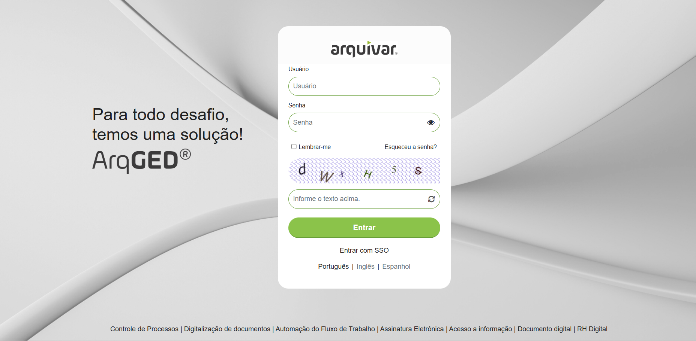

# 🟩 Regra de Auditoria

Nesta tela, o usuário define regras que possibilitam o controle e a identificação dos documentos ausentes em seu acervo, com base em parâmetros previamente estabelecidos para validação. Essas regras são essenciais para garantir que a documentação esteja completa e em conformidade com as exigências legais ou internas da organização.

Por exemplo, ao admitir um funcionário, é necessário a realização de um exame para emissão do Atestado de Saúde Ocupacional (ASO) - Admissional, logo, é possível criar uma regra no sistema, onde é informado que o documento precisa constar na pasta do funcionário uma única vez dias antes da data de admissão.

Considerando este cenário, o sistema deverá verificar se o ASO consta ou não nos documentos cadastrados para o funcionário em questão e, se não identificado o cadastro desse documento, o sistema deverá apontar sua falta pelo processamento da regra de auditoria.&#x20;

O fluxo deve ser:



O responsável pela gestão cria regras no sistema, definindo qual documento é necessário em determinadas situações. Por exemplo, "O ASO Admissional deve ser registrado uma única vez na pasta do funcionário até 10 dias antes da admissão."



Quando um novo funcionário é admitido e seu perfil é atualizado no sistema, baseado na execução automática ou manual da regra de auditoria, o sistema verifica se o ASO Admissional foi registrado na pasta de documentos do colaborador.



O sistema, por meio de uma auditoria automatizada, verifica se o documento especificado na regra (neste caso, o ASO) está presente na pasta de documentos do funcionário.



Caso o ASO não seja encontrado, o sistema gera um alerta, indicando a falta do documento. Esse alerta pode ser enviado para os responsáveis pela gestão de documentos, RH ou outro setor relevante para que a pendência seja corrigida. Um relatório de inconsistência é gerado e disponibilizado para consulta.



Este processo visa garantir que os documentos obrigatórios sejam registrados corretamente e dentro dos prazos estabelecidos, evitando falhas ou pendências no cumprimento de exigências legais ou internas da empresa.


<mark style="color:orange;">O processo de auditoria não se limita exclusivamente aos documentos de funcionários, ele é aplicável a todos os tipos documentais que possuem critérios para verificação de sua existência no acervo.</mark>


<figure><figcaption>
Clique na imagem para ampliar.
</figcaption></figure>

**Cliente:** É apresentado o nome do cliente conforme usuário logado ou conforme selecionado pela Unidade na lista de clientes com o serviço de auditoria ativo em contrato.

**Adicionar:** O ícone é utilizado para adicionar uma nova regra para o cliente selecionado.

**Editar:** Permite a edição de regras já existentes para o cliente, basta selecionar a regra desejada e clicar na opção de editar.

**Visualizar:** Permite ao usuário acessar os parâmetros configurados para a regra, para isso, selecione a regra desejada e clique em visualizar.

**Excluir:** Permite a exclusão de uma regra existente para o cliente. Selecione a regra na tela e clique em excluir.

**Processar:** Permite ao usuário processar a regra de auditoria de forma “manual”, para isso, selecione a regra clique no ícone.


<mark style="color:orange;">Para que o cliente consiga criar uma regra no</mark> <mark style="color:orange;"></mark><mark style="color:orange;">**Menu > Auditoria**</mark><mark style="color:orange;">, é necessário que ele tenha cadastrado em seu contrato vigente o serviço “</mark><mark style="color:orange;">**ArqAudit por Regra**</mark><mark style="color:orange;">”, do contrário ele não poderá criar uma regra de auditoria no sistema.</mark>

<mark style="color:orange;">O usuário de Unidade não tem permissão para realizar este cadastro, portanto devem solicitar para que a Master realize o cadastro do serviço no ArqGED.</mark>


## Criando uma Regra de Auditoria

No **Menu > Auditoria > Regra de Auditoria**, clique na opção “Adicionar”.

<figure><figcaption>
Clique na imagem para ampliar.
</figcaption></figure>

Ao clicar em adicionar, o sistema apresenta na tela a aba “Dados Gerais” para preenchimento, nesta tela são apresentadas as informações iniciais para execução da regra de auditoria.

### Aba Dados Gerais

<figure><figcaption>
Clique na imagem para ampliar.
</figcaption></figure>

**Nome da Regra:** Procure adicionar um nome que indique o que se deseja com a  regra, ou seja, que seja simples de identificar na lista de regras existentes.&#x20;

Exemplo:

• Folha de Ponto – Filial A: Neste caso o nome já indica uma particularidade, o universo de busca é limitado a Filial A.

• Aso Admissional – Vigilantes – Filial A: Já neste segundo caso, temos duas restrições, a função e a filial.

**Início Vigência:** Indica a partir de qual data a regra deve começar a ser aplicada. Se informada a data de hoje, ao executar a regra, o sistema fará a verificação dos documentos faltantes inseridos a partir de hoje, aqueles inseridos em datas pretéritas não serão considerados no resultado da auditoria. Porém, o campo permite que seja lançado um início de vigência no passado, então neste caso o sistema realiza a consulta a partir da data informada, mesmo sendo uma data no passado.

**Fim Vigência:** Indica a data de encerramento da regra, ou seja, a partir da data de Fim de Vigência, a regra não será mais executada de forma automática no sistema.

**Tipo de Regra:** Neste campo é apresentada uma modal para seleção do tipo de regra que deve ser aplicado:

**• Regra vinculada a uma lista:** Significa que é necessário ter uma lista previamente cadastrada na aplicação, com os dados atualizados, sendo que estes dados serão utilizados para gerar o resultado da auditoria.

&#x20;• **Regra não vinculada a uma lista:** Significa que a regra não precisa de uma lista cadastrada previamente no sistema para funcionar.

&#x20;**Campo:** Consolidar ...do período de ausência do documento

**A partir do fim / A partir do início**

Esta configuração indica que ao executar a regra de auditoria, será considerado se a falta dos documentos deve ser contabilizada “a partir do início” ou “a partir  do fim” do período.

Exemplo:&#x20;

Em uma regra, foi dito que a data de referência seria a data de Admissão do funcionário. O documento foi cadastrado com a data de admissão de 01/12/2024, se definida que a consolidação deve ser realizada a partir do fim do período, sempre que gerada a auditoria no início do período a regra será executada, porém, não deverá acusar a falta deste documento, pois na configuração foi dito que a consolidação deve ser realizada a partir do fim do período de ausência do documento, ou seja, se o colaborador foi contratado em 01/12/2024 o fim do seu período, seria 31/12/2024.


<mark style="color:orange;">Ao criar uma regra de auditoria, pense bem no seu cenário antes de definir as regras que serão aplicadas.</mark>


**Consolidar somente o último período faltante do mês:** Neste caso, a aplicação deve verificar quais são os períodos existentes para então retornar somente o último período faltante.

**Cobrança por lista:** Quando o “Tipo de Regra” definido for “Regra vinculada a uma lista” a opção de “Cobrança por lista” já vem preenchida automaticamente e é necessário ter uma lista previamente cadastrada na aplicação.

Além de ter a lista cadastrada na aplicação, também é necessário ter o serviço “ArqAudit por lista” ativo no contrato.

A tela também possui a forma de cobrança por regra de auditoria, que neste caso, não precisa de uma lista cadastrada ou o serviço ArqAudit por Lista na aplicação, porém, é preciso do serviço ArqAudit por Regra ativo no contrato.

**Contrato/Serviço:** Quando definida a “cobrança por lista”, este campo será apresentado desabilitado para preenchimento. Quando definida a cobrança por regra de auditoria, o campo é habilitado com a opção de seleção do serviço previsto no contrato.

**Notificações:** Após realizar todo o preenchimento da tela de “Dados Gerais” e salvar, clicando em "Editar" o campo notificações é habilitado. Neste campo é possível selecionar um ou mais usuários para que sejam notificados por e-mail sempre que executada uma regra de auditoria. Clique no nome disponível na lista depois em adicionar “+”, ou caso deseje excluir um usuário, selecione no campo abaixo e clique na lixeira para “Excluir”.

É possível notificar tanto usuários de cliente quanto usuários de unidade.

<figure><figcaption>
Clique na imagem para ampliar.
</figcaption></figure>


<mark style="color:orange;">É necessário ter uma lista configurada na aplicação + o serviço de ArqAudit por lista ativo no contrato + a Lista relacionada ao serviço. Do contrário, não será possível concluir a configuração.</mark>


Somente **Lista** do tipo **Consolidação** podem ser utilizadas para aplicação da regra de auditoria. Ao criar a lista na aplicação, o tipo de lista é definido, podendo ser de “Consolidação” ou “Auto Complete”.

**Lista do tipo consolidação:** É mantido histórico das atualizações.

**Lista do tipo auto complete:** É utilizada no auxílio da indexação de documentos, sem registro de alterações de dados.

**Iniciar a contagem dos intervalos a partir do campo:** Este campo apresenta uma lista onde deve ser selecionada qual data a aplicação deve considerar para a aplicação da regra.

<figure><figcaption>
Clique na imagem para ampliar.
</figcaption></figure>

Selecionando a primeira opção, a regra irá considerar campos do tipo Data existentes na lista, como por exemplo: Quero verificar todos os documentos faltantes entre a data de admissão e demissão. Essas duas datas estão na lista, então a aplicação irá buscá-las para consolidação da regra.

A outra opção, é considerar sempre a data inicial da vigência já preenchida na parte superior da tela.

**Periodicidade com que a regra executa automaticamente:** Uma regra de auditoria pode ser executada manualmente sempre que o cliente desejar, porém, é possível realizar uma parametrização para que a regra de auditoria seja executada de forma automática pelo sistema, ou seja, sem interação do usuário/cliente, para isso é necessário o preenchimento dos “Parâmetro de Ativação”.

Nesta tela, é necessário informar a periodicidade de consolidação da regra, que pode ser mensal, anual, dia e no (a).

Abaixo alguns exemplos de como pode ser feita a parametrização.

Ao definir por mensal + dia, informe o dia e a quantos meses a regra deve ser consolidada.

<figure><figcaption>
Clique na imagem para ampliar.
</figcaption></figure>

Neste caso estamos dizendo que a regra será consolidada mensalmente no 10º dia de cada mês.

<figure><figcaption>
Clique na imagem para ampliar.
</figcaption></figure>

Já neste caso estamos dizendo que a regra será consolidada no 5º dia a cada dois meses.

&#x20;Ao definir por mensal + No (a), temos o seguinte:

<figure><figcaption>
Clique na imagem para ampliar.
</figcaption></figure>

Neste caso a regra será consolidada na primeira segunda-feira de cada mês.

<figure><figcaption>
Clique na imagem para ampliar.
</figcaption></figure>

Já no segundo caso, a regra será consolidada na segunda segunda-feira a cada dois meses.

Ao definir por Anual + Em, temos:

<figure><figcaption>
Clique na imagem para ampliar.
</figcaption></figure>

Neste caso a regra será consolidada anualmente sempre no primeiro dia de junho.

Ao definir por Anual + No (a), temos:

<figure><figcaption>
Clique na imagem para ampliar.
</figcaption></figure>

Neste caso a regra será consolidada anualmente na primeira segunda-feira do mês de agosto.

Concluído o preenchimento da tela, clique “Salvar” para seguir.

Ao retornar na tela inicial, temos a regra criada, vamos ao detalhamento dos dados apresentados:

<figure><figcaption>
Clique na imagem para ampliar.
</figcaption></figure>

Ao clicar na regra, os demais ícones da parte superior da tela são habilitados, quando antes da regra apenas o ícone “adicionar” aparecia habilitado.

**Editar:** Ao selecionar a regra e clicar neste ícone, é possível a edição das informações cadastradas.

**Visualizar:** Ao selecionar a regra e clicar neste ícone o usuário poderá visualizar todas as informações existentes na regra, sem a opção de edição.

**Excluir:** Ao selecionar a regra e clicar neste ícone, o usuário poderá realizar a exclusão da regra, exceto quando já houver alguma consolidação de auditoria para a regra.

**Processar:** Ao selecionar a regra e clicar neste ícone, é realizada a execução manual da regra de auditoria.

Ainda na tela inicial temos também as informações apresentadas em colunas:

<figure><figcaption>
Clique na imagem para ampliar.
</figcaption></figure>

As colunas,

* Nome da Regra
* Tipo de Regra
* Contrato /Serviço
* Nome da Lista
* Início Vigência
* Fim Vigência

Exibem informações preenchidas na aba “Dados Gerais” para uma visão externa, com exceção da coluna “Última Execução”.

**Última Execução:** Nesta coluna fica registrada a última consolidação realizada para a regra, considerando a data e a hora da execução.

Após salvar as configurações, são habilitadas duas nova abas na tela “Regra” e “Exceções”.

***

### Aba Regra

Na Aba Regra é feita de fato a definição da regra de auditoria.

<figure><figcaption>
Clique na imagem para ampliar.
</figcaption></figure>

**Universo de Busca:** Esta área determina os critérios a serem utilizados na execução da regra de auditoria, especificando quais informações serão analisadas para identificar a inconsistência de um documento.

Nela são exibidos os campos da lista associada na tela de “Dados Gerais”, estes campos são os responsáveis pela identificação na busca dos documentos faltantes, conforme as parametrizações inseridas para cada um.

<figure><figcaption>
Clique na imagem para ampliar.
</figcaption></figure>

**Adicionar:** Permite a adição de outros universos que devem ser considerados na regra.

**Excluir:** Permite a exclusão de uma configuração.

**Salvar/Editar:** Permite a edição dos dados de uma das configurações ou a adição de mais configurações para o universo de busca.

<figure><figcaption>
Clique na iamgem para ampliar.
</figcaption></figure>

**E/ou:** Quando adicionada mais de uma configuração para a regra, é possível informar para a aplicação quais e como essas configurações devem ser aplicadas, por exemplo:

<figure><figcaption>
Clique na imagem para ampliar.
</figcaption></figure>

Neste primeiro caso, é preciso identificar os documentos faltantes de todos os funcionários **sem data de demissão**, que sejam da **filial Belo Horizonte** e especificamente **da função Administrativo**. Note que foi utilizada a opção “E” para vincular todas as condições na mesma regra, desta forma não serão listados funcionários das demais filiais ou funções.

