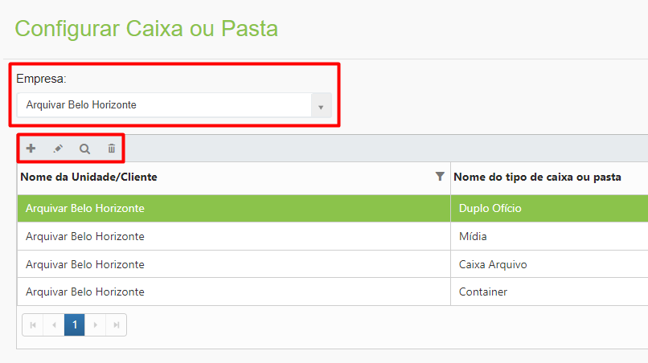
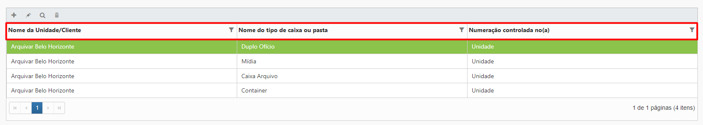
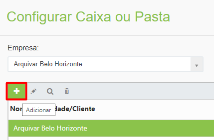
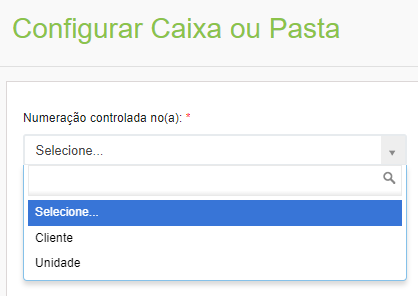
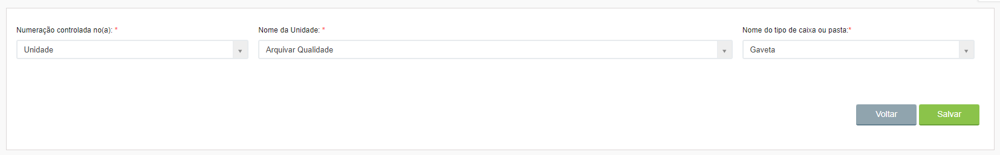
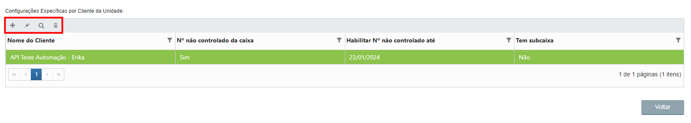
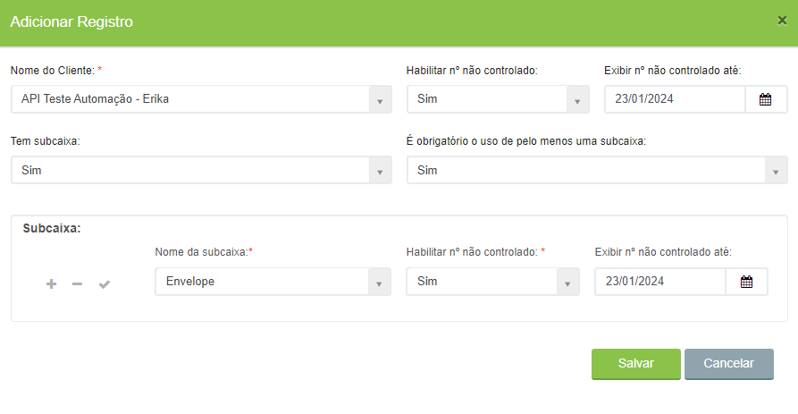
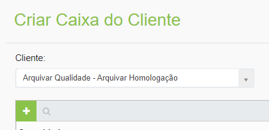

# 🟩 Configurar

No menu Configurar, depois de selecionar a unidade no campo “Empresa”, é possível vincular os tipos de caixa ou pasta criados no menu Tipo de Caixa ou Pasta a um cliente ou a uma unidade franqueada Arquivar. &#x20;

<figure><figcaption>
Clique para ampliar a imagem.
</figcaption></figure>

***

## Configurar – Tela principal&#x20;

**Empresa:** Ao selecionar a empresa são exibidos os tipos de caixa ou pasta associados a ela.&#x20;

**Ícone Adicionar:** Utilizado para fazer uma nova associação de tipo de caixa ou pasta ao cliente ou unidade.&#x20;

**Ícone Editar:** Utilizado para editar as informações da associação de tipo de caixa ou pasta.&#x20;

**Ícone Visualizar:** Utilizado para apresentar as informações de associação de tipo de caixa ou pasta ao cliente ou unidade. &#x20;

**Ícone Excluir:** Utilizado para excluir uma associação de tipo de caixa ou pasta.&#x20;

<figure><figcaption></figcaption></figure>

**Coluna Nome da Unidade/Cliente:** Exibe o nome da unidade Arquivar ou do cliente. &#x20;

**Coluna Nome do tipo de caixa ou pasta:** Exibe todos os tipos de caixas ou pastas associados ao cliente.&#x20;

**Coluna Numeração controlada no (a):** Informa se a numeração da caixa ou pasta é controlada pela unidade Arquivar ou pelo próprio cliente.&#x20;

<figure><figcaption>
Clique para ampliar a imagem.
</figcaption></figure>

***

## Configuração de Caixa ou Pasta&#x20;

Para fazer a associação de um tipo de caixa ou pasta ao cliente, clique no ícone “Adicionar”.&#x20;

<figure><figcaption></figcaption></figure>

**Numeração controlada no(a):** Informe se a numeração de controle da caixa ou pasta será feita pelo próprio cliente ou pela unidade Arquivar. &#x20;

<figure><figcaption></figcaption></figure>

***

## Configuração para Unidade&#x20;

**Nome da Unidade:** Se for escolhida a opção “Unidade”, esta deverá ser selecionada no campo “Nome da Unidade”. &#x20;

**Nome do tipo de caixa ou pasta:** Neste campo deve ser selecionado o tipo de caixa ou pasta que será associado à unidade. As opções exibidas aqui devem ter sido anteriormente cadastradas no menu Tipo de Caixa ou Pasta.&#x20;

<figure><figcaption>
Clique para ampliar a imagem.
</figcaption></figure>

Caso a configuração de caixa ou pasta seja para uma das unidades Arquivar, será exibido o campo “Configurações Específicas por Cliente da Unidade”, no qual será possível definir parâmetros específicos de tipo de caixa ou pasta para cada cliente daquela unidade.&#x20;

**Ícone Adicionar:** Utilizado para fazer uma nova associação de tipo de caixa ou pasta ao cliente.&#x20;

**Ícone Editar:** Utilizado para editar as informações da associação de tipo de caixa ou pasta.&#x20;

**Ícone Visualizar:** Utilizado para apresentar as informações de associação de tipo de caixa ou pasta ao cliente. &#x20;

**Ícone Excluir:** Utilizado para excluir uma associação de tipo de caixa ou pasta.&#x20;

**Coluna Nome do Cliente:** Exibe o nome do cliente.&#x20;

**Coluna Nº não controlado da caixa:** Mostra o número não controlado provisório associado à caixa, se houver.&#x20;

**Coluna Habilitar Nº não controlado até:** Mostra a data até quando o número não controlado provisório associado à caixa estará vigente, se houver.&#x20;

**Coluna Tem subcaixa:** Informa se a caixa possui ou não subacaixas.&#x20;

<figure><figcaption>
Clique para ampliar a imagem.
</figcaption></figure>

Para configurar uma caixa ou pasta para um cliente específico, clique no ícone “Adicionar”.&#x20;

**Nome do Cliente:** Selecione o cliente da unidade para o qual está sendo feita a configuração de caixa ou pasta.&#x20;

**Habilitar nº não controlado:** Informe se deverá ser habilitado um número não controlado para a caixa ou pasta. &#x20;


<mark style="color:blue;">O número não controlado é utilizado, por exemplo, quando o arquivo do cliente já teve uma numeração de controle anterior definida pelo próprio cliente ou por outra empresa de gestão de documentos. Ao trazer o arquivo do cliente para a Arquivar, essa numeração feita por outra empresa será utilizada para controlar provisoriamente esse arquivo, até que a unidade Arquivar consiga substituir todo o código de controle das caixas e pastas do cliente.</mark>


**Exibir nº não controlado até:** Se definido que será habilitado o número não controlado, é possível definir uma data limite até quando a numeração não controlada será utilizada.&#x20;

**Tem subcaixa:** Informe se a caixa que está sendo configurada possui subcaixas. Se sim, deverá ser definido também o nome para a subcaixa e se será habilitado um número não controlado para a subcaixa.&#x20;

**É obrigatório o uso de pelo menos uma subcaixa:** Informe se será obrigatório usar pelo menos uma subcaixa para o tipo de caixa ou pasta que está sendo configurado.&#x20;

<figure><figcaption>
Clique para ampliar a imagem.
</figcaption></figure>

***

## Configuração para Cliente&#x20;

**Nome do Cliente:** Selecione o cliente da unidade para o qual está sendo feita a configuração de caixa ou pasta.&#x20;

**Nome do tipo de caixa ou pasta:** Neste campo deve ser selecionado o tipo de caixa ou pasta que será associado ao cliente. As opções exibidas aqui devem ter sido anteriormente cadastradas no menu Tipo de Caixa ou Pasta.&#x20;

**Habilitar nº não controlado:** Informe se deverá ser habilitado um número não controlado para a caixa ou pasta. &#x20;


<mark style="color:blue;">O número não controlado é utilizado, por exemplo, quando o arquivo do cliente já teve uma numeração de controle anterior definida pelo próprio cliente ou por outra empresa de gestão de documentos. Ao trazer o arquivo do cliente para a Arquivar, essa numeração feita por outra empresa será utilizada para controlar provisoriamente esse arquivo, até que a unidade Arquivar consiga substituir todo o código de controle das caixas e pastas do cliente.</mark>


**Exibir nº não controlado até:** Se definido que será habilitado o número não controlado, é possível definir uma data limite até quando a numeração não controlada será utilizada.&#x20;

**Tem subcaixa:** Informe se a caixa que está sendo configurada possui subcaixas. Se sim, deverá ser definido também o nome para a subcaixa e se será habilitado um número não controlado para a subcaixa.&#x20;

**É obrigatório o uso de pelo menos uma subcaixa:** Informe se será obrigatório usar pelo menos uma subcaixa para o tipo de caixa ou pasta que está sendo configurado.&#x20;

<figure><figcaption>
Clique para ampliar a imagem.
</figcaption></figure>
