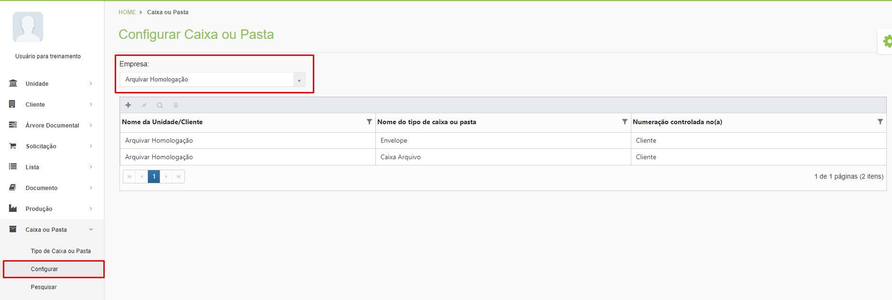

# 🟩 Configurar

No menu Configurar, depois de selecionar a unidade no campo “Empresa”, é possível vincular os tipos de caixa ou pasta criados no menu Tipo de Caixa ou Pasta a um cliente ou a uma unidade franqueada Arquivar. &#x20;

<figure><figcaption>
Clique para ampliar a imagem.
</figcaption></figure>
