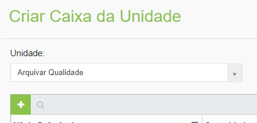
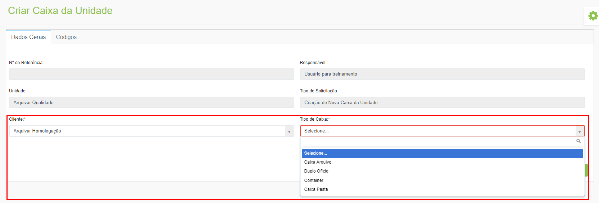
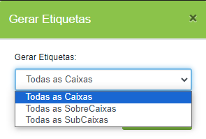
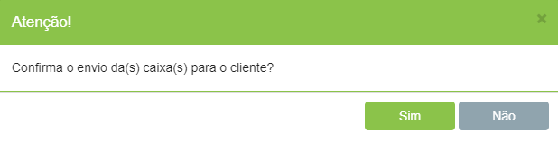
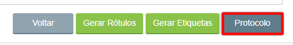
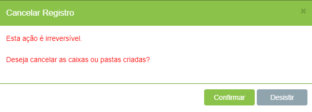
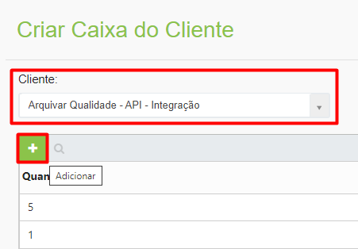
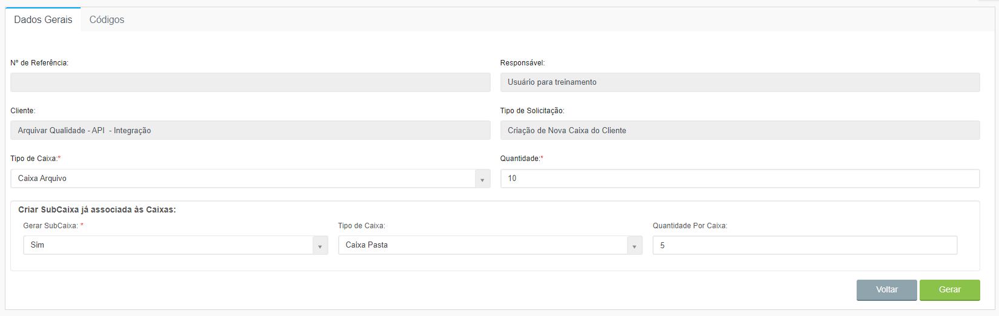

# 🟩 Criar

Depois de criar um tipo de caixa ou pasta e de vinculá-lo a uma unidade ou a um cliente, é preciso criar as caixas dessa unidade ou cliente, neste menu. &#x20;

***

## Caixa da Unidade&#x20;

Para criar uma caixa da unidade, selecione no campo “Unidade” e clique no ícone “Adicionar”.&#x20;

<figure><figcaption></figcaption></figure>

Na aba Dados Gerais os campos “Nº de Referência”, “Responsável”, “Unidade” e “Tipo de Solicitação” serão preenchidos automaticamente. Selecione o cliente para o qual a caixa está sendo criada no campo “Cliente” e o “Tipo de Caixa”.

<figure><figcaption>
Clique para ampliar a imagem.
</figcaption></figure>


<mark style="color:orange;">**Os tipos de caixa exibidos aqui para seleção devem ter sido anteriormente vinculados à unidade no campo “Numeração controlada no(a): “, no menu**</mark> [<mark style="color:blue;">**Caixa ou Pasta > Configurar.**</mark>](configurar.md)


<figure><figcaption>
Clique para ampliar a imagem.
</figcaption></figure>

Informe quantas caixas estão sendo criadas e a de que estoque a caixa será subtraída, podendo ser do estoque de caixas novas ou usadas que a unidade possui. &#x20;

Se tiver sido definido que para aquele tipo de caixa selecionado haverá utilização de subcaixas no menu [Caixa ou Pasta > Configurar](configurar.md), será necessário informar se haverá criação de subcaixa, o tipo de subcaixa e a quantidade por caixa.&#x20;

No campo “Serviço de guarda associado” é preciso selecionar à qual serviço de guarda oferecido pela unidade a caixa que está sendo criada será associada. &#x20;


<mark style="color:orange;">**Os serviços exibidos aqui são aqueles que foram definidos em contrato que seriam oferecidos pela unidade para aquele cliente. O cadastro desses serviços deve ter sido realizado anteriormente no menu**</mark> [<mark style="color:blue;">**Cliente > Contratos**</mark>](../cliente/contratos/)<mark style="color:orange;">**. Caso o serviço desejado não tenha sido cadastrado no contrato do cliente, não será possível realizar a criação da caixa.**</mark>


<figure><figcaption>
Clique para ampliar a imagem.
</figcaption></figure>

Nesta tela deve ser definido também o local de armazenamento das caixas que estão sendo criadas dentro do galpão da unidade. Os endereços disponíveis devem ter sido anteriormente cadastrados no menu [Endereço > Endereço da Unidade](../endereco/endereco-da-unidade.md).&#x20;

<figure><figcaption>
Clique para ampliar a imagem.
</figcaption></figure>

### Aba Códigos&#x20;

Depois de gerar as caixas, na aba “Códigos” será possível visualizar os códigos, ícone representativo, endereço, total de itens armazenados, status e tipo de cada uma das caixas e subcaixas geradas. &#x20;

<figure><figcaption>
Clique para ampliar a imagem.
</figcaption></figure>

Para identificação das caixas devem ser utilizadas etiquetas e para identificação de subcaixas devem ser utilizados rótulos. &#x20;

<figure><figcaption></figcaption></figure>

Ao clicar em “Gerar Rótulos” será possível gerar os rótulos de identificação para as subcaixas para impressão. Para isso, defina o layout da impressão e a quantidade de rótulos para pular se quiser reaproveitar uma folha que já tenha sido utilizada para imprimir outros rótulos mas ainda tenha espaço para impressão.  &#x20;

<figure><figcaption></figcaption></figure>

Ao clicar em “Gerar Etiquetas” é preciso selecionar se as etiquetas que serão geradas serão para todas as caixas, somente para as sobrecaixas (caixas que abrigam as subcaixas) ou somente para as subcaixas. As etiquetas serão criadas seguindo a ordem do endereço das caixas. &#x20;

<figure><figcaption></figcaption></figure>

A funcionalidade “Enviar para o Cliente” é utilizada quando a unidade precisa enviar caixas vazias para o cliente, para que ele faça o armazenamento de documentos e indexação dos itens. Quando feito esse envio o status das caixas enviadas mudará para “Emprestada” e para que retorne o cliente deverá fazer a devolução por meio do menu Solicitação > Devolução.&#x20;

<figure><figcaption></figcaption></figure>

Ao enviar caixas para o cliente será habilitado o botão “Protocolo”, no qual será possível visualizar o protocolo de entrega das caixas para o cliente.&#x20;

<figure><figcaption>
Clique para ampliar a imagem.
</figcaption></figure>

 

<figure><figcaption></figcaption></figure>

Para cancelar a criação das caixas, clique no botão “Cancelar Códigos”. O cancelamento só pode ser feito se as caixas não tiverem sido enviadas para o cliente. Será feito o cancelamento de todas as caixas criadas na requisição.


<mark style="color:orange;">**A cobrança do ArqDOC é feita por número de caixas, portanto, é imprescindível que a criação de caixas seja feita com atenção. A funcionalidade “Cancelar Códigos” foi desenvolvida para que seja possível cancelar uma criação de caixas indevida e essa cobrança não seja feita para o cliente.**</mark>


<figure><figcaption></figcaption></figure>

***

## Caixa do Cliente &#x20;

No menu Caixa do Cliente são criadas caixas controladas pelo próprio cliente. Para criar uma caixa do cliente, selecione-o no campo “Cliente” e clique no ícone “Adicionar”. &#x20;

<figure><figcaption></figcaption></figure>

Os campos “Nº de Referência”, “Responsável”, “Cliente” e “Tipo de Solicitação” serão preenchidos automaticamente. Selecione o “Tipo de Caixa” e a quantidade de caixas ou pastas que estão sendo criadas. Informe também se deseja criar subcaixas associadas à caixa que está sendo criada. Para finalizar, clique em “Gerar”.&#x20;


<mark style="color:orange;">**Os tipos de caixa exibidos aqui para seleção aqui devem ter sido anteriormente vinculados ao cliente no campo “Numeração controlada no(a): “, no menu**</mark> [<mark style="color:blue;">**Caixa ou Pasta > Configurar**</mark>](configurar.md)<mark style="color:orange;">**.**</mark>


<figure><figcaption>
Clique para ampliar a imagem.
</figcaption></figure>

### Aba Códigos&#x20;

Depois de gerar as caixas, na aba “Códigos” será possível visualizar os códigos, ícone representativo, status, total de itens armazenados e tipo de cada uma das caixas geradas. &#x20;

Para desfazer a criação das caixas, clique em “Cancelar Códigos”. Será feito o cancelamento de todas as caixas criadas na requisição. &#x20;


<mark style="color:orange;">**A cobrança do ArqDOC é feita por número de caixas, portanto, é imprescindível que a criação de caixas seja feita com atenção. A funcionalidade “Cancelar Códigos” foi desenvolvida para que seja possível cancelar uma criação de caixas indevida e essa cobrança não seja feita para o cliente.**</mark>


<figure><figcaption>
Clique para ampliar a imagem.
</figcaption></figure>
