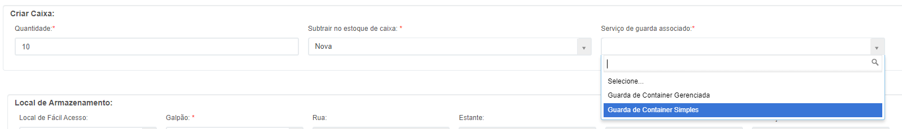
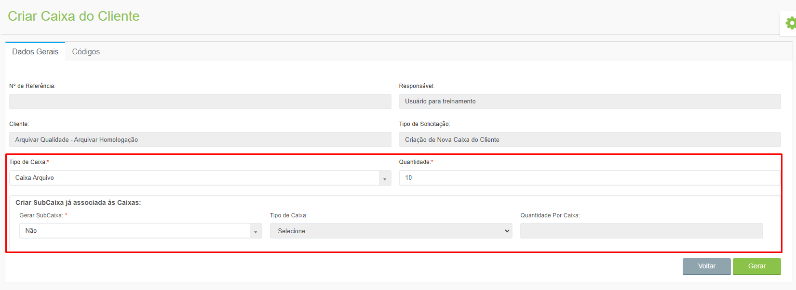

# 🟩 Criar

Depois de criar um tipo de caixa ou pasta e de vinculá-lo a uma unidade ou a um cliente, é preciso criar as caixas dessa unidade ou cliente, neste menu. &#x20;

## Caixa da Unidade&#x20;

Para criar uma caixa da unidade, selecione no campo “Unidade” e clique no ícone “Adicionar”.&#x20;

<figure><figcaption></figcaption></figure>

Na aba Dados Gerais selecione a unidade no campo “Cliente” e o “Tipo de Caixa”. &#x20;

<figure><figcaption>
Clique para ampliar a imagem.
</figcaption></figure>


<mark style="color:orange;">**Os tipos de caixa exibidos aqui para seleção aqui devem ter sido anteriormente vinculados à unidade no menu**</mark> [<mark style="color:blue;">**Caixa ou Pasta > Configurar**</mark>](configurar.md)<mark style="color:blue;">**.**</mark>


Informe quantas caixas estão sendo criadas e a que serviço de guarda serão associadas.&#x20;

<figure><figcaption>
Clique para ampliar a imagem.
</figcaption></figure>


<mark style="color:orange;">**Os serviços exibidos aqui são aqueles que foram definidos em contrato que seriam oferecidos pela unidade.**</mark>


Nesta tela deve ser definido também o local de armazenamento das caixas que estão sendo criadas dentro do galpão da unidade.&#x20;

<figure><figcaption>
Clique para ampliar a imagem.
</figcaption></figure>

***

## Caixa do Cliente&#x20;

Para criar uma caixa do cliente, selecione-o no campo “Cliente” e clique no ícone “Adicionar”.&#x20;

<figure><figcaption></figcaption></figure>

Selecione o “Tipo de Caixa” e a quantidade de caixas ou pastas que estão sendo criadas. Informe também se deseja criar subcaixas associadas à caixa que está sendo criada.&#x20;

<figure><figcaption>
Clique para ampliar a imagem.
</figcaption></figure>


<mark style="color:orange;">**Os tipos de caixa exibidos aqui para seleção aqui devem ter sido anteriormente vinculados à unidade no menu**</mark> [<mark style="color:blue;">**Caixa ou Pasta > Configurar**</mark>](configurar.md)<mark style="color:blue;">**.**</mark>

