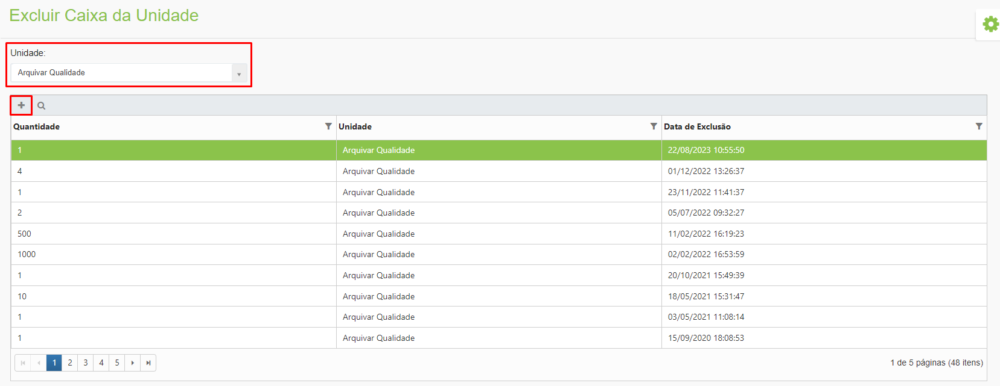
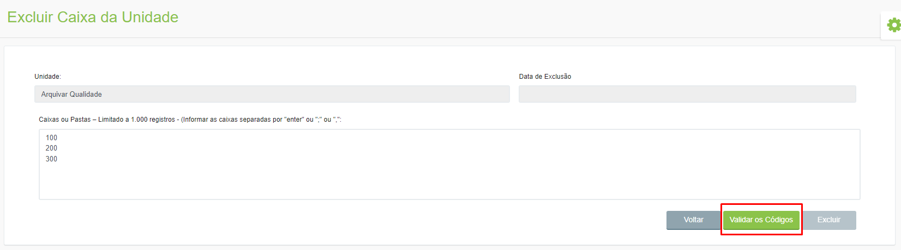
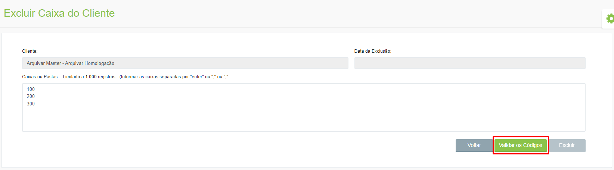

# 🟩 Excluir

Neste menu é feita a exclusão de caixas ou pastas. Esta funcionalidade é utilizada quando um cliente deixa de utilizar serviços de guarda e é necessário dar baixa em suas caixas e pastas. Quando uma caixa ou pasta é excluída o endereço onde ela estava alocada é automaticamente liberado para receber um novo arquivo. &#x20;

## Caixa da Unidade&#x20;

Na tela principal são exibidas todas as caixas da unidade excluídas. São mostradas a quantidade de caixas que foram excluídas a data e horário da exclusão. Para excluir uma caixa de unidade, selecione a “Unidade” e clique no ícone “Adicionar”.&#x20;

<figure><figcaption>
Clique para ampliar a imagem.
</figcaption></figure>

Informe os códigos das caixas ou pastas que deseja excluir e clique em “Validar os Códigos”. Se todos os códigos informados forem validados, será possível clicar em “Excluir” para concluir a exclusão. &#x20;

<figure><figcaption>
Clique para ampliar a imagem.
</figcaption></figure>

***

## Caixa do Cliente&#x20;

Na tela principal são exibidas todas as caixas do cliente excluídas. São mostradas a quantidade de caixas que foram excluídas a data e horário da exclusão. Para excluir uma caixa do cliente, selecione-o e clique no ícone “Adicionar”.&#x20;

<figure><figcaption>
Clique para ampliar a imagem.
</figcaption></figure>

Para excluir uma caixa do cliente, selecione o “Cliente”. Informe os códigos das caixas ou pastas que deseja excluir e clique em “Validar os Códigos”. Se todos os códigos informados forem validados, será possível clicar em “Excluir” para concluir a exclusão.&#x20;

<figure><figcaption>
Clique para ampliar a imagem.
</figcaption></figure>
