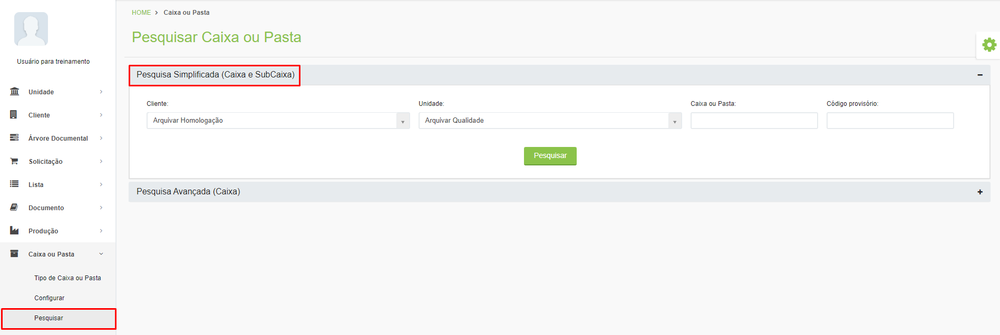
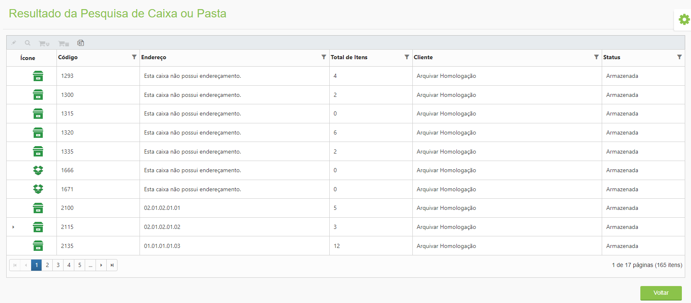

# 🟩 Pesquisar

É possível pesquisar informações sobre as caixas alocadas. &#x20;

Para realizar uma Pesquisa Simplificada, informe o “Cliente”, a “Unidade” e o código da caixa ou pasta e clique em “Pesquisar”.&#x20;

<figure><figcaption>
Clique para ampliar a imagem.
</figcaption></figure>

Para realizar uma Pesquisa Avançada, informe o “Cliente”, a “Unidade” e utilize os demais filtros para refinar os resultados da busca.&#x20;

<figure><figcaption>
Clique para ampliar a imagem.
</figcaption></figure>

Serão exibidos todos os registros associados ao código informado. Serão exibidos o código da caixa, o endereço onde está alocada, o total de itens que existem dentro dela, o cliente ao qual pertence e o ícone e status de armazenamento.&#x20;

<figure><figcaption>
Clique para ampliar a imagem.
</figcaption></figure>
