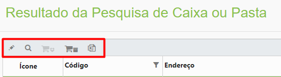
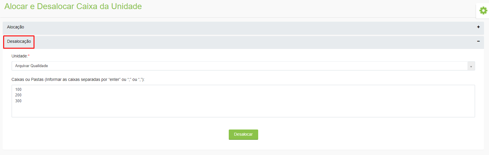
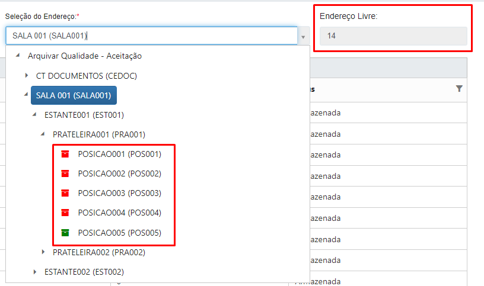

# 🟩 Pesquisar

É possível pesquisar informações sobre as caixas alocadas. &#x20;

Para realizar uma Pesquisa Simplificada, informe o “Cliente”, a “Unidade” e o código da caixa ou pasta e clique em “Pesquisar”.&#x20;

<figure><figcaption>
Clique para ampliar a imagem.
</figcaption></figure>

Pode ser feita também a pesquisa por código provisório, ou seja, pelo número não controlado habilitado no menu [Caixa ou Pasta > Configurar](configurar.md).

Para realizar uma Pesquisa Avançada, informe o “Cliente”, a “Unidade” e utilize os demais filtros para refinar os resultados da busca.&#x20;

<figure><figcaption>
Clique para ampliar a imagem.
</figcaption></figure>

Serão exibidos todos os registros associados ao código informado. Serão exibidos o código da caixa, o endereço onde está alocada, o total de itens que existem dentro dela, o cliente ao qual pertence e o ícone e status de armazenamento.&#x20;

<figure><figcaption>
Clique para ampliar a imagem.
</figcaption></figure>

Ao selecionar um dos registros são habilitadas as seguintes funcionalidades:&#x20;

<figure><figcaption></figcaption></figure>

**Editar:** Ao clicar neste ícone serão exibidos os dados cadastrais da caixa ou pasta e o histórico de sua movimentação. Será possível realizar a indexação da caixa e gerar as etiquetas de identificação. &#x20;

<figure><figcaption>
Clique para ampliar a imagem.
</figcaption></figure>

**Visualizar:** Ao clicar neste ícone serão exibidos os dados cadastrais da caixa ou pasta e o histórico de sua movimentação. Será possível realizar a indexação da caixa e gerar as etiquetas de identificação.&#x20;

<figure><figcaption>
Clique para ampliar a imagem.
</figcaption></figure>

**Reservar subcaixa:** Se a caixa tiver subcaixas associadas, este ícone será habilitado para que seja feita a reserva das subcaixas.&#x20;

**Reservar caixa:** Utilizado para reservar a caixa selecionada.&#x20;

**Exportar:** Exporta os resultados da pesquisa realizada. É possível exportas apenas as informações de caixas, apenas o resultado de subcaixas ou os resultados de ambas.&#x20;

<figure><figcaption></figcaption></figure>
