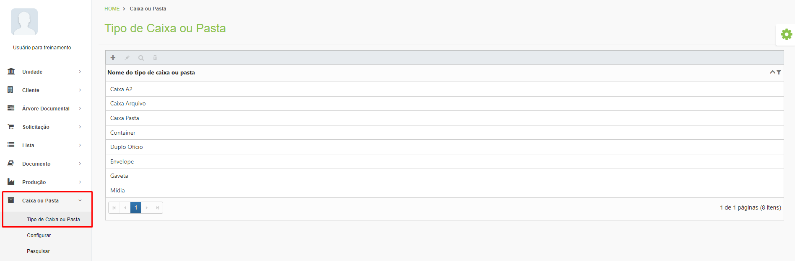
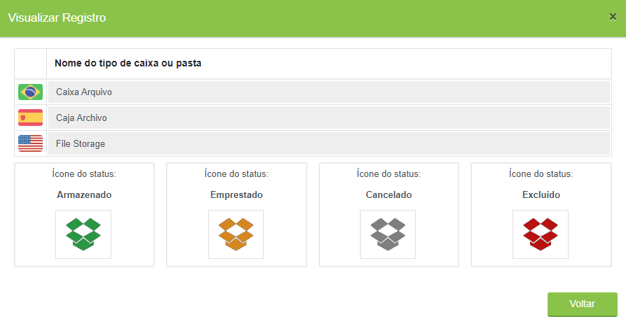
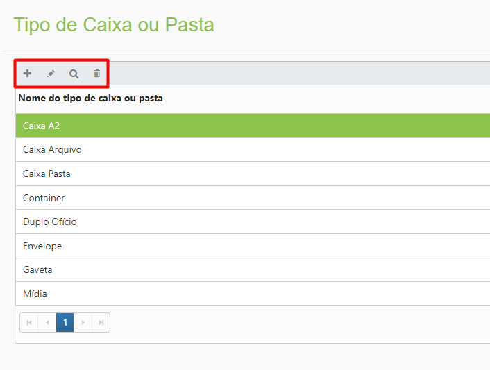
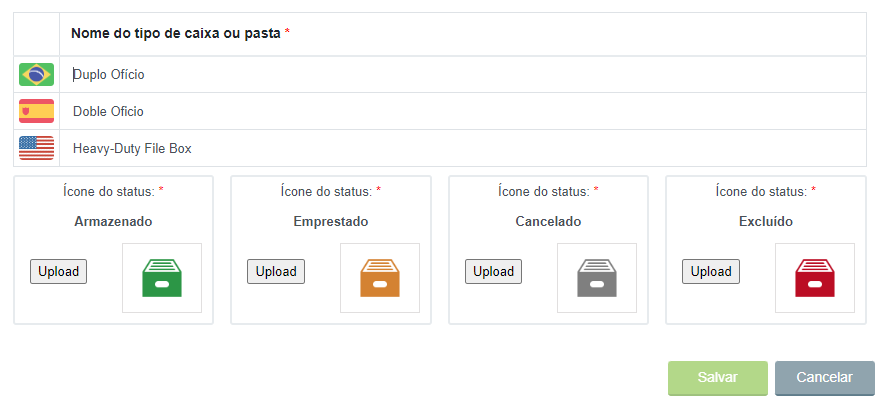

# 🟩 Tipo de Caixa ou Pasta

Neste menu são apresentados os tipos de caixas e pastas físicas que uma unidade Arquivar pode oferecer para seus clientes. Essa criação deve ser feita pela unidade Arquivar Master.&#x20;

<figure><figcaption>
Clique para ampliar a imagem.
</figcaption></figure>

É possível definir o ícone de cada um dos status de uma caixa ou pasta e o nome nos idiomas Português, Inglês e Espanhol que será dado à caixa ou pasta. &#x20;

<figure><figcaption>
Clique para ampliar a imagem.
</figcaption></figure>

***

## Tipo de Caixa ou Pasta – Tela principal&#x20;

**Ícone Adicionar:** Utilizado para cadastrar um novo tipo de caixa ou pasta.&#x20;

**Ícone Editar:** Utilizado para editar as informações do tipo de caixa ou pasta selecionado.&#x20;

**Ícone Visualizar:** Utilizado para apresentar as informações do tipo de caixa ou pasta selecionado. &#x20;

**Ícone Excluir:** Utilizado para excluir o tipo de caixa ou pasta selecionado.&#x20;

<figure><figcaption></figcaption></figure>

***

## Criação de Caixa ou Pasta&#x20;

Clique no ícone “Adicionar”.&#x20;

<figure><figcaption></figcaption></figure>

Defina o nome do tipo de caixa ou pasta. Esse nome deve ser informado nos idiomas Português, Inglês e Espanhol.&#x20;

Realize o upload da imagem que será o ícone representativo da caixa ou pasta. Esse ícone deve ser inserido em diferentes cores para representar os diferentes status que o tipo de caixa ou pasta pode ter, que são Armazenado, Emprestado, Cancelado ou Excluído. Clique em “Salvar” para concluir.&#x20;

<figure><figcaption>
Clique para ampliar a imagem.
</figcaption></figure>
