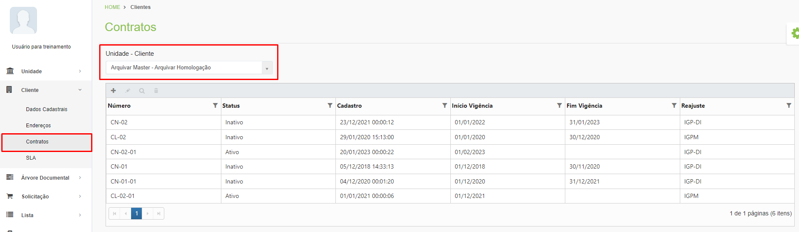
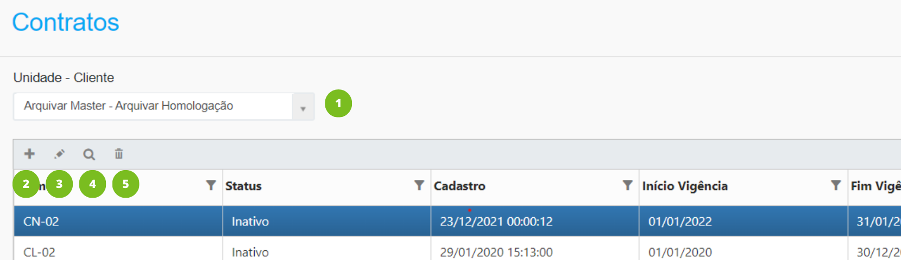
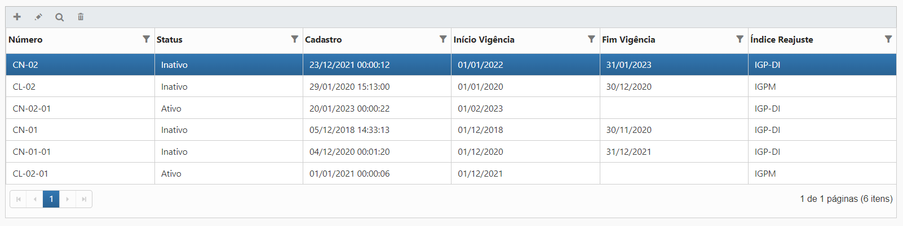

# 🟩 Contratos

Na tela Contratos são exibidas as informações dos contratos celebrados entre cliente e unidade selecionados no campo “Unidade – Cliente”.&#x20;

<figure><figcaption>
Clique na imagem para ampliar.
</figcaption></figure>

***

## Contratos – Tela principal

**1. Campo Unidade - Cliente:** Neste campo é exibida a empresa ou empresas às quais o usuário logado pertence ou tem acesso. No caso de franqueados serão exibidos aqui todos os clientes da Unidade.

**2. Ícone Adicionar:** Utilizado para adicionar um novo contrato. &#x20;

**3. Ícone Editar:** Utilizado para editar o contrato selecionado. &#x20;

**4. Ícone Visualizar:** Utilizado para visualizar detalhes do contrato selecionado. &#x20;

**5. Ícone Excluir:** Utilizado para excluir o contrato selecionado.

<figure><figcaption>
Clique na imagem para ampliar.
</figcaption></figure>

**Coluna Número:** Exibe o número do contrato.

**Coluna Status:** Exibe o status do contrato, que pode estar ativo ou inativo.

**Coluna Cadastro:** Exibe a data e hora em que o contrato foi cadastrado no sistema.

**Coluna Início Vigência:** Exibe a data de início da vigência do contrato.

**Coluna Fim Vigência:** Exibe a data de fim da vigência do contrato.

**Coluna Índice Reajuste:** Apresenta o índice escolhido para reajuste do valor contrato. Caso nenhum índice tenha sido escolhido no momento do cadastro do contrato, a coluna será preenchida como “Sem Reajuste”.

<figure><figcaption>
Clique na imagem para ampliar.
</figcaption></figure>

