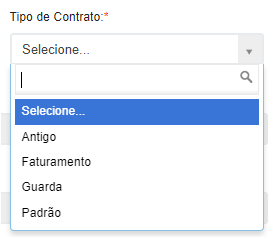
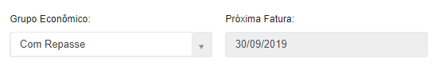
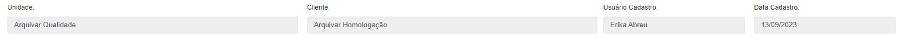
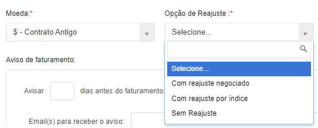
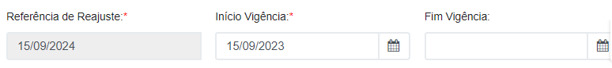
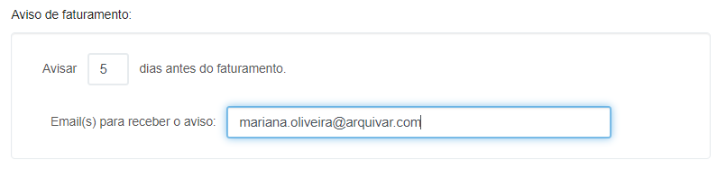
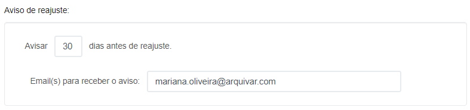
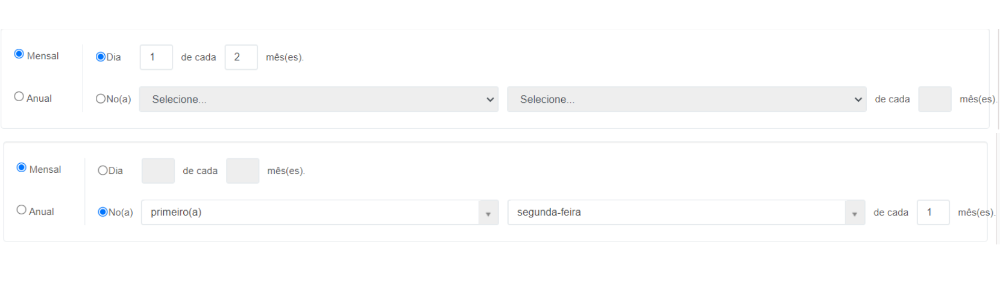

# 🔹 Aba Dados Gerais

**Tipo de Contrato:** Neste campo deve ser selecionado o tipo de contrato que está sendo cadastrado, que pode ser:

* _Antigo:_ Nesse tipo de contrato, qualquer serviço pode ser incluído, tanto relacionado a serviços de guarda documental quanto de utilização e licença do software ArqGED. Nesse tipo de contrato será utilizada a cobrança antiga de repasse do franqueado para a Master.&#x20;
* _Faturamento:_ Nesse tipo de contrato não pode haver nenhum tipo de serviço relacionado ao software ArqGED. Esse tipo de contrato foi criado para serviços que não envolvem o uso do software, como por exemplo digitalização (sem o uso do ArqIndex), organização de documentos, consultoria etc.
* _Guarda:_ Nesse tipo de contrato só podem ser incluídos serviços relacionados ao software ArqGED e ao Storage, ou seja, serviços de guarda como transporte, consulta de documentos etc.
* _Padrão:_ Assim como no contrato Antigo, nesse tipo de contrato qualquer serviço pode ser incluído, tanto relacionado a serviços de guarda documental quanto de utilização e licença do software ArqGED. A diferença é que nesse tipo de contrato será utilizada a cobrança atualizada de repasse do franqueado para a Master.  &#x20;


<mark style="color:orange;">**O Tipo de Contrato é importante para que o franqueado saiba que tipo de serviço poderá incluir no contrato do cliente.**</mark>


<figure><figcaption></figcaption></figure>

**Grupo Econômico:** O campo Grupo Econômico permite que sejam agrupados vários contratos em um mesmo grupo e que a cobrança seja feita uma única vez, da franqueadora (Master) para o franqueado (Unidade).


<mark style="color:blue;">**EXEMPLO:**</mark> <mark style="color:blue;"></mark><mark style="color:blue;">Uma mesma empresa possui três contratos com a Unidade X, e os três contratos foram agrupados no mesmo Grupo Econômico. Ao cobrar a licença do software da Unidade X, a Arquivar Master para irá faturar a mensalidade apenas uma vez, sobre o grupo econômico criado.</mark>


**Próxima Fatura:** Ao salvar o contrato, com base no preenchimento do campo “Recorrência de Faturamento”, será calculada automaticamente a data da próxima fatura, que será exibida aqui.

<figure><figcaption></figcaption></figure>

**Unidade:** Campo preenchido automaticamente com a Unidade selecionada na tela principal.

**Cliente:** Campo preenchido automaticamente com o cliente selecionado na tela principal.

**Usuário Cadastro:** Campo preenchido automaticamente o nome do usuário logado.

**Data Cadastro:** Campo preenchido automaticamente com a data em que está sendo realizado o cadastro.

<figure><figcaption>
Clique na imagem para ampliar.
</figcaption></figure>

**Moeda:** Aqui deve ser selecionada a moeda que será utilizada para pagamento do contrato (Real, Dólar etc.).

**Opção de Reajuste:** Aqui deve ser indicado o tipo de reajuste periódico do valor do contrato que deverá ser realizado, de acordo com o que foi negociado com o cliente.

* _Com reajuste negociado:_ Indica que o valor do contrato não pode ser reajustado sem antes o cliente ser consultado e validar o novo valor. Nesse caso o setor Comercial precisa entrar em contato com o cliente, negociar o novo preço e providenciar um aditivo do contrato.
* _Com reajuste por índice:_ Indica que o reajuste do valor do contrato será feito automaticamente, de acordo com o índice de Reajuste apontado.
* _Sem reajuste:_ Indica que não haverá reajuste no valor do contrato.

<figure><figcaption></figcaption></figure>

**Índice de Reajuste:** Esse campo deverá ser preenchido caso a opção de reajuste for “Com reajuste por índice”. Aqui deve ser informado o índice de mercado que irá nortear o reajuste do valor do contrato.

**Tipo de Reajuste:** Esse campo deverá ser preenchido caso a opção de reajuste for “Com reajuste por índice”. Se escolhida a opção “Manual”, o setor Financeiro irá calcular o valor do reajuste de acordo com a tabela do índice escolhido. Se for escolhida a opção “Automática” o sistema irá reajustar o valor automaticamente na data indicada no campo “Referência de Reajuste”.

<figure><figcaption></figcaption></figure>

**Referência de Reajuste:** Esse campo será preenchido automaticamente com a data de um ano após a data informada no campo “Início Vigência”, ou seja, se o contrato for do tipo “Com reajuste por índice”, o reajuste do valor do contrato será feito anualmente. &#x20;

**Início Vigência:** Aqui deve ser informada a data de início da prestação de serviços para o cliente, ou seja, a partir de que dia o contrato passa a valer.

**Fim Vigência:** Aqui deve ser informada a data final da prestação de serviços para o cliente, ou seja, a partir de que dia o contrato passa a valer. Esse campo não é obrigatório e caso não haja uma data estipulada para o fim do contrato, a vigência será por tempo indeterminado.

<figure><figcaption></figcaption></figure>

**Aviso de Faturamento:** Ao preencher esse campo o sistema emitirá um aviso para sobre a data de faturamento da próxima fatura. Para isso, informe a quantidade de dias antes do faturamento o alerta deverá ser emitido e para qual e-mail esse alerta deverá ser enviado.

<figure><figcaption></figcaption></figure>

**Aviso de reajuste:** Ao preencher esse campo o sistema emitirá um comunicado sobre a data de reajuste do valor do contrato. Para isso, informe a quantidade de dias antes do reajuste o alerta deverá ser emitido e para qual e-mail esse comunicado deverá ser enviado.

<figure><figcaption></figcaption></figure>

**Recorrência de Faturamento:** Nesse campo deve ser determinada a periodicidade de faturamento do contrato.

• _Mensal:_ Se a cobrança for mensal, pode ser determinado um dia específico ou uma data de acordo com determinado dia da semana.


<mark style="color:blue;">**EXEMPLO:**</mark> <mark style="color:blue;"></mark><mark style="color:blue;">Se for preenchido “Dia 1 de cada 2 meses”, o sistema entenderá que todo dia 1º deverá realizar o faturamento, com intervalo de dois meses, ou seja, seria uma cobrança bimensal.</mark>

<mark style="color:blue;">Se for preenchido “Na primeira segunda-feira de cada 1 mês”, o sistema entenderá que toda primeira segunda-feira de cada mês deverá realizar o faturamento, ou seja, seria uma cobrança mensal.</mark>&#x20;


<figure><figcaption>
Clique na imagem para ampliar.
</figcaption></figure>

• _Anual:_ Se a cobrança for anual, pode ser determinado que aconteça em um dia e mês específicos ou em uma data de acordo com determinado dia da semana e do mês.
