# 🔹 Aba Serviço

## Aba Serviço – Tela principal

**1. Ícone Adicionar:** Utilizado para adicionar um novo serviço ao contrato.  &#x20;

**2. Ícone Editar:** Utilizado para editar os serviços inclusos no contrato selecionado.  &#x20;

**3. Ícone Visualizar:** Utilizado para visualizar detalhes dos serviços inclusos no contrato selecionado.  &#x20;

**4. Ícone Excluir:** Utilizado para excluir serviços do contrato selecionado.&#x20;

<figure>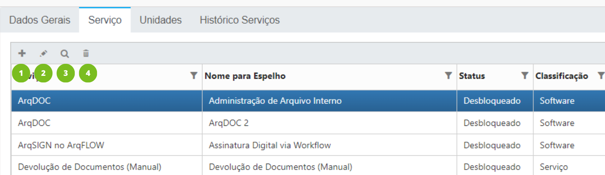<figcaption>
Clique na imagem para ampliar.
</figcaption></figure>

**Coluna Serviço:** Exibe o nome do serviço.&#x20;

**Coluna Nome para Espelho:** Exibe o nome do campo que será exibido no relatório de faturamento.&#x20;

**Coluna Status:** Exibe se o serviço está bloqueado, desbloqueado ou em versão POC no contrato.&#x20;

**Coluna Classificação:** Informa se se trata de um “Serviço”, ou seja, é executado fora do sistema ArqGED, ou se é “Software”, ou seja, é um serviço relacionado a um dos módulos do ArqGED.&#x20;

**Coluna Controle:** Informa se a forma de controle do serviço é manual ou automática. &#x20;

**Coluna Faturamento:** Exibe o tipo de faturamento do serviço, podendo ser periódico ou parcelado. &#x20;

**Coluna Faturado por:** Informa a unidade responsável pelo faturamento do serviço.&#x20;

**Coluna Início Vigência:** Exibe a data de início de vigência do serviço. &#x20;

**Coluna Fim Vigência:** Informa a data de fim da vigência do serviço, se houver.&#x20;

<figure>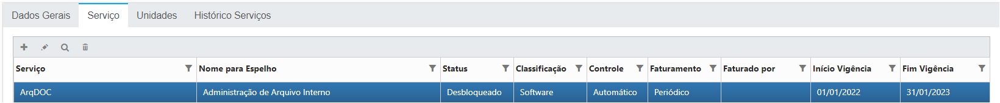<figcaption>
Clique na imagem para ampliar.
</figcaption></figure>

***

## Adicionando  um serviço

1\. Para adicionar um serviço ao contrato, clique no ícone “Adicionar”.

<figure><figcaption></figcaption></figure>

2\. Informe o Serviço que será adicionado. No campo “Serviço” serão listados apenas os serviços disponíveis para o tipo de contrato selecionado anteriormente no campo “Tipo de Contrato” na [aba Dados Gerais. ](../aba-dados-gerais.md)

3\. Ao escolher o Tipo de Serviço serão exibidos novos campos para preenchimento, que vão variar de acordo com a opção escolhida.&#x20;

<figure>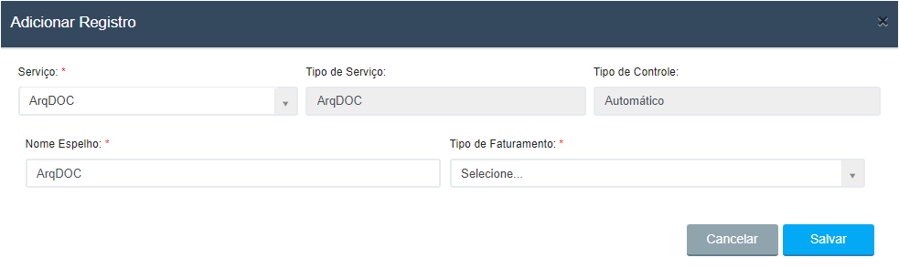<figcaption>
Clique na imagem para ampliar.
</figcaption></figure>

**Serviço:** Selecione o serviço que deseja incluir.

<figure>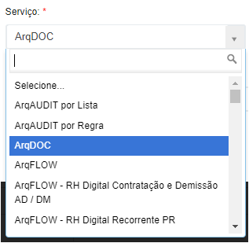<figcaption></figcaption></figure>

**Tipo de Serviço:** Esse campo será preenchido automaticamente com o tipo de serviço que vai servir como referência para contagem de itens no contrato. Ao cadastrar um contrato, o sistema fará a contagem de quantos tipos de serviço estão inclusos. Se o serviço não tiver um tipo específico, será mostrada a opção “N.A.” (Não se aplica).


<mark style="color:blue;">**EXEMPLO:**</mark> <mark style="color:blue;"></mark><mark style="color:blue;">Os serviços “ArqFlow – RH Digital” e “ArqFlow – RH Recorrente” possuem o mesmo tipo de serviço: “ArqFlow”. Em um contrato que possuir os dois serviços, o sistema fará a cobrança de duas unidades do item “ArqFlow”.</mark>


**Tipo de Controle:** Esse campo será preenchido automaticamente de acordo com a opção escolhida no campo Tipo de Serviço, podendo ser “Manual” ou “Automático”. Serão automáticos os tipos de serviço em que o usuário deve fazer uma solicitação de execução por meio do menu “Solicitação”.


<mark style="color:blue;">**EXEMPLO:**</mark> <mark style="color:blue;"></mark><mark style="color:blue;">O tipo de serviço “Transporte” é de controle manual, porque não é possível que o sistema saiba a quantidade de itens que foram transportados, devendo o usuário informar manualmente. Já o tipo de serviço “Solicitação de Container” é de controle automático, porque o usuário precisa acessar o menu “Solicitações” e registrar a quantidade de contêineres que será adquirida.</mark>


<figure>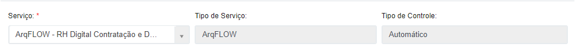<figcaption>
Clique na imagem para ampliar.
</figcaption></figure>

**Classificação:** O campo Classificação será preenchido automaticamente de acordo com o tipo de serviço escolhido, podendo ser “Serviço”, quando relacionada à prestação de serviços fora do ArqGED ou “Software”, quando o serviço tiver relação e for executado dentro de um dos módulos do sistema ArqGED.&#x20;

**Nome Espelho:** Informe um nome para o campo que será exibido no relatório de faturamento.&#x20;

**Tipo de Faturamento:** Dependendo do tipo de serviço escolhido será preenchido automaticamente ou apresentará as opções “Parcelado” e “Periódico” para escolha.

<figure>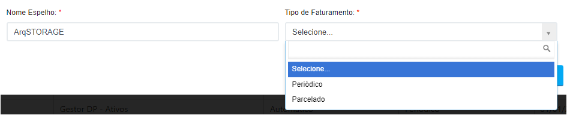<figcaption>
Clique na imagem para ampliar.
</figcaption></figure>



O faturamento periódico é aquele que é cobrado de forma recorrente, podendo ser mensalmente, anualmente etc. Neste caso é preciso preencher os campos relacionados ao pacote inicial, periódico e unitário, dependendo do serviço, além das datas de início e fim da vigência do serviço, se houver.

<figure>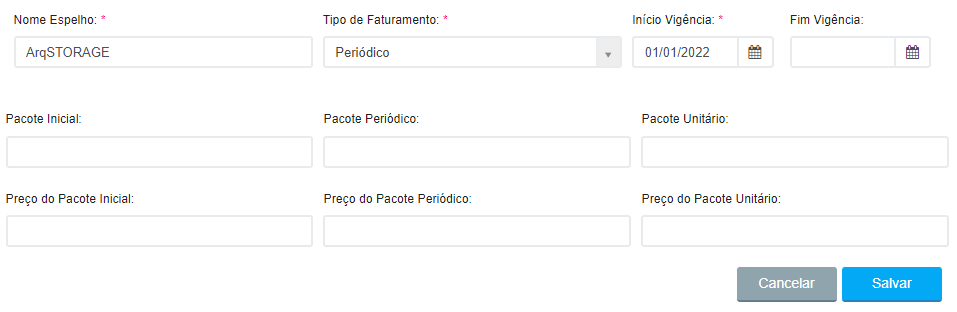<figcaption>
Clique na imagem para ampliar.
</figcaption></figure>



O faturamento parcelado é cobrado uma única vez, podendo ser parcelado ou não. Caso essa opção seja escolhida serão apresentados os campos “Valor Total”, que deve ser preenchido com o valor total que será cobrado, e “Total de Parcelas”. Será preciso também preencher os campos “Data do faturamento da parcela” e “Valor da parcela” de cada parcela em que será dividido o valor total para o cliente.

<figure>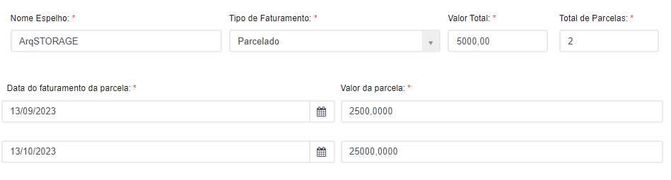<figcaption>
Clique na imagem para ampliar.
</figcaption></figure>



**Início Vigência:** Quando solicitado o preenchimento desse campo, informe a mesma data de início da vigência do contrato cadastrada na aba Dados Gerais ou uma data posterior ao início do contrato para indicar que o serviço foi adquirido depois.&#x20;

**Fim Vigência:** Se houver uma data para o fim da vigência do contrato, informe neste campo a mesma data ou uma data menor. Se o serviço for vigente por tempo indeterminado, deixe este campo em branco.&#x20;

<figure>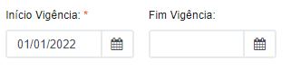<figcaption></figcaption></figure>

**Faturado por:** Quando solicitado o preenchimento desse campo, selecione se o serviço será faturado pela Arquivar Master ou pela unidade responsável pelo contrato.

<figure>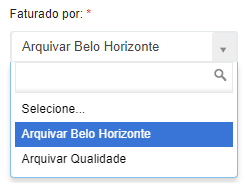<figcaption></figcaption></figure>

**% Desconto:** O percentual de desconto a que se refere este campo está relacionado ao desconto que a Arquivar Master poderá conceder ao franqueado no momento da cobrança do repasse. O desconto informado aqui não tem impacto no valor que a unidade cobrará do cliente.&#x20;

**Limite de Faturamento:** Se houver algum limite do que será cobrado do cliente acordado entre a unidade e a empresa cliente, informe neste campo o valor. &#x20;

**Bloquear serviço ao exceder Limite Faturamento:** Se marcada esta opção, o contrato será bloqueado após atingir o limite estipulado no campo “Limite de Faturamento”. &#x20;

<figure>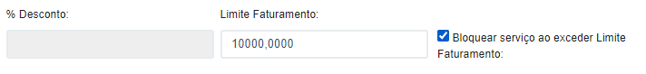<figcaption></figcaption></figure>

**Status:** Selecione uma das opções:

<figure>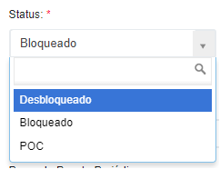<figcaption></figcaption></figure>

* _Desbloqueado:_ Utilize esse status caso o cliente já esteja vá utilizar o serviço ou já esteja utilizando.&#x20;
* _Bloqueado:_ Utilize esse status caso o serviço esteja previsto no contrato do cliente, mas ele ainda não esteja utilizando ou não tenha previsão de utilização. Neste caso o serviço não será cobrado do cliente.&#x20;
* _POC:_ Utilize esse status caso o cliente vá utilizar o serviço por determinado período sem cobrança, com o objetivo de testar a ferramenta. Nesse caso preencha também os campos “Início POC” e “Fim POC”, com as datas de início e fim do período de demonstração. Também será necessário informar no campo “Notificar” o e-mail do colaborador ou equipe da unidade que será avisado sobre o fim do período de demonstração do cliente.&#x20;

<figure>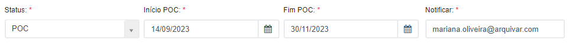<figcaption>
Clique na imagem para ampliar.
</figcaption></figure>

**Unidade de Medida para Limite Gratuito:** Informe se deve ser considerado para cálculo de requisições gratuitas (via API) o quantitativo realizado no "Dia" ou no "Mês".

**Quantidade para o Limite Gratuito:** Neste campo deve ser informada a quantidade de requisições que podem ser realizadas (via API) no dia ou no mês de forma gratuita.

<figure><figcaption>
Clique na imagem para ampliar.
</figcaption></figure>

O faturamento para a quantidade do serviço ArqAPI, segue o mesmo padrão dos demais softwares que usam a combinação de campos: &#x20;

* Pacote Periódico&#x20;
* Preço Pacote Periódico&#x20;
* Pacote Unitário&#x20;
* Preço Pacote Unitário&#x20;

**Pacote Inicial:** O valor informado neste campo será consumido uma única vez. Depois de consumido passará a ser descontada a quantidade do pacote periódico ou do pacote unitário. Quando se tratar de software esse campo não estará disponível para preenchimento.

**Preço do Pacote Inicial:** Informe o valor que será cobrado do pacote inicial. Quando se tratar de software esse campo não estará disponível para preenchimento.

**Pacote Periódico:** O valor informado neste campo será cobrado periodicamente, independente do uso.&#x20;

**Preço do Pacote Periódico:** Informe o valor que será cobrado do pacote periódico. &#x20;

**Pacote Unitário:** O valor informado neste campo será cobrado quando utilizado, por unidade. &#x20;

**Preço do Pacote Unitário:** Informe o valor que será cobrado por unidade do serviço. &#x20;


<mark style="color:orange;">**O ideal é que em todo serviço que tenha cobrança de pacote seja incluída a cobrança de pacote unitário, mesmo que não haja cobrança de mensalidade periódica. Isso garante que a unidade franqueada não assuma prejuízos em  caso do serviço exceder o que está previsto no contrato.**</mark>


<figure>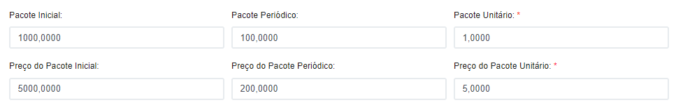<figcaption>
Clique na imagem para ampliar.
</figcaption></figure>

Quando o serviço ArqNFe for adicionado, serão exibidos os campos “**Pacote de referência**” e “V**alor de referência**”.

&#x20;Os campos permitem valores numéricos de até quatro casas decimais e o “**Valor de referência**” será reajustado normalmente conforme data do contrato.

&#x20;Estes campos existem para guardar a quantidade e valor para utilização excedente do serviço.

<figure><figcaption>
Clique na imagem para ampliar.
</figcaption></figure>

&#x20;
