# 🔹 Aba Serviço

## Aba Serviço – Tela principal

<figure><figcaption>
Clique na imagem para ampliar.
</figcaption></figure>

**Ícone Adicionar:** Utilizado para adicionar um novo serviço ao contrato.  

**Ícone Editar:** Utilizado para editar os serviços inclusos no contrato selecionado.  

**Ícone Visualizar:** Utilizado para visualizar detalhes dos serviços inclusos no contrato selecionado.  

**Ícone Excluir:** Utilizado para excluir serviços do contrato selecionado.

<figure><figcaption>
Clique na imagem para ampliar.
</figcaption></figure>

**Coluna Serviço:** Exibe o nome do serviço.

**Coluna Nome para Espelho:** Exibe o nome do campo que será exibido no relatório de faturamento.

**Coluna Status:** Exibe se o serviço está bloqueado, desbloqueado ou em versão POC (_Proof of Concept_ - Prova de Conceito) no contrato.

**Coluna Classificação:** Informa se o item cadastrado se trata de um “Serviço”, ou seja, é executado fora do sistema ArqGED, ou se é “Software”, serviço relacionado a um dos módulos do ArqGED.

**Coluna Controle:** Informa se a forma de controle do serviço é manual ou automática.

**Coluna Faturamento:** Exibe o tipo de faturamento do serviço, podendo ser periódico ou parcelado.

**Coluna Faturado por:** Informa a unidade responsável pelo faturamento do serviço.

**Coluna Início Vigência:** Exibe a data de início de vigência do serviço.

**Coluna Fim Vigência:** Informa a data de fim da vigência do serviço, se houver.

***

## Adicionando um serviço

1\. Para adicionar um serviço ao contrato, clique no ícone “Adicionar”.

<figure>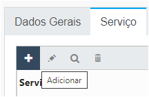<figcaption></figcaption></figure>

2\. Informe o Serviço que será adicionado. No campo “Serviço” serão listados apenas os serviços disponíveis para o tipo de contrato selecionado anteriormente no campo “Tipo de Contrato” na [aba Dados Gerais.](../aba-dados-gerais.md)

3\. Ao escolher o Tipo de Serviço serão exibidos novos campos para preenchimento, que vão variar de acordo com a opção escolhida.

<figure>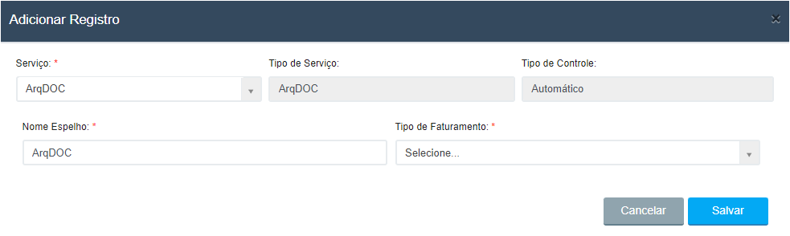<figcaption>
Clique na imagem para ampliar.
</figcaption></figure>

**Serviço:** Selecione o serviço que deseja incluir.

<figure>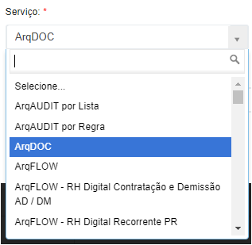<figcaption>
Clique na imagem para ampliar.
</figcaption></figure>

**Tipo de Serviço:** Esse campo será preenchido automaticamente com o tipo de serviço que vai servir como referência para contagem de itens no contrato. Ao cadastrar um contrato, o sistema fará a contagem de quantos tipos de serviço estão inclusos. Se o serviço não tiver um tipo específico, será mostrada a opção “N.A.” (Não se aplica).


<mark style="color:blue;">**EXEMPLO:**</mark> <mark style="color:blue;">Os serviços “ArqFlow – RH Digital” e “ArqFlow – RH Recorrente” possuem o mesmo tipo de serviço: “ArqFlow”. Em um contrato que possuir os dois serviços, o sistema fará a cobrança de duas unidades do item “ArqFlow”.</mark>


**Tipo de Controle:** Esse campo será preenchido automaticamente de acordo com a opção escolhida no campo Tipo de Serviço, podendo ser “Manual” ou “Automático”. Serão automáticos os tipos de serviço em que o usuário deve fazer uma solicitação de execução por meio do menu “Solicitação”.


<mark style="color:blue;">**EXEMPLO:**</mark> <mark style="color:blue;">O tipo de serviço “Transporte” é de controle manual, porque não é possível que o sistema saiba a quantidade de itens que foram transportados, devendo o usuário informar manualmente. Já o tipo de serviço “Solicitação de Container” é de controle automático, porque o usuário precisa acessar o menu “Solicitações” e registrar a quantidade de contêineres que será adquirida.</mark>


<figure>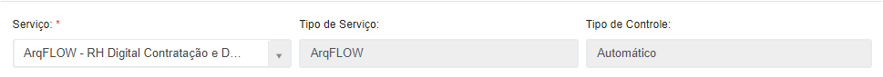<figcaption>
Clique na imagem para ampliar.
</figcaption></figure>

**Classificação:** O campo Classificação será preenchido automaticamente de acordo com o tipo de serviço escolhido, podendo ser “Serviço”, quando relacionada à prestação de serviços fora do ArqGED ou “Software”, quando o serviço tiver relação e for executado dentro de um dos módulos do sistema ArqGED.

**Nome Espelho:** Informe um nome para o campo que será exibido no relatório de faturamento.

**Tipo de Faturamento:** Dependendo do tipo de serviço escolhido será preenchido automaticamente ou apresentará as opções “Parcelado” e “Periódico” para escolha.

<figure>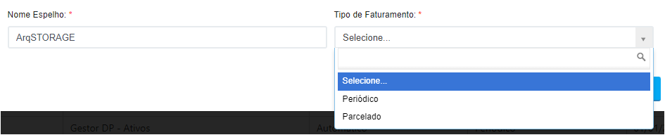<figcaption>
Clique na imagem para ampliar.
</figcaption></figure>



O faturamento periódico é aquele que é cobrado de forma recorrente, podendo ser mensalmente, anualmente etc. Neste caso é preciso preencher os campos relacionados ao pacote inicial, periódico e unitário, dependendo do serviço, além das datas de início e fim da vigência do serviço, se houver.

<figure>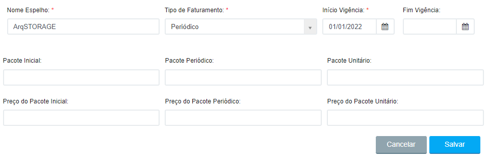<figcaption>
Clique na imagem para ampliar.
</figcaption></figure>



O faturamento parcelado é cobrado uma única vez, podendo ser parcelado ou não. Caso essa opção seja escolhida serão apresentados os campos “Valor Total”, que deve ser preenchido com o valor total que será cobrado, e “Total de Parcelas”. Será preciso também preencher os campos “Data do faturamento da parcela” e “Valor da parcela” de cada parcela em que será dividido o valor total para o cliente.

<figure>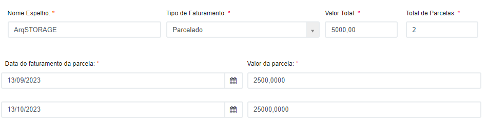<figcaption>
Clique na imagem para ampliar.
</figcaption></figure>



**Início Vigência:** Quando solicitado o preenchimento desse campo, informe a mesma data de início da vigência do contrato cadastrada na aba Dados Gerais ou uma data posterior ao início do contrato para indicar que o serviço foi adquirido depois.

**Fim Vigência:** Se houver uma data para o fim da vigência do contrato, informe neste campo a mesma data ou uma data menor. Se o serviço for vigente por tempo indeterminado, deixe este campo em branco.

<figure>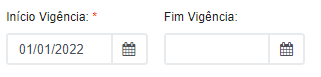<figcaption></figcaption></figure>

**Faturado por:** Quando solicitado o preenchimento desse campo, selecione se o serviço será faturado pela Arquivar Master ou pela unidade responsável pelo contrato.

<figure>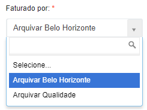<figcaption></figcaption></figure>

**% Desconto:** O percentual de desconto a que se refere este campo está relacionado ao desconto que a Arquivar Master poderá conceder ao franqueado no momento da cobrança do repasse. O desconto informado aqui não tem impacto no valor que a unidade cobrará do cliente.

**Limite de Faturamento:** Se houver algum limite do que será cobrado do cliente acordado entre a unidade e a empresa cliente, informe neste campo o valor.

**Bloquear serviço ao exceder Limite Faturamento:** Se marcada esta opção, o contrato será bloqueado após atingir o limite estipulado no campo “Limite de Faturamento”.

<figure>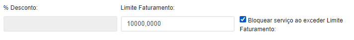<figcaption></figcaption></figure>

**Status:** Selecione uma das opções:

<figure>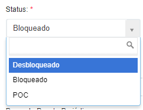<figcaption></figcaption></figure>

* _Desbloqueado:_ Utilize esse status caso o cliente vá utilizar o serviço ou já esteja utilizando.
* _Bloqueado:_ Utilize esse status caso o serviço esteja previsto no contrato do cliente, mas ele ainda não esteja utilizando ou não tenha previsão de utilização. Neste caso o serviço não será cobrado do cliente.
* _POC:_ Utilize esse status caso o cliente vá utilizar o serviço por determinado período sem cobrança, com o objetivo de testar a ferramenta. Nesse caso preencha também os campos “Início POC” e “Fim POC”, com as datas de início e fim do período de demonstração. Também será necessário informar no campo “Notificar” o e-mail do colaborador ou equipe da unidade que será avisado sobre o fim do período de demonstração do cliente.

<figure>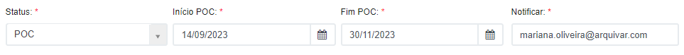<figcaption>
Clique na imagem para ampliar.
</figcaption></figure>

**Unidade de Medida para Limite Gratuito:** Informe se deve ser considerado para cálculo de requisições gratuitas (via API) o quantitativo realizado no "Dia" ou no "Mês".

**Quantidade para o Limite Gratuito:** Neste campo deve ser informada a quantidade de requisições que podem ser realizadas (via API) no dia ou no mês de forma gratuita.

<figure><figcaption>
Clique na imagem para ampliar.
</figcaption></figure>

O faturamento para a quantidade do serviço ArqAPI, segue o mesmo padrão dos demais softwares que usam a combinação de campos:

* Pacote Periódico
* Preço Pacote Periódico
* Pacote Unitário
* Preço Pacote Unitário

**Pacote Inicial:** O valor informado neste campo será consumido uma única vez. Depois de consumido passará a ser descontada a quantidade do pacote periódico ou do pacote unitário. Quando se tratar de software esse campo não estará disponível para preenchimento.

**Preço do Pacote Inicial:** Informe o valor que será cobrado do pacote inicial. Quando se tratar de software esse campo não estará disponível para preenchimento.

**Pacote Periódico:** O valor informado neste campo será cobrado periodicamente, independente do uso.

**Preço do Pacote Periódico:** Informe o valor que será cobrado do pacote periódico.

**Pacote Unitário:** O valor informado neste campo será cobrado quando utilizado, por unidade.

**Preço do Pacote Unitário:** Informe o valor que será cobrado por unidade do serviço.


<mark style="color:orange;">**O ideal é que em todo serviço que tenha cobrança de pacote seja incluída a cobrança de pacote unitário, mesmo que não haja cobrança de mensalidade periódica. Isso garante que a unidade franqueada não assuma prejuízos em caso do serviço exceder o que está previsto no contrato.**</mark>


<figure>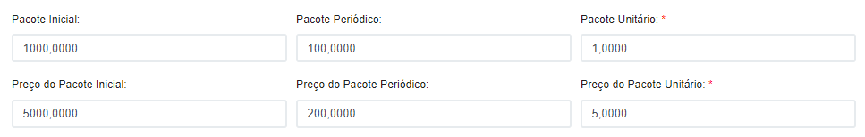<figcaption>
Clique na imagem para ampliar.
</figcaption></figure>

Quando o serviço ArqNFe for adicionado, serão exibidos os campos “**Pacote de referência**” e “V**alor de referência**”.

Os campos permitem valores numéricos de até quatro casas decimais e o “**Valor de referência**” será reajustado normalmente conforme data do contrato.

Estes campos existem para guardar a quantidade e valor para utilização excedente do serviço.

<figure><figcaption>
Clique na imagem para ampliar.
</figcaption></figure>

## Serviço Assinador ArqSign

### O que é o serviço Assinador ArqSign

A **ArqSign** é a **plataforma de gestão de processos com assinaturas digitais da Arquivar**, projetada para integrar, automatizar e monitorar o ciclo completo de trâmite de documentos. Muito além da assinatura eletrônica, a ArqSign permite controlar fluxos de envio, acompanhamento, recebimento, prazos, notificações e ações específicas relacionadas à formalização documental dentro de processos organizacionais.

Ao integrar a ArqSign ao **ArqGED**, por meio de um **componente específico no Workflow**, o cliente pode configurar etapas inteligentes e automatizadas com regras claras sobre quando um documento deve ser enviado para assinatura, como será acompanhado, quem deve assinar e o que acontece caso ocorram recusas, atrasos ou vencimentos.

Diferente de outros serviços oferecidos na plataforma, o Assinador ArqSign **possui uma forma de cadastro exclusiva**, que requer atenção especial no momento da inclusão ao contrato do cliente no ArqGED.

Ao selecionar o serviço **Assinador** **ArqSign**, além das configurações habituais vistas nessa página, o sistema exigirá **campos específicos e validações adicionais**, como:

* **ID da Conta ArqSign** (associada à plataforma)
* **Validação ativa da conta e do plano em vigor**
* **Cadastro dos subserviços** utilizados: **Envios**, **WhatsApp** e **SMS**

<figure><figcaption></figcaption></figure>

Esses dados garantem que a comunicação entre o ArqGED e a plataforma ArqSign ocorra de maneira segura, eficiente e compatível com o plano contratado.


<mark style="color:red;">Para que o serviço funcione corretamente, a conta ArqSign vinculada precisa estar:</mark>

* <mark style="color:red;">**Ativa**</mark> <mark style="color:red;">e com</mark> <mark style="color:red;">**plano vigente**</mark> <mark style="color:red;">diretamente na plataforma ArqSign;</mark>
* <mark style="color:red;">Em</mark> <mark style="color:red;">**conformidade com o plano registrado no ArqGED**</mark><mark style="color:red;">;</mark>
* <mark style="color:red;">Sem bloqueios ou divergências contratuais.</mark>

<mark style="color:red;">Caso sejam identificadas inconsistências (ex.: plano vencido, bloqueado ou divergente), o ArqGED exibirá alertas automáticos e poderá realizar o</mark> <mark style="color:red;">**ajuste automático da conta**</mark><mark style="color:red;">, conforme as regras previstas para cada cenário.</mark>


### Limites e Métricas do Serviço/Sistema

<table><thead><tr><th width="221">Ação</th><th width="369">Descrição</th><th width="140">Métrica</th></tr></thead><tbody><tr><td>Cadastro de Documento</td><td>Tamanho máximo permitido para um arquivo individual no momento do cadastro.</td><td>500 MB</td></tr><tr><td>Download em Massa</td><td>Tamanho máximo permitido para o download em massa de arquivos.</td><td>500 MB</td></tr><tr><td>Assinatura ArqSign</td><td>Quantidade máxima de arquivos enviados em um único processo de assinatura na ArqSign.</td><td>25 Arquivos</td></tr><tr><td>Assinatura ArqSign</td><td>Tamanho máximo da soma dos arquivos em um único processo de assinatura na ArqSign.</td><td>100 MB</td></tr><tr><td>Assinatura ArqGED</td><td>Quantidade máxima de arquivos enviados simultaneamente para a fila de assinatura da ArqGED.</td><td>300 Arquivos</td></tr><tr><td>Localização Avançada</td><td>Exportação de documentos para arquivos CSV sem geração de download em massa.</td><td>20000 registros</td></tr><tr><td>Localização Avançada</td><td>Exportação de documentos para arquivos CSV com geração de download em massa.</td><td>de 20000 registros até 1.000.000 registros*</td></tr></tbody></table>


\*Acima de 1.000.000 de registros, é necessário abrir chamado para o suporte técnico.


### Inclusão do serviço

Ao selecionar o serviço **Assinador ArqSign**, o sistema exibe os seguintes campos para informar os dados da conta ArqSign:

* **ID Conta ArqSign**
* **Ícone “Validar Conta”**
* **Nome da Conta ArqSign**
* **Ícone “Informações da Conta”**
* **GRID para cadastro dos subserviços** (Envios, WhatsApp e SMS)

#### ID Conta ArqSign

O usuário deve informar o ID da conta ArqSign no campo “ID da Conta ArqSign” e clicar no ícone para validar a conta.

<figure><figcaption></figcaption></figure>

**Regra:**\
Uma conta ArqSign pode estar vinculada somente a um contrato-serviço no ArqGED.

**Validações:**

* **ID da conta inválido:**\
  \&#xNAN;_Erro! ID de conta ArqSign não existe._
* **ID da conta usado em outro contrato:**\
  \&#xNAN;_Erro! Não é permitido associar um ID de conta ArqSign já associado a outro serviço vigente._

Após validação bem-sucedida, o sistema retorna os dados da conta e, ao salvar, vincula essa conta ao serviço “Assinador ArqSign" no contrato do cliente.

#### Nome da Conta ArqSign

Esse campo é preenchido automaticamente quando o ID da conta é validado com sucesso. O nome é exibido conforme os dados retornados e a situação da conta:

* **Plano Divergente**
  * Status = Ativo
  * PeríodoFinal > data atual
  * IdPlano ≠ IdPlanoArqSign
* **Conta Bloqueada ou Plano Vencido**
  * Status ≠ Ativo
  * PeríodoFinal ≤ data atual
* **Conta em conformidade**
  * Status = Ativo
  * PeríodoFinal > data atual
  * IdPlano = IdPlanoArqSign

#### Informações da Conta

<figure><figcaption></figcaption></figure>

Ao clicar no ícone “Informações da Conta” <mark style="color:green;">(ícone verde com letra "i" ao centro)</mark>, o sistema exibe uma modal com os dados retornados da validação. Dependendo da situação, a mensagem varia:

**a) Plano Divergente**

* _IMPORTANTE: Esta conta possui um plano diferente do faturado pelo ArqGED. Fique atento à sua vigência e aos créditos existentes no ArqSign para o fluxograma não parar de funcionar._
* Campo: “**Ajustar a conta no ArqSign ao salvar o serviço no contrato**”\
  \&#xNAN;_(opcional)_

<figure><figcaption></figcaption></figure>

**b) Conta Bloqueada ou Plano Vencido**

* _IMPORTANTE: Esta conta não está mais ativa ou a data fim da assinatura está vencida. A conta será ajustada automaticamente ao incluir o serviço vinculada a mesma ao contrato._
* **Neste caso, o ajuste é obrigatório e automático** (campo de ajuste não é exibido).

<figure><figcaption></figcaption></figure>

**c) Conta em conformidade**

* _IMPORTANTE: Conta em conformidade para uso no ArqGED._
* **Nenhum campo adicional será exibido**.

<figure><figcaption></figcaption></figure>

#### GRID para Cadastro dos Subserviços

No GRID são listados os itens ArqSign adicionados ao serviço e que estarão disponíveis no Workflow:

* **Envios**
* **SMS**
* **WhatsApp**

<figure><figcaption></figcaption></figure>

* **Coluna Nome do Espelho** _(Obrigatório)_**:** Exibe o nome do campo que será exibido no relatório de faturamento.

<figure><figcaption></figcaption></figure>

* **Coluna Nome do Item** _(Obrigatório)_**:** Exibe o nome do item ArqSign.

<figure><figcaption></figcaption></figure>

* **Coluna Pacote Periódico - Preço** _(opcional)_**:** Valor configurado para quando o item é cobrado de forma recorrente (mesmo padrão dos outros serviços).

<figure><figcaption></figcaption></figure>

* **Coluna Pacote Unitário - Preço** _(obrigatório)_**:** Valor configurado para quando o item é cobrado de forma unitária (mesmo padrão dos outros serviços).

<figure><figcaption></figcaption></figure>

**Visão geral da janela**

<figure><figcaption></figcaption></figure>

**Condições por tipo de conta:**

* **Plano Divergente:**
  * Se o campo “Ajustar a conta no ArqSign...” **não estiver marcado**, só é possível incluir os itens contidos no plano atual da conta.
  * Se o campo estiver **marcado**, é possível incluir todos os itens.
* **Conta Bloqueada ou com Plano Vencido:**
  * Permite incluir todos os itens, pois a conta será ajustada automaticamente ao salvar.
* **Conta em Conformidade:**
  * Permite incluir todos os itens.

#### Ajuste da Conta ArqSign

O ajuste da conta no ArqSign ocorre **automaticamente** ao salvar (inclusão ou edição) o serviço no contrato com status **POC** ou **Desbloqueado**, nas seguintes situações:

* Conta com **Plano Divergente** e o usuário **marcou** a opção “Ajustar a conta...” na modal de informações;
* Conta **Bloqueada** ou com **Plano Vencido**.
