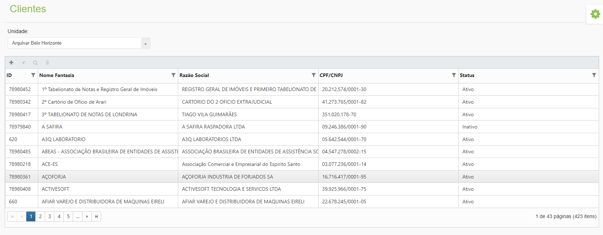

# 🟩 Dados Cadastrais

No menu Dados Cadastrais são exibidas todas as informações dos clientes da unidade selecionada no campo “Unidade”.&#x20;

<figure><figcaption>
Clique para ampliar a imagem.
</figcaption></figure>

**Unidade:** Para exibir as informações de um cliente, selecione a unidade à qual ele pertence se tiver acesso aos clientes de mais de uma unidade. &#x20;

**Coluna ID:** O número ID é o código do cliente apresentado nas etiquetas das caixas quando o cliente possui serviço de guarda de documentos contratado.&#x20;

**Colune Nome Fantasia:** Esta coluna exibe o nome fantasia do cliente. É este nome que será exibido ao realizar o cadastro de qualquer serviço no sistema.  &#x20;

**Coluna Razão Social:** Nesta coluna é exibida a razão social do cliente. A razão social é o nome comercial do cliente, ou seja, seu nome jurídico registrado.&#x20;

**Coluna CPF/CNPJ:** Esta coluna exibe o CPF ou CNPJ do cliente.&#x20;

**Coluna Status:** Informa se cliente está ativo, inativo ou bloqueado na plataforma. &#x20;

<figure><figcaption>
Clique para ampliar a imagem.
</figcaption></figure>

**Ícone Adicionar:** Utilizado para cadastrar um novo cliente.&#x20;

**Ícone Editar:** Utilizado para editar as informações do cliente selecionado.&#x20;

**Ícone Visualizar:** Utilizado para apresentar as informações do cliente. &#x20;

**Ícone Excluir:** Utilizado para excluir o cliente selecionado.&#x20;

<figure><figcaption></figcaption></figure>
