# 🟩 Dados Cadastrais



No menu Dados Cadastrais são exibidas todas as informações dos clientes da unidade selecionada no campo “Unidade”.

<figure>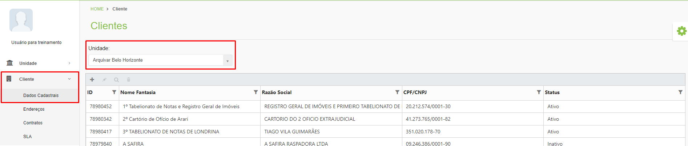<figcaption>
Clique para ampliar a imagem.
</figcaption></figure>

***

## Dados Cadastrais – Tela inicial

**Campo Unidade:** Para exibir as informações de um cliente, selecione a unidade à qual ele pertence se tiver acesso aos clientes de mais de uma unidade.

**Coluna ID:** O número ID é o código do cliente apresentado nas etiquetas das caixas quando o cliente possui serviço de guarda de documentos contratado.

**Coluna Nome Fantasia:** Esta coluna exibe o nome fantasia do cliente. É este nome que será exibido ao realizar o cadastro de qualquer serviço no sistema.

**Coluna Razão Social:** Nesta coluna é exibida a razão social do cliente. A razão social é o nome comercial do cliente, ou seja, seu nome jurídico registrado.

**Coluna CPF/CNPJ:** Esta coluna exibe o CPF ou CNPJ do cliente.

**Coluna Status:** Informa se cliente está ativo, inativo ou bloqueado na plataforma.


<mark style="color:orange;">**Ativo: Indica que o cliente possui contrato vigente;**</mark>

<mark style="color:orange;">**Inativo: Indica que o contrato do cliente foi encerrado;**</mark>

<mark style="color:orange;">**Bloqueado: Indica que o cliente possui alguma pendência impeditiva de uso do sistema, podendo se tratar de uma pendência financeira ou afins.**</mark>


<figure>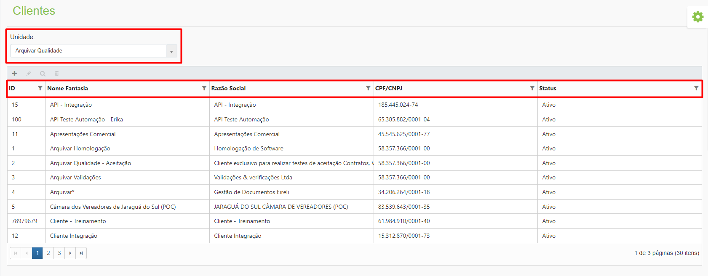<figcaption>
Clique para ampliar a imagem.
</figcaption></figure>

**Ícone Adicionar:** Utilizado para cadastrar um novo cliente.

**Ícone Editar:** Utilizado para editar as informações do cliente selecionado.

**Ícone Visualizar:** Utilizado para apresentar as informações do cliente.

**Ícone Excluir:** Utilizado para excluir o cliente selecionado.

<figure>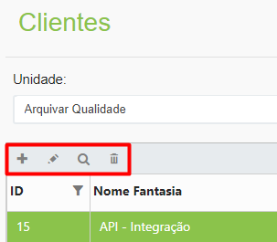<figcaption>
Clique para ampliar a imagem.
</figcaption></figure>

***

## Cadastro de Cliente

Para cadastrar um cliente, selecione a unidade e clique no ícone “Adicionar”.

<figure>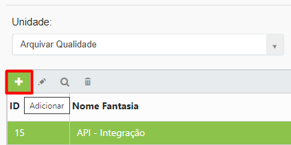<figcaption>
Clique para ampliar a imagem.
</figcaption></figure>

***

### Aba Dados Cadastrais

Na aba Dados Cadastrais devem ser cadastradas todas as informações do cliente.

**ID:** No campo ID atribua um Id para o cliente. Esse Id é o código do cliente apresentado nas etiquetas das caixas quando o cliente possui serviço de guarda de documentos contratado.

**Idioma:** Neste campo o usuário deve definir o idioma do cliente, que pode ser Português, Inglês ou Espanhol.


<mark style="color:orange;">**A definição do idioma realizada aqui irá interferir no idioma das telas mostradas aos signatários em ações externas de assinatura de documentos do Workflow.**</mark>


**Status:** Informe se cliente está ativo, inativo ou bloqueado na plataforma.

* _Ativo:_ Utilizado quando o cliente está com a situação regular para uso da plataforma.
* _Bloqueado:_ Utilizado quando o cliente está inadimplente e seu acesso precisa ser interrompido temporariamente até que ele regularize sua situação.
* _Inativo:_ Utilizado quando o cliente não tem mais acesso ao sistema.

**Nome Fantasia:** Informe o nome fantasia do cliente. Este nome será exibido ao realizar o cadastro de qualquer serviço no sistema.

**Razão Social:** Informe a razão social do cliente. A razão social é o nome comercial do cliente, ou seja, seu nome jurídico registrado.

<figure>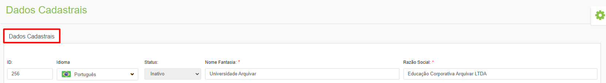<figcaption>
Clique para ampliar a imagem.
</figcaption></figure>

**CPF/CNPJ:** Informe o CPF do responsável legal pela empresa ou o CNPJ do cliente.

**Inscrição estadual e Inscrição municipal:** Informe as inscrições estadual e municipal do cliente, se ele possuir.

<figure>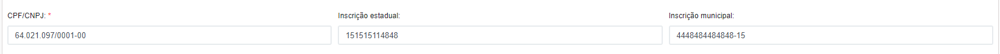<figcaption>
Clique para ampliar a imagem.
</figcaption></figure>

**IP e DNS para acesso à aplicação:** Por meio deste campo é possível limitar o acesso ao sistema à rede do cliente, determinando que o acesso seja realizado apenas pelos IPs cadastrados. Para isso, selecione entre IP ou DNS, informe o endereço desejado e clique no ícone “Adicionar”. Fazendo essa restrição, só será permitido que os usuários do cliente se autentiquem no sistema se estiverem utilizando um dos IPs ou DNS informados neste campo.


<mark style="color:orange;">**Essa configuração só funcionará se o IP ou DNS do cliente for fixo. Se for dinâmico (variável a cada acesso) o sistema não conseguirá fazer o bloqueio do acesso do usuário.**</mark>


<figure>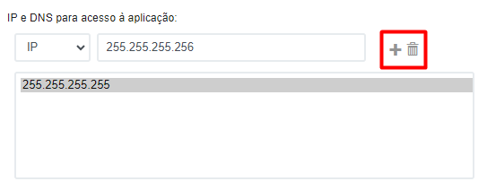<figcaption>
Clique para ampliar a imagem.
</figcaption></figure>

**Opções de layout padrão e Opções de cor padrão:** As definições de layout feitas nestes campos serão aplicadas a todos os usuários do cliente que utilizarem o sistema. Por padrão as opções “Cabeçalho fixo” e “Menu à esquerda fixo” estarão selecionadas, e a cor verde será o padrão do tema, mas as configurações podem ser alteradas de acordo com a necessidade do cliente.

<figure>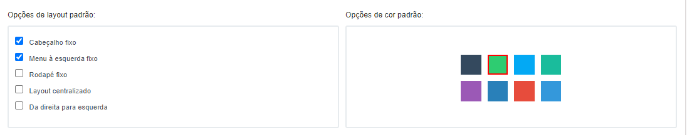<figcaption>
Clique para ampliar a imagem.
</figcaption></figure>

**Geral:** Configurações gerais do sistema. Neste campo pode ser definido se os usuários do cliente poderão alterar o layout escolhido no campo “Opções de layout padrão”. Se marcada essa opção será exibido o ícone de engrenagem no canto direito da tela, para que os usuários do cliente realizem as alterações de layout que desejarem.

<figure>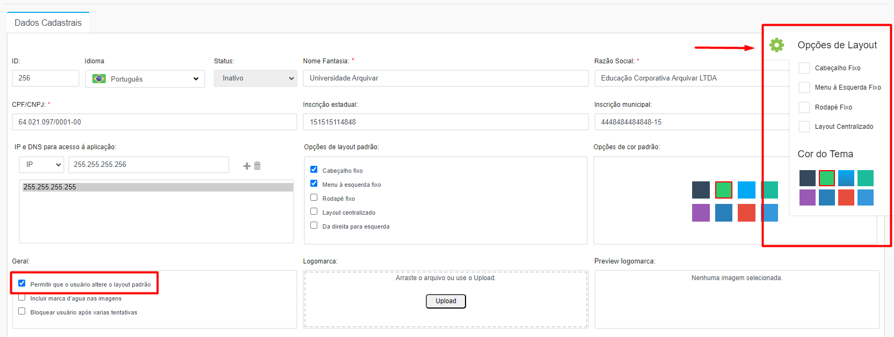<figcaption>
Clique para ampliar a imagem.
</figcaption></figure>

A opção “Incluir marca d’água nas imagens” inclui uma marca d’água no rodapé de todos os documentos que forem baixados por usuários, exibindo a data, hora e nome do usuário que realizou o download daquele documento.


<mark style="color:orange;">**Para que essa opção funcione corretamente, a permissão “Download sem Marca D’água” deve estar desabilitada para os usuários do cliente, na tela**</mark> [<mark style="color:blue;">**Administração > Perfis de Usuários > Permissões.**</mark>](../administracao/perfis-de-usuarios.md)



<mark style="color:red;">**Não é recomendado que clientes que utilizem Certificado Digital para assinatura de documentos no sistema utilizem essa opção, porque esse tipo de documento não pode ser manipulado. Ao incluir a marca d’água a integridade do documento e as assinaturas são corrompidas, já que essa inclusão é considerada uma alteração do documento original.**</mark>


Também é possível bloquear um usuário quando ele mais de cinco tentativas de acesso ao sistema sem sucesso, informando usuário ou senha incorretos. Neste caso o usuário só poderá tentar acessar novamente após alguns minutos.

<figure>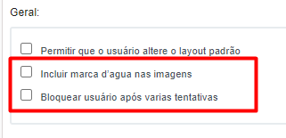<figcaption>
Clique para ampliar a imagem.
</figcaption></figure>

**Logomarca:** Neste campo deve ser feito o upload das logomarcas utilizadas pelo cliente. Pode ser feito o upload de mais de uma logo. Ao realizar o upload de uma logomarca, no campo “Arquivos que serão associados ao registro” deve ser informado um nome para a logo (de preferência, utilize nomes que descrevam como será a utilização).

<figure>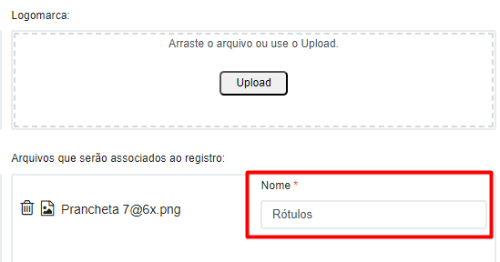<figcaption>
Clique para ampliar a imagem.
</figcaption></figure>

Ao salvar, será possível informar se aquela logo é a padrão (exibida nas telas do sistema), e se será utilizada nos rótulos e etiquetas gerados no sistema. Pode ser escolhida mais de uma logo para rótulos e etiquetas.


<mark style="color:orange;">**O ideal é que a logomarca padrão seja toda branca, para uma melhor visualização nas telas do sistema. As logos utilizadas em rótulos e etiquetas devem ser pretas ou coloridas, para melhor visualização nos documentos gerados e impressos.**</mark>


<figure>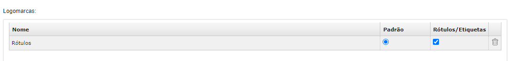<figcaption>
Clique para ampliar a imagem.
</figcaption></figure>

Todas as logos acrescentadas são apresentadas no campo “Logomarcas”. Clicando sobre cada uma é possível visualizá-la no campo “Preview logomarca”.

<figure>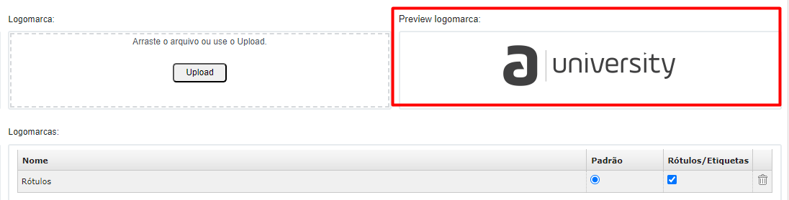<figcaption>
Clique para ampliar a imagem.
</figcaption></figure>

**Observação:** Neste campo podem ser adicionadas informações específicas sobre o cliente.

***

### Aba Prestadoras de Serviço

Nesta aba são cadastradas as unidades que prestam serviço para o cliente. Para adicionar a Unidade Arquivar responsável pelo cliente, selecione-a na lista e clique no ícone “Adicionar”. É possível associar mais de uma Unidade Arquivar ao cliente, se necessário.


<mark style="color:orange;">**É necessário realizar a associação da Unidade ao cliente nesta tela para que seja possível cadastrar o contrato do cliente na tela**</mark> [<mark style="color:blue;">**Cliente > Contratos**</mark>](contratos/)<mark style="color:orange;">**.**</mark>


Para excluir uma associação, selecione a Unidade e clique no ícone “Excluir”.

<figure>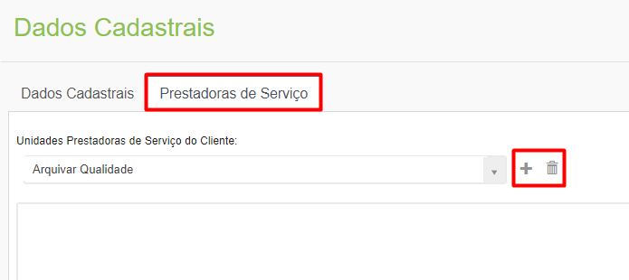<figcaption>
Clique para ampliar a imagem.
</figcaption></figure>
