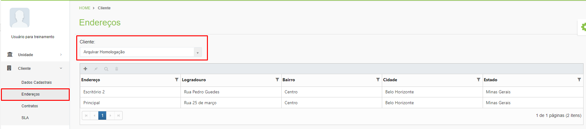
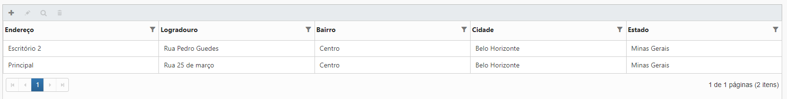
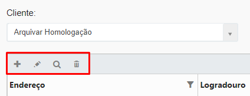

# 🟩 Endereços

A tela Endereços exibe todos os endereços registrados do cliente selecionado no campo “Cliente”.  Se o cliente possui serviço de guarda de documentos contratado, é extremante importante cadastrar os endereços que possam receber e alocar documentos.&#x20;

Ao solicitar a consulta a documentos alocados em uma das unidades Arquivar, o cliente deverá selecionar o endereço no qual receberá os arquivos que serão consultados e esse endereço deve ter sido anteriormente cadastrado nesta tela. &#x20;

<figure><figcaption>
Clique na imagem para ampliar.
</figcaption></figure>

As colunas da tela principal da aba Endereços apresentam o logradouro, bairro, cidade e estado do cliente. A coluna “Endereço” informa se aquele endereço é o principal do cliente ou se trata-se do endereço de uma filial, por exemplo.&#x20;

<figure><figcaption>
Clique na imagem para ampliar.
</figcaption></figure>

**Ícone Adicionar:** Utilizado para cadastrar um novo endereço para um cliente.&#x20;

**Ícone Editar:** Utilizado para editar as informações do endereço selecionado.&#x20;

**Ícone Visualizar:** Utilizado para apresentar as informações de endereço do cliente. &#x20;

**Ícone Excluir:** Utilizado para excluir o endereço selecionado.&#x20;

<figure><figcaption></figcaption></figure>
