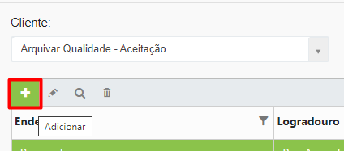
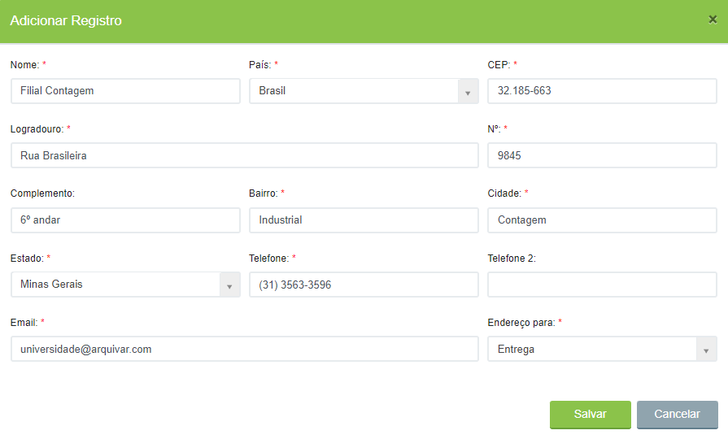

# 🟩 Endereços

A tela Endereços exibe todos os endereços cadastrados do cliente. &#x20;

Este endereço é utilizado para identificação de Coleta e/ou Entrega de consulta de Documentos e/ou Caixas.&#x20;

Quando o cliente possui Guarda Interna, durante a solicitação de consulta é possível indicar se a consulta é com Coleta ou Coleta/Entrega ou _Inloco_. Neste caso, um cliente que possui sua guarda em endereço diferente do comercial pode informar qual o endereço será utilizado, contudo, um cliente pode possuir quantos endereços forem necessários.&#x20;

Exemplos: Endereço Comercial, Endereço do Galpão, Filial A, Filial B e etc.&#x20;

Ao solicitar a consulta a documentos alocados em uma das unidades Arquivar, o cliente deverá selecionar o endereço previamente cadastrado nesta tela. &#x20;

<figure><figcaption>
Clique na imagem para ampliar.
</figcaption></figure>

***

## Endereços - Tela inicial

As colunas da tela principal da aba Endereços apresentam o logradouro, bairro, cidade e estado do cliente. A coluna “Endereço” informa se aquele endereço é o principal do cliente ou se trata-se do endereço de uma filial, por exemplo.&#x20;

<figure><figcaption>
Clique na imagem para ampliar.
</figcaption></figure>

**Ícone Adicionar:** Utilizado para cadastrar um novo endereço para um cliente.&#x20;

**Ícone Editar:** Utilizado para editar as informações do endereço selecionado.&#x20;

**Ícone Visualizar:** Utilizado para apresentar as informações de endereço do cliente. &#x20;

**Ícone Excluir:** Utilizado para excluir o endereço selecionado.&#x20;

<figure><figcaption>
Clique na imagem para ampliar.
</figcaption></figure>

***

## Cadastro de Endereços&#x20;

Para cadastrar um novo endereço para o cliente, selecione-o e clique no ícone “Adicionar”.&#x20;

<figure><figcaption>
Clique na imagem para ampliar.
</figcaption></figure>

Na tela “Adicionar registro”, informe:&#x20;

**Nome:** Neste campo nomeie o endereço. O ideal é indicar no nome se aquele é o endereço principal ou se trata-se de uma filial do cliente, por exemplo.&#x20;

**Endereço completo:** Informe o país, CEP, logradouro, nº, complemento (se houver), bairro, cidade e estado.&#x20;

**Telefone:** Informe o principal telefone de contato com o cliente.&#x20;

**E-mail:** Informe os principais e-mails do cliente. Se o cliente possuir serviço de guarda interna contratado, as notificações de movimentações dos documentos do seu CEDOC serão enviadas para os e-mails cadastrados neste campo.  &#x20;

**Endereço para:** Selecione se o endereço que está sendo cadastrado será utilizado para coleta ou entrega (ou ambos) de documentos que sejam solicitados para consulta. Essa informação é muito importante no caso de clientes que possuem serviço de guarda contratado. Caso o endereço não seja utilizado para nenhuma ação de guarda, selecione a opção “Outros”.&#x20;

<figure><figcaption>
Clique na imagem para ampliar.
</figcaption></figure>
