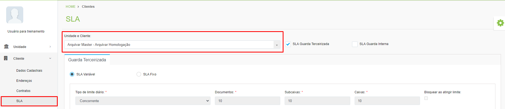

# 🟩 SLA

A sigla SLA significa Service Level Agreement, ou Acordo de Nível de Serviço. No ArqGED o SLA acordado entre o cliente e a unidade é que define o tempo que uma solicitação de serviço de guarda levará para ser atendida pela unidade e o limite de consultas que o cliente pode solicitar de acordo com o seu contrato. &#x20;

Para visualizar as informações de SLA de um cliente, selecione-o no campo “Unidade e Cliente”. &#x20;

<figure><figcaption>
Clique na imagem para ampliar.
</figcaption></figure>
