# 🟩 SLA

A sigla SLA significa Service Level Agreement, ou Acordo de Nível de Serviço. No ArqGED o SLA acordado entre o cliente e a unidade é que define o tempo que uma solicitação de serviço de guarda levará para ser atendida pela unidade e o limite de consultas que o cliente pode solicitar de acordo com o seu contrato. &#x20;

Para visualizar as informações de SLA de um cliente, selecione-o no campo “Unidade e Cliente”. Marque se deseja visualizar o SLA de guarda terceirizada, de guarda interna ou ambos.


<mark style="color:blue;">O</mark> <mark style="color:blue;"></mark><mark style="color:blue;">**SLA de guarda terceirizada**</mark> <mark style="color:blue;"></mark><mark style="color:blue;">refere-se ao prazo que a Unidade Arquivar possui para atender a uma solicitação de consulta feita pelo cliente.</mark>&#x20;

<mark style="color:blue;">O</mark> <mark style="color:blue;"></mark><mark style="color:blue;">**SLA de guarda interna**</mark> <mark style="color:blue;"></mark><mark style="color:blue;">é utilizado por clientes que possuem um CEDOC próprio e precisam determinar o prazo de atendimento a solicitações de consultas feitas por outros setores ao próprio CEDOC.</mark> &#x20;


<figure>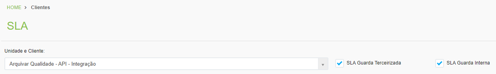<figcaption>
Clique na imagem para ampliar.
</figcaption></figure>

Dependendo da opção escolhida serão habilitadas as abas “Guarda Terceirizada” e “Guarda Interna”. Em ambos os casos será preciso escolher entre “SLA Variável” ou “SLA Fixo”. &#x20;


<mark style="color:orange;">**A única diferença entre os SLAs de guarda terceirizada e guarda interna é que no caso da guarda interna serão considerados, além dos prazos e limites cadastrados nesta tela, os limites e urgências de atendimento para cada tipo de serviço contratado pelo cliente na tela**</mark> [**Cliente > Contratos**](contratos/)<mark style="color:orange;">.</mark> &#x20;


<figure>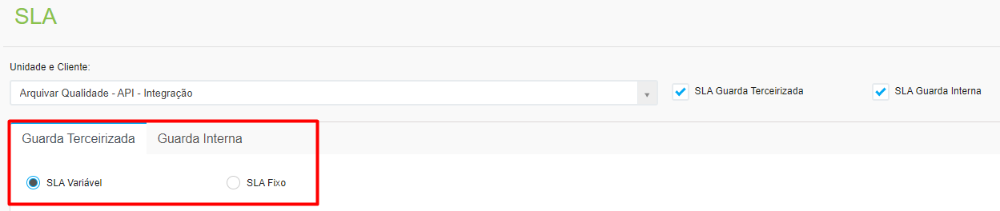<figcaption>
Clique na imagem para ampliar.
</figcaption></figure>

***

## SLA Fixo&#x20;

O SLA Fixo apresenta um prazo de atendimento fixo, independentemente da quantidade e complexidade das solicitações de consulta feitas pelo cliente. Neste caso, deve ser definida as solicitações de consulta são atendidas periodicamente de acordo com as definições feitas nesta tela.  &#x20;

Se escolhida essa opção, será preciso definir se o atendimento às solicitações será semanal ou mensal. &#x20;

Se for semanal, informe a cada quantas semanas e o(s) dia(s) da semana em que ocorrerá(ão) os atendimentos.&#x20;


<mark style="color:blue;">**EXEMPLO:**</mark> <mark style="color:blue;"></mark><mark style="color:blue;">Se escolhido um SLA Fixo semanal, a cada uma semana toda terça-feira, todas as solicitações feitas na quarta-feira só serão atendidas na terça-feira da semana seguinte. Se a solicitação for feita em uma segunda-feira, ela será atendida no dia seguinte, que é o dia de atendimento.</mark>  &#x20;


<figure>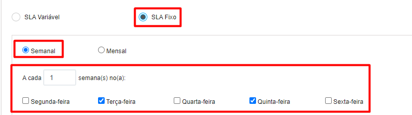<figcaption>
Clique na imagem para ampliar.
</figcaption></figure>

Será preciso também informar a faixa de horário de preferencial para atendimento das solicitações de consulta.&#x20;

<figure>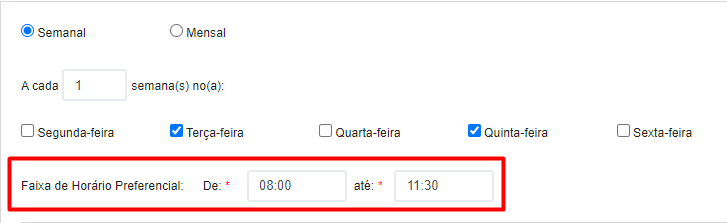<figcaption>
Clique na imagem para ampliar.
</figcaption></figure>

Se for mensal, informe o dia do mês dos atendimentos ou se haverá uma data específica para os atendimentos.&#x20;


<mark style="color:blue;">**EXEMPLO:**</mark> <mark style="color:blue;"></mark><mark style="color:blue;">Pode ser definido que os atendimentos serão feitos todo dia 05 de cada mês ou apenas na primeira segunda-feira de cada mês.</mark>&#x20;


<figure>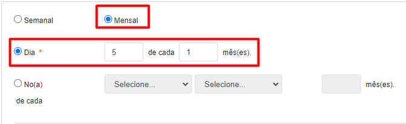<figcaption>
Clique na imagem para ampliar.
</figcaption></figure>

<figure>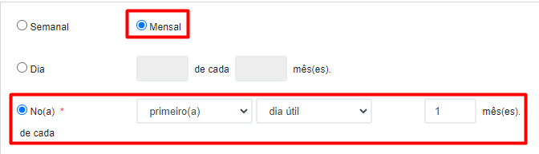<figcaption>
Clique na imagem para ampliar.
</figcaption></figure>

É possível determinar um limite de solicitações de consulta nos dias de atendimento. Para isso, informe nos campos “Documentos”, “Subcaixas” e “Caixas” a quantidade de cada um desses itens que poderá ser solicitada para consulta pelo cliente.&#x20;

No campo “Tipo de Limite” é preciso definir se esse limite de solicitações é concorrente ou não, ou seja, se o cálculo do limite irá considerar todas as solicitações separadamente ou irá contabilizar todas as solicitações feitas.&#x20;


<mark style="color:blue;">**EXEMPLO:**</mark> <mark style="color:blue;"></mark><mark style="color:blue;">Foi estipulado um limite de solicitações de dez documentos, dez subcaixas e dez caixas.  Se o limite</mark> <mark style="color:blue;"></mark><mark style="color:blue;">**for**</mark> <mark style="color:blue;">**concorrente**</mark> <mark style="color:blue;"></mark><mark style="color:blue;">e for feita a solicitação de consulta a oito documentos, só poderão ser atendidas mais duas solicitações de caixas ou subcaixas.</mark>&#x20;

<mark style="color:blue;">Se o limite</mark> <mark style="color:blue;"></mark><mark style="color:blue;">**não for concorrente**</mark><mark style="color:blue;">, no mesmo dia de atendimento podem ser feitas solicitações de consulta, além dos oito documentos, a mais dez caixas e dez subcaixas.</mark>


Ao marcar a opção “Bloquear ao atingir limite” os usuários do cliente não conseguirão realizar novos pedidos de consulta após o limite determinado ser atingido. Se desmarcada essa opção, as solicitações poderão continuar sendo feitas, mas só serão atendidas no próximo dia de atendimento, gerando uma espécie de fila.&#x20;

<figure>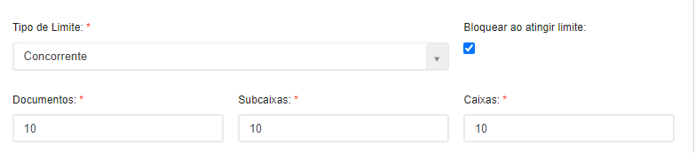<figcaption>
Clique na imagem para ampliar.
</figcaption></figure>

No lado direito da tela são exibidos os serviços contratados pelo cliente, com seus respectivos limites diários de solicitação. Os serviços e limites mostrados aqui são aqueles previamente cadastrados na tela Cliente > Contratos e interferem no limite que pode ser estabelecido nesta tela. &#x20;


<mark style="color:blue;">**EXEMPLO:**</mark> <mark style="color:blue;"></mark><mark style="color:blue;">Na tela de SLA foi estipulado para um cliente um limite de solicitações de dez documentos por dia, mas em seu contrato, foi determinado anteriormente um limite de solicitações de cinco documentos urgentes e dez documentos simples por dia.</mark> &#x20;

<mark style="color:blue;">Caso o cliente faça uma solicitação de cinco documentos urgentes em um dia, o limite considerado será o de SLA (dez documentos), ou seja, além dos documentos urgentes ele só poderá solicitar mais cinco documentos simples para atingir o limite.</mark>&#x20;



<mark style="color:orange;">**Se os campos “Limite Diário de Serviço” estiverem em branco é porque esse cadastro não foi feito e o limite previamente estabelecido nos campos “Documentos”, “Subcaixas” e “Caixas” prevalecerão.**</mark>  &#x20;


<figure>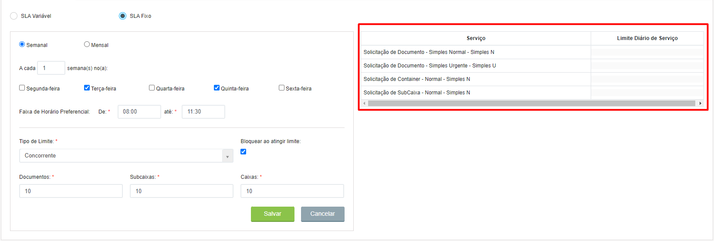<figcaption>
Clique na imagem para ampliar.
</figcaption></figure>

***

## SLA Variável&#x20;

O SLA Variável calcula o prazo de atendimento de forma dinâmica, de acordo com a solicitação do cliente, ou seja, o prazo vai variar de acordo com a quantidade e complexidade das consultas solicitadas.  Neste SLA o atendimento às solicitações é feito diariamente, dentro do horário estabelecido. &#x20;

Para calcular o limite diário de atendimento o sistema considera os números estabelecidos nos campos “Documentos”, “Subcaixas” e “Caixas” e o “Tipo de limite diário”, que pode ser Concorrente ou Não concorrente, ou seja, se o cálculo do limite irá considerar todas as solicitações separadamente ou irá contabilizar todas as solicitações feitas.&#x20;


<mark style="color:blue;">**EXEMPLO:**</mark> <mark style="color:blue;"></mark><mark style="color:blue;">Foi estipulado um limite de solicitações de dez documentos, dez subcaixas e dez caixas.  Se o limite</mark> <mark style="color:blue;"></mark><mark style="color:blue;">**for concorrente**</mark> <mark style="color:blue;"></mark><mark style="color:blue;">e for feita a solicitação de consulta a oito documentos, só poderão ser atendidas mais duas solicitações de caixas ou subcaixas.</mark>&#x20;

<mark style="color:blue;">Se o limite</mark> <mark style="color:blue;"></mark><mark style="color:blue;">**não for concorrente**</mark><mark style="color:blue;">, no mesmo dia de atendimento podem ser feitas solicitações de consulta, além dos oito documentos, a mais dez caixas e dez subcaixas.</mark> &#x20;


Ao marcar a opção “Bloquear ao atingir limite” os usuários do cliente não conseguirão realizar novos pedidos de consulta após o limite diário determinado ser atingido. Se desmarcada essa opção, as solicitações poderão continuar sendo feitas, mas só serão atendidas no dia seguinte.&#x20;

<figure><figcaption>
Clique na imagem para ampliar.
</figcaption></figure>

Além disso, no SLA Variável é preciso determinar o horário em que as solicitações poderão ser feitas, sendo o horário comercial ou 24 horas por dia. Se escolhida a opção “Comercial”, informe o início do expediente do setor de atendimento, o início e fim do intervalo para almoço e o fim do expediente. O recomendado é que a Unidade utilize o horário comercial para evitar que o sistema calcule o prazo de atendimento considerando horas em que não há expediente. &#x20;


<mark style="color:blue;">**EXEMPLO:**</mark> <mark style="color:blue;"></mark><mark style="color:blue;">Um cliente solicitou uma consulta de documentos simples às 19 horas e o SLA de atendimento para esse tipo de consulta é de duas horas. Se o sistema considerar o horário comercial (8h às 17h), a Unidade terá até 10h do dia seguinte para atender à solicitação. Já se o sistema considerar o horário de 24 horas, a Unidade teria que atender à solicitação até as 21h do mesmo dia, tornando inviável o atendimento.</mark>&#x20;


<figure>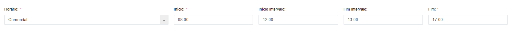<figcaption>
Clique na imagem para ampliar.
</figcaption></figure>

Depois de salvar, serão habilitados os campos “Limite Diário de Serviço” e “Prazo em Horas” para preenchimento. Esses campos devem ser preenchidos para cada um dos serviços descritos na coluna “Serviços” à esquerda. &#x20;


<mark style="color:orange;">**Os serviços apresentados aqui são aqueles contratados pelo cliente e previamente cadastrados na tela**</mark> [<mark style="color:blue;">**Cliente > Contratos**</mark>](contratos/)<mark style="color:orange;">**.**</mark>  &#x20;


<figure>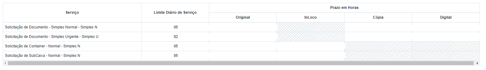<figcaption>
Clique na imagem para ampliar.
</figcaption></figure>

No campo “Limite Diário de Serviço” determine o limite diário de solicitações que o usuário pode fazer de cada tipo de serviço. É importante ressaltar que mesmo que o usuário informe um valor maior nestes campos, o limite que irá prevalecer é o determinado nos campos “Documentos”, “Subcaixas” e “Caixas”.&#x20;


<mark style="color:blue;">**EXEMPLO:**</mark> <mark style="color:blue;"></mark><mark style="color:blue;">Para o serviço “Solicitação de Documentos Simples” foi determinado o limite de 15 solicitações diárias, mas no campo “Documentos” foi determinado o limite de 12 solicitações sem bloqueio após atingir o limite. Serão atendidas 12 solicitações e as três restantes só poderão ser atendidas no dia seguinte. Caso tivesse sido definido o bloqueio após o limite, o cliente só conseguiria fazer 12 solicitações.</mark>  &#x20;


<figure>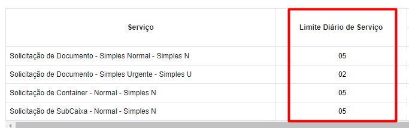<figcaption>
Clique na imagem para ampliar.
</figcaption></figure>

Nos campos de “Prazo em Horas”, é preciso informar quantas horas serão necessárias para atender uma solicitação considerando:&#x20;

* _Original:_ Documentos físicos originais, que a Unidade vai localizar no galpão e enviar para o cliente consultar.&#x20;
* _In Loco:_ Documentos físicos que serão consultados pelo cliente dentro da Unidade. Neste caso a Unidade vai localizar o documento no galpão e disponibilizar para que o cliente vá até a sede da Unidade para fazer a consulta.  Esse tipo de atendimento está relacionado ao serviço “Sala de Consulta”.&#x20;
* _Cópia:_ Cópias dos documentos originais. Neste caso a Unidade irá localizar o documento no galpão, tirar uma cópia e enviar para o cliente essa cópia.&#x20;
* _Digital:_ Documento digitalizado. Neste caso a Unidade vai enviar o documento que foi digitalizado ou cadastrado no ArqGED para o cliente de forma virtual. &#x20;


<mark style="color:orange;">**Geralmente o prazo para atendimento de solicitações de documentos originais e cópias é o mesmo. O prazo para documentos digitais costuma ser mais rápido porque não há necessidade de localização de arquivos no galpão**</mark>.&#x20;



<mark style="color:blue;">**INFORMAÇÃO:**</mark> <mark style="color:blue;"></mark><mark style="color:blue;">No caso do serviço de transporte, só serão habilitados os campos “Original” e “Cópia”, porque trata-se do serviço de transporte de documentos até a sede do cliente, desnecessário nos casos de consulta in loco ou a documentos digitais.</mark>  &#x20;


<figure>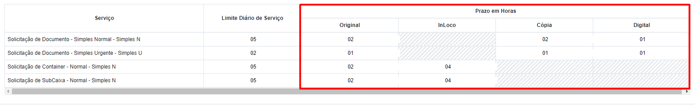<figcaption>
Clique na imagem para ampliar.
</figcaption></figure>
