# 🟩 Cadastrar

Neste menu são cadastrados todos os documentos do cliente. Os documentos cadastrados podem ser do tipo:&#x20;

* **Eletrônicos:** Documentos eletrônicos não possuem cópia física, podendo ser consultados a qualquer momento no próprio sistema ArqGED.&#x20;
* **Guarda Interna:** Documentos de Guarda Interna possuem versão física e estão armazenados com o cliente, em sua própria estrutura. &#x20;
* **Guarda Terceirizada:** Documentos de Guarda Terceirizada possuem versão física e estão armazenados na unidade Arquivar que atende ao cliente. Para que sejam consultados é preciso realizar uma solicitação pelo menu [Solicitação > Consulta](../solicitacao/consulta.md).&#x20;

<figure>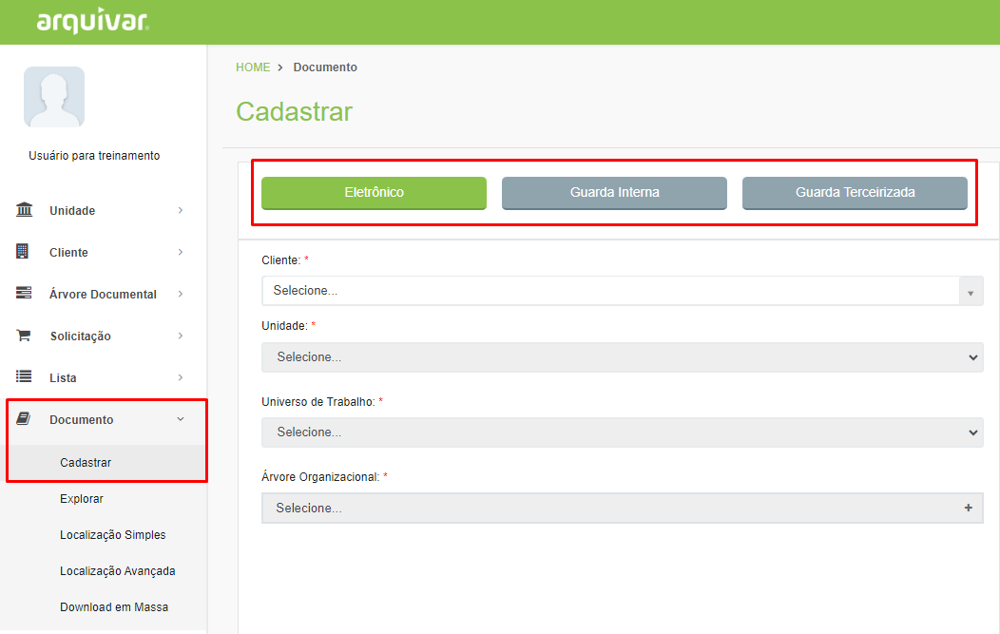<figcaption>
Clique para ampliar a imagem.
</figcaption></figure>

Independentemente do tipo de documento, no momento do cadastro é importante e necessário informar à qual cliente e unidade aquele documento que está sendo criado pertence.   &#x20;

***

## Cadastro de Documento

### Eletrônico

Depois de selecionar o Universo de Trabalho e a Árvore Organizacional será solicitado preencher os metadados do documento.  Os campos de preenchimento aqui foram aqueles anteriormente criados nos menus[ Árvore Documental > Campos Customizados](../arvore-documental/campo-customizado.md) e [Lista](../lista/criar-listas.md). &#x20;

<figure>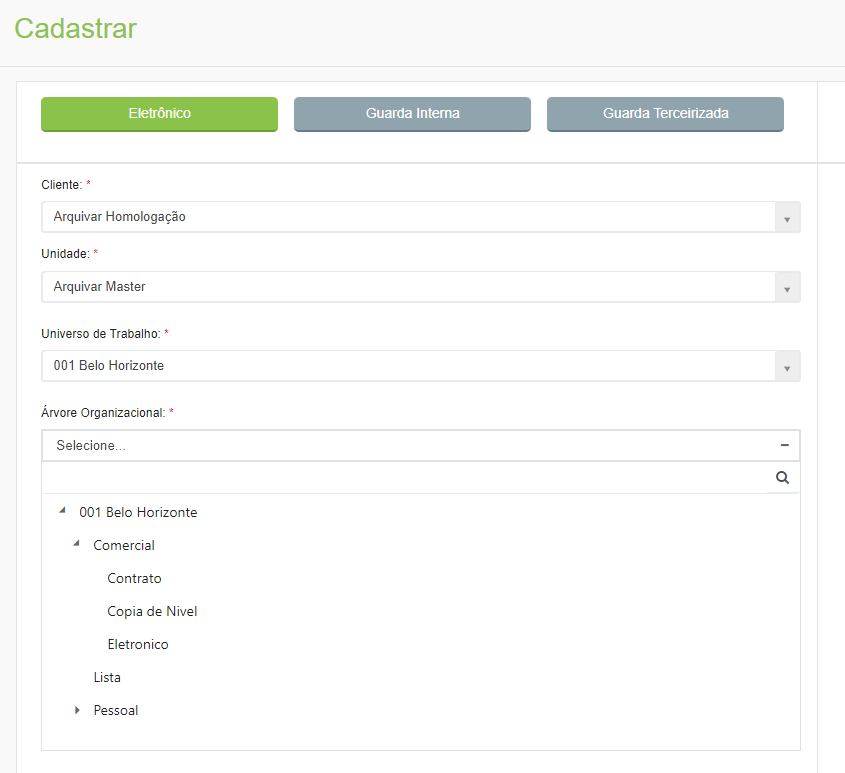<figcaption>
Clique para ampliar a imagem.
</figcaption></figure>

Caso necessário também é possível anexar arquivos ao documento que está sendo criado. Para isso, selecione o documento desejado e informe um nome para o arquivo, que será anexado ao documento que está sendo cadastrado.&#x20;

<figure>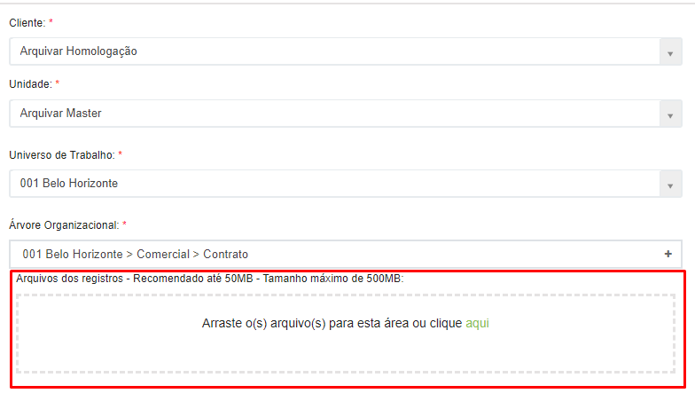<figcaption>
Clique para ampliar a imagem.
</figcaption></figure>

Serão exibidos na parte direita da tela os campos indexadores do documento para preenchimento. Os campos exibidos aqui são aqueles definidos anteriormente para o tipo documental escolhido na árvore organizacional do cliente.

<figure>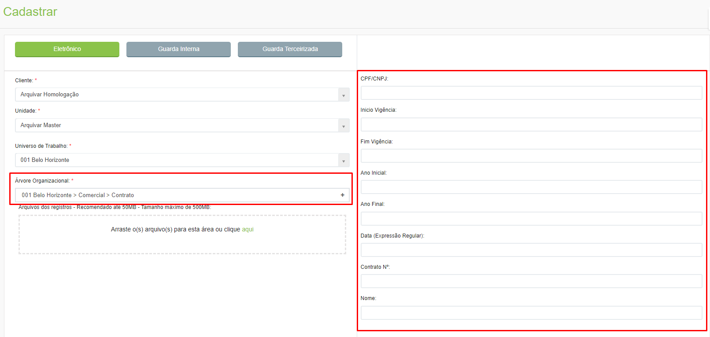<figcaption>
Clique para ampliar a imagem.
</figcaption></figure>


<mark style="color:orange;">**Se tiver sido definido que a lista de campos não permite indexação no momento do cadastro do documento, alguns campos serão desabilitados porque só será permitida a inclusão de informações já existentes na lista. Essa configuração é feita anteriormente no menu**</mark> [<mark style="color:blue;">**Lista > Criar Listas**</mark>](../lista/criar-listas.md)<mark style="color:orange;">**, no campo “Permitir a inclusão durante a indexação”. Esses dados preexistentes devem ser cadastrados via API ou por meio de planilha de importação.**</mark>


Os campos azuis são do tipo lista e os campos pretos são campos customizados. Depois de preencher os dados do documento que está sendo cadastrado, clique em “Salvar”.

<figure>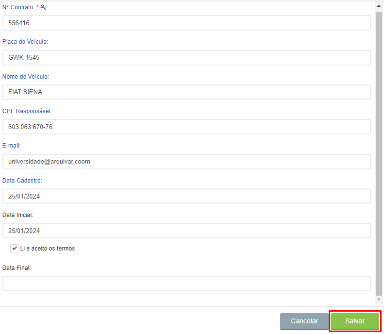<figcaption>
Clique para ampliar a imagem.
</figcaption></figure>

Depois de salvar o documento serão habilitadas as abas “Dados Cadastrais”, “Arquivos”, “Histórico” e “Workflow”.&#x20;

<figure>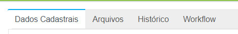<figcaption></figcaption></figure>

***

### Guarda Interna&#x20;

Documentos de Guarda Interna são aqueles documentos que existem fisicamente e estão alocados na própria estrutura do cliente, ou seja, em um galpão, sala, armário ou outra estrutura que empresa possua para arquivar seus documentos. &#x20;

Depois de selecionar o cliente e a unidade, informe se será criada uma caixa ou pasta para armazenar o documento que está sendo criado ou se será utilizada uma caixa ou pasta já existente. &#x20;

<figure><figcaption>
Clique para ampliar a imagem.
</figcaption></figure>

Se selecionada a opção “Não”, será utilizada uma caixa ou pasta já existente. Neste caso, no lado direito da tela será exibido o campo “Nº Caixa ou Pasta”, para que seja informado o número da caixa onde o documento que está sendo cadastrado será armazenado.&#x20;

<figure>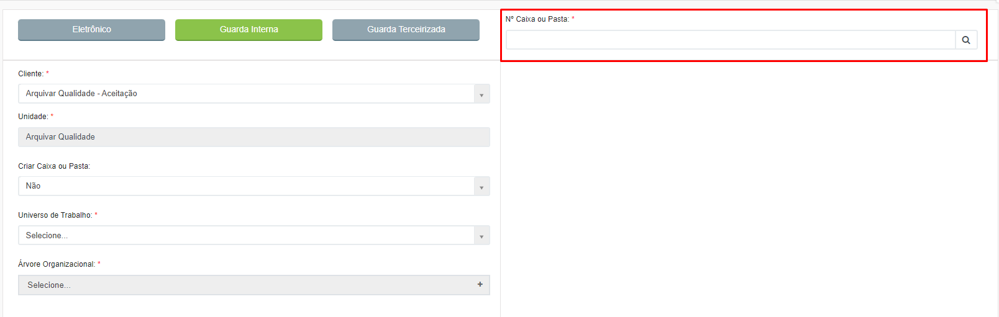<figcaption>
Clique para ampliar a imagem.
</figcaption></figure>

Se for ser criada uma nova caixa, deverá ser escolhido o “Tipo de Caixa ou Pasta”. &#x20;


<mark style="color:orange;">**Os tipos de caixa ou pasta exibidos aqui são aqueles criados anteriormente para o cliente no menu**</mark> [**Caixa ou Pasta > Criar**](../caixa-ou-pasta/criar.md)<mark style="color:orange;">**.**</mark>


<figure>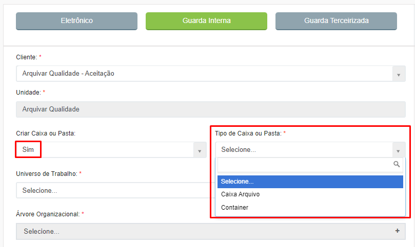<figcaption>
Clique para ampliar a imagem.
</figcaption></figure>

Depois de selecionar o Universo de Trabalho e a Árvore Organizacional, caso necessário também será possível anexar arquivos ao documento que está sendo criado. Para isso, selecione o documento desejado e informe um nome para o arquivo, que será anexado ao documento que está sendo cadastrado.  &#x20;

<figure>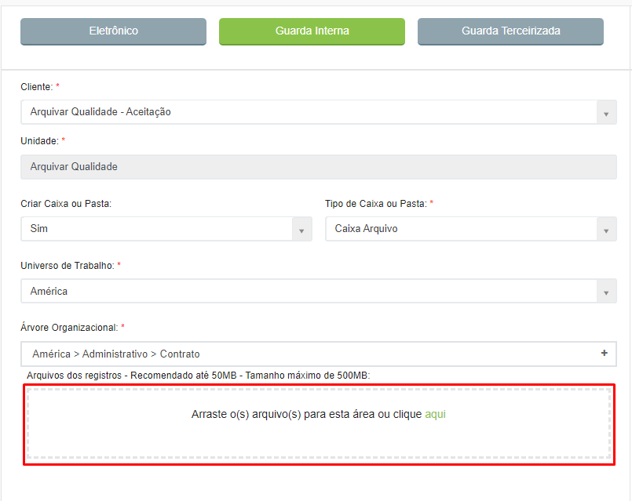<figcaption>
Clique para ampliar a imagem.
</figcaption></figure>

Serão exibidos na parte direita da tela os campos indexadores do documento para preenchimento. Os campos exibidos aqui são aqueles definidos anteriormente para o tipo documental escolhido na árvore organizacional do cliente anteriormente criados nos menus [Árvore Documental > Campos Customizados](../arvore-documental/campo-customizado.md) e [Lista](../lista/).  &#x20;


<mark style="color:orange;">**Se tiver sido definido que a lista de campos não permite indexação no momento do cadastro do documento, alguns campos serão desabilitados porque só será permitida a inclusão de informações já existentes na lista. Essa configuração é feita anteriormente no menu**</mark> [<mark style="color:blue;">**Lista > Criar Listas**</mark>](../lista/criar-listas.md)<mark style="color:orange;">**, no campo “Permitir a inclusão durante a indexação”. Esses dados preexistentes devem ser cadastrados via API ou por meio de planilha de importação.**</mark>


Os campos azuis são do tipo lista e os campos pretos são campos customizados. Depois de preencher os dados do documento que está sendo cadastrado, clique em “Salvar”. &#x20;

<figure>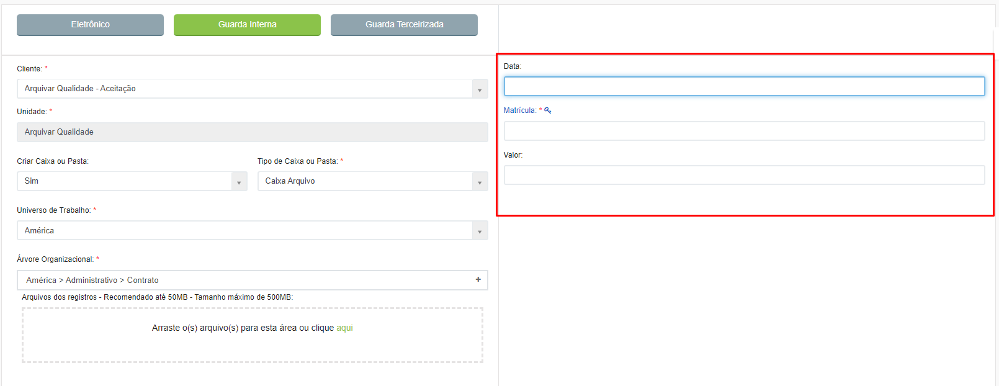<figcaption>
Clique para ampliar a imagem.
</figcaption></figure>

Depois de salvar o documento serão habilitadas as abas “Dados Cadastrais”, “Arquivos”, “Histórico” e “Workflow”.&#x20;

<figure><figcaption>
Clique para ampliar a imagem.
</figcaption></figure>

***

### Guarda Terceirizada&#x20;

Documentos de Guarda Interna são aqueles documentos que existem fisicamente e estão alocados no galpão da unidade Arquivar que atende aquele cliente. &#x20;

Depois de selecionar o cliente, é preciso informar, no lado direito da tela o “Nº de Caixa ou Pasta”. Isso significa que obrigatoriamente, antes de iniciar o cadastro de um documento, é necessário criar as caixas ou pastas que irão armazenar os documentos daquele cliente no menu [Caixa ou Pasta > Criar](../caixa-ou-pasta/criar.md).&#x20;

<figure>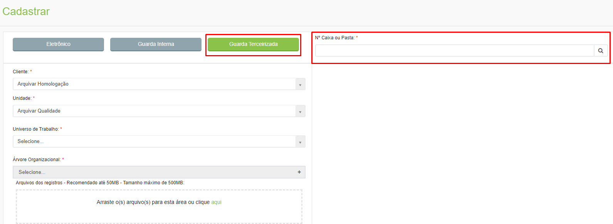<figcaption>
Clique para ampliar a imagem.
</figcaption></figure>


<mark style="color:orange;">**Se tiver sido definido anteriormente que a caia ou pasta informada possui subcaixa ou código provisório, estes também deverão ser informados.**</mark>


<figure>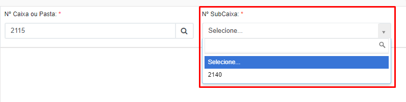<figcaption>
Clique para ampliar a imagem.
</figcaption></figure>

Depois de selecionar o Universo de Trabalho e a Árvore Organizacional, caso necessário também será possível anexar arquivos ao documento que está sendo criado. Para isso, selecione o documento desejado e informe um nome para o arquivo, que será anexado ao documento que está sendo cadastrado.  &#x20;

<figure>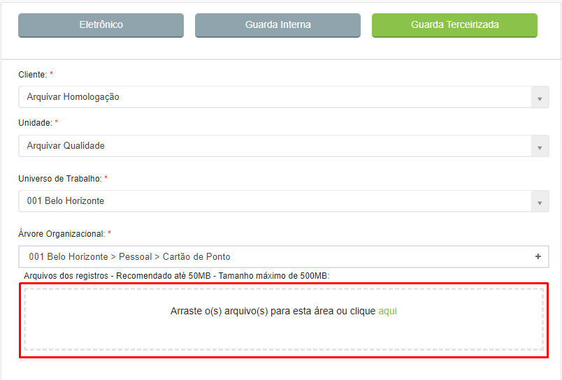<figcaption>
Clique para ampliar a imagem.
</figcaption></figure>

Serão exibidos na parte direita da tela os campos indexadores do documento para preenchimento. Os campos exibidos aqui são aqueles definidos anteriormente para o tipo documental escolhido na árvore organizacional do cliente anteriormente criados nos menus [Árvore Documental > Campos Customizados](../arvore-documental/ordenacao-campos.md) e [Lista](../lista/).  &#x20;


<mark style="color:orange;">**Se tiver sido definido que a lista de campos não permite indexação no momento do cadastro do documento, alguns campos serão desabilitados porque só será permitida a inclusão de informações já existentes na lista. Essa configuração é feita anteriormente no menu**</mark> [<mark style="color:blue;">**Lista > Criar Listas**</mark>](../lista/criar-listas.md)<mark style="color:orange;">**, no campo “Permitir a inclusão durante a indexação”. Esses dados preexistentes devem ser cadastrados via API ou por meio de planilha de importação.**</mark>


Os campos azuis são do tipo lista e os campos pretos são campos customizados. Depois de preencher os dados do documento que está sendo cadastrado, clique em “Salvar”. &#x20;

<figure>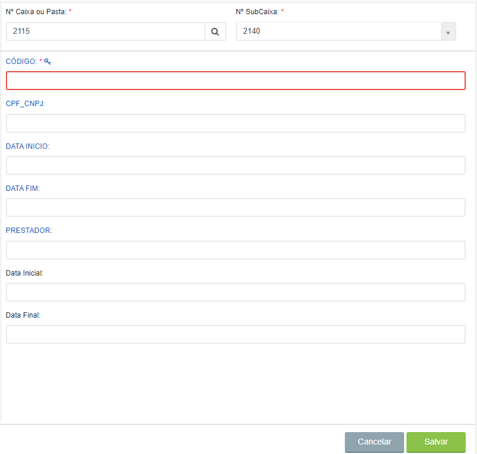<figcaption>
Clique para ampliar a imagem.
</figcaption></figure>

Depois de salvar o documento serão habilitadas as abas “Dados Cadastrais”, “Arquivos”, “Histórico” e “Workflow”.&#x20;

<figure><figcaption>
Clique para ampliar a imagem.
</figcaption></figure>

***

## Aba Dados Cadastrais

Nesta aba são exibidas as informações cadastradas do documento e o código gerado para ele, que pode ser visualizado no campo “Código do Documento”. No caso de documentos de Guarda Interna e Guarda Terceirizada será exibido também o campo “Nº Caixa ou Pasta”, que mostrará o número da caixa ou pasta em que o documento está armazenado e o ícone do status da caixa (em indexação ou armazenada) e informações sobre a tabela de temporalidade do documento e destinação final, se houver.&#x20;

<figure>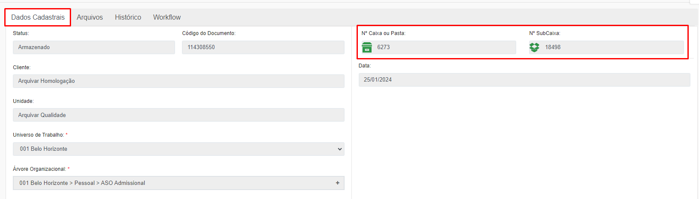<figcaption>
Clique para ampliar a imagem.
</figcaption></figure>

Serão habilitados também os botões:&#x20;

**Enviar para Caixa:** Utilizado quando é necessário criar uma versão física do documento eletrônico e enviar para ser armazenada em uma caixa que esteja alocada na unidade Arquivar ou no próprio espaço do cliente.

<figure>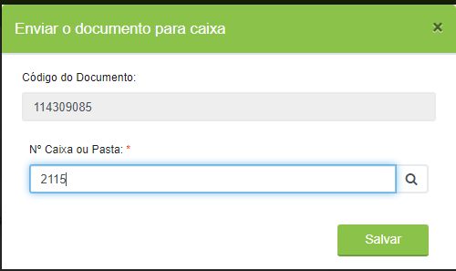<figcaption>
Clique para ampliar a imagem.
</figcaption></figure>

**Novo Registro:** Utilizado para iniciar o registro de um novo documento.

**Excluir:** Utilizado para excluir o documento cadastrado.

**Editar:** Utilizado para alterar as informações do documento cadastrado.

<figure>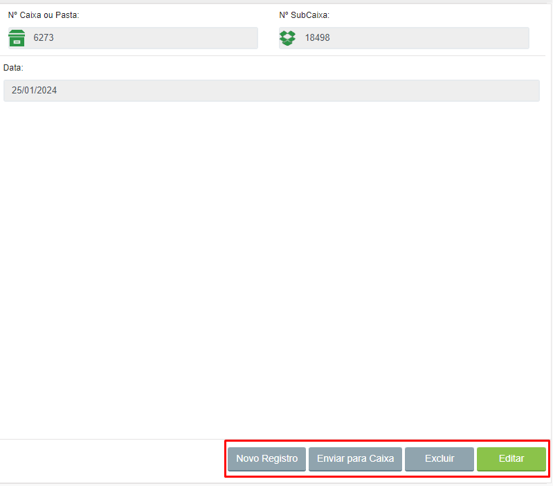<figcaption>
Clique para ampliar a imagem.
</figcaption></figure>

***

## Aba Arquivo&#x20;

Caso algum arquivo tenha sido anexado ao documento, nesta aba ele será exibido. Os ícones exibidos sinalizam o tipo de arquivo (PDF, Word, Excel etc.), se possui OCR ou não, se foi assinado digitalmente ou não e se foi compartilhado ou não. &#x20;

<figure>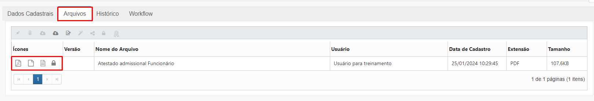<figcaption>
Clique para ampliar a imagem.
</figcaption></figure>

Clicando nos ícones será possível realizar as seguintes ações em relação a esse arquivo:&#x20;

<figure>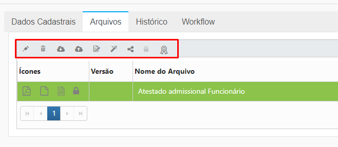<figcaption>
Clique para ampliar a imagem.
</figcaption></figure>

* **Editar:** Utilizado para editar o nome do documento e numerar a sua versão.&#x20;
* **Excluir:** Utilizado para excluir o documento que estiver selecionado.&#x20;
* **Download:** Utilizado para baixar o documento selecionado. O documento será aberto para visualização e download.&#x20;
* **Upload:** Utilizado para inserir um novo anexo ao documento.  &#x20;
* **Assinar:** Utilizado para assinar os documentos. O usuário pode escolher entre assinar todos os documentos apresentados ou assinar apenas os que estiverem selecionados em verde no grid.&#x20;
* **OCR:** Habilita o serviço de realização de OCR (Optical Character Recognition, ou Reconhecimento de Caractere Óptico) das páginas do documento anexado. Essa opção só está disponível caso o cliente tenha do serviço ArqOCR contratado.&#x20;
* **Compartilhar:** Utilizado para permitir que o documento seja compartilhado com usuários externos (não autenticados no sistema).    &#x20;
* **Descompartilhar:** Utilizado para interromper o compartilhamento de um documento.  &#x20;
* **Capturar certificado:** Quando se faz o upload de um documento que esteja assinado digitalmente, clicando neste ícone será possível extrair e visualizar as informações sobre o certificado digital utilizado para a assinatura. Quando o documento for assinado no próprio GED o certificado de assinaturas ficará disponível automaticamente.&#x20;

***

## Aba Histórico&#x20;

Nesta aba será possível visualizar o histórico de todas as solicitações de consulta e devoluções do documento (de Guarda Interna ou de Guarda Terceirizada) realizadas pelo cliente.  &#x20;

São exibidas as informações de número do documento, número do pedido, código da caixa onde o documento está armazenado, processo (consulta ou devolução), status, se foi localizado ou recebido, nome do solicitante, nome do atendente e data do fechamento ou recebimento.&#x20;

<figure>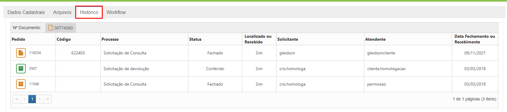<figcaption>
Clique para ampliar a imagem.
</figcaption></figure>

***

## Aba Workflow&#x20;

Nesta aba é possível verificar todos os fluxos aos quais o documento está associado, com informações do código do fluxo, nome do processo, etapa atual em que se encontra, responsável atual, data de ativação do fluxo, status do fluxo e situação. &#x20;

<figure>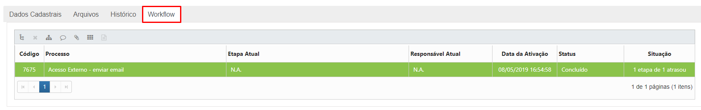<figcaption>
Clique para ampliar a imagem.
</figcaption></figure>

Clicando nos ícones será possível realizar as seguintes ações em relação ao documento:&#x20;

<figure>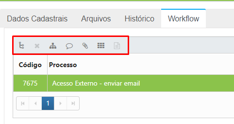<figcaption></figcaption></figure>

* **Ativar novo fluxo:** Utilizado para ativar um novo fluxo já com o documento associado a ele.&#x20;
* **Desassociar:** Utilizado para desvincular o registro selecionado do fluxo. O documento continua existindo no sistema mas não terá mais relação com o fluxo. &#x20;
* **Visualizar desenho:** Utilizado para visualizar o desenho do fluxo ao qual o documento está associado.&#x20;
* **Comentário:** Utilizado para verificar os comentários feitos no fluxo ao qual o documento está associado.&#x20;
* **Anexos:** Utilizado para visualizar os anexos do fluxo ao qual o documento está associado.&#x20;
* **Formulário:** Utilizado para visualizar o formulário do fluxo ao qual o documento está associado.&#x20;
* **Modelo Documento:** Utilizado para visualizar o modelo PDF se existir algum associado ao fluxo.&#x20;
