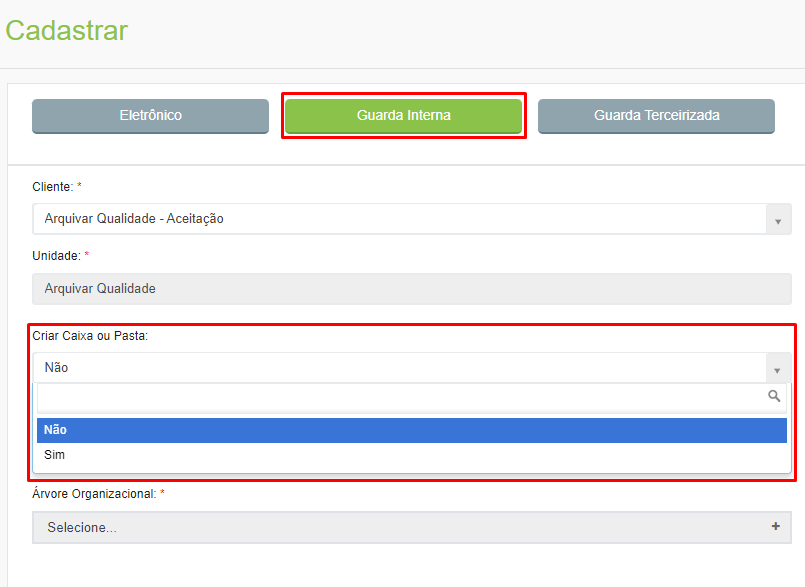

# 🟩 Cadastrar

Neste menu são cadastrados todos os documentos do cliente. Os documentos cadastrados podem ser do tipo: 

* **Eletrônicos:** Documentos eletrônicos não possuem cópia física, podendo ser consultados a qualquer momento no próprio sistema ArqGED. 
* **Guarda Interna:** Documentos de Guarda Interna possuem versão física e estão armazenados com o cliente, em sua própria estrutura.  
* **Guarda Terceirizada:** Documentos de Guarda Terceirizada possuem versão física e estão armazenados na unidade Arquivar que atende ao cliente. Para que sejam consultados é preciso realizar uma solicitação pelo menu [Solicitação > Consulta](../solicitacao/consulta.md). 

<figure><figcaption>
Clique para ampliar a imagem.
</figcaption></figure>

Independentemente do tipo de documento, no momento do cadastro é importante e necessário informar à qual cliente e unidade aquele documento que está sendo criado pertence.   &#x20;

***

## Cadastro de documento Eletrônico

Depois de selecionar o Universo de Trabalho e a Árvore Organizacional será solicitado preencher os metadados do documento.  Os campos de preenchimento aqui foram aqueles anteriormente criados nos menus[ Árvore Documental > Campos Customizados](../arvore-documental/campo-customizado.md) e [Lista](../lista/criar-listas.md). &#x20;

<figure><figcaption>
Clique para ampliar a imagem.
</figcaption></figure>

Caso necessário também é possível anexar arquivos ao documento que está sendo criado. Para isso, selecione o documento desejado e informe um nome para o arquivo, que será anexado ao documento que está sendo cadastrado.&#x20;

<figure><figcaption>
Clique para ampliar a imagem.
</figcaption></figure>

Serão exibidos na parte direita da tela os campos indexadores do documento para preenchimento. Os campos exibidos aqui são aqueles definidos anteriormente para o tipo documental escolhido na árvore organizacional do cliente.

<figure><figcaption>
Clique para ampliar a imagem.
</figcaption></figure>


<mark style="color:orange;">**Se tiver sido definido que a lista de campos não permite indexação no momento do cadastro do documento, alguns campos serão desabilitados porque só será permitida a inclusão de informações já existentes na lista. Essa configuração é feita anteriormente no menu**</mark> [<mark style="color:blue;">**Lista > Criar Listas**</mark>](../lista/criar-listas.md)<mark style="color:orange;">**, no campo “Permitir a inclusão durante a indexação”. Esses dados preexistentes devem ser cadastrados via API ou por meio de planilha de importação.**</mark>


Os campos azuis são do tipo lista e os campos pretos são campos customizados. Depois de preencher os dados do documento que está sendo cadastrado, clique em “Salvar”.

<figure><figcaption>
Clique para ampliar a imagem.
</figcaption></figure>

Depois de salvar o documento serão habilitadas as abas “Dados Cadastrais”, “Arquivos”, “Histórico” e “Workflow”.&#x20;

<figure><figcaption></figcaption></figure>

***

## Cadastro de documento de Guarda Interna&#x20;

Documentos de Guarda Interna são aqueles documentos que existem fisicamente e estão alocados na própria estrutura do cliente, ou seja, em um galpão, sala, armário ou outra estrutura que empresa possua para arquivar seus documentos. &#x20;

Depois de selecionar o cliente e a unidade, informe se será criada uma caixa ou pasta para armazenar o documento que está sendo criado ou se será utilizada uma caixa ou pasta já existente. &#x20;

<figure><figcaption>
Clique para ampliar a imagem.
</figcaption></figure>

Se selecionada a opção “Não”, será utilizada uma caixa ou pasta já existente. Neste caso, no lado direito da tela será exibido o campo “Nº Caixa ou Pasta”, para que seja informado o número da caixa onde o documento que está sendo cadastrado será armazenado.&#x20;

<figure><figcaption>
Clique para ampliar a imagem.
</figcaption></figure>

Se for ser criada uma nova caixa, deverá ser escolhido o “Tipo de Caixa ou Pasta”. &#x20;


<mark style="color:orange;">**Os tipos de caixa ou pasta exibidos aqui são aqueles criados anteriormente para o cliente no menu**</mark> [**Caixa ou Pasta > Criar**](../caixa-ou-pasta/criar.md)<mark style="color:orange;">**.**</mark>


<figure><figcaption>
Clique para ampliar a imagem.
</figcaption></figure>

Depois de selecionar o Universo de Trabalho e a Árvore Organizacional, caso necessário também será possível anexar arquivos ao documento que está sendo criado. Para isso, selecione o documento desejado e informe um nome para o arquivo, que será anexado ao documento que está sendo cadastrado.  &#x20;

<figure><figcaption>
Clique para ampliar a imagem.
</figcaption></figure>

Serão exibidos na parte direita da tela os campos indexadores do documento para preenchimento. Os campos exibidos aqui são aqueles definidos anteriormente para o tipo documental escolhido na árvore organizacional do cliente anteriormente criados nos menus [Árvore Documental > Campos Customizados](../arvore-documental/campo-customizado.md) e [Lista](../lista/).  &#x20;


<mark style="color:orange;">**Se tiver sido definido que a lista de campos não permite indexação no momento do cadastro do documento, alguns campos serão desabilitados porque só será permitida a inclusão de informações já existentes na lista. Essa configuração é feita anteriormente no menu**</mark> [<mark style="color:blue;">**Lista > Criar Listas**</mark>](../lista/criar-listas.md)<mark style="color:orange;">**, no campo “Permitir a inclusão durante a indexação”. Esses dados preexistentes devem ser cadastrados via API ou por meio de planilha de importação.**</mark>


Os campos azuis são do tipo lista e os campos pretos são campos customizados. Depois de preencher os dados do documento que está sendo cadastrado, clique em “Salvar”. &#x20;

<figure><figcaption>
Clique para ampliar a imagem.
</figcaption></figure>

Depois de salvar o documento serão habilitadas as abas “Dados Cadastrais”, “Arquivos”, “Histórico” e “Workflow”.&#x20;

<figure><figcaption>
Clique para ampliar a imagem.
</figcaption></figure>

***

## Cadastro de documento de Guarda Terceirizada&#x20;

Documentos de Guarda Interna são aqueles documentos que existem fisicamente e estão alocados no galpão da unidade Arquivar que atende aquele cliente. &#x20;

Depois de selecionar o cliente, é preciso informar, no lado direito da tela o “Nº de Caixa ou Pasta”. Isso significa que obrigatoriamente, antes de iniciar o cadastro de um documento, é necessário criar as caixas ou pastas que irão armazenar os documentos daquele cliente no menu [Caixa ou Pasta > Criar](../caixa-ou-pasta/criar.md).&#x20;

<figure><figcaption>
Clique para ampliar a imagem.
</figcaption></figure>


<mark style="color:orange;">**Se tiver sido definido anteriormente que a caia ou pasta informada possui subcaixa ou código provisório, estes também deverão ser informados.**</mark>


<figure><figcaption>
Clique para ampliar a imagem.
</figcaption></figure>

Depois de selecionar o Universo de Trabalho e a Árvore Organizacional, caso necessário também será possível anexar arquivos ao documento que está sendo criado. Para isso, selecione o documento desejado e informe um nome para o arquivo, que será anexado ao documento que está sendo cadastrado.  &#x20;

<figure><figcaption>
Clique para ampliar a imagem.
</figcaption></figure>

Serão exibidos na parte direita da tela os campos indexadores do documento para preenchimento. Os campos exibidos aqui são aqueles definidos anteriormente para o tipo documental escolhido na árvore organizacional do cliente anteriormente criados nos menus [Árvore Documental > Campos Customizados](../arvore-documental/ordenacao-campos.md) e [Lista](../lista/).  &#x20;


<mark style="color:orange;">**Se tiver sido definido que a lista de campos não permite indexação no momento do cadastro do documento, alguns campos serão desabilitados porque só será permitida a inclusão de informações já existentes na lista. Essa configuração é feita anteriormente no menu**</mark> [<mark style="color:blue;">**Lista > Criar Listas**</mark>](../lista/criar-listas.md)<mark style="color:orange;">**, no campo “Permitir a inclusão durante a indexação”. Esses dados preexistentes devem ser cadastrados via API ou por meio de planilha de importação.**</mark>


Os campos azuis são do tipo lista e os campos pretos são campos customizados. Depois de preencher os dados do documento que está sendo cadastrado, clique em “Salvar”. &#x20;

<figure><figcaption>
Clique para ampliar a imagem.
</figcaption></figure>

Depois de salvar o documento serão habilitadas as abas “Dados Cadastrais”, “Arquivos”, “Histórico” e “Workflow”.&#x20;

<figure><figcaption>
Clique para ampliar a imagem.
</figcaption></figure>
