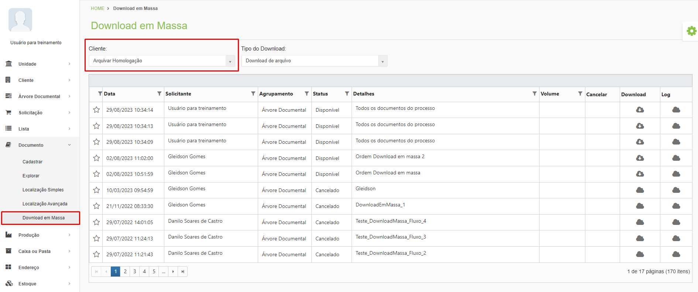
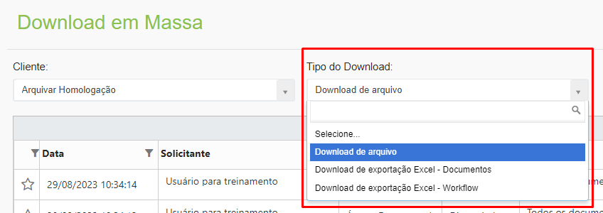
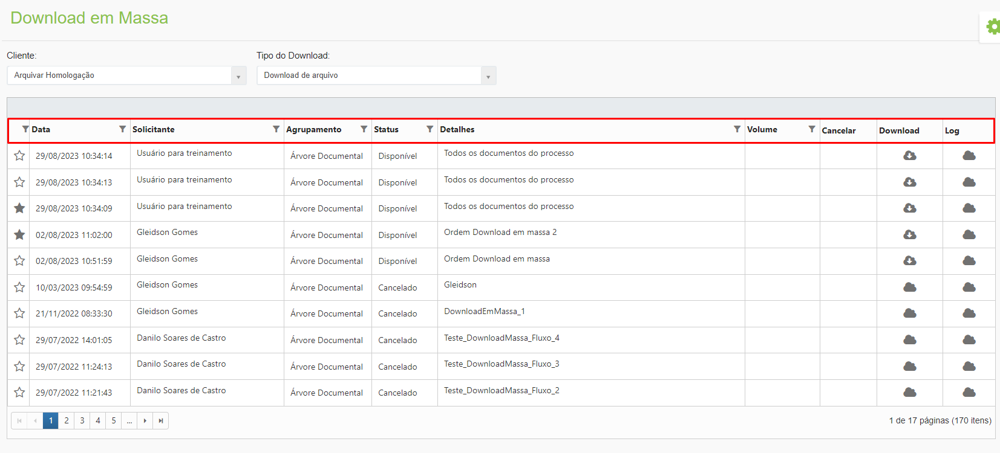

# 🟩 Download em Massa

Nos três tipos de pesquisa de documento (Explorar, Localização Simples e Localização Avançada) é oferecido ao usuário a opção de solicitar o download em massa dos arquivos associados aos documentos localizados.&#x20;

<figure><figcaption>
Clique para ampliar a imagem.
</figcaption></figure>

O Download em Massa permite que, ao localizar um documento que possua arquivos associados a ele, seja feito o download de todos esses documentos como arquivo único em formato PDF ou de todos os arquivos em uma pasta ZIP.&#x20;


<mark style="color:blue;">**EXEMPLO:**</mark> <mark style="color:blue;"></mark><mark style="color:blue;">Ao localizar o tipo de documento “Cartão de Autógrafo”, existem, associados a esse documento, a digitalização dos cartões de todos os clientes de uma determinada agência bancária. Para fazer o download de todos esses arquivos digitalizados, seria utilizada a funcionalidade de Download em Massa.</mark>


Dependendo do tamanho do arquivo de download solicitado ele não será feito instantaneamente, podendo demorar até 24 horas para ser gerado. No menu Download em Massa será possível visualizar todos os downloads em massa do cliente selecionado no campo “Cliente”. &#x20;

É nesta tela que o usuário conseguirá efetivamente realizar o download dos arquivos solicitados, além de verificar caso alguma solicitação tenha tido falha de execução.&#x20;

<figure><figcaption>
Clique para ampliar a imagem.
</figcaption></figure>

Existem três tipos de downloads disponíveis nesta tela:&#x20;

* **Download de Arquivo:** Resultado das solicitações de download em massa dos arquivos associados a um documento.&#x20;
* **Download de exportação Excel – Documentos:** É possível também exportar para Excel os resultados de pesquisas feitas nos menus Localização Simples e Localização Avançada.  &#x20;
* **Download de exportação Excel – Workflow:** Exporta para Excel os resultados de pesquisas feitas pelo menu [Workflow > Atividades > Pesquisa por Fluxo](../workflow/atividades/aba-pesquisa-por-fluxo.md) e [Pesquisa por Formulário](../workflow/atividades/aba-pesquisa-por-formulario.md).

<figure><figcaption>
Clique para ampliar a imagem.
</figcaption></figure>

Ao selecionar o tipo de download serão exibidas as seguintes informações:&#x20;

<figure><figcaption>
Clique para ampliar a imagem.
</figcaption></figure>

**Coluna Data:** Mostra a data e horário daquela solicitação de download em massa.&#x20;

**Coluna Solicitante:** Mostra o nome do usuário que solicitou o download em massa.&#x20;

**Coluna Agrupamento:** Mostra se o agrupamento dos documentos contidos no download em massa foi feito por árvore documental do cliente ou por lista.&#x20;

**Status:** Mostra o status do download em massa, que pode ser disponível, cancelado ou arquivo não foi gerado (quando há falha na geração do arquivo de download em massa).&#x20;

**Detalhes:** Mostra detalhes do arquivo que foi gerado para download em massa.&#x20;

**Volume:** Mostra o tamanho do arquivo gerado.&#x20;

**Cancelar:** Mostra se o arquivo de download em massa pode ser cancelado.&#x20;

**Download:** Se o arquivo de download em massa foi gerado com sucesso será exibido nesta coluna um ícone de nuvem com seta para download do arquivo gerado.&#x20;

**Log:** Se houve falha para gerar o arquivo de download em massa será exibido nesta coluna um ícone de nuvem com seta para download do relatório de erros encontrados.&#x20;
