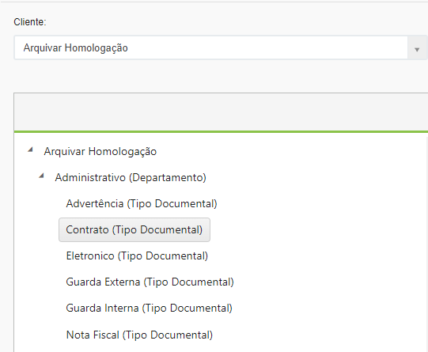
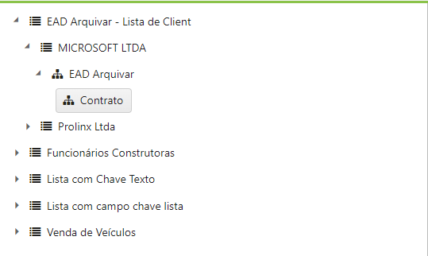
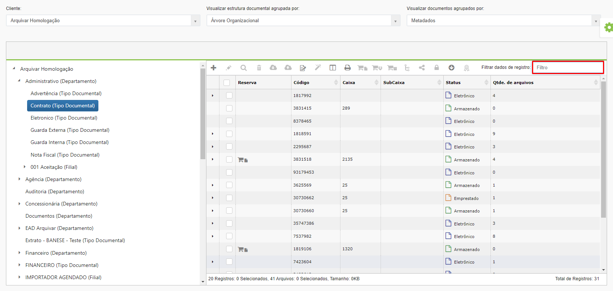

# 🟩 Explorar

O objetivo do menu Explorar é localizar documentos por meio de uma busca feita pela árvore documental do cliente. Para isso, é necessário selecionar o cliente e definir se deseja visualizar a estrutura documental agrupada pela árvore organizacional ou pelas listas do cliente.  &#x20;

<figure><figcaption>
Clique para ampliar a imagem.
</figcaption></figure>

**Visualizar estrutura documental agrupada por Árvore Organizacional:** Ao escolher visualizar a estrutura documental agrupada pela Árvore Organizacional, para localizar um documento será preciso explorar todos os níveis da árvore do cliente até chegar ao último, que enfim exibirá o tipo documental desejado. Esse tipo de busca só é recomendado se o usuário souber exatamente em que nível da árvore se encontra o documento que está buscando. Depois de localizar o tipo documental, na parte direita da tela serão exibidos os arquivos existentes.

<figure><figcaption>
Clique para ampliar a imagem.
</figcaption></figure>

**Visualizar estrutura documental agrupada por Listas:** Também é possível localizar utilizando-se as listas criadas para o cliente no menu [Lista > Criar lista](../lista/criar-listas.md). Neste caso serão exibidas todas as listas criadas para o cliente no lado esquerda da tela. Para localizar o tipo documental será preciso explorar todos os níveis da lista até chegar ao tipo documental desejado.

<figure><figcaption>
Clique para ampliar a imagem.
</figcaption></figure>

No campo “Visualizar documentos agrupados por” é possível escolher entre visualizar os documentos agrupados por metadados ou por arquivos. &#x20;

**Visualizar documentos agrupados por metadados:** A visualização por metadados permite que sejam exibidas as informações de indexação de todos os registros.&#x20;

<figure><figcaption>
Clique para ampliar a imagem.
</figcaption></figure>

**Visualizar documentos agrupados por arquivos:** Na visualização por arquivos são exibidos apenas registros que possuem arquivos anexados. Neste caso, são exibidas as informações desses arquivos. &#x20;

<figure><figcaption>
Clique para ampliar a imagem.
</figcaption></figure>

***

## Ícones da tela Explorar

<figure><figcaption>
Clique para ampliar a imagem.
</figcaption></figure>

### Adicionar Registro&#x20;

Ao selecionar o tipo documento desejado será possível adicionar um novo documento a ele, clicando no ícone “Adicionar”. Será aberta a tela [Documento > Cadastrar](cadastrar.md) para o cadastro do novo registro.&#x20;

### Editar&#x20;

Utilizado para editar informações do registro que estiver selecionado. Será aberta a mesma tela mostrada em [Documento > Cadastrar](cadastrar.md).&#x20;

### Visualizar&#x20;

Utilizado para visualizar as informações do registro que estiver selecionado. Será aberta a mesma tela mostrada em [Documento > Cadastrar](cadastrar.md).&#x20;

### Excluir&#x20;

Utilizado para excluir o registro que estiver selecionado.&#x20;

### Download do documento&#x20;

Utilizado para realizar o download dos arquivos associados ao registro selecionado. Se não houver arquivos anexados ao registro, não é possível realizar o download.&#x20;

Se selecionado mais de um registro para download com arquivos anexados, será possível escolher entre realizar o download em massa de todos os arquivos em um PDF único, em um arquivo ZIP com vários arquivos ou como arquivos em PDF separados por tamanho do documento (de acordo com o tamanho escolhido pelo usuário). O resultado das solicitações de download em massa feitas nessa tela será disponibilizado na tela [Documento > Download em Massa](download-em-massa.md). &#x20;

<figure><figcaption>
Clique para ampliar a imagem.
</figcaption></figure>

 

<figure><figcaption>
Clique para ampliar a imagem.
</figcaption></figure>

Upload de documento&#x20;

Utilizado para fazer o upload de um arquivo para associá-lo ao registro selecionado, ou seja, anexar um arquivo àquele documento. Deverá ser informada a versão e o nome do arquivo que está sendo anexado. &#x20;

\[doc27]&#x20;

Assinatura&#x20;

Se o cliente possuir o serviço de Assinatura Digital contratado, será exibido o ícone “Assinatura”. Será possível realizar a assinatura em lote dos arquivos selecionados no grid de todos os arquivos dos resultados da pesquisa realizada (sendo limitado a 300 arquivos por vez).&#x20;

\[doc28]&#x20;

Para localizar um documento é preciso explorar todos os níveis da árvore do cliente até chegar ao último, que enfim exibirá o tipo de documento desejado. Esse tipo de busca só é recomendado se o usuário souber exatamente em que nível da árvore se encontra o documento que está buscando. &#x20;

<figure><figcaption></figcaption></figure>

Também é possível localizar utilizando-se as listas criadas pelo cliente. Neste caso, é preciso explorar todos os níveis até chegar ao tipo documental desejado.&#x20;

<figure><figcaption></figcaption></figure>

Depois de localizar o tipo documental, na parte direita da tela será possível localizar os arquivos desejados, utilizando os filtros disponíveis. &#x20;

<figure><figcaption>
Clique para ampliar a imagem.
</figcaption></figure>
