# 🟩 Explorar

O objetivo do menu Explorar é localizar documentos por meio de uma busca feita pela árvore documental do cliente. Para isso, é necessário selecionar o cliente e definir se deseja visualizar a estrutura documental agrupada pela árvore organizacional ou pelas listas do cliente.

<figure>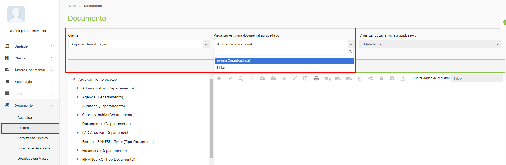<figcaption>
Clique para ampliar a imagem.
</figcaption></figure>

***

## **Visualizar estrutura documental**



### **Por Árvore Organizacional**

Ao escolher visualizar a estrutura documental agrupada pela Árvore Organizacional, para localizar um documento será preciso explorar todos os níveis da árvore do cliente até chegar ao último, que enfim exibirá o tipo documental desejado. Esse tipo de busca só é recomendado se o usuário souber exatamente em que nível da árvore se encontra o documento que está buscando. Depois de localizar o tipo documental, na parte direita da tela serão exibidos os arquivos existentes.

<figure>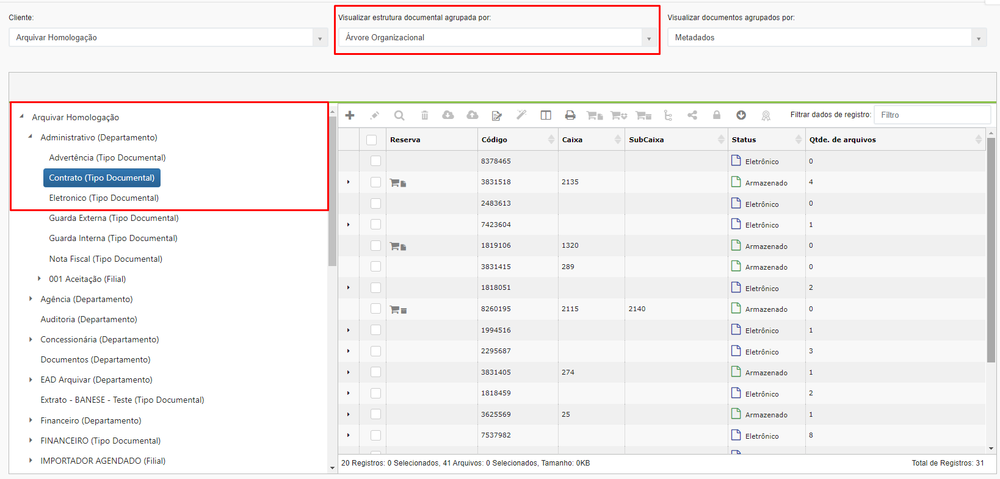<figcaption>
Clique para ampliar a imagem.
</figcaption></figure>

### **Por Listas**

Também é possível localizar utilizando-se as listas criadas para o cliente no menu [Lista > Criar lista](../../lista/criar-listas.md). Neste caso serão exibidas todas as listas criadas para o cliente no lado esquerda da tela. Para localizar o tipo documental será preciso explorar todos os níveis da lista até chegar ao tipo documental desejado.

<figure>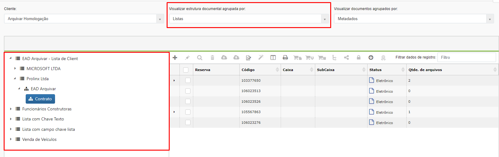<figcaption>
Clique para ampliar a imagem.
</figcaption></figure>

***

## Visualizar documentos



No campo “Visualizar documentos agrupados por” é possível escolher entre visualizar os documentos agrupados por metadados ou por arquivos.

### **Por metadados**

A visualização por metadados permite que sejam exibidas as informações de indexação de todos os registros.

<figure>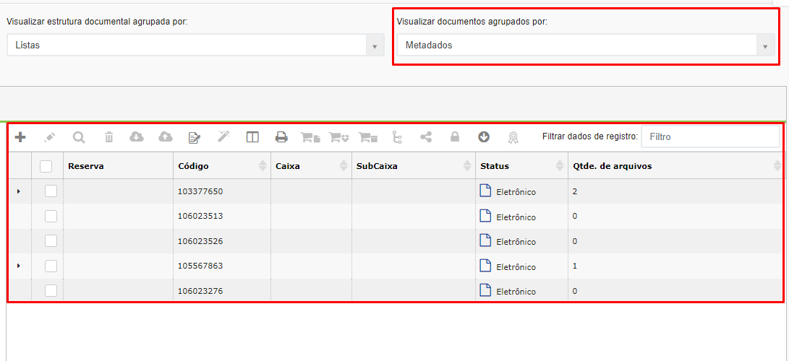<figcaption>
Clique para ampliar a imagem.
</figcaption></figure>

### **Por arquivos**

Na visualização por arquivos são exibidos apenas registros que possuem arquivos anexados. Neste caso, são exibidas as informações desses arquivos.

<figure>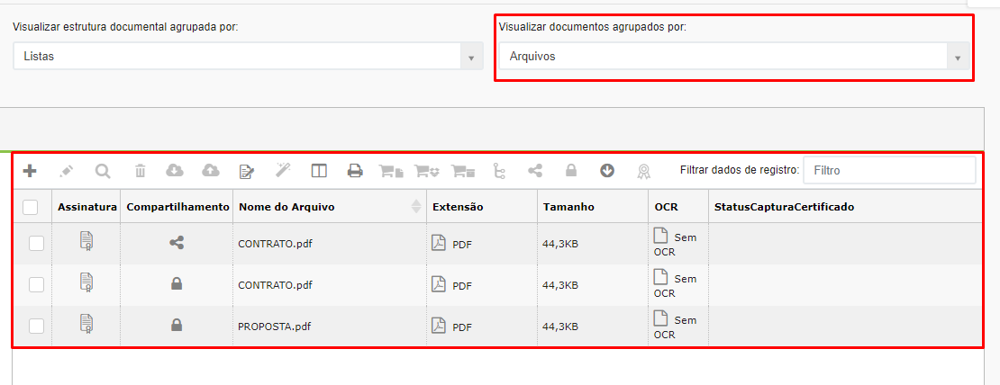<figcaption>
Clique para ampliar a imagem.
</figcaption></figure>

***

## Ícones da tela Explorar

<figure>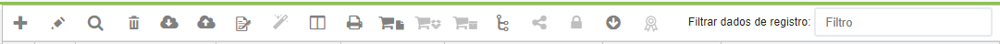<figcaption>
Clique para ampliar a imagem.
</figcaption></figure>

### Adicionar Registro .png>)

Ao selecionar o tipo documento desejado será possível adicionar um novo documento a ele, clicando no ícone “Adicionar”. Será aberta a tela [Documento > Cadastrar](../cadastrar.md) para o cadastro do novo registro.

### Editar .png>)

Utilizado para editar informações do registro que estiver selecionado. Será aberta a mesma tela mostrada em [Documento > Cadastrar](../cadastrar.md).

### Visualizar .png>)

Utilizado para visualizar as informações do registro que estiver selecionado. Será aberta a mesma tela mostrada em [Documento > Cadastrar](../cadastrar.md).

### Excluir .png>)

Utilizado para excluir o registro que estiver selecionado.

### Download do documento .png>)

Utilizado para realizar o download dos arquivos associados ao registro selecionado. Se não houver arquivos anexados ao registro, não é possível realizar o download.

Se selecionado mais de um registro para download com arquivos anexados, será possível escolher entre realizar o download em massa de todos os arquivos em um PDF único, em um arquivo ZIP com vários arquivos ou como arquivos em PDF separados por tamanho do documento (de acordo com o tamanho escolhido pelo usuário). O resultado das solicitações de download em massa feitas nessa tela será disponibilizado na tela [Documento > Download em Massa](../download-em-massa.md).

<figure>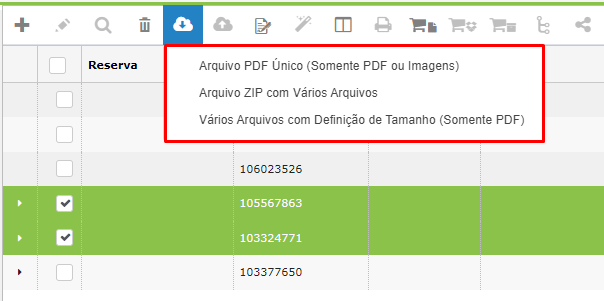<figcaption>
Clique para ampliar a imagem.
</figcaption></figure> <figure>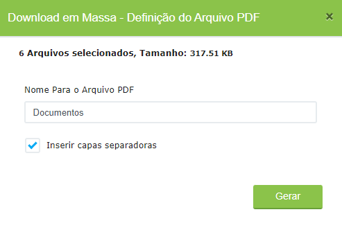<figcaption>
Clique para ampliar a imagem.
</figcaption></figure>


Se ao tentar realizar o download do arquivo for exibida a mensagem **"Não foi possível carregar o plug-in"**, siga os passos abaixo para ajustar as configurações do navegador:

1. Acesse as configurações do navegador.
2. Navegue até **Privacidade e Segurança**.
3. Localize a opção **Documentos em PDF** ou similar.
4. Em **Comportamento Padrão**, selecione a opção **Fazer o download dos PDFs**.

Essa configuração é padrão do navegador e pode interferir na visualização ou no download dos arquivos PDF, sendo necessário ajustá-la para corrigir o problema.


### Upload de documento .png>)

Utilizado para fazer o upload de um arquivo para associá-lo ao registro selecionado, ou seja, anexar um arquivo àquele documento. Deverá ser informada a versão e o nome do arquivo que está sendo anexado.

<figure>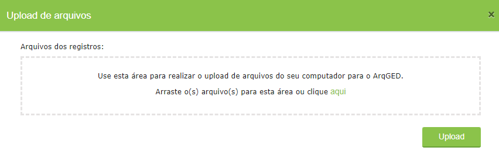<figcaption>
Clique para ampliar a imagem.
</figcaption></figure>

### Assinatura .png>)

Se o cliente possuir o serviço de Assinatura Digital contratado, será exibido o ícone “Assinatura”. Será possível realizar a assinatura em lote dos arquivos selecionados no grid de todos os arquivos dos resultados da pesquisa realizada (sendo limitado a 300 arquivos por vez).

<figure>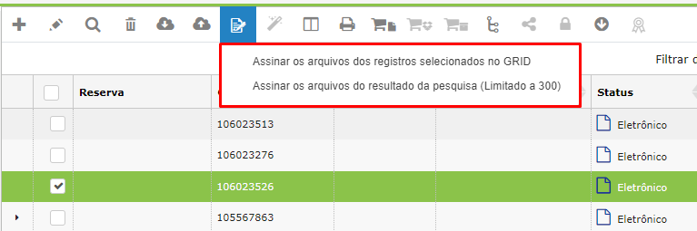<figcaption>
Clique para ampliar a imagem.
</figcaption></figure>


<mark style="color:orange;">Para assinatura de documentos tratados em conformidade com o Decreto 10.278, os arquivos que atingirem 300MB ou mais deverão ser tratados com o fracionamento em partes sequenciais devidamente nomeadas. Caso haja numeração preexistente, como o número de atendimento, sugerimos utilizar essa identificação no nome do arquivo para facilitar a organização e a futura localização do registro no ArqGED.</mark>

<mark style="color:orange;">**Exemplo:**</mark>

<mark style="color:orange;">Prontuário de atendimento nº 100, o fracionamento correto do arquivo deve ser:</mark>

<mark style="color:orange;">100 parte 01/03.pdf</mark>

<mark style="color:orange;">100 parte 02/03.pdf</mark>

<mark style="color:orange;">100 parte 03/03.pdf</mark>

<mark style="color:orange;">Esse procedimento visa otimizar o manuseio e a entrega dos arquivos, evitando possíveis dificuldades no processo de assinatura do acervo.</mark>


### Configurar colunas da tela .png>)

As colunas exibidas na tela podem ser escolhidas de acordo com o que se deseja que seja exibido. No campo “Colunas com os dados de identificação do documento”, é possível escolher as colunas que serão exibidas ao se realizar a busca de arquivos do tipo documental selecionado. No campo à esquerda são exibidas as colunas disponíveis e no campo à direita são mostradas as colunas selecionadas que serão exibidas.

<figure>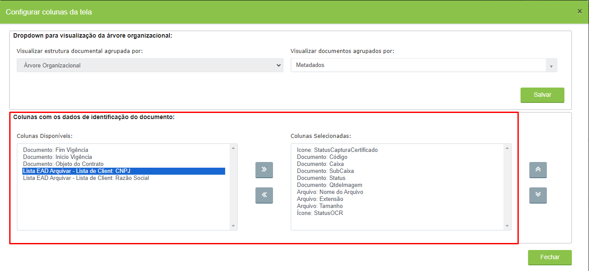<figcaption>
Clique para ampliar a imagem.
</figcaption></figure>

Para exibir uma coluna, selecione-a no campo à esquerda e clique no ícone “>>”. Para retirar uma coluna da visualização, basta selecioná-la no campo à direita e clicar no ícone “<<”. Para alterar a ordem em que as colunas são exibidas utilize as setas para cima e para baixo.

<figure>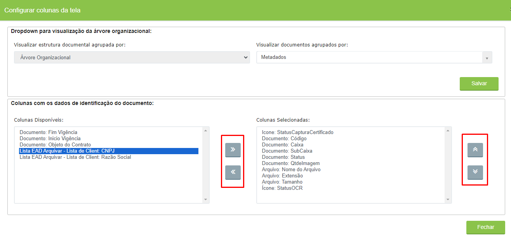<figcaption>
Clique para ampliar a imagem.
</figcaption></figure>

### Digitalizar documento .png>)

Ao clicar neste ícone o usuário será direcionado para o [módulo ArqScan](modulo-arqscan.md) para que seja feita a indexação do registro selecionado.

<figure>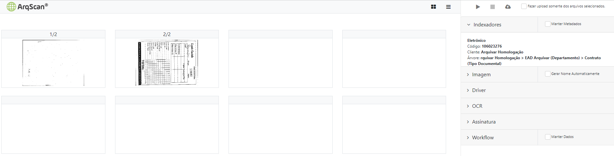<figcaption>
Clique para ampliar a imagem.
</figcaption></figure>

### Reservar documento .png>)

Este ícone só será habilitado se houver documento físico associado ao registro selecionado, ou seja, documentos que tenham sido castrados como de “Guarda Interna” ou “Guarda Terceirizada” na tela [Documento > Cadastrar](../cadastrar.md). Neste caso será possível [solicitar a consulta](../../solicitacao/consulta.md) aos documentos físicos por meio deste ícone.

### Reservar caixa .png>)

Este ícone só será habilitado se houver caixa física de documentos associada ao registro selecionado. Neste caso será possível [solicitar a consulta](../../solicitacao/consulta.md) aos documentos das caixas por meio deste ícone.

### Reservar subcaixa .png>)

Este ícone só será habilitado se houver subcaixa física de documentos associada ao registro selecionado. Neste caso será possível [solicitar a consulta](../../solicitacao/consulta.md) aos documentos das subcaixas por meio deste ícone.

### Ativar novo fluxo .png>)

Utilizado para ativar um novo fluxo com o registro selecionado já associado a ele. Esse ícone só será habilitado se o cliente possuir o serviço ArqFlow contratado. Será aberta a tela “[Ativar Novo Fluxo](./#ativar-novo-fluxo)”.

<figure>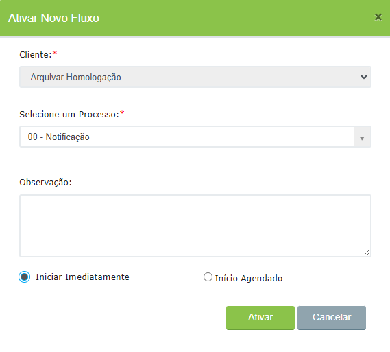<figcaption></figcaption></figure>

### Compartilhar  (1) (1) (1).png>)

Permite realizar o compartilhamento do registro selecionado com pessoas externas ao ArqGED, por meio de uma URL gerada para envio por e-mail. É possível definir se essa URL terá acesso por tempo indeterminado ou se terá uma data determinada de validade.

<figure><figcaption>
Clique para ampliar a imagem.
</figcaption></figure>

### Descompartilhar  (1) (1) (1) (1) (1) (1) (1) (1) (1) (1) (1) (1) (1) (1) (1) (1) (1) (1).png>)

Utilizado para cessar o acesso aos links gerados por meio do botão “Compartilhar” e enviados por e-mail a usuários externos. Neste caso as pessoas que clicarem no link não conseguirão mais acessar o documento compartilhado.

### Como compartilhar um documento quando ele já possui um compartilhamento em execução

Neste caso, o processo seria realizar o "Descompartilhamento", conforme orientação anterior e realizar novamente o compartilhamento, porém, neste caso os usuários com acesso ao documento perderiam o a link, ou seja o acesso seria cessado.

Para que os compartilhamentos anteriores não sejam perdidos, o ideal é ao clicar no ícone de "Descompartilhar"

<figure><figcaption>
Clique na imagem para ampliar.
</figcaption></figure>

O link é novamente habilitado na tela, juntamente com o campo de envio por e-mail:

<figure><figcaption>
Clique na imagem para ampliar.
</figcaption></figure>

Neste momento basta copiar o mesmo link ou enviar por e-mail aos novos usuários, sem efetivar o "Descopartilhamento" ou seja, o cancelamento do compartilhamento anterior, sendo mantido os acessos dos usuários anteriores.

Caso opte pelo "Descompartilhamento" clicando no botão disponível, os usuários externos que até então, utilizavam o link, perderão o acesso ao documento.

### Carregar mais 1000 registros .png>)

Por padrão, a tela Explorar exibe no máximo 1000 registros ao se realizar uma busca. Para exibir mais que essa quantidade de registros, deve-se clicar neste ícone.

### Capturar Certificado .png>)

Utilizado para capturar os certificados digitais de arquivos assinados digitalmente. Se houver certificados digitais utilizados para assinatura do registro será possível visualizar as informações desses certificados.

<figure>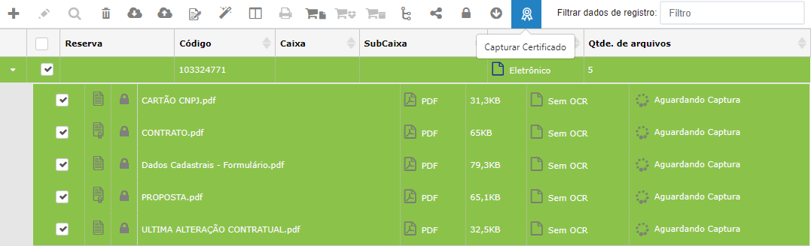<figcaption>
Clique para ampliar a imagem.
</figcaption></figure>

### Filtrar dados de registro

É possível também filtrar os resultados exibidos utilizando o campo “Filtrar dados de registro”.

<figure>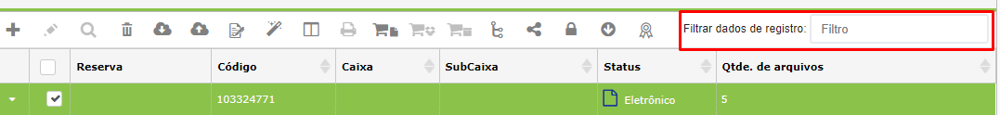<figcaption>
Clique para ampliar a imagem.
</figcaption></figure>
