# 🔹 Módulo ArqScan

## Pré-requisitos para a utilização do ArqScan &#x20;

Para que o módulo ArqScan funcione corretamente é necessária a instalação de um scanner e do driver que fará a comunicação entre o sistema e o aparelho de scanner. Além disso, é preciso também instalar o aplicativo ArqClient na máquina do usuário, utilizado para a comunicação entre a máquina do usuário, scanners e tokens.&#x20;


<mark style="color:orange;">**Deve ser instalado na máquina do usuário o driver correspondente ao seu aparelho de scanner. Verifique a marca e modelo do scanner e busque o driver correspondente a ele.**</mark>


### Instalando o ArqClient&#x20;

O ArqClient precisa ser instalado na máquina do usuário como requisito para utilização das funcionalidades do ArqSCAN e ArqSIGN (Assinatura Digital) no software ArqGED. O software ArqClient possui duas funções:&#x20;

* Realizar a comunicação entre o ArqSCAN e o driver de scanner (para o uso do ArqSCAN).&#x20;
* Realizar a comunicação entre o ArqGED e certificados de assinatura digital, seja via tokens, certificados instalados na máquina ou cartões inteligentes (para uso da assinatura digital).&#x20;

Para o funcionamento correto do ArqClient são exigidos os requisitos mínimos abaixo.&#x20;

* Memória RAM: Mínimo 4 GB&#x20;
* Processador: Dual Core, 2 GHz ou Superior.&#x20;
* Sistema Operacional: Windows 10, ou superior&#x20;

1\. Para realizar o download e instalação do aplicativo “ArqClient” na máquina onde será utilizada a assinatura digital, acesse o site [**https://downloads.arquivar.com/**](https://downloads.arquivar.com/).&#x20;

<figure><figcaption>
Clique na imagem para ampliar.
</figcaption></figure>

2\. Em “Instaladores”, clique no link para o arquivo de instalação para utilização no ambiente de Produção. &#x20;

<figure>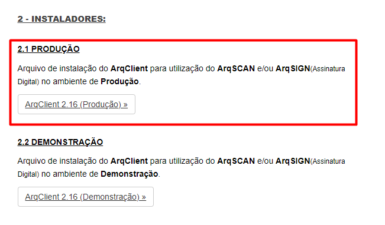<figcaption></figcaption></figure>

3\. Salve o arquivo ZIP na máquina. Em seguida, abra a pasta e clique duas vezes sobre o arquivo de instalação.&#x20;

<figure>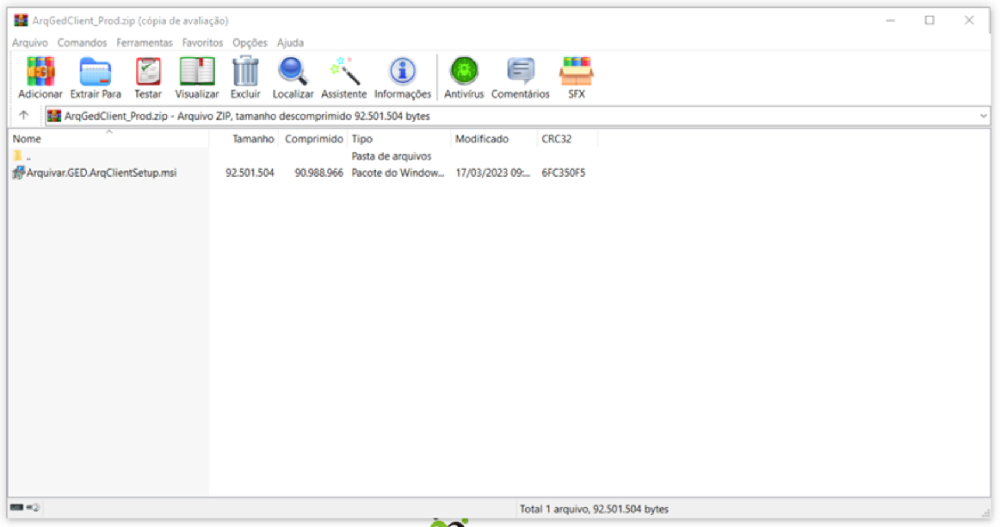<figcaption>
Clique para ampliar a imagem.
</figcaption></figure>

4\. Clique em “Avançar” nas próximas telas até que o status de instalação seja concluído. &#x20;

<figure>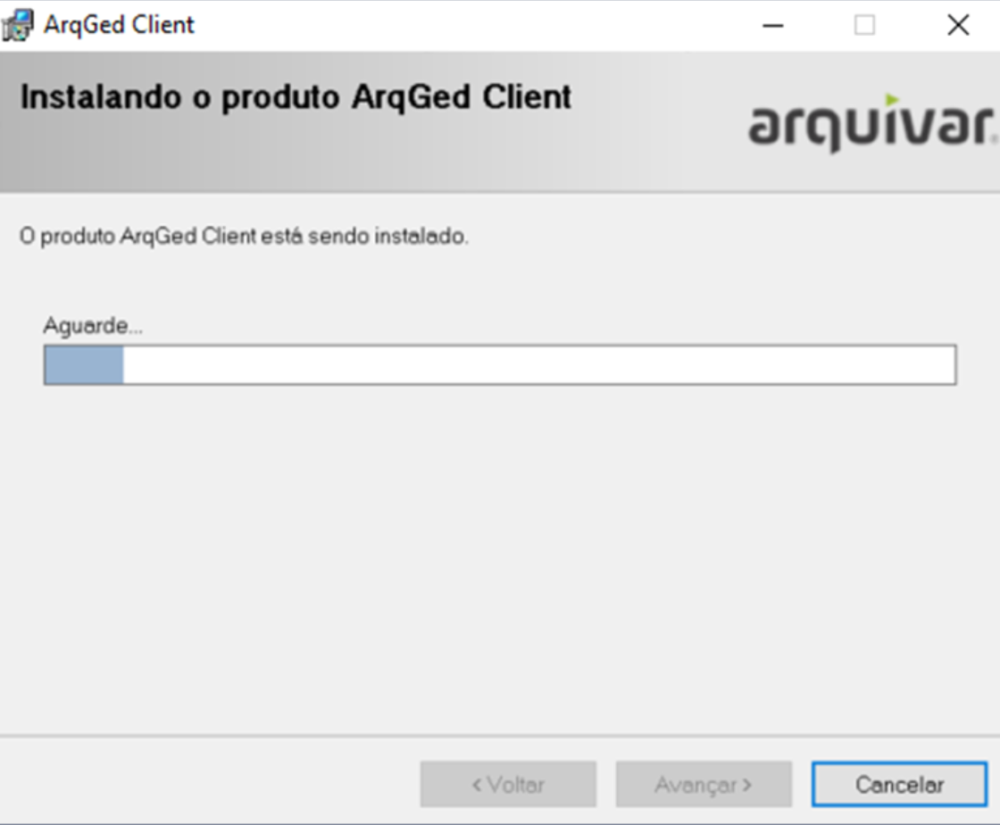<figcaption></figcaption></figure>

5\. Clique em “Fechar” para concluir a instalação.&#x20;

<figure>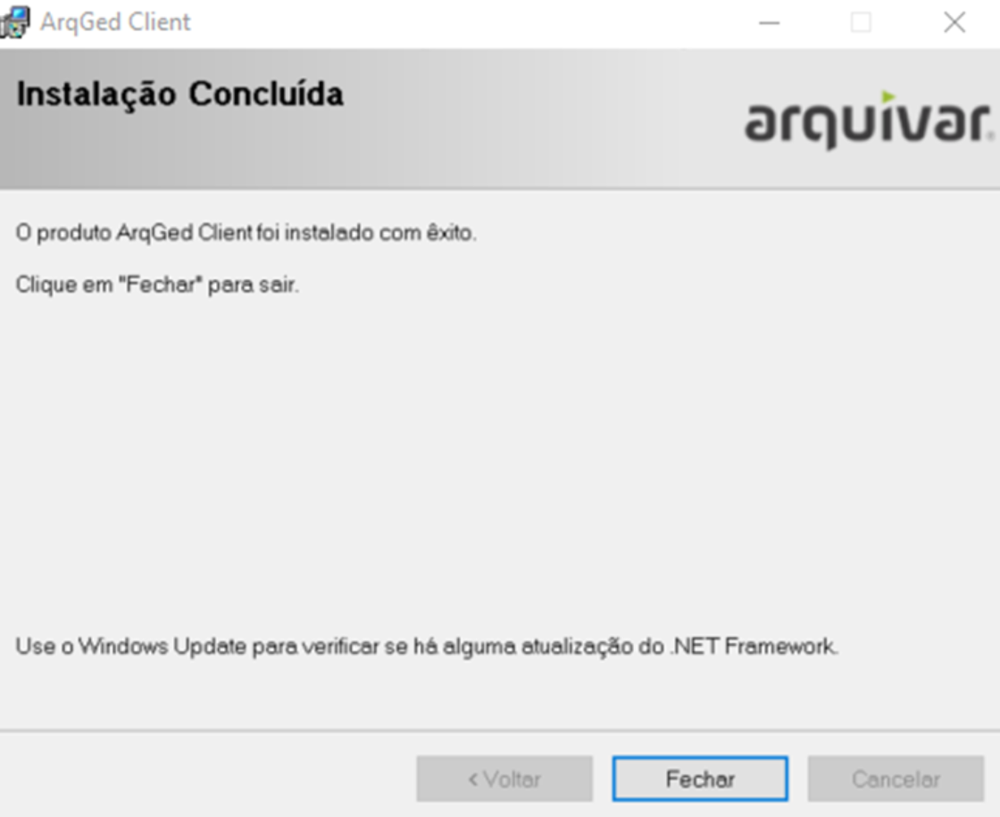<figcaption></figcaption></figure>


[<mark style="color:blue;">**Clique aqui**</mark>](https://view.genial.ly/65269e7884447000117c67f7) <mark style="color:orange;">**e acesse o conteúdo completo sobre o aplicativo ArqClient.**</mark>


O acesso ao módulo ArqScan deve ser feito na tela [Documento > Explorar](./), clicando no ícone “Digitalizar”. &#x20;

nnnn

<figure><figcaption>
Clique para ampliar a imagem.
</figcaption></figure>

***

## Digitalizando documentos&#x20;

Para iniciar a digitalização de um documento, insira-o no aparelho de scanner e na tela do ArqScan clique no ícone “Digitalizar”. As páginas serão digitalizadas e exibidas na tela.&#x20;

<figure><figcaption>
Clique para ampliar a imagem.
</figcaption></figure>

<figure>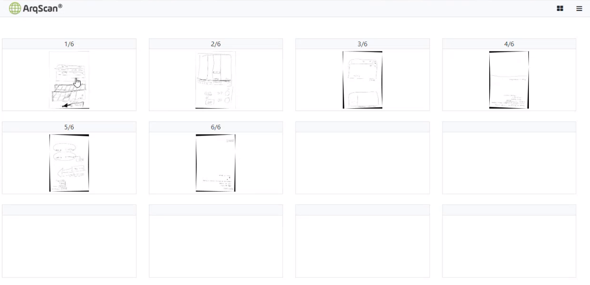<figcaption>
Clique para ampliar a imagem.
</figcaption></figure>

Ao clicar em uma imagem digitalizada será possível expandi-la para visualização. Na tela de visualização da imagem também será possível rotaciona-la para a direita e esquerda, girá-la 180° e mover a imagem. Na paginação na parte inferior será possível navegar entre as imagens digitalizadas.&#x20;

<figure>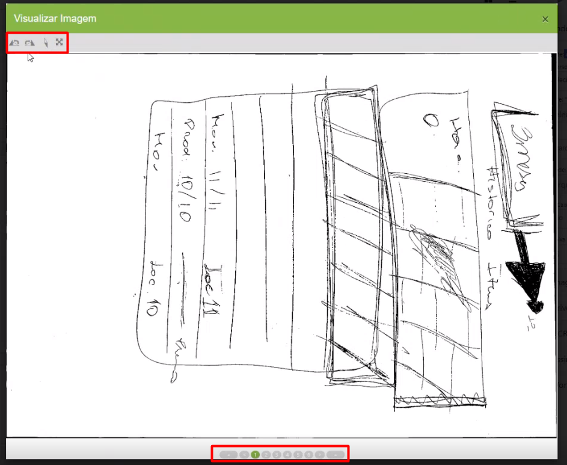<figcaption>
Clique para ampliar a imagem.
</figcaption></figure>

Voltando à tela inicial do ArqScan, clicando com o botão direito do mouse sobre uma imagem será possível:&#x20;

**Excluir:** Exclui a página selecionada.

<figure>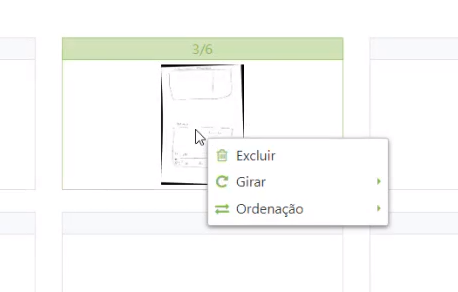<figcaption></figcaption></figure>

**Girar:** Permite girar a página selecionada em 90° à direita ou à esquerda e em 180°.&#x20;

<figure>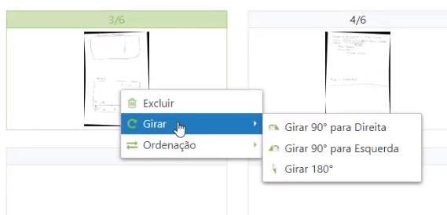<figcaption></figcaption></figure>

**Ordenação:** Alterar a ordenação da imagem selecionada, enviando a para o início, para o fim ou para uma posição específica entre as páginas digitalizadas.&#x20;

<figure>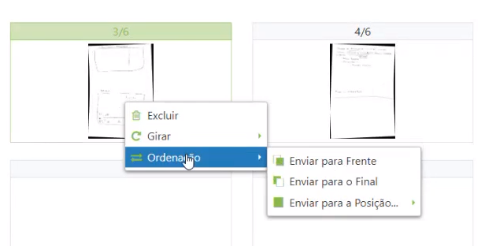<figcaption></figcaption></figure>

Clicando no ícone “Visualização” é possível alterar a forma como o grid de imagens deve ser exibido. O ícone de três barras é utilizado para ocultar ou mostra o menu lateral.&#x20;

<figure>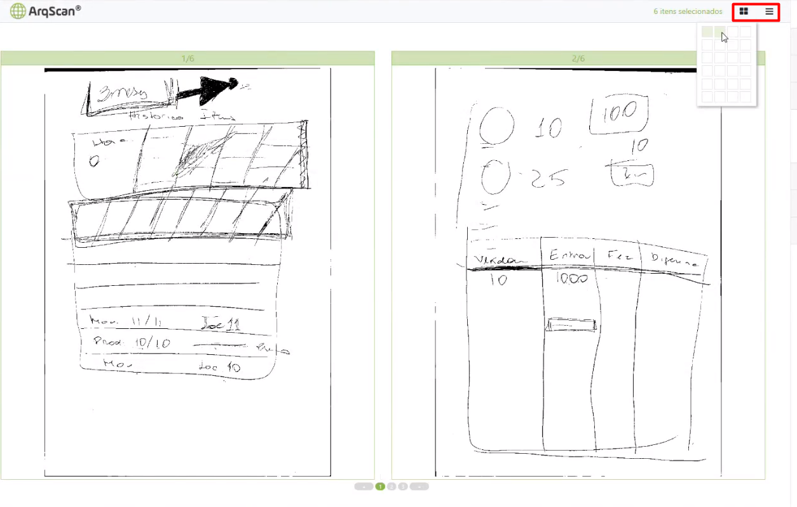<figcaption>
Clique para ampliar a imagem.
</figcaption></figure>

***

## Realizando a indexação de documentos&#x20;

Para iniciar a indexação, selecione as páginas que deseja indexar. É possível selecionar mais de uma página por vez, mantendo a tecla Ctrl pressionada e selecionando as páginas que deseja indexar. &#x20;

<figure>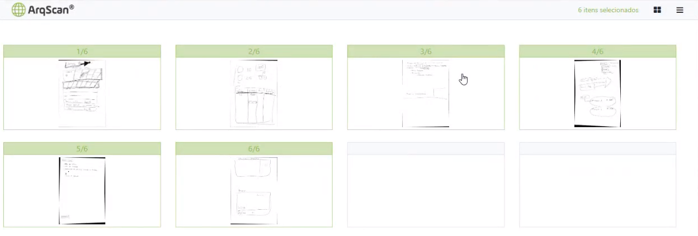<figcaption>
Clique para ampliar a imagem.
</figcaption></figure>

Na área “Indexadores” será exibido o cliente selecionado anteriormente em [Documento > Explorar](./). Selecione o Universo de Trabalho, a Árvore Organizacional e o Tipo de Documento (Eletrônico, Guarda Interna ou Guarda Terceirizada). O campo “Unidade” será preenchido automaticamente com a unidade que atende o cliente selecionado.&#x20;

<figure>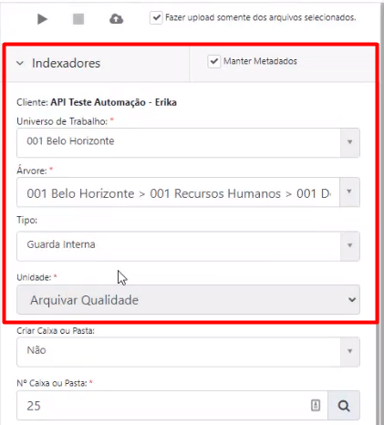<figcaption>
Clique para ampliar a imagem.
</figcaption></figure>

Depois de realizar a seleção serão exibidos os campos indexadores para preenchimento. Esses campos são aqueles definidos anteriormente para o tipo documental que estiver sendo indexado. O preenchimento desses campos funciona da mesma forma que no [cadastro de documentos](../cadastrar.md). &#x20;

<figure>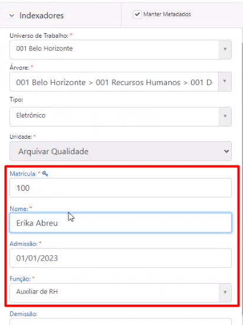<figcaption>
Clique para ampliar a imagem.
</figcaption></figure>

Caso tenha sido escolhido o tipo de documento “Guarda Interna” será preciso informar se será feita a criação de uma nova caixa. Se não for criada será preciso informar o número da caixa e subcaixa (se houver) à qual o documento será associado. Se escolhido o tipo de documento de “Guarda Terceirizada” será obrigatório informar o número da caixa e subcaixa (se houver).&#x20;

<figure><figcaption>
Clique para ampliar a imagem.
</figcaption></figure>

Na área “Imagem” é possível nomear as imagens manualmente ou selecionar a opção “Gerar Nome Automaticamente”.&#x20;

<figure>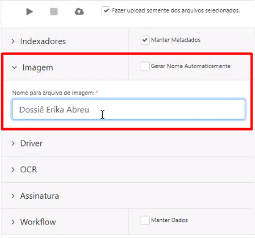<figcaption>
Clique para ampliar a imagem.
</figcaption></figure>

No campo “Driver”, selecione o driver correspondente ao scanner que está sendo utilizado. Clicando no ícone “Configurações” serão exibidas as configurações do scanner e do driver. &#x20;

<figure>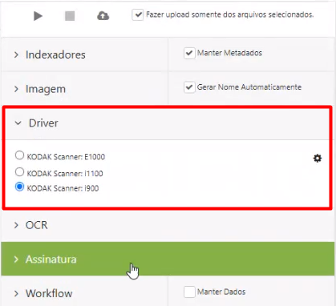<figcaption>
Clique para ampliar a imagem.
</figcaption></figure>


<mark style="color:orange;">**As configurações do scanner são definidas pelo fabricante do aparelho e variam de acordo com a marca e modelo utilizado. Para maiores informações sobre essas configurações, procure o site ou documentação do fabricante do aparelho de scanner que estiver utilizando.**</mark>


<figure>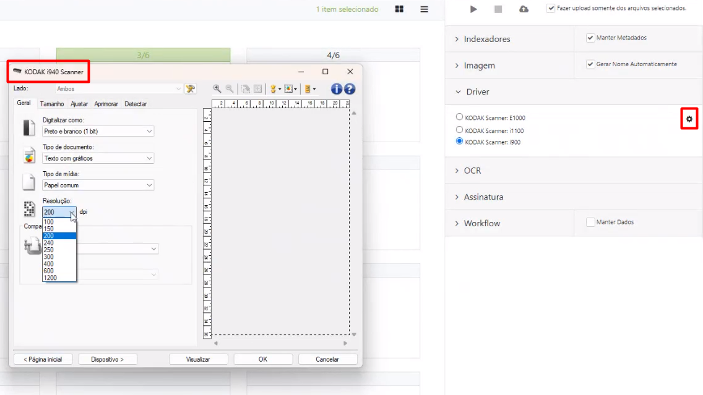<figcaption>
Clique para ampliar a imagem.
</figcaption></figure>

No campo “OCR” é possível selecionar a opção “Gerar PDF pesquisável”. Essa opção permite que as imagens do PDF que for gerado serão pesquisáveis por meio do módulo ArqOCR.&#x20;


<mark style="color:orange;">**Para utilizar essa opção é necessário que o cliente possua o módulo ArqOCR contratado.**</mark>&#x20;


<figure>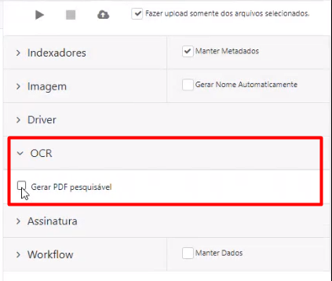<figcaption>
Clique para ampliar a imagem.
</figcaption></figure>

Na área “Assinatura” é possível assinar digitalmente o documento que for gerado. Para isso será preciso possuir um certificado digital instalado na máquina. Se houver mais de um certificado instalado, basta selecionar aquele que deseja utilizar. &#x20;

<figure>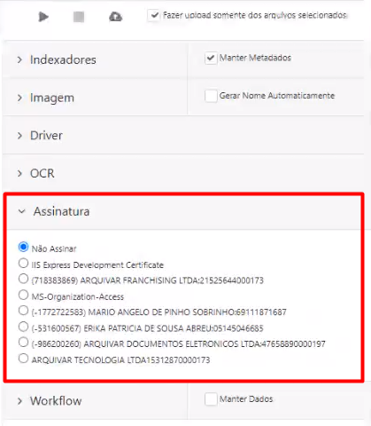<figcaption>
Clique para ampliar a imagem.
</figcaption></figure>

Na área “Workflow” é possível ativar um novo fluxo associando os documentos digitalizados a ele. Para isso, é preciso selecionar o processo, inserir as observações (se houver) e informar se a ativação será imediata ou deverá ser feita em uma data e horários agendados.&#x20;

Também é possível associar os documentos digitalizados a um fluxo já existente. Para isso é preciso informar o número do fluxo do cliente que esteja ativo e em execução e inserir observações (se houver). &#x20;

<figure>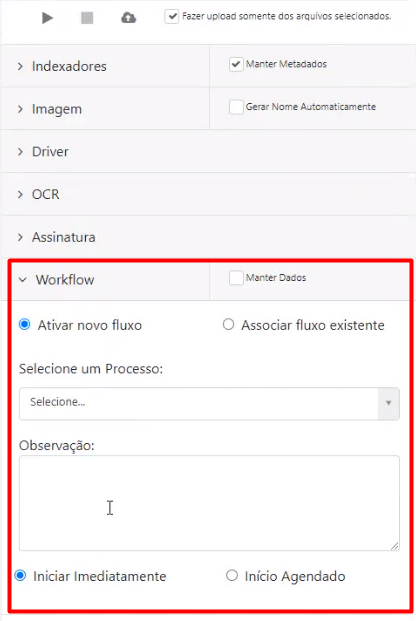<figcaption>
Clique para ampliar a imagem.
</figcaption></figure>

Ao selecionar as opções “Manter Metadados” e “Manter Dados” selecionadas, os dados e configurações feitas na indexação serão mantidos para o próximo registro. &#x20;

<figure>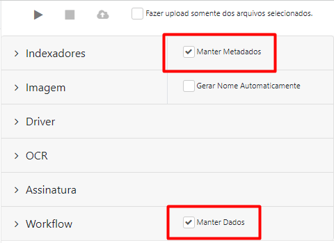<figcaption>
Clique para ampliar a imagem.
</figcaption></figure>

Depois de concluir as configurações de indexação, clique no ícone “Upload”. Para fazer o upload de páginas específicas selecione a opção “Fazer upload somente dos arquivos selecionados”.  Confirme o envio das imagens. Se tiver sido definido que será feita a assinatura dos documentos, será solicitada a senha do certificado digital escolhido.  &#x20;

<figure>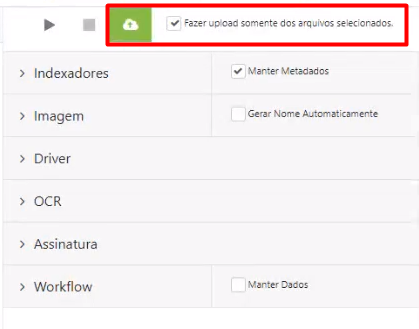<figcaption>
Clique para ampliar a imagem.
</figcaption></figure>

As páginas selecionadas serão indexadas e sumirão da tela de digitalização. Para visualizá-las, retorne à tela [Documento > Explorar](./) e localize o tipo documental do cliente ao qual o registro foi associado. Quando localizar, selecione-o e clique no ícone “Download do documento” para visualizar o PDF gerado com as páginas digitalizadas. &#x20;

<figure>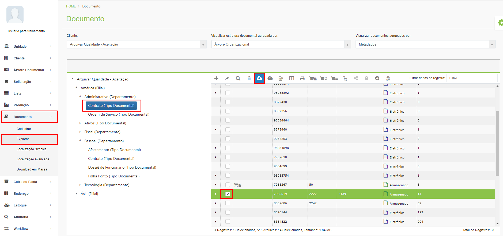<figcaption>
Clique para ampliar a imagem.
</figcaption></figure>
