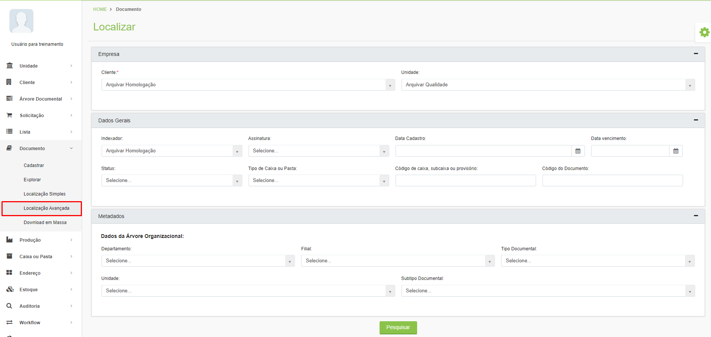
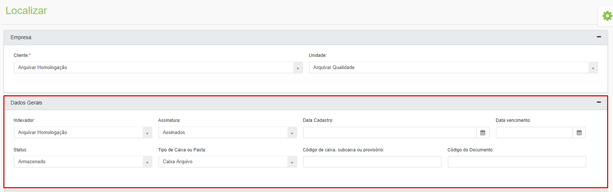
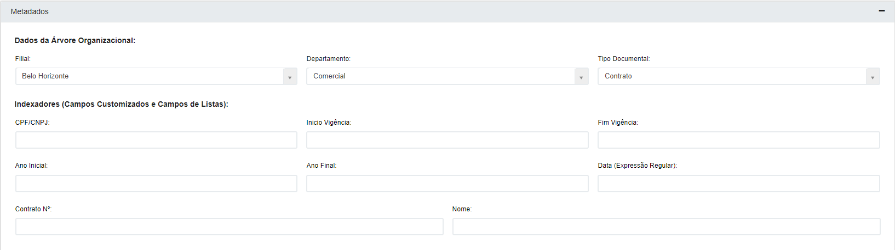
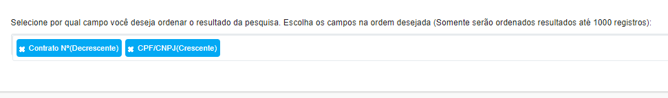
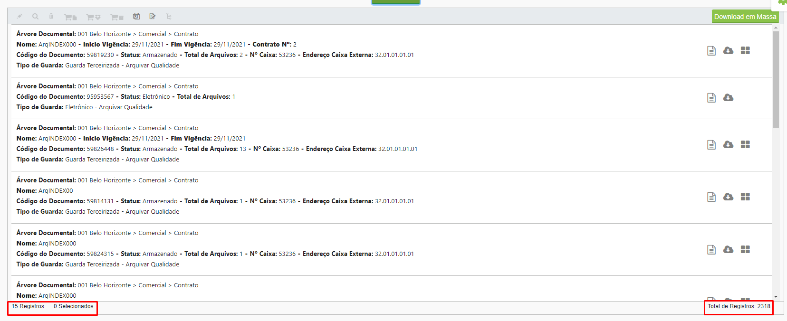

# 🟩 Localização Avançada

Na Localização Avançada a pesquisa por documentos é mais precisa porque para realizá-la podem ser utilizados vários filtros para refinar os resultados. &#x20;

Depois de selecionar o Cliente e a Unidade, podem ser usados diversos filtros relacionados aos Dados Gerais do documento e aos seus metadados indexadores, refinando os resultados até se chegar a um universo de registros menor, em que seja mais fácil localizar o documento desejado. &#x20;

<figure><figcaption>
Clique para ampliar a imagem.
</figcaption></figure>

No campo Dados Gerais podem ser utilizados os seguintes filtros:&#x20;

* **Indexador:** A busca é feita pelo usuário que cadastrou o documento.&#x20;
* **Assinatura:** Pode se realizar a busca por documentos que não foram assinados, que não foram assinados pelo próprio usuário logado, assinados ou assinados pelo próprio usuário logado.&#x20;
* **Data Cadastro:** A busca é feita por período em que o documento foi cadastrado.&#x20;
* **Data Vencimento:** Esse filtro se refere à tabela de temporalidade documental do (TTD) do documento. A busca é feita considerando a data em que o documento vai vencer de acordo com a TTD cadastrada.&#x20;
* **Status:** A busca é feita considerando o status do documento, que pode ser armazenado (alocado na empresa cliente ou na unidade), eletrônico (documento que não existe fisicamente), em indexação (documento que foi criado durante a indexação), emprestado (o documento inteiro foi emprestado para consulta ao cliente), emprestado – parcial (parte do documento foi emprestada para consulta ao cliente) ou excluído (por padrão o sistema busca todos os registros exceto os excluídos, que devem ser buscados selecionando-se essa opção). &#x20;
* **Tipo de Caixa ou Pasta:** A busca é feita considerando os tipos de caixa ou pasta utilizadas pelo cliente, que foram anteriormente associadas a ele na tela [Caixa ou Pasta.](../caixa-ou-pasta/criar.md)&#x20;
* **Código de caixa, subcaixa ou provisório:** A busca é feita considerando o código de caixa, subcaixa ou código provisório da caixa em que o documento está alocado. &#x20;
* **Código do Documento:** A busca é feita considerando o código do documento, criado no momento do [cadastro do documento](cadastrar.md). &#x20;

<figure><figcaption>
Clique para ampliar a imagem.
</figcaption></figure>

Depois de selecionar o cliente, em “Metadados” serão exibidos os campos da árvore organizacional do cliente definidos anteriormente na tela [Árvore Documental > Árvore Organizacional](../arvore-documental/arvore-organizacional.md).&#x20;

A partir da seleção feita nesses campos serão exibidos os campos indexadores, que deverão ser usados para realizar a busca e filtrar os resultados obtidos. Esses campos são aqueles cadastrados para o cliente como [campos de lista](../lista/) ou [campos customizados](../arvore-documental/campo-customizado.md), que foram associados à [arvore organizacional](../arvore-documental/arvore-organizacional.md) do cliente anteriormente. Os campos de lista são exibidos em azul e os campos customizados são exibidos em preto.&#x20;

<figure><figcaption>
Clique para ampliar a imagem.
</figcaption></figure>

Além da possibilidade de filtrar os resultados por meio dos indexadores, é possível ainda ordenar os resultados da pesquisa, escolhendo a ordem dos campos. &#x20;

<figure><figcaption>
Clique para ampliar a imagem.
</figcaption></figure>

***

## Ícones da tela Localização Avançada&#x20;

Ao concluir a busca, serão exibidos os registros encontrados. O total de registros encontrados é exibido no canto inferior direito da tela. &#x20;

<figure><figcaption>
Clique para ampliar a imagem.
</figcaption></figure>

Selecionado um ou mais registros serão habilitados os ícones para as ações:&#x20;

Editar&#x20;

Utilizado para editar informações do registro que estiver selecionado. Será aberta a mesma tela mostrada em Documento > Cadastrar.&#x20;

Visualizar&#x20;

Utilizado para visualizar as informações do registro que estiver selecionado. Será aberta a mesma tela mostrada em Documento > Cadastrar.&#x20;

Excluir&#x20;

Utilizado para excluir o registro que estiver selecionado.&#x20;

Reservar documento&#x20;

Este ícone só será habilitado se houver documento físico associado ao registro selecionado, ou seja, documentos que tenham sido castrados como de “Guarda Interna” ou “Guarda Terceirizada” na tela Documento > Cadastrar. Neste caso será possível solicitar a consulta aos documentos físicos por meio deste ícone.&#x20;

Reservar caixa&#x20;

Este ícone só será habilitado se houver caixa física de documentos associada ao registro selecionado. Neste caso será possível solicitar a consulta aos documentos das caixas por meio deste ícone.&#x20;

Reservar subcaixa&#x20;

Este ícone só será habilitado se houver subcaixa física de documentos associada ao registro selecionado. Neste caso será possível solicitar a consulta aos documentos das subcaixas por meio deste ícone.&#x20;

Exportar&#x20;

Esta opção permite exportar um relatório em formato Excel com os resultados da pesquisa. É possível exportar os resultados de todos os documentos encontrados, apenas os resultados de documentos que estejam emprestados ou apenas resultados de documentos já vencidos.  &#x20;

\[doc38]&#x20;

O relatório gerado sempre mostrará os resultados separados por nó da árvore organizacional do cliente.&#x20;

\[doc39]&#x20;

Assinatura&#x20;

Se o cliente possuir o serviço de Assinatura Digital contratado, será exibido o ícone “Assinatura”. Será possível realizar a assinatura em lote dos arquivos selecionados no grid de todos os arquivos dos resultados da pesquisa realizada (sendo limitado a 300 arquivos por vez).&#x20;

\[doc40]&#x20;

Ativar novo fluxo&#x20;

Utilizado para ativar um novo fluxo com o registro selecionado já associado a ele. Esse ícone só será habilitado se o cliente possuir o serviço ArqFlow contratado. Será aberta a tela “Ativar Novo Fluxo”.&#x20;

\[doc41]&#x20;

Download em Massa&#x20;

O Download em Massa permite que, ao localizar um documento que possua arquivos associados a ele, seja feito o download de todos esses documentos de uma só vez. É possível solicitar um download em massa de documentos por árvore organizacional ou por lista do cliente, no campo “Tipo de Download”.&#x20;

\[doc42]&#x20;

Depois de selecionar o tipo de download é preciso selecionar os itens que se deseja incluir no download em massa e o tipo de arquivo que será gerado, que pode ser arquivo único em formato PDF ou de todos os arquivos em uma pasta ZIP. No arquivo PDF podem também ser incluídas capas separadoras por tipo documental.  &#x20;

\[doc43]&#x20;

IMPORTANTE: O arquivo gerado será disponibilizado em até 24 horas, dependendo do tamanho do arquivo solicitado, no menu Download em Massa.  &#x20;

\[doc44]&#x20;

Ao lado de cada registro outros ícones podem ser exibidos. São eles:&#x20;

Endereço: Passando o mouse sobre esse ícone será possível ver o código do endereço onde aquele documento está alocado na unidade Arquivar ou na estrutura própria do cliente (documentos de Guarda Interna ou Guarda Terceirizada).&#x20;

\[doc46]&#x20;

Editar: Clicando neste botão será possível editar os campos indexadores do documento.&#x20;

Download: Clicando neste ícone será possível realizar o download dos arquivos do documento selecionado.&#x20;
