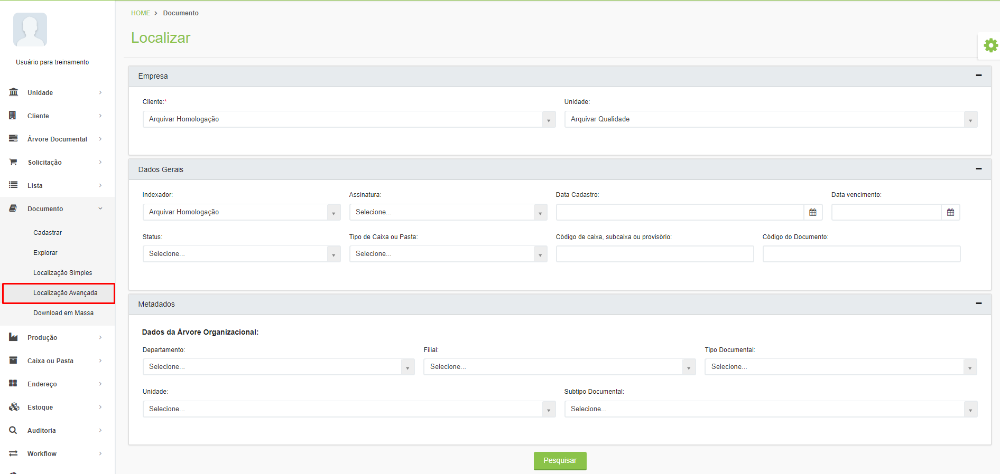
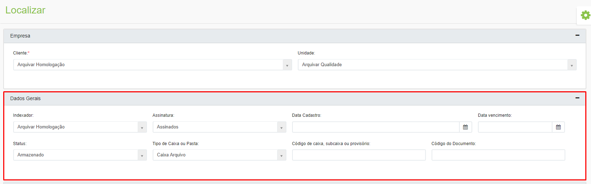
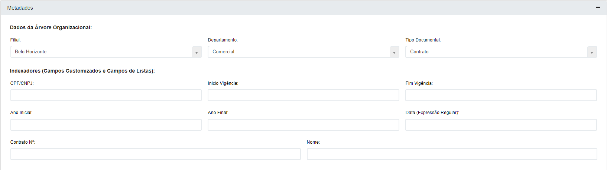
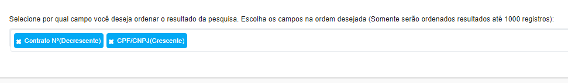
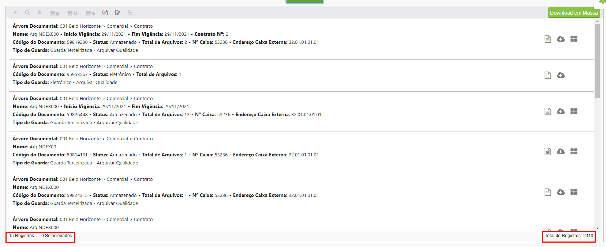

# 🟩 Localização Avançada



Na Localização Avançada a pesquisa por documentos é mais precisa porque para realizá-la podem ser utilizados vários filtros para refinar os resultados.

Depois de selecionar o Cliente e a Unidade, podem ser usados diversos filtros relacionados aos Dados Gerais do documento e aos seus metadados indexadores, refinando os resultados até se chegar a um universo de registros menor, em que seja mais fácil localizar o documento desejado.

<figure><figcaption>
Clique para ampliar a imagem.
</figcaption></figure>

No campo Dados Gerais podem ser utilizados os seguintes filtros:

* **Indexador:** A busca é feita pelo usuário que cadastrou o documento.
* **Assinatura:** Pode se realizar a busca por documentos que não foram assinados, que não foram assinados pelo próprio usuário logado, assinados ou assinados pelo próprio usuário logado.
* **Data Cadastro:** A busca é feita por período em que o documento foi cadastrado.
* **Data Vencimento:** Esse filtro se refere à tabela de temporalidade documental do (TTD) do documento. A busca é feita considerando a data em que o documento vai vencer de acordo com a TTD cadastrada.
* **Status:** A busca é feita considerando o status do documento, que pode ser armazenado (alocado na empresa cliente ou na unidade), eletrônico (documento que não existe fisicamente), em indexação (documento que foi criado durante a indexação), emprestado (o documento inteiro foi emprestado para consulta ao cliente), emprestado – parcial (parte do documento foi emprestada para consulta ao cliente) ou excluído (por padrão o sistema busca todos os registros exceto os excluídos, que devem ser buscados selecionando-se essa opção).
* **Tipo de Caixa ou Pasta:** A busca é feita considerando os tipos de caixa ou pasta utilizadas pelo cliente, que foram anteriormente associadas a ele na tela [Caixa ou Pasta.](../caixa-ou-pasta/criar.md)
* **Código de caixa, subcaixa ou provisório:** A busca é feita considerando o código de caixa, subcaixa ou código provisório da caixa em que o documento está alocado.
* **Código do Documento:** A busca é feita considerando o código do documento, criado no momento do [cadastro do documento](cadastrar.md).

<figure><figcaption>
Clique para ampliar a imagem.
</figcaption></figure>

Depois de selecionar o cliente, em “Metadados” serão exibidos os campos da árvore organizacional do cliente definidos anteriormente na tela [Árvore Documental > Árvore Organizacional](../arvore-documental/arvore-organizacional.md).

A partir da seleção feita nesses campos serão exibidos os campos indexadores, que deverão ser usados para realizar a busca e filtrar os resultados obtidos. Esses campos são aqueles cadastrados para o cliente como [campos de lista](../lista/) ou [campos customizados](../arvore-documental/campo-customizado.md), que foram associados à [arvore organizacional](../arvore-documental/arvore-organizacional.md) do cliente anteriormente. Os campos de lista são exibidos em azul e os campos customizados são exibidos em preto.

<figure><figcaption>
Clique para ampliar a imagem.
</figcaption></figure>

Além da possibilidade de filtrar os resultados por meio dos indexadores, é possível ainda ordenar os resultados da pesquisa, escolhendo a ordem dos campos.

<figure><figcaption>
Clique para ampliar a imagem.
</figcaption></figure>

## Regra de pesquisa em campos indexadores

### Texto

**Busca por conteúdo (Padrão)**

Por padrão, o sistema localiza qualquer registro que contenha o texto digitado, mesmo que ele faça parte de uma palavra ou frase maior.

* **Exemplo:** Pesquisar por Relatório encontrará resultados como “Relatório Anual” e “Novo relatório de vendas”.

**Busca Exata**

Para localizar uma expressão exatamente como foi digitada, utilize aspas duplas (“) ao redor do termo.

* **Exemplo:** Pesquisar por “Relatório Anual” trará apenas os registros que correspondem exatamente a “Relatório Anual”.

**Busca com Curinga (%),**

Ao incluir o caractere % na sua pesquisa, ele atuará como um curinga, representando qualquer sequência de caracteres.

* **Exemplo:** Pesquisar por Nota%Fiscal retornará registros como “Nota Fiscal” e “Nota de Serviço Fiscal”.

### CPF - CNPJ - CNPJ/CPF

**Ignora Formatação**

Você pode digitar os números com ou sem pontuação, como pontos, traços ou barras. O sistema considera apenas os números, independentemente do formato.

* **Exemplo:** Pesquisar por 123.456.789-00 ou por 12345678900 retornará os mesmos resultados.

### Numérico

**Busca Numérica Exata**

O sistema interpreta os valores como números, e não como texto. Por isso, a busca deve ser feita com o número exato que deseja encontrar.

* **Exemplo:** Pesquisar por 2024 localizará o campo que contém exatamente o número “2024”.

### Data

**Busca por Data Exata**

A pesquisa deve ser feita utilizando o formato completo da data no padrão dd/mm/aaaa.

* **Exemplo:** Para encontrar registros do dia 15 de julho de 2025, pesquise por 15/07/2025.

### Hora

**Busca por Hora Exata**

Utilize o formato de hora hh:mm:ss para localizar registros em um horário específico.

* **Exemplo:** Para encontrar registros das 14h30, pesquise por 14:30:00.

### Data e Hora

**Busca por Data e Hora Exata**

A pesquisa deve combinar o formato de data e hora no padrão dd/mm/aaaa hh:mm:ss.

* **Exemplo:** Para encontrar registros do dia 15/07/2025 às 14h30, pesquise por 15/07/2025 14:30:00.

### Monetário

**Busca Exata**

A pesquisa deve ser feita com o valor exato, incluindo vírgulas ou pontos decimais conforme registrados no sistema.

* **Exemplo:** Se o valor cadastrado for 150,50, você deve pesquisar exatamente por 150,50.

### CheckBox

**Busca Exata**

A busca considera apenas os campos em que a opção estiver exatamente marcada. O filtro só é aplicado se o CheckBox estiver selecionado.

### Outros Tipos

**Busca Exata**

Para todos os demais tipos de campos não especificados acima, aplica-se a busca por correspondência exata. O conteúdo digitado deve ser idêntico ao que está no campo.

* **Exemplo:** Se o campo de e-mail contiver nome@exemplo.com, você deve pesquisar exatamente por nome@exemplo.com.

***

## Ícones da tela Localização Avançada

Ao concluir a busca, serão exibidos os registros encontrados. O total de registros encontrados é exibido no canto inferior direito da tela.

<figure><figcaption>
Clique para ampliar a imagem.
</figcaption></figure>

Selecionado um ou mais registros serão habilitados os ícones para as ações:

### Editar

Utilizado para editar informações do registro que estiver selecionado. Será aberta a mesma tela mostrada em [Documento > Cadastrar](cadastrar.md).

### Visualizar

Utilizado para visualizar as informações do registro que estiver selecionado. Será aberta a mesma tela mostrada em [Documento > Cadastrar](cadastrar.md).

### Excluir

Utilizado para excluir o registro que estiver selecionado.

### Reservar documento

Este ícone só será habilitado se houver documento físico associado ao registro selecionado, ou seja, documentos que tenham sido castrados como de “Guarda Interna” ou “Guarda Terceirizada” na tela [Documento > Cadastrar](cadastrar.md). Neste caso será possível [solicitar a consulta](../solicitacao/consulta.md) aos documentos físicos por meio deste ícone.

### Reservar caixa

Este ícone só será habilitado se houver caixa física de documentos associada ao registro selecionado. Neste caso será possível [solicitar a consulta](../solicitacao/consulta.md) aos documentos das caixas por meio deste ícone.

### Reservar subcaixa

Este ícone só será habilitado se houver subcaixa física de documentos associada ao registro selecionado. Neste caso será possível [solicitar a consulta](../solicitacao/consulta.md) aos documentos das subcaixas por meio deste ícone.

### Exportar

Esta opção permite exportar um relatório em formato Excel com os resultados da pesquisa. É possível exportar os resultados de todos os documentos encontrados, apenas os resultados de documentos que estejam emprestados ou apenas resultados de documentos já vencidos.

<figure><figcaption></figcaption></figure>

O relatório gerado sempre mostrará os resultados separados por nó da árvore organizacional do cliente.

<figure><figcaption>
Clique para ampliar a imagem.
</figcaption></figure>


<mark style="color:orange;">Relatórios com menos de 20 mil linhas, são exibidos na tela do usuário no momento da solicitação. Já os relatórios com mais de 20 mil linhas, a solicitação é encaminhada para a lista de</mark> [<mark style="color:orange;">Download em Massa</mark>](download-em-massa.md)<mark style="color:orange;">.</mark>


### Assinatura

Se o cliente possuir o serviço de Assinatura Digital contratado, será exibido o ícone “Assinatura”. Será possível realizar a assinatura em lote dos arquivos selecionados no grid de todos os arquivos dos resultados da pesquisa realizada (sendo limitado a 300 arquivos por vez).

<figure><figcaption>
Clique na imagem para ampliar.
</figcaption></figure>

Para executar a assinatura de documentos, é necessário realizar a [instalação do ArqClient](explorar/modulo-arqscan.md#instalando-o-arqclient) na máquina onde o processo será executado.


<mark style="color:orange;">Para assinatura de documentos tratados em conformidade com o Decreto 10.278, os arquivos que atingirem 300MB ou mais deverão ser tratados com o fracionamento em partes sequenciais devidamente nomeadas. Caso haja numeração preexistente, como o número de atendimento, sugerimos utilizar essa identificação no nome do arquivo para facilitar a organização e a futura localização do registro no ArqGED.</mark>

<mark style="color:orange;">**Exemplo:**</mark>

<mark style="color:orange;">Prontuário de atendimento nº 100, o fracionamento correto do arquivo deve ser:</mark>

<mark style="color:orange;">100 parte 01/03.pdf</mark>

<mark style="color:orange;">100 parte 02/03.pdf</mark>

<mark style="color:orange;">100 parte 03/03.pdf</mark>

<mark style="color:orange;">Esse procedimento visa otimizar o manuseio e a entrega dos arquivos, evitando possíveis dificuldades no processo de assinatura do acervo.</mark>



<mark style="color:red;">Em conformidade com o Decreto nº 10.278/2020, que estabelece os requisitos técnicos para a digitalização de documentos públicos e privados, o processo de assinatura do documento digitalizado tem como finalidade atestar a integridade e a autenticidade do processo de digitalização. Dessa forma, o documento deve ser assinado digitalmente pelo responsável que realizou a digitalização.</mark>

<mark style="color:red;">No momento da assinatura digital, é gerado um</mark> <mark style="color:red;"></mark>_<mark style="color:red;">**hash**</mark>_ <mark style="color:red;"></mark><mark style="color:red;">criptográfico que garante que o arquivo não sofreu qualquer forma de alteração na digitalização. Caso o documento seja manipulado ou modificado posteriormente, esse</mark> <mark style="color:red;"></mark>_<mark style="color:red;">**hash**</mark>_ <mark style="color:red;"></mark><mark style="color:red;">é automaticamente corrompido, colocando o arquivo em desconformidade com os requisitos estabelecidos pelo Decreto nº 10.278/2020.</mark>

<mark style="color:red;">Portanto,</mark> <mark style="color:red;"></mark><mark style="color:red;">**não se deve realizar qualquer tipo de manipulação ou edição no documento**</mark><mark style="color:red;">, sob pena de invalidação do processo e perda da conformidade normativa.</mark>


### Ativar novo fluxo

Utilizado para ativar um novo fluxo com o registro selecionado já associado a ele. Esse ícone só será habilitado se o cliente possuir o serviço ArqFlow contratado. Será aberta a tela “[Ativar Novo Fluxo](localizacao-avancada.md#ativar-novo-fluxo)”.

<figure><figcaption></figcaption></figure>

### Download em Massa

O Download em Massa permite que, ao localizar um documento que possua arquivos associados a ele, seja feito o download de todos esses documentos de uma só vez. É possível solicitar um download em massa de documentos por árvore organizacional ou por lista do cliente, no campo “Tipo de Download”.

<figure><figcaption>
Clique para ampliar a imagem.
</figcaption></figure>

Depois de selecionar o tipo de download é preciso selecionar os itens que se deseja incluir no download em massa e o tipo de arquivo que será gerado, que pode ser arquivo único em formato PDF ou de todos os arquivos em uma pasta ZIP. No arquivo PDF podem também ser incluídas capas separadoras por tipo documental.

<figure><figcaption>
Clique para ampliar a imagem.
</figcaption></figure>


<mark style="color:orange;">**O arquivo gerado será disponibilizado em até 24 horas, dependendo do tamanho do arquivo solicitado, no menu**</mark> [<mark style="color:blue;">**Download em Massa**</mark>](download-em-massa.md)<mark style="color:orange;">**.**</mark>


<figure><figcaption>
Clique para ampliar a imagem.
</figcaption></figure>

Ao lado de cada registro outros ícones podem ser exibidos. São eles:

**Endereço:** Passando o mouse sobre esse ícone será possível ver o código do endereço onde aquele documento está alocado na unidade Arquivar ou na estrutura própria do cliente (documentos de Guarda Interna ou Guarda Terceirizada).

<figure><figcaption></figcaption></figure>

**Editar:** Clicando neste botão será possível editar os campos indexadores do documento.

**Download:** Clicando neste ícone será possível realizar o download dos arquivos do documento selecionado.


Se ao tentar realizar o download do arquivo for exibida a mensagem **"Não foi possível carregar o plug-in"**, siga os passos abaixo para ajustar as configurações do navegador:

1. Acesse as configurações do navegador.
2. Navegue até **Privacidade e Segurança**.
3. Localize a opção **Documentos em PDF** ou similar.
4. Em **Comportamento Padrão**, selecione a opção **Fazer o download dos PDFs**.

Essa configuração é padrão do navegador e pode interferir na visualização ou no download dos arquivos PDF, sendo necessário ajustá-la para corrigir o problema.

