# 🟩 Localização Simples

A Localização Simples funciona como uma busca geral, ou seja, é necessário apenas informar um termo ou código que se esteja buscando e selecionar o cliente ao qual o documento que se busca está relacionado. &#x20;

<figure>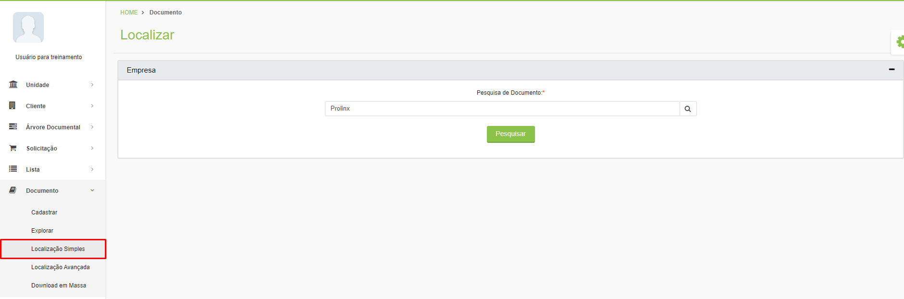<figcaption>
Clique para ampliar a imagem.
</figcaption></figure>

É possível utilizar alguns filtros para refinar a busca informando a Unidade, o Universo de Trabalho, a Árvore Organizacional e selecionando se deseja aplicar a pesquisa no universo de busca de metadados, de arquivos ou ambos.   &#x20;


<mark style="color:orange;">**Por padrão, o sistema realiza a busca por metadados (campos indexadores), mas se o cliente possuir os serviços ArqOCR e ArqSEARCH contratados, será possível realizar a busca pelo conteúdo dos arquivos PDF gerados via**</mark> [<mark style="color:blue;">**ArqSCAN**</mark>](explorar/modulo-arqscan.md)<mark style="color:orange;">**.**</mark>


<figure>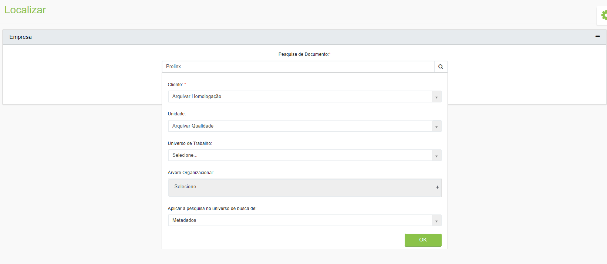<figcaption>
Clique para ampliar a imagem.
</figcaption></figure>

Ao clicar em “Pesquisar” o sistema retornará como resultado todos os registros que contenham o texto ou código informados, desde os nós da árvore do cliente até os campos de indexação dos documentos. Esse tipo de busca retorna um resultado mais amplo. &#x20;

<figure>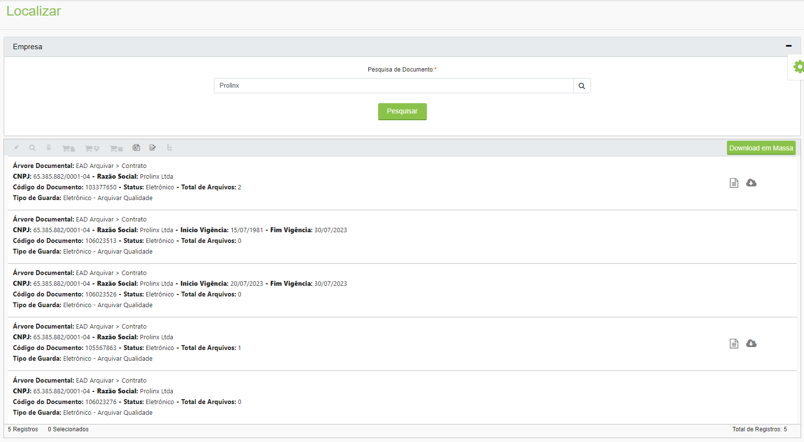<figcaption>
Clique para ampliar a imagem.
</figcaption></figure>

***

## Ícones da tela Localização Simples&#x20;

Ao concluir a busca, serão exibidos os registros encontrados. O total de registros encontrados é exibido no canto inferior direito da tela. &#x20;

<figure>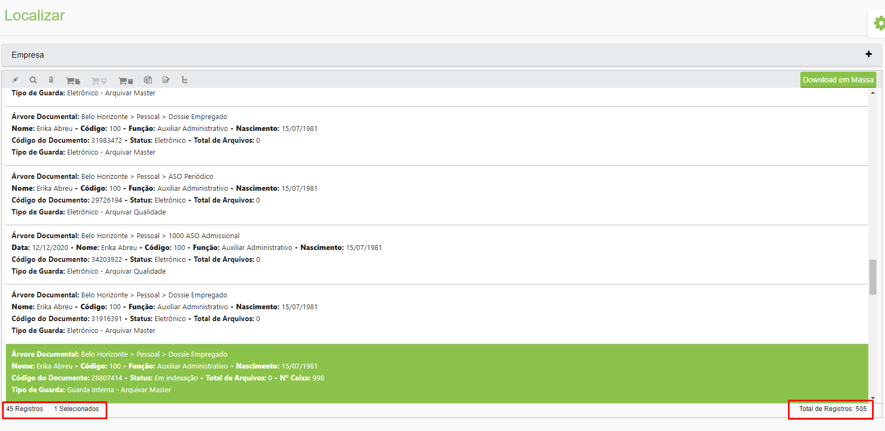<figcaption>
Clique para ampliar a imagem.
</figcaption></figure>

Selecionado um ou mais registros serão habilitados os ícones para as ações:&#x20;

<figure>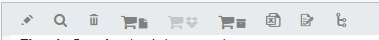<figcaption>
Clique para ampliar a imagem.
</figcaption></figure>

### Editar&#x20;

Utilizado para editar informações do registro que estiver selecionado. Será aberta a mesma tela mostrada em [Documento > Cadastrar](cadastrar.md).&#x20;

### Visualizar&#x20;

Utilizado para visualizar as informações do registro que estiver selecionado. Será aberta a mesma tela mostrada em [Documento > Cadastrar](cadastrar.md).&#x20;

### Excluir&#x20;

Utilizado para excluir o registro que estiver selecionado.&#x20;

### Reservar documento&#x20;

Este ícone só será habilitado se houver documento físico associado ao registro selecionado, ou seja, documentos que tenham sido castrados como de “Guarda Interna” ou “Guarda Terceirizada” na tela [Documento > Cadastrar](cadastrar.md). Neste caso será possível [solicitar a consulta](../solicitacao/consulta.md) aos documentos físicos por meio deste ícone.&#x20;

### Reservar caixa&#x20;

Este ícone só será habilitado se houver caixa física de documentos associada ao registro selecionado. Neste caso será possível [solicitar a consulta](../solicitacao/consulta.md) aos documentos das caixas por meio deste ícone.&#x20;

### Reservar subcaixa&#x20;

Este ícone só será habilitado se houver subcaixa física de documentos associada ao registro selecionado. Neste caso será possível [solicitar a consulta](../solicitacao/consulta.md) aos documentos das subcaixas por meio deste ícone.&#x20;

### Exportar&#x20;

Esta opção permite exportar um relatório em formato Excel com os resultados da pesquisa. É possível exportar os resultados de todos os documentos encontrados, apenas os resultados de documentos que estejam emprestados ou apenas resultados de documentos já vencidos.  &#x20;

<figure>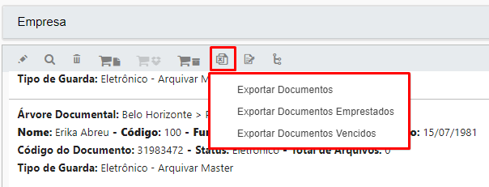<figcaption>
Clique para ampliar a imagem.
</figcaption></figure>

O relatório gerado sempre mostrará os resultados separados por nó da árvore organizacional do cliente.&#x20;

<figure>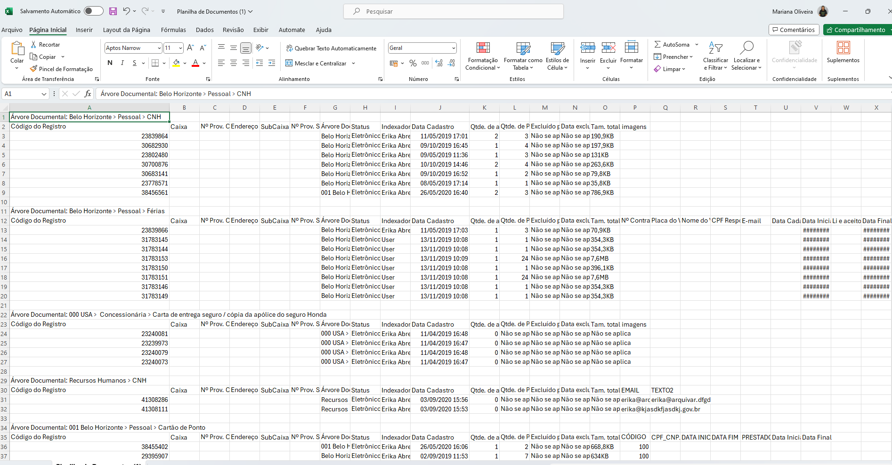<figcaption>
Clique para ampliar a imagem.
</figcaption></figure>

### Assinatura&#x20;

Se o cliente possuir o serviço de Assinatura Digital contratado, será exibido o ícone “Assinatura”. Será possível realizar a assinatura em lote dos arquivos selecionados no grid de todos os arquivos dos resultados da pesquisa realizada (sendo limitado a 300 arquivos por vez).&#x20;

<figure>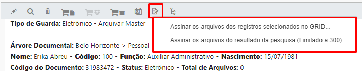<figcaption>
Clique para ampliar a imagem.
</figcaption></figure>

### Ativar novo fluxo&#x20;

Utilizado para ativar um novo fluxo com o registro selecionado já associado a ele. Esse ícone só será habilitado se o cliente possuir o serviço ArqFlow contratado. Será aberta a tela “[Ativar Novo Fluxo](localizacao-simples.md#ativar-novo-fluxo)”.&#x20;

<figure>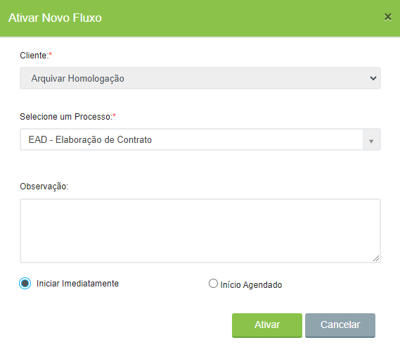<figcaption></figcaption></figure>

### Download em Massa&#x20;

O Download em Massa permite que, ao localizar um documento que possua arquivos associados a ele, seja feito o download de todos esses documentos de uma só vez. &#x20;

<figure>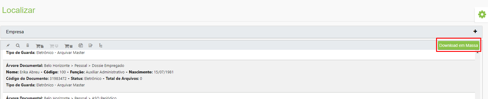<figcaption>
Clique para ampliar a imagem.
</figcaption></figure>

É possível solicitar um download em massa de documentos por árvore organizacional ou por lista do cliente, no campo “Tipo de Download”.&#x20;

<figure>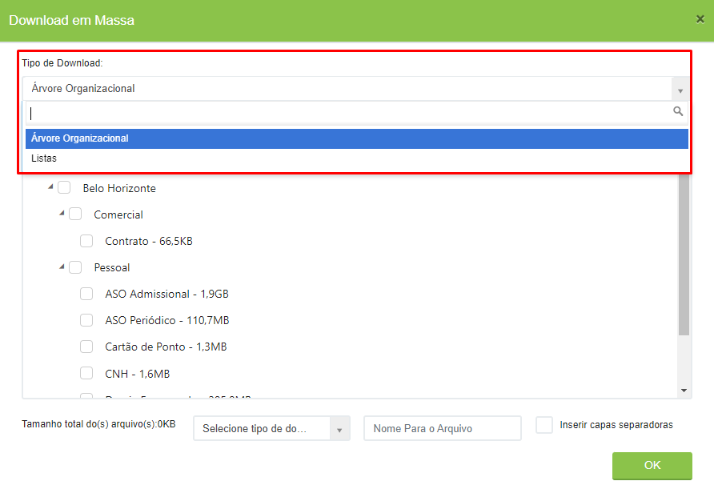<figcaption>
Clique para ampliar a imagem.
</figcaption></figure>

Depois de selecionar o tipo de download é preciso selecionar os itens que se deseja incluir no download em massa e o tipo de arquivo que será gerado, que pode ser arquivo único em formato PDF ou de todos os arquivos em uma pasta ZIP. No arquivo PDF podem também ser incluídas capas separadoras por tipo documental.  &#x20;


<mark style="color:orange;">**O arquivo gerado será disponibilizado em até 24 horas, dependendo do tamanho do arquivo solicitado, no menu**</mark> [<mark style="color:orange;">**Download em Massa**</mark>](download-em-massa.md)<mark style="color:orange;">**.**</mark>**  **&#x20;


<figure>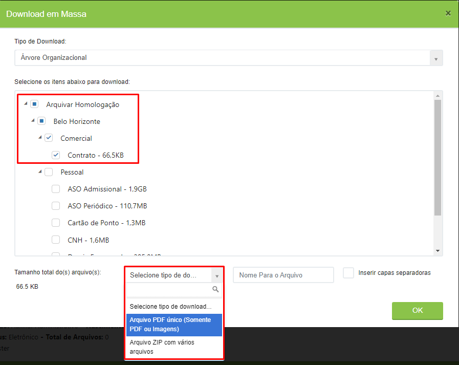<figcaption>
Clique para ampliar a imagem.
</figcaption></figure>

Ao lado de cada registro outros ícones podem ser exibidos. São eles:&#x20;

<figure>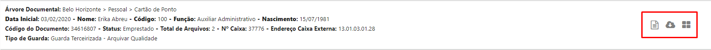<figcaption>
Clique para ampliar a imagem.
</figcaption></figure>

**Endereço:** Passando o mouse sobre esse ícone será possível ver o código do endereço onde aquele documento está alocado na unidade Arquivar ou na estrutura própria do cliente (documentos de Guarda Interna ou Guarda Terceirizada).&#x20;

<figure>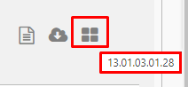<figcaption></figcaption></figure>

**Editar:** Clicando neste botão será possível editar os campos indexadores do documento.&#x20;

**Download:** Clicando neste ícone será possível realizar o download dos arquivos do documento selecionado.&#x20;
