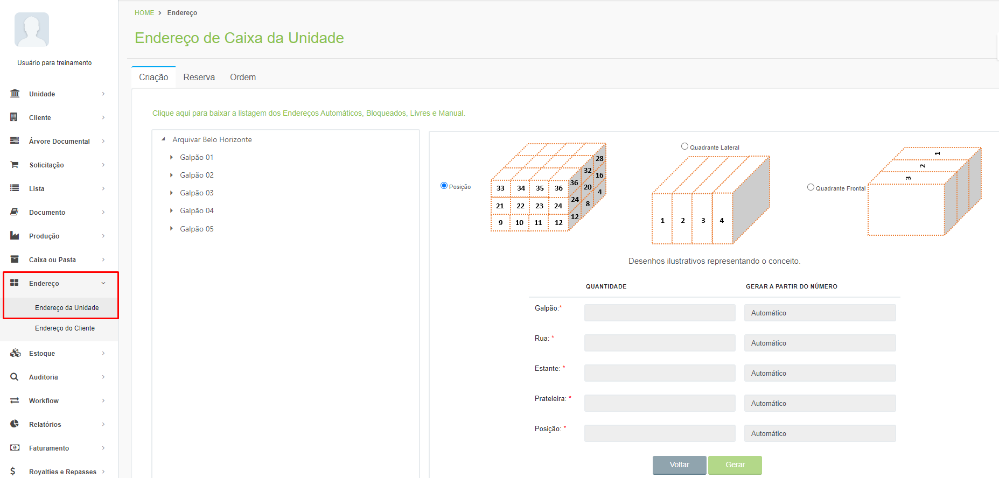
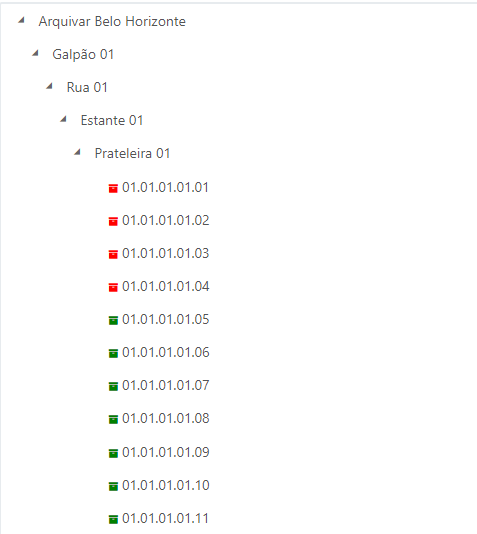
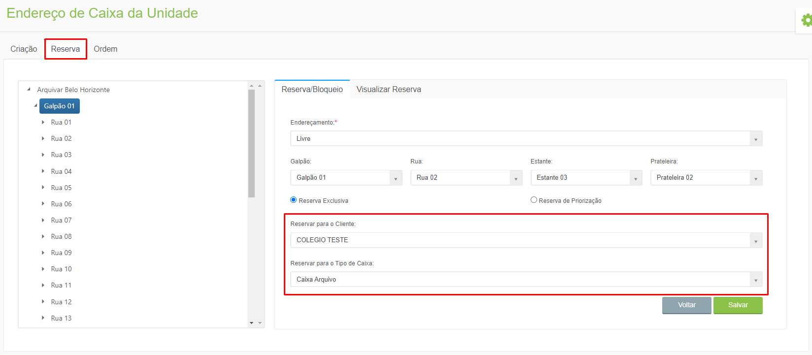
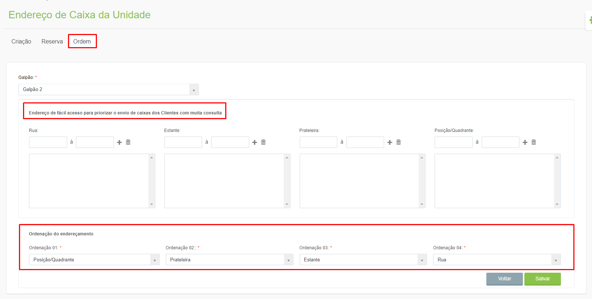

# 🟩 Endereço da Unidade

Na tela de Endereço da Unidade são mostradas todas as posições de armazenamento que a unidade Arquivar possui, divididas por galpão, rua, estante e prateleira. &#x20;

<figure><figcaption>
Clique para ampliar a imagem.
</figcaption></figure>

Ao clicar nos endereços e descer até o último nível que é a posição será possível visualizar quais espaços estão disponíveis, de acordo com o ícone (verde = livre e vermelho = ocupado).&#x20;

<figure><figcaption></figcaption></figure>

Na aba Reserva é possível bloquear ou direcionar o endereçamento de um galpão, rua, estante ou prateleira. É possível também reservar um endereço para um cliente específico e para determinado tipo de caixa. &#x20;

<figure><figcaption>
Clique para ampliar a imagem.
</figcaption></figure>

Na aba Ordem é possível definir a ordem de preenchimento dos espaços e informar quais são os endereços de fácil acesso dentro do galpão.  &#x20;

<figure><figcaption>
Clique para ampliar a imagem.
</figcaption></figure>
