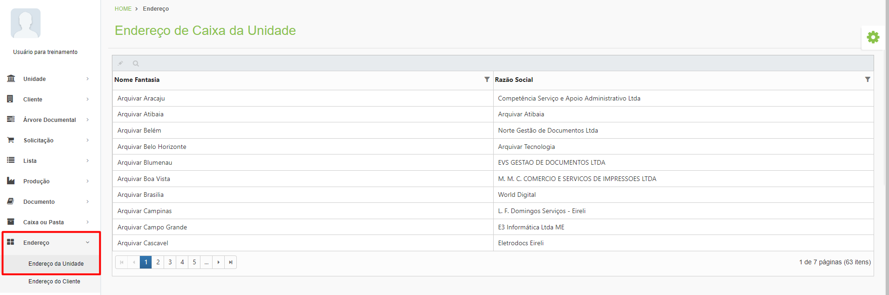
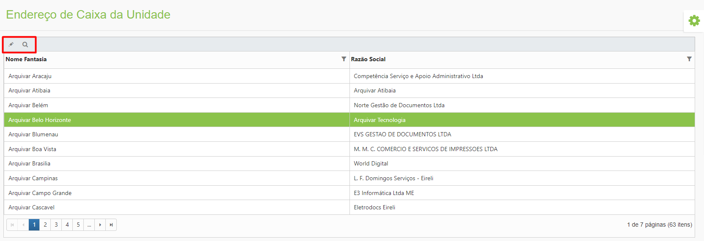
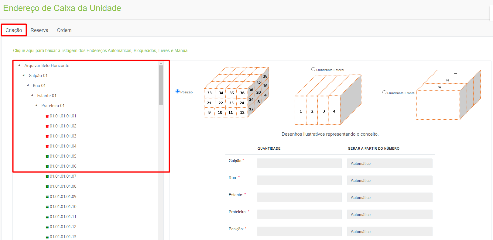
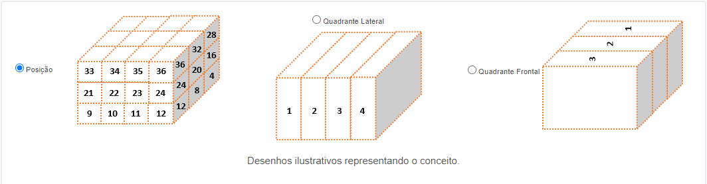
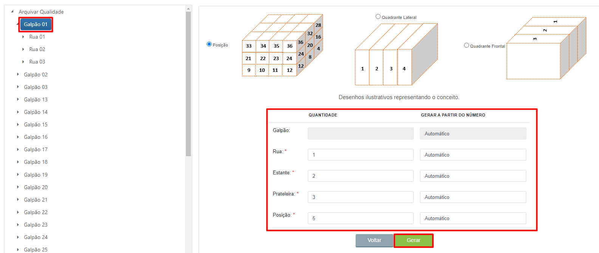
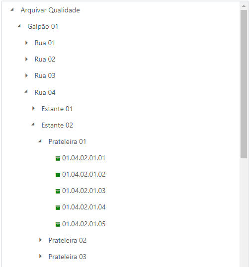
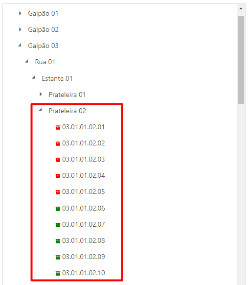
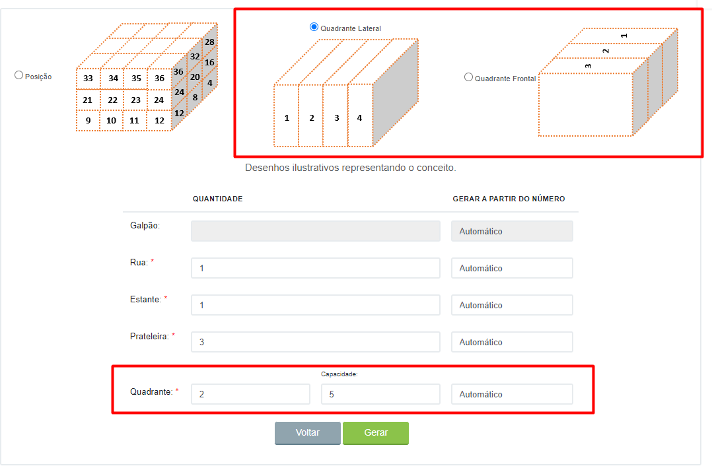
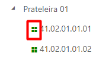
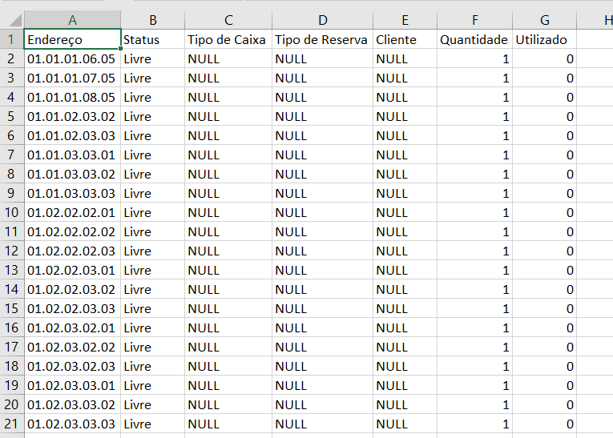

# 🟩 Endereço da Unidade

Na tela Endereço da Unidade são mostradas todas as unidades Arquivar.


<mark style="color:orange;">**As unidades mostradas nesta tela foram anteriormente cadastradas no**</mark> [<mark style="color:orange;">**menu Unidade**</mark>](../)<mark style="color:orange;">**.**</mark>


<figure><figcaption>
Clique na imagem para ampliar.
</figcaption></figure>

***

## Endereço da Unidade – Tela inicial&#x20;

**Ícone Editar:** Utilizado para realizar a edição e criação das posições de armazenamento da unidade selecionada. &#x20;

**Ícone Visualizar:** Utilizado para visualizar detalhes das posições de armazenamento da unidade selecionada.&#x20;

**Coluna Nome Fantasia:** Exibe o nome fantasia da unidade Arquivar.&#x20;

**Coluna Razão Social:** Exibe a razão social da unidade Arquivar.&#x20;


<mark style="color:blue;">**NOME FANTASIA X RAZÃO SOCIAL:**</mark> <mark style="color:blue;"></mark><mark style="color:blue;">O nome fantasia de uma empresa é como ela vai ser conhecida ou reconhecida pelo público. É definido na hora da formalização, considerando o mercado e a área de atuação. Já a razão social, é o nome oficial do empreendimento no registro, usada em contratos, Nota Fiscal e documentos oficiais.</mark>&#x20;


<figure><figcaption>
Clique na imagem para ampliar.
</figcaption></figure>

***

## Criação de Endereço da Unidade&#x20;

### Aba Criação&#x20;

Selecione a unidade desejada e clique no ícone “Editar”. Na aba Criação são exibidos são exibidas todas as posições de armazenamento que a unidade possui, divididas por galpão, rua, estante e prateleira no lado esquerdo da tela.&#x20;

<figure><figcaption>
Clique na imagem para ampliar.
</figcaption></figure>

Para criar locais de armazenamento, selecione se serão criados dentro de uma posição, em um quadrante lateral ou em um quadrante frontal no lado direito da tela.&#x20;

<figure><figcaption>
Clique na imagem para ampliar.
</figcaption></figure>

**Posição:** Se selecionada esta opção, o local de armazenamento será criado em uma posição exata, devendo ser informado o endereço completo de armazenamento da caixa no momento de alocação.&#x20;

**Quadrante Lateral:** Se selecionada essa opção, o local de armazenamento da caixa poderá ser em qualquer posição, desde que dentro de um dos quadrantes laterais. As caixas serão endereçadas até o quadrante onde estão acondicionadas.&#x20;

**Quadrante Frontal:** Se selecionada essa opção, o local de armazenamento da caixa poderá ser em qualquer posição, desde que dentro de um dos quadrantes frontais. As caixas serão endereçadas até o quadrante onde estão acondicionadas.&#x20;

Ao selecionar um local de armazenamento no lado esquerdo, serão criadas posições dentro daquele espaço. Deve-se informar a quantidade de posições que devem ser criadas para cada um dos níveis seguintes e informar se a geração deve seguir a partir de algum número específico ou de forma automática. Para concluir, clique em “Gerar”.&#x20;


<mark style="color:blue;">**EXEMPLO:**</mark> <mark style="color:blue;"></mark><mark style="color:blue;">Observe que a criação no lado direito começa a partir do nível imediatamente inferior ao nível selecionado no lado esquerdo. Por exemplo, se desejar criar uma rua, selecione na lista uma posição no nível anterior (neste caso, um dos galpões). Serão apresentados os campos Rua, Estante, Prateleira e Posição para preenchimento e criação de locais dentro daquele galpão</mark>. &#x20;


<figure><figcaption>
Clique na imagem para ampliar.
</figcaption></figure>

As posições geradas poderão ser visualizadas na parte esquerda da tela ao clicar nos endereços e descer até o último nível.&#x20;

<figure><figcaption>
Clique na imagem para ampliar.
</figcaption></figure>

Ao chegar ao último nível (prateleira) será possível visualizar quais espaços estão disponíveis, de acordo com o ícone (verde = livre e vermelho = ocupado).&#x20;

<figure><figcaption>
Clique na imagem para ampliar.
</figcaption></figure>

O ideal é que a criação das posições seja feita do geral para o individual, ou seja, que seja feita a criação dos espaços comuns primeiro e depois sejam acrescentadas as posições avulsas.&#x20;


<mark style="color:blue;">**EXEMPLO:**</mark> <mark style="color:blue;"></mark><mark style="color:blue;">Se necessária a criação de cinco prateleiras em que quatro possuem dez posições cada e uma possui doze posições, crie cinco prateleiras com dez posições e depois acrescente mais duas posições àquela com doze lugares.</mark> &#x20;


Se o local estiver sendo criado em um quadrante lateral ou frontal, deverá ser informado o número de quadrantes a serem criados e capacidade de armazenamento de cada um. Neste caso não será preciso informar a quantidade de posições. &#x20;

<figure><figcaption>
Clique na imagem para ampliar.
</figcaption></figure>

Ao ser criado o quadrante, no lado esquerdo da tela serão exibidos os lotes de caixas disponíveis, ao invés das posições específicas. &#x20;

<figure><figcaption>
Clique na imagem para ampliar.
</figcaption></figure>

Nesta aba também é possível baixar uma lista com todos os endereços automáticos, bloqueados, livres e manuais disponíveis na unidade.&#x20;

<figure><figcaption>
Clique na imagem para ampliar.
</figcaption></figure>

 

<figure><figcaption>
Clique na imagem para ampliar.
</figcaption></figure>

