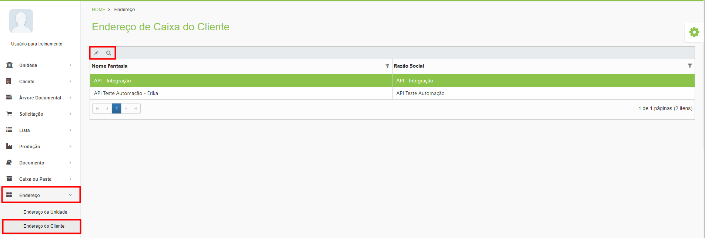
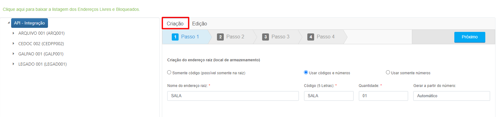
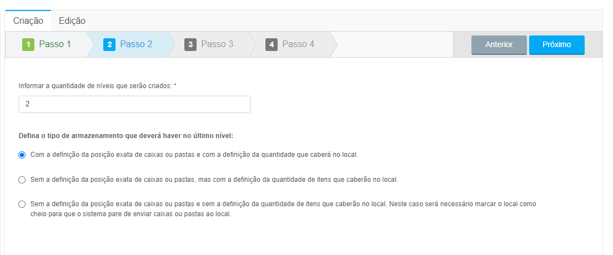
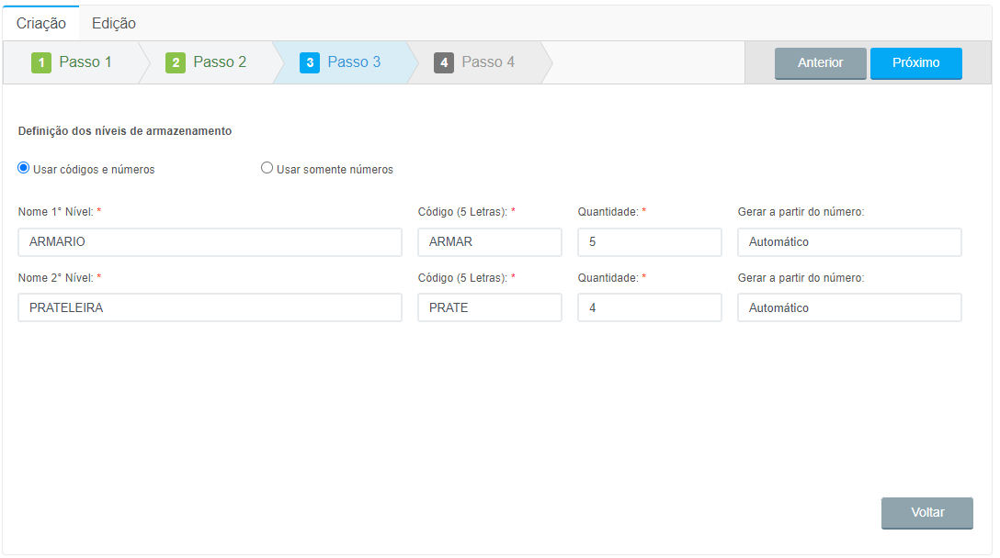
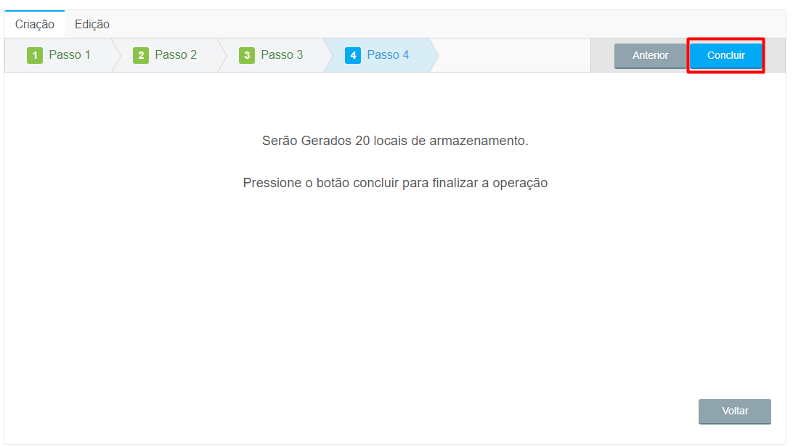
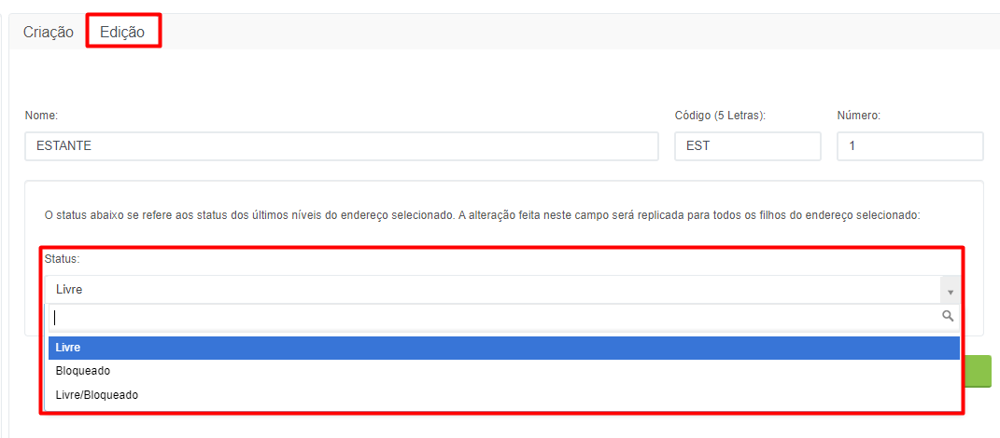

# 🟩 Endereço do Cliente

Na tela de Endereço do Cliente são mostradas todas as posições de armazenamento que o cliente possui em seu espaço físico, como salas, galpões, armários etc.&#x20;

## Endereço do Cliente – Tela inicial&#x20;

Na tela inicial de Endereço do Cliente são mostrados todos os clientes da unidade Arquivar do usuário logado. &#x20;

**Ícone Editar:** Utilizado para realizar a edição e criação das posições de armazenamento do cliente selecionado. &#x20;

**Ícone Visualizar:** Utilizado para visualizar detalhes das posições de armazenamento do cliente selecionado.&#x20;

**Coluna Nome Fantasia:** Exibe o nome fantasia do cliente.&#x20;

**Coluna Razão Social:** Exibe a razão social do cliente.&#x20;


<mark style="color:blue;">**NOME FANTASIA X RAZÃO SOCIAL:**</mark> <mark style="color:blue;"></mark><mark style="color:blue;">O nome fantasia de uma empresa é como ela vai ser conhecida ou reconhecida pelo público. É definido na hora da formalização, considerando o mercado e a área de atuação. Já a razão social, é o nome oficial do empreendimento no registro, usada em contratos, Nota Fiscal e documentos oficiais.</mark>&#x20;


<figure><figcaption>
Clique na imagem para ampliar.
</figcaption></figure>

***

## Criação de Endereço do Cliente&#x20;

### Aba Criação&#x20;

Na aba Criação são exibidos são exibidas todas as posições de armazenamento que o cliente possui no lado esquerdo da tela.&#x20;

Para criar um espaço de armazenamento siga os passos a seguir: &#x20;

1\.  Informe um nome para o endereço raiz e um código de cinco letras para esse endereço. É preciso também definir se será utilizado apenas o código, o código e números ou somente números para identificação do endereço que está sendo criado. O endereço raiz é o primeiro nível de armazenamento, que abrigará todos os outros níveis. Caso deseje utilizar um endereço raiz já existente, selecione-o na parte esquerda da tela e para ser direcionado para o próximo passo.&#x20;


<mark style="color:blue;">**EXEMPLO:**</mark> <mark style="color:blue;"></mark><mark style="color:blue;">Imagine que o cliente possui seu arquivo inteiro em uma sala de sua sede. Neste caso, o endereço raiz pode ser “SALA 01”, e os demais níveis podem ser armários, prateleiras, gavetas etc.</mark>


<figure><figcaption>
Clique na imagem para ampliar.
</figcaption></figure>

2\. Informe a quantidade de níveis de armazenamento que aquele endereço terá e se nesse endereço será determinada a posição exata de caixas e pastas e de quantidade de itens que caberão no local. Se for selecionado que não será preciso definir a posição exata das caixas nem a quantidade de itens que caberão, será preciso informar manualmente no sistema quando o local de armazenamento estiver cheio. &#x20;

<figure><figcaption>
Clique na imagem para ampliar.
</figcaption></figure>

3\. Definir os níveis de armazenamento usando códigos e números ou somente números. Os níveis de armazenamento são uma forma de dividir e organizar os locais que receberão as caixas, como armários, prateleiras, estantes, gavetas, posições etc. É preciso também informar a quantidade de posições de cada um dos níveis de armazenamento.&#x20;

<figure><figcaption>
Clique na imagem para ampliar.
</figcaption></figure>

Para finalizar, clique em “Concluir”. Os locais criados serão exibidos no lado esquerdo da tela. &#x20;

<figure><figcaption>
Clique na imagem para ampliar.
</figcaption></figure>

***

### Aba Edição&#x20;

Na aba Edição é possível editar o nome e o código do endereço e alterar o status dos níveis de armazenamento, se necessário.  &#x20;

O status de um nível de armazenamento é “Livre” por padrão, ou seja, pode receber caixas e documentos livremente. &#x20;

Caso seja necessário é possível bloquear um local de armazenamento selecionando o status “Bloqueado”. O bloqueio só pode ocorrem se o nível selecionado for o último nível de armazenamento.&#x20;

O status “Livre/Bloqueado” serve para sinalizar quando um nível intermediário possui tanto locais livres quanto bloqueados.&#x20;


<mark style="color:blue;">**EXEMPLO:**</mark> <mark style="color:blue;"></mark><mark style="color:blue;">Uma estante possui três prateleiras, sendo que uma está livre e as outras duas estão bloqueadas. Neste caso, o status da prateleira será “Livre/Bloqueado”.</mark>


<figure><figcaption>
Clique na imagem para ampliar.
</figcaption></figure>
