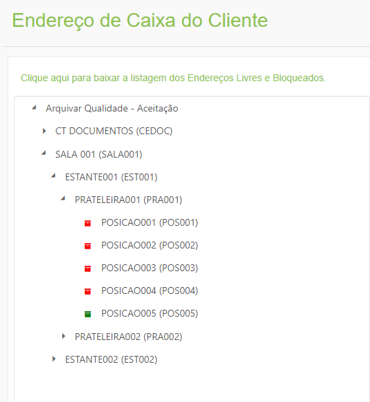
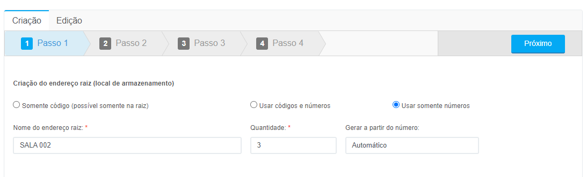
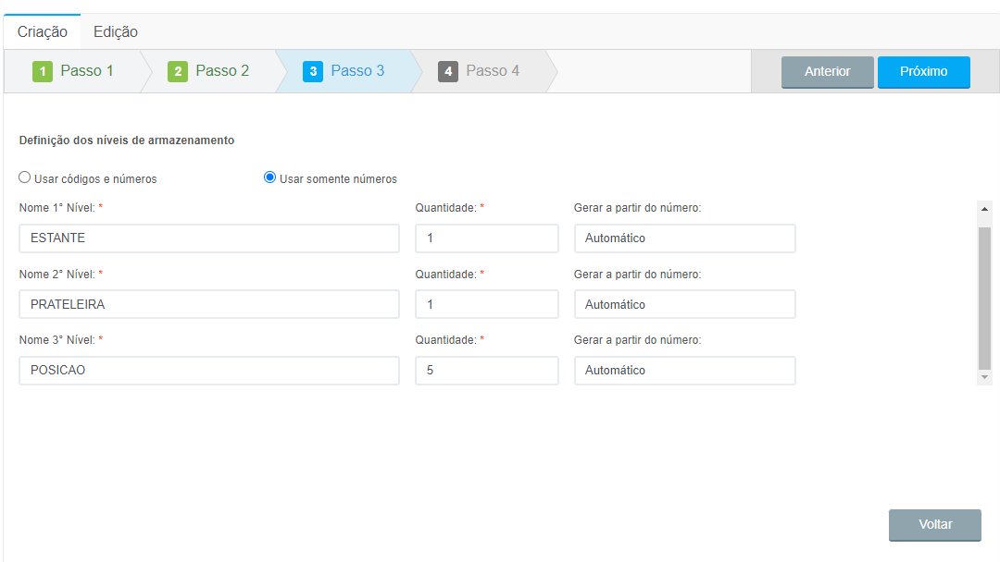
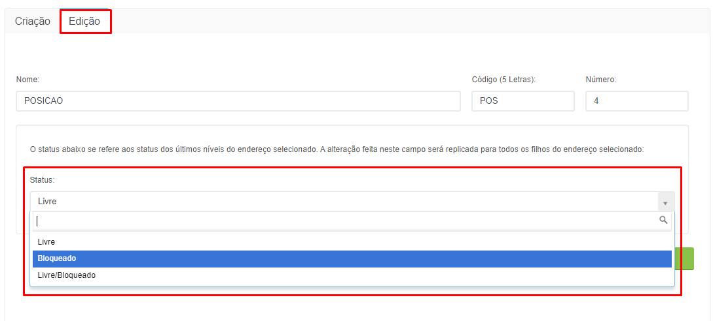

# 🟩 Endereço do Cliente

Na tela de Endereço do Cliente são mostradas todas as posições de armazenamento que o cliente possui em seu espaço físico, como salas, galpões, armários etc. &#x20;

<figure><figcaption></figcaption></figure>

Para criar um espaço de armazenamento é preciso:&#x20;

1\.  Informar um nome para o endereço e um código de cinco letras para esse endereço. É preciso também definir se será utilizado apenas o código, o código e números ou somente números para identificação do endereço que está sendo criado.&#x20;

<figure><figcaption>
Clique para ampliar a imagem.
</figcaption></figure>

2\. Informar a quantidade de níveis de armazenamento que aquele endereço terá e se nesse endereço será determinada a posição exata de caixas e pastas e de quantidade de itens que caberão no local.&#x20;

<figure><figcaption>
Clique para ampliar a imagem.
</figcaption></figure>

3\. Informar um nome, um código de cinco letras e a quantidade de posições de cada um dos níveis de armazenamento.&#x20;

<figure><figcaption>
Clique para ampliar a imagem.
</figcaption></figure>

Na aba Edição é possível editar o nome e o código do endereço e bloquear os níveis de armazenamento se necessário. &#x20;

<figure><figcaption>
Clique para ampliar a imagem.
</figcaption></figure>
