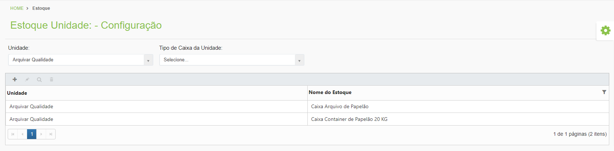
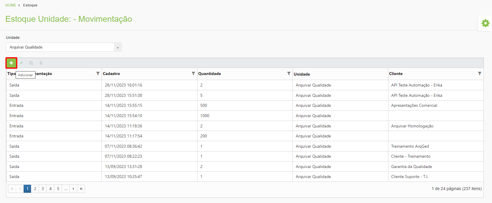
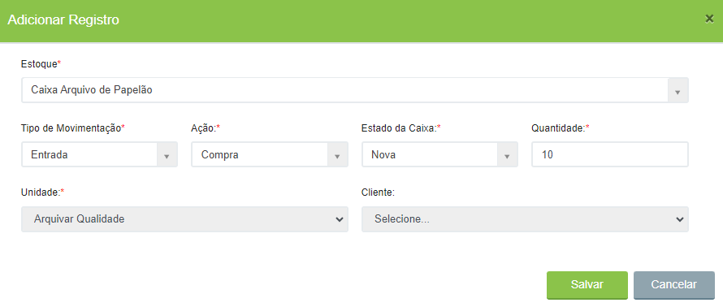

# 🟩 Caixa

## Configuração&#x20;

No menu Configuração são cadastrados os tipos de caixa adquiridos pela unidade. Ao cadastrar um tipo de caixa é importante informar um nome que ajude as pessoas a entenderem as características da caixa.&#x20;

<figure><figcaption>
Clique na imagem para ampliar.
</figcaption></figure>

***

## Saldo&#x20;

No menu Saldo é exibido o total de cada tipo de caixa existente no estoque da unidade. O estoque é dividido em caixas novas e usadas.&#x20;

<figure><figcaption>
Clique na imagem para ampliar.
</figcaption></figure>

***

## Movimentação&#x20;

No menu Movimentação são lançadas as movimentações de entrada (compra) e saída (descarte) das caixas.  &#x20;

Para informar uma movimentação, clique no ícone “Adicionar”.&#x20;

<figure><figcaption>
Clique na imagem para ampliar.
</figcaption></figure>

No campo “Estoque” selecione o tipo de caixa que terá lançamento. Informe o “Tipo de Movimentação”, que pode ser de entrada ou saída e a “Ação”, que pode ser de compra, exclusão ou substituição. No campo “Estado da Caixa” informe se são caixas usadas ou novas e no campo “Quantidade” informe a quantidade que está sendo movimentada.&#x20;

<figure><figcaption>
Clique na imagem para ampliar.
</figcaption></figure>


<mark style="color:orange;">**A entrada de caixas pode vir de uma ação de compra (quando a unidade adquire novas caixas) ou de exclusão (quando um cliente exclui caixas que ainda podem ser aproveitadas pela unidade e essas caixas entram no estoque como usadas).**</mark>&#x20;

<mark style="color:orange;">**A saída de caixa vem de uma ação de substituição (quando há necessidade de substituir caixas de um cliente e as caixas utilizadas para essa substituição saem do estoque da unidade).**</mark>

