# 🟩 Caixa

## Configuração&#x20;

No menu Configuração são cadastrados os tipos de caixa adquiridos pela unidade. Ao cadastrar um tipo de caixa é importante informar um nome que ajude as pessoas a entenderem as características da caixa.&#x20;


<mark style="color:orange;">**Antes de iniciar a configuração das caixas físicas é importante**</mark> [<mark style="color:blue;">**criar**</mark>](../caixa-ou-pasta/tipo-de-caixa-ou-pasta.md#criacao-de-caixa-ou-pasta) <mark style="color:orange;">**e**</mark> [<mark style="color:blue;">**configurar**</mark>](../caixa-ou-pasta/configurar.md) <mark style="color:orange;">**os**</mark> [<mark style="color:blue;">**Tipos de Caixa**</mark>](../caixa-ou-pasta/tipo-de-caixa-ou-pasta.md) <mark style="color:blue;">**ou Pasta**</mark>** **<mark style="color:orange;">**associados à unidade, no menu**</mark> [<mark style="color:blue;">**Caixa ou Pasta**</mark>](../caixa-ou-pasta/)<mark style="color:orange;">**.**</mark>


Um mesmo modelo de caixa física pode ser utilizado por diferentes tipos de caixa ou pasta cadastrados. Essa situação ocorre, por exemplo, quando existem diferenças na estrutura física que irá alocar as caixas.


<mark style="color:blue;">**EXEMPLO:**</mark> <mark style="color:blue;"></mark><mark style="color:blue;">Os tipos de caixa “Duplo Ofício” e “Container” utilizam o mesmo modelo de caixa de papelão 20 kg. Caixas do tipo “Duplo Ofício” contém duas subpastas e ficam com a tampa totalmente fechada. Caixas do tipo “Container” recebem três subcaixas e por isso sua tampa fica alguns centímetros suspensa.</mark>

<mark style="color:blue;">Devido à estrutura física, algumas prateleiras do galpão recebem apenas caixas totalmente fechadas. Outras conseguem alocar caixas com a tampa suspensa que ocupam maior espaço. Quando for feita a criação e endereçamento de um Tipo de Caixa ou Pasta, apesar de ambas utilizarem o material “caixa de papelão 20 kg”, deverá ser criado no sistema o tipo adequado ao espaço que será ocupado.</mark>&#x20;


### Configuração - Tela inicial

<figure><figcaption>
Clique na imagem para ampliar.
</figcaption></figure>

**Campo Unidade:** Exibe a Unidade Arquivar.

**Campo Tipo de Caixa da Unidade:** Neste campo deve ser selecionado o tipo de caixa que será configurado. São exibidos aqui os tipos de caixa ou pasta definidos anteriormente no menu [Caixa ou Pasta > Tipo de Caixa ou Pasta](../caixa-ou-pasta/tipo-de-caixa-ou-pasta.md) para a Unidade.

<figure>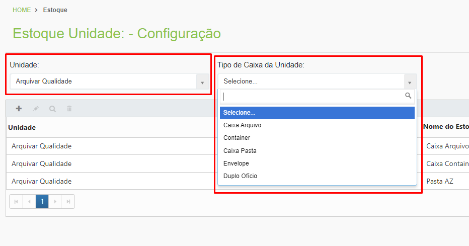<figcaption>
Clique na imagem para ampliar.
</figcaption></figure>

**Ícone Adicionar:** Utilizado para adicionar um novo tipo de caixa física.

**Ícone Editar:** Utilizado para editar as configurações de um tipo de caixa física.

**Ícone Visualizar:** Utilizado para visualizar as informações de um tipo de caixa física.

**Ícone Excluir:** Utilizado para excluir um tipo de caixa física.

**Coluna Unidade:** Exibe o nome da Unidade Arquivar.

**Coluna Nome do Estoque:** Exibe o nome dado ao tipo de caixa física.

<figure>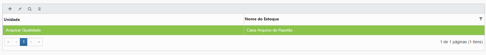<figcaption>
Clique na imagem para ampliar.
</figcaption></figure>

### &#x20;Criação de uma Caixa de Estoque

Para adicionar um novo tipo de caixa física, depois de selecionar a Unidade e o Tipo de Caixa da Unidade, clique no ícone “Adicionar”.

<figure>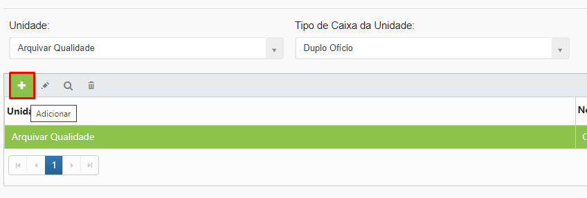<figcaption>
Clique na imagem para ampliar.
</figcaption></figure>

O campo Unidade será automaticamente preenchido com o nome da Unidade Arquivar selecionado na tela inicial.

Na tela "Adicionar Registro", em “Nome do Estoque” informe o nome do tipo de caixa que está sendo criado. É importante que o nome descreva o modelo de caixa, fornecendo aos usuários clareza sobre o material e características do tipo que está sendo criado. Clique em “Salvar” para concluir.

<figure>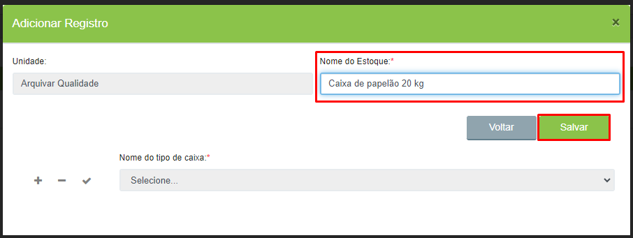<figcaption>
Clique na imagem para ampliar.
</figcaption></figure>

Será habilitado o campo “Nome do tipo de caixa”. Neste campo deverão ser selecionados os tipos de caixa ou pasta do sistema que utilizarão aquele modelo físico.


<mark style="color:orange;">**Serão exibidos para seleção os tipos de caixa ou pastas criados anteriormente no menu**</mark> [<mark style="color:blue;">**Caixa ou Pasta > Tipo de Caixa ou Pasta**</mark>](../caixa-ou-pasta/tipo-de-caixa-ou-pasta.md)<mark style="color:orange;">**.**</mark>


<figure>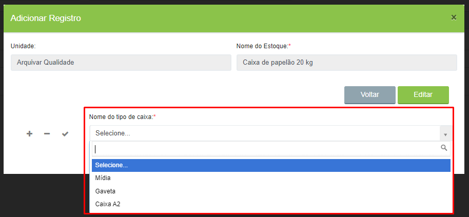<figcaption>
Clique na imagem para ampliar.
</figcaption></figure>

Para associar o modelo a mais de um tipo, clique no ícone “Adicionar”.

<figure>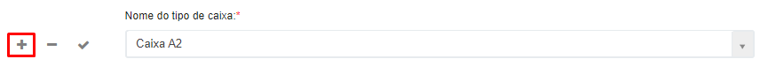<figcaption>
Clique na imagem para ampliar.
</figcaption></figure>


<mark style="color:blue;">**EXEMPLO:**</mark> <mark style="color:blue;"></mark><mark style="color:blue;">Ao criar o modelo “Caixa de papelão 20 kg”, foram associados os tipos de caixa “Duplo Ofício” e “Container” a ele. Isso significa que esses dois tipos utilizarão o mesmo material (caixa física de papelão 20 kg). Se uma unidade cadastrar 20 caixas de cada tipo, deverá possuir no estoque 40 caixas de papelão 20 kg, que servirão para os dois tipos.</mark>


***

## Saldo&#x20;

No menu Saldo é exibido o total de cada modelo de caixa física existente no estoque da unidade. O estoque é dividido em caixas novas e usadas.

Esta tela é apenas informativa. Ao selecionar a Unidade Arquivar no campo “Unidade” são mostrados os modelos de caixa criados para aquela Unidade e o saldo de caixas novas e usadas que ela possui de cada modelo.

<figure>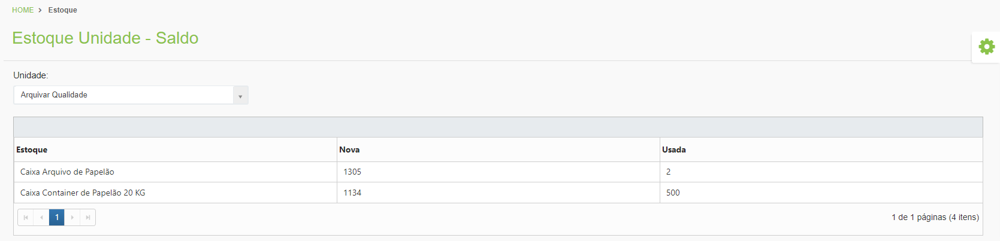<figcaption>
Clique na imagem para ampliar.
</figcaption></figure>

***

## Movimentação&#x20;

No menu Movimentação são lançadas as movimentações de entrada (compra) e saída (descarte) das caixas.  &#x20;


<mark style="color:orange;">**A criação de caixas na tela**</mark> [<mark style="color:blue;">**Caixa ou Pasta > Criar > Caixa da Unidade**</mark>](../caixa-ou-pasta/criar.md#caixa-da-unidade) <mark style="color:orange;">**interfere no saldo de caixas físicas da Unidade, porque o sistema entende que a Unidade está tirando caixas físicas do seu estoque para direcionar para um cliente. Cada caixa criada para clientes será subtraída do estoque de caixas novas ou usadas da Unidade e essas movimentações também serão exibidas automaticamente na tela Movimentação.**</mark>


<figure>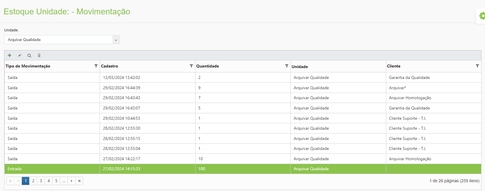<figcaption>
Clique na imagem para ampliar.
</figcaption></figure>

### Movimentação - Tela inicial

**Campo Unidade:** Exibe a Unidade Arquivar.

**Ícone Adicionar:** Utilizado para informar uma nova movimentação de caixa física.

**Ícone Editar:** Utilizado para editar as informações de uma movimentação de caixa física.

**Ícone Visualizar:** Utilizado para visualizar as informações de uma movimentação de caixa registrada.

**Ícone Excluir:** Utilizado para excluir uma informação de movimentação de caixa física.

<figure>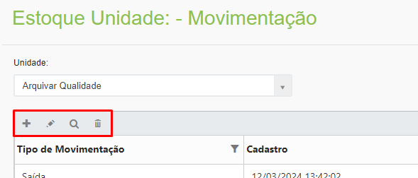<figcaption>
Clique na imagem para ampliar.
</figcaption></figure>

**Coluna Tipo de Movimentação:** Informa se a movimentação registrada foi de entrada ou saída.

**Coluna Cadastro:** Exibe a data e hora da movimentação realizada.

**Coluna Quantidade:** Exibe a quantidade de caixas acrescentadas ou excluídas.

**Coluna Unidade:** Exibe o nome da Unidade Arquivar.

**Coluna Cliente:** Exibe o nome do cliente para o qual aquela movimentação de caixa física foi realizada.

<figure>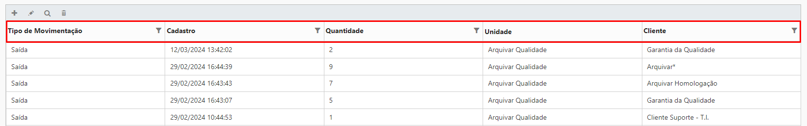<figcaption>
Clique na imagem para ampliar.
</figcaption></figure>

### Registro de Movimentação de Caixa de Estoque

Para informar uma movimentação, selecione a Unidade e clique no ícone “Adicionar”.

<figure>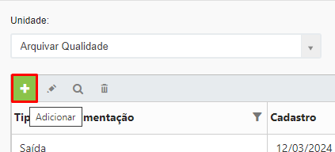<figcaption>
Clique na imagem para ampliar.
</figcaption></figure>

No campo “Estoque” selecione o modelo de caixa que terá lançamento. Os modelos apresentados aqui devem ter sido anteriormente cadastrados na tela de [Configuração](caixa.md#configuracao).&#x20;

<figure>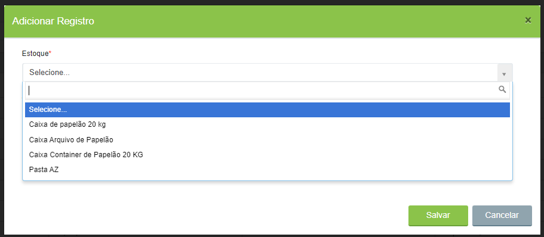<figcaption>
Clique na imagem para ampliar.
</figcaption></figure>

Informe o “Tipo de Movimentação”, que pode ser de entrada ou saída e a “Ação”, que pode ser de compra, exclusão ou substituição.


<mark style="color:orange;">**A entrada de caixas pode vir de uma ação de compra (quando a unidade adquire novas caixas) ou de exclusão (quando um cliente exclui caixas que ainda podem ser aproveitadas pela unidade e essas caixas entram no estoque como usadas).**</mark>&#x20;

<mark style="color:orange;">**A saída de caixa vem de uma ação de substituição (quando há necessidade de substituir caixas de um cliente e as caixas utilizadas para essa substituição saem do estoque da unidade).**</mark>


<figure>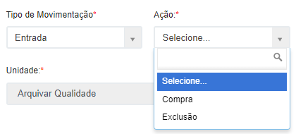<figcaption>
Clique na imagem para ampliar.
</figcaption></figure>

 

<figure>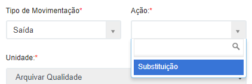<figcaption>
Clique na imagem para ampliar.
</figcaption></figure>

No campo “Estado da Caixa” informe se são caixas usadas ou novas. Se a ação for de entrada por meio de compra, a caixa será obrigatoriamente nova. Se for de entrada por meio de exclusão, a caixa será obrigatoriamente usada. Se a ação for de saída devido a substituição, a caixa pode ser nova ou usada.

<figure>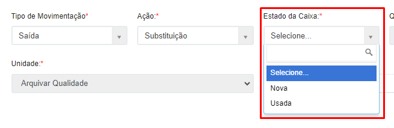<figcaption>
Clique na imagem para ampliar.
</figcaption></figure>

No campo “Quantidade” informe a quantidade que está sendo movimentada.

<figure>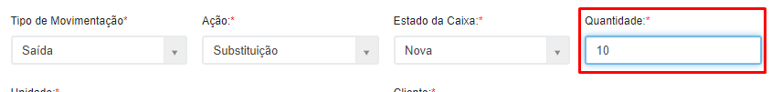<figcaption>
Clique na imagem para ampliar.
</figcaption></figure>

No caso de ações de entrada por meio de exclusão é preciso informar o cliente do qual as caixas estão sendo excluídas e sendo repassadas para o estoque da Unidade. No caso de saída para substituição, será preciso informar o cliente para o qual as caixas da Unidade estão sendo repassadas. Clique em “Salvar” para concluir.

<figure>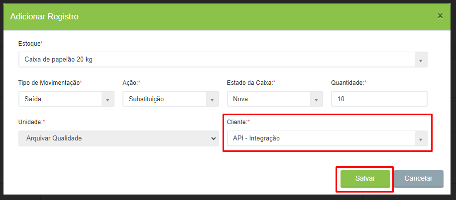<figcaption>
Clique na imagem para ampliar.
</figcaption></figure>

Para conferir se a movimentação foi feita com sucesso, acesse o menu [Saldo](caixa.md#saldo) e revise as informações cadastradas.
